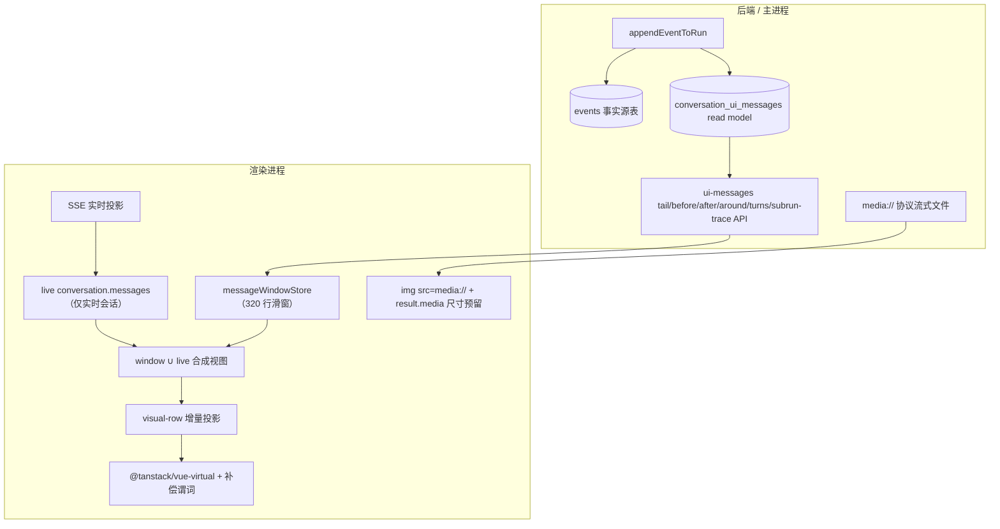

# Conversation 虚拟化与滚动规范

> **全链路权威规范**：[`docs/conversation-platform/`](../../../../../docs/conversation-platform/README.md)。不变量以 [`00-invariants.md`](../../../../../docs/conversation-platform/00-invariants.md) 的 `INV-nn` 为准；本文是实现级说明，冲突时以规范为准。

> 长会话渲染是本域最脆弱、最容易回归的部分，因此单列一份规范。本文定义**数据层、渲染层、timeline 层三层虚拟化**、媒体管线、估高体系、滚动契约、以及不可动的不变量与回归门禁。
>
> 本文是热路径的**冻结契约**：改动前必读，任何改动必须走 Electron 真机三类会话门禁（见 §7）。
>
> 配套文档：域架构与不变量见 [`conversation-architecture.md`](./conversation-architecture.md)；核心数据流与目录见 [`README.md`](./README.md)。实现级细节见 `../ui/conversationView/README.md`（虚拟列表与滚动合同）、`../ui/components/timeline/README.md`（timeline 圆点与让位动画）。

---

## 0. 为什么这样设计

长会话曾同时暴露：滚动卡死、吸底拉锯、打开不落底、多图冻结、timeline 跳转失效、长历史加载慢。根因不是六个独立 bug，而是三层架构债互相放大：

1. **媒体层**：图片走 Data URL（串行 IPC 读文件 → base64 常驻 renderer 堆），16 图即冻结主线程；width/height 元数据链路断裂，估高必然失准。
2. **数据层**：打开历史 = 全量事件 replay，`conversation.messages` 同时承担实时投影 / 历史全量 / 渲染源 / 编排输入四种职责。
3. **视图层**：手写虚拟布局不支持 prepend 锚定，估高 spacer 与真实排版存在结构性分裂帧；timeline 双数据源且 `scrollToTurn` 静默失效。

现方案按三层拆开，各层职责与实现位置固定。**核心结论**：长会话不全量 replay，也不把整轮消息塞进一个虚拟 item。

---

## 1. 终态数据流

- 打开历史：`loadTail(80)` 直接可交互；完整 replay 只留给审计 / rebuild / 调试。
- 向上滚动：`loadBefore` prepend + `anchorTo:'end'` 锚定，滚动条变矮是正常体验。
- timeline / 搜索跳转：`loadAround(anchor)` 原地换窗，不加载中间页。
- 图片：media URL 懒加载 + `result.media` 尺寸预留，renderer 堆不持有图片字节。

---

## 2. 数据层：window ∪ live 双层，有界滑窗

实现：`message-window/`；打开编排在 `history/store/historyLoaderStore.ts`。

1. **window ∪ live 双层**：window 行（已落盘）物理隔离在 `messageWindowStore`，**不回写** `conversation.messages`（误回写会让其它 selector 误判完整加载，属评审卡口）；渲染消费合成视图，按 `message_id` 去重、live 优先。
2. **滑窗有界**：`WINDOW_MAX_ROWS=320`，双向分页 + 反向淘汰，每页成本 O(cap)。
3. **加载相位三分**：`tail`=初始加载（整窗占位）；`before/after`=背景分页（不改相位）；`around`=导航加载（`isNavigationLoading`，ready 态内原地换窗、画布不卸载）。`around` 是 ready 态内的导航换窗，不是初次加载，已有画布不能因此卸载。
4. **edit/regenerate 双槽语义**：canonical messageId 始终存续；window 槽 `truncateAfterMessage` + live 槽 `truncateProjectionStateAfterMessage` 必须显式同步（SSE 不回流编辑消息）。
5. **假底补页**：`hasMoreAfter=true` 的窗口底部是假底，即使 `follow-bottom` 也放行 `loadAfter` 链式补到权威尾部；`loadBefore` 仍禁止在 follow-bottom 下触发。
6. **落底是显式编排意图**：普通发送先 `ensureHistoryWindowTailForBottom` 回真实尾窗再落底；编辑 / 重新生成先截断为新逻辑尾部再落底。禁止用「末条消息 role」等列表形态启发式反推用户意图。
7. **加载竞态防线**：loader 按 store 实例维护请求世代，所有 `await` 后校验所有权（`store.conversationId === conversationId && generation 未变`）再 apply；store action 内另做 conversation 归属断言作底线。切换 conversationId 开始加载时立即清空旧窗口 rows / cursor / revision。
8. **响应式边界**：window rows 是不可变历史快照，单行用 `markRaw` 阻止 Vue 深代理递归 JSON payload，外层 rows 数组仍响应替换。分页、truncate 和 revision 更新必须替换行/数组，禁止原地修改 raw row。live `conversation.messages` 仍保持深层响应式；metadata 合同收紧没有改变 message ID、visual row key、估高或滚动补偿。

> 加载期 SSE 无损缓冲（打开仍在生成会话时的短暂窗口）见 [`conversation-architecture.md`](./conversation-architecture.md) §5。

---

## 3. 渲染层：visual-row 粒度 + TanStack Virtual

实现：`ui/messageCanvas/`（共享 row DOM、轮次间距与行操作）和 `ui/conversationView/`（主时间线 adapter、增量投影、估高、滚动规则）；接线宿主 `ui/ConversationHost.vue`、`ui/ConversationView.vue` 与 `features/subrun-detail/`。依赖声明为 `@tanstack/vue-virtual@3.13.31`，当前 lockfile 实际解析 `@tanstack/virtual-core@3.17.3`；公开 `measure()`、end-anchor / prepend / resize clamp 行为按 core 3.17.3 验证，升级时必须重新跑动态尺寸门禁。

- **粒度合同（谓词生效的前置条件）**：**每个会独立异步改变高度的视觉块，必须是独立虚拟 row，或在自己的 row 内有界布局**（消息 / artifact visual-row 粒度）。turn 级巨 item 横跨视口顶时虚拟器没有内部边界信息，补偿必然失效。subrun collection 留在父工具消息内部有界展示，不提升为顶层 row。
- **共享展示 owner**：主时间线与 Subrun 详情都使用 `ConversationMessageCanvas → ConversationVisualRow → Message`。主时间线 adapter 只给出 virtual placement / measure；详情不提供 placement，按普通文档流渲染。禁止详情直接循环 `Message.vue`、另设统一 `gap`，也禁止共享画布读取主时间线 store、分页或滚动状态。
- **补偿谓词**：`shouldAdjustScrollPositionOnItemSizeChange = (item,_d,inst) => item.end <= (inst.scrollOffset ?? 0)`——只补偿完整位于视口上方的 row。**它是实例属性赋值，options 字段静默忽略**。禁止按手势或固定帧窗口关闭补偿。
- **prepend post-render 事务**：稳定首 key 被头插后移到 `index>0` 时开启事务；`anchorTo:'end'` 的显式目标先与同批尺寸残差合并，Vue 完成画布 patch 后**只写一次** DOM `scrollTop`，避免目标被旧画布最大滚动范围钳位。
- **增量 builder**：尾部 append / 流式尾更新只处理尾行；prepend / truncate / edit replay 才属于语义结构全量重建。宽度是 geometry estimate 输入；当前阶段只允许 settled width 一次性触发全窗口重新估高，禁止把连续 resize 帧当作消息结构变化。append-only 派生链（`useAppendOnlyConversationVisualRows` + 增量 builder）与虚拟化正交，尾部增量不得退化为全量 turn / card 双投影。
- **任意位置 revision**：消息数量不变时也要按对象引用与 `message_id` 找出被修订实体，定点重投对应 row。父工具卡、subrun trace、交互表单和工具 completion 即使不在尾部，也不能依赖“只检查最后一条”。
- **稳定实体 key**：virtual row、timeline marker、动画账本与列表项必须使用正式 message/entity ID。禁止数组 index、内容文本、工具名+序号或随机 fallback；seal、loading→complete 与 reload 不得换 key。
- **视觉轮次身份**：visual-row 的 `visualTurnId`、timeline marker、实测位置与 virtualizer 导航共用 `@app/schemas` 的 `ConversationVisualTurnId`。完整身份只从可见 user message ID 派生；窗口中段的 partial 身份只参与当前布局。Runtime `turn_id` 不得进入这条链，也不得作为 fallback。
- **几何契约**：`getScrollElement` 必须返回 `.conversation-host-viewport`；最后一个 turn-end visual row 通过共享 message canvas 独占 tail region，duration、answer actions 与 waiting indicator 在同一固定高度区域内布局。tail 是 row 的真实测量结果并一次参与 `scrollHeight`，不再由 `ConversationView` 创建第二个 slot；图标/actions 显隐不改变该区域高度。waiting 只允许主画布最后一行拥有，run terminal 后释放；有回答操作时 tail 继续保留，Subrun 普通画布默认不启用 trailing status。`scrollEndThreshold` 只包含画布外 sticky footer 与内容 padding，不能再次累计 row tail；`scrollMargin` = 滚动原点到画布顶的实测距离；`paddingEnd=0`（`paddingEnd > scrollEndThreshold` 时流式吸底失效）；落底靠 `scrollToEnd()`。禁止写死 footer 像素（输入框可增长，mask 用 ResizeObserver 动态测量）。
- **行距口径**：item 根 `display: flow-root`，行间距按 kind 收进 item 内 padding，`measureElement` 测含间距的 border-box；不用统一 `gap`。
- **测量单一执行者**：尺寸测量统一交给 TanStack 的 `measureElement`。禁止每 item ResizeObserver + rAF 测高链、手写 spacer、第二套测量缓存，或测量后的第二次 `scrollTop` 修正。
- **单活跃实例**：chat-centric / editor-centric 双宿主必须保证只有一个活跃 ConversationHost 发分页 / 落底 / 测量意图。
- **复制 / 转存**：多段 `final_answer` 经离屏 `ConversationAnswerRenderHost` 在同一 Vue app 上下文按需真实渲染后提取，操作串行化；禁止第二套 Markdown→HTML。
- **Markdown 提交一次**：流式内容可以节流解析，但进入非 streaming 后同一正文只提交一次最终 AST。run 状态变化、操作区挂载或父级重渲染不能触发第二次正文提交；所有 Markdown 来源复用 `MarkstreamRenderer` / `packages/stream-markdown-parser`。
- **平滑宽度与流式提交隔离**：AppLayout 始终保留真实内容宽度动画。Conversation 宿主只观察真实消息列；连续 resize 时通过 render-scheduling port 暂停当前 Thought / Answer 的 Markdown AST 提交并缓存最新正文，quiet window 后一次追平。解析后的顶层 block 对 append-only 未变节点复用 identity，Vue 只 patch 活跃尾块。该合同同样覆盖 Sidebar、窗口、pane 和 timeline，不监听 App Sidebar 事件。

### 3.1 合同重构对虚拟化的影响

近期 Runtime identity、Conversation UI message、tool payload 和 Workspace read 合同的收紧没有改变虚拟化的三层结构，反而移除了造成闪动与错行的输入不确定性：

- answer chunk 与 seal 共享 `answer_id/message_id`，不再产生第二个 virtual item。
- tool/subrun 使用真实 `tool_call_id/source_event_id`，历史前缀与 live tail 可稳定归并。
- `ConversationUiMessageSchema` 排除了 `ui_card` 等非 timeline entity，visual admission 与 leaf 渲染使用同一联合。
- message/run scoped streaming 使操作区采用稳定占位，不再因会话级状态切换改变尾行几何。
- Workspace/TaskState/tool-output 卡片使用结构化合同和稳定 item ID，不再从文本或数组位置生成列表 key。

因此本轮合同重构不要求更换 TanStack、窗口大小、补偿谓词或滚动控制器。后续审计应重点防止两类回退：把合同失败改成 UI fallback，以及用 Runtime `turn_id` 与 visual turn anchor 的同名字段误建 row scope。

### 3.2 滚动意图层（S1）

滚动写入归库，`useConversationScrollController` 只维护产品意图（`follow-bottom` / `anchored` / `free`）。virtualizer 是滚动执行的**唯一写者**；S1 只声明意图（回底、timeline 定位、跟随、按钮显隐），落底由发送 / 编辑 / 重新生成编排显式声明。`scroll-write-storm` 哨兵保留为永久防回归观测。

### 3.3 估高体系

- `contentHeightEstimator.ts` 是 `estimateSize` 的唯一输入：按「消息对象 + 内容 + 宽度分桶 + 估高类型」用 WeakMap 缓存内容高度；`message.max=8000` / `min=56`。
- **`user_input` 估高必须按纯文本处理，禁止走 Markdown parser**：用户消息由 `UserMessage.vue` 用 `v-text + white-space: pre-wrap` 渲染，Markdown 估高既不符合渲染语义，也会在流式阶段重复解析超长 prompt。
- **完成态 Thought 固定按折叠壳估高，禁止读取正文**：完成态初次挂载默认折叠且正文使用 `v-if` 不进入 DOM；用户展开后由当前 row 的 TanStack `measureElement` 测真实高度。未完成 Thought 默认展开，继续按 streaming Markdown 估高。
- 用户请求发送后通常不再变化，后续 `final_answer_chunk` 只应重算变化的助手消息高度。调整估高逻辑必须覆盖长 `user_input` 回归测试。

### 3.4 bounded 口径

仅 bash `tool_output` 标记 bounded（max-height + 内滚）；普通长回答 / 表格自然高度内联。Host 的 Subrun 父卡只渲染轻量进度，完整 child 消息在同一 `ConversationHost` 滚动视口内结构性切换到 detail surface，不在 virtual row 内嵌套 bounded 容器。插件公开 `SubrunCard` 仍可传 `bounded`；该分支没有动画语义，必须直接挂载共享 body，禁止进入 `Transition/BaseTransition` 的 DOM anchor 生命周期。无尺寸存量图使用 600×400 上限有界盒作永久 fallback（见 §4）。

---

## 4. 媒体管线

- 图片一律 `window.linnyaMedia.buildGeneratedImageUrl(path)` **同步**构建 media URL；复制走 `fetch→blob→ClipboardItem`，下载走 `fetch→objectURL`。**禁止回到 Data URL / IPC 读字节**。
- `StructuredToolResult.media?: {path,width,height}[]` 的序列化结构是图片尺寸的唯一跨边界合同；`SavedImageInfo` 为写盘侧共享契约。`image-generation.ts` 在 producer 与 Renderer admission 两端 strict parse，projector 再生成最小 `ImageGenerationPresentationImage`，禁止为了复用后端 `ToolResultImageMedia` 类型而导入 linnkit runtime。`result.media` 已落盘，**禁止改名**。Renderer 只为历史事件保留 `text_to_image` key，新事件使用 `generate_image`。
- **图片几何**：有 `result.media` 的图按真实比例预留（`max-width` + `aspect-ratio`）；无尺寸图使用 600×400 上限有界盒作**永久 fallback**（几何稳定优先，不做存量回填）。图片高度从「测量问题」变为「计算问题」。
- **sharp 集成硬约束**：sharp 必须在 `tsup.backend.config.ts` external 列表中（原生模块禁止打进 bundle）；必须**静态** `import sharp from 'sharp'`（生产链路编译为 bytenode 字节码，vm 不支持动态 `import()`）；`package.json` `asarUnpack` 必须含 `**/node_modules/sharp/**/*` 与 `**/node_modules/@img/**/*`；不需要 electron-rebuild。历史教训：`await import('sharp')` 失败被空 `catch {}` 静默吞掉，导致所有生成图长期缺尺寸（图片白边根因链）。
- **发版门禁**：生产 electron-builder 打包冒烟——确认 `app.asar.unpacked/node_modules/@img/*` 存在、能 `require('sharp')`、新生成图带 width/height。

---

## 5. Timeline 层：全量 turn index + 窗口实测位置

实现：`features/timeline/`（index 获取与导航编排）；纯展示 `ui/components/timeline/`。

- **markers 数据源 = 全量 turn index**（`GET /api/v1/conversation/:id/turns`，window ready 后拉取，preparing 降级窗口派生并重试），合并当前窗口与 live user turn。`TimelineNav` 纯消费 markers 与当前窗口实测位置，**禁止直读 store 旁路**。`ConversationView` 只上报当前窗口内 `isTurnStart` 行的实测位置用于高亮与精确定位。
- **marker 合并键**：后端 `readTurnIndex` 返回正式 `visual_turn_id`，其值由共享派生函数从 `message_id` 创建；窗口 / live marker 调用同一函数。旧 `turn_id` 字段和手工字符串拼接不受支持。edit / truncate 按 revision 重拉。
- **窗口外导航**：dot 点击走 `loadAround → waitForTimelineVisualTurnMounted → scrollToVisualTurn`。Host 在整个导航期间持有取消令牌与 backfill 锁，只允许最后一次导航落地；定位按稳定 `visualTurnId` 逐帧重解析（连续 2 帧落点 <1px 才 settle，5s 超时显式失败，支持 AbortSignal），不持有会被 prepend 改写的数字 index。连续点击 / 切会话 / 卸载取消旧导航。
- **dot 溢出走内部滚动**（固定高度 + `overflow-y:auto` + `overscroll-behavior:contain`），**只挂载可见 marker + overscan**——全量直挂会在 prepend 时触发全量绝对定位重算导致正文闪帧。
- **index 加载失败显式化**：`/turns` 失败进入显式 error 状态，停止把窗口局部 markers 伪装成完整时间轴，由 Host 展示一次本地化错误通知；后端 preparing 仍按原节奏重试。

### 5.1 让位与展开性能

- 收起 timeline 只改变视觉交互状态，**不得清空** turns / markers / 圆点 DOM，否则展开时会把完整历史重新投影成时间轴（右侧窄栏尤其卡顿）。
- `TimelineNav` 的 `transform` / `opacity` 进出由 Web Animations API 驱动（避免 sticky/grid 下 CSS transition 偶发不触发）。
- 消息列让位走真实布局宽度变化：容器足够宽时 timeline 叠在右侧空白里不挤占消息列；较窄时只从消息列右侧扣除 timeline reserve，左侧留白不变。让位动画由 `useTimelineLayoutReserveAnimation` 逐帧更新 `--conversation-content-timeline-reserve-px`，起止点按 `max-width` 夹紧后的真实可见宽度计算。布局动画仍可逐帧改变当前 DOM，但估高协调器观察真实 `.messages-container`，连续 observer 输入只更新 pending width，120ms quiet window 后才提交一次最终宽度。
- 非空内容列两侧最小留白由 `--conversation-content-side-gap` 统一控制；消息项、输入框和宽度估算必须读取同一变量。宽度估算直接使用真实消息列宽度再扣除共享 side gap，不再由 outer width 重算 timeline 公式。settled 提交前同步捕获 `follow-bottom` 或首个可见稳定 row key + row 内偏移，随后由 TanStack 公开 `measure()` 使未挂载行的旧 estimate 失效，并在画布提交后通过公开滚动 API 恢复同一视口。禁止写内部 cache、增加第二套测量或直接修正 DOM `scrollTop`。visual-row 的 grid track 必须允许收缩，通用工具卡最大宽度不得超过当前消息列，长 URL 或外部搜索结果不能把对话列撑宽。

---

## 6. Subrun Trace 展示

`features/subrun-trace/` 是子 run trace 基础能力的唯一 feature，统一持有事件 bucket、历史 API 契约、DTO 校验、历史懒加载、append-only 增量消费、步骤标题 / 状态投影与 `SubrunTracePanel`。外部 UI 只能通过 feature 根出口消费，禁止恢复顶层 `subrun-trace/` 或 `ui/tools/subrunTrace/` 双入口。

该 feature 的步骤 projector 只产出轻量过程步骤，并由既有 `SubrunTracePanel` 统一渲染；Deep Search 与 Host `SubrunProgressCard` 必须复用同一面板，后者只负责 Host detail navigation 适配，不得复制步骤 DOM、历史加载或 CSS。Host 的卡片边界继续由 `ToolCallsMessage` 统一持有，subrun registry 不得通过 `renderAsGroup` 绕开它，也不得让内容组件再造卡片。`features/subrun-card/` 另有正式 message admission，把完整 trace 原子投影为 thought / tool / final answer 等 `BaseMessage`，供 `features/subrun-detail/` 和插件公开 `SubrunCard` 复用。两条投影共享 bucket，但职责独立，禁止合并为带 `compact/full` 分支的上帝 projector。多 subrun 的 Host 父卡由 `SubrunBatchCollection` 归一为多个进度项；插件 collection 合同见 [`task-system.md`](./task-system.md)。

Subrun detail 的底部状态面板与主 composer 只共享 `conversation-footer-shell` 和
`conversation-footer-surface` 两层视觉外壳；editor、草稿、附件、模型选择与发送控制仍只属于
`AiAssistantInput`。不得为“看起来像输入框”而挂载一份 disabled composer，也不得复制圆角、边框和阴影。

---

## 7. 不变量与回归门禁

### 7.1 红线（任何阶段 PR 碰到即打回）

| # | 红线（禁止） | 正确做法 |
|---|---|---|
| G1 | 把 N 个 child run 提升为 N 个顶层 visual-row，或在父 row 嵌套完整 child 消息树 | 父工具仍是单个 visual-row，内部只有 N 个轻量进度项；完整内容进入 Host 单一 detail surface |
| G2 | 给卡片加 per-item ResizeObserver / rAF 测高链 / 第二套测量缓存 | 测量统一交 TanStack `measureElement`；沿用 `contentHeightEstimator` |
| G3 | 破坏估高体系 / 补偿谓词 / append-only 增量保证 | 父进度仍走单 row 测量，detail 是 Host 顶层内容；消息级增量、稳定 key 与尾更新保证保持不变 |
| G4 | 在流式 chunk 上全量 Markdown parse 长内容 | 只重算变化的助手消息高度 |
| G5 | 改事件类型 / 投影却只改一边 | 前端 `reduceEvent` + 后端投影器 + parity fixture 同 PR 改 |
| G6 | 用「列表形态 / 末条 role」反推用户意图触发滚动 | 落底 / 锚定是显式编排意图，由动作声明 |
| G7 | 用 Runtime `turn_id`、旧 `turn_id` wire 或手拼字符串代替 visual turn | 只消费 `visual-turn-identity.ts` 与 `visual_turn_id` |

### 7.2 回归门禁（每次改动收尾必跑）

- **真机三类会话不回归**：5000 条无图 / 16 图 / 任务型；任务型会话额外覆盖父进度、Host 就地详情、返回锚点、reload 与 conversation 切换。
- **合成夹具全绿**：`?fixture=conversation-virtualizer-spike` / `conversation-visual-row`（B0 滚动数学矩阵 + UI gate）。**夹具只作库回归，不替代真机**；合成 gate 绿 ≠ 生产可用。
- **性能读数**：`window.__CONVERSATION_PERF__` 的 `history-load` / `long-task` / `image-load` 不劣化于基线。
- **结构门禁**：`pnpm run guard:conversation-contract` 必须通过；它禁止恢复含糊 `turnId`、旧 timeline wire、手拼 visual ID 和私有 Replay 事件合同。

### 7.3 已接受的固有体验（不视为缺陷）

- 上滑 prepend 后滚动条比例变化是成熟产品常见体验，不因此加载中间页。
- 无尺寸存量图有界 fallback（不做存量回填）。

---

## 8. 去哪里看

| 关注点 | 模块 | 文档 |
|---|---|---|
| 窗口分页 read model、双层合成、假底 / 换窗语义 | `message-window/` | 本文 §2 |
| visual-row 投影、TanStack 接线、滚动 / 分页 / 估高规则 | `ui/conversationView/` | `ui/conversationView/README.md` |
| 全会话 timeline index 与换窗导航 | `features/timeline/` | 本文 §5 |
| 子 run 历史加载、增量步骤与过程面板 | `features/subrun-trace/` | 本文 §6 |
| 完整 child message admission 与父进度卡 | `features/subrun-card/` | [Subrun 规范](../../../../../docs/conversation-platform/10-subruns.md) |
| Host 就地详情 scope、导航与只读 surface | `features/subrun-detail/` | [Subrun 规范](../../../../../docs/conversation-platform/10-subruns.md) |
| timeline 圆点渲染、溢出滚动、让位动画 | `ui/components/timeline/` | `ui/components/timeline/README.md` |
| 滚动宿主几何、timeline 接线、跨 feature 导航编排 | `ui/ConversationHost.vue` | `ui/conversationView/README.md`「虚拟滚动合同」 |
| 确定性滚动回归门禁（`?fixture=`） | `features/virtualizer-spike/` | 本文 §7.2 |

> 视觉与滚动的不可变约定（滚动条贯穿全高、内容滚入 footer 背后渐隐、只有 bash 无界输出用 row 内 bounded、无尺寸图 600×400 有界 fallback）另见 `ui/conversationView/README.md`「UI 不变量」，改动前必读。
