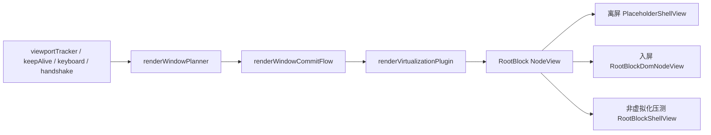

# RenderVirtualization

`RenderVirtualization` 是 Editor 的 RootBlock 渲染虚拟化能力。它解决的是超长文档里 ProseMirror / Tiptap 为每个块都创建完整 ViewDesc 子树导致的首开、滚动和 pending 投影卡顿。

一句话心智模型：

> 文档是真相，渲染是窗口。

ProseMirror doc 始终完整；虚拟化只发生在 NodeView 渲染层。离屏 rootBlock 会被渲染成无 `contentDOM` 的 placeholder，进入窗口后 hydrate 成原生 `RootBlockDomNodeView`，正文仍由 ProseMirror 渲染进 `contentDOM`。普通小文档继续走 Vue `BlockView`；原生 `RootBlockShellView` 只保留给非虚拟化 Shell 压测路径，不能作为大文档的正常编辑主路线。

## 目标

- 10000 块文档首开不全量创建内部内容子树。
- 10000 pending 文档只全量保留 canonical 数据，不全量投影 `revisionMark`。
- 滚动、跳转、查找、批注定位、Revision Accept/Reject 在进入块内部前统一 hydrate。
- 所有渲染事务都不进入 undo history，也不触发用户级块删除/重建副作用。

## 分层

当前模块按四类职责拆分：

- `state/`：ProseMirror plugin、height cache、NodeView lifecycle、KeepAlive 租约。
- `runtime/`：RootBlock runtime registry。它只暴露非响应式 action-time handle，是阶段 2 裸 DOM RootBlock NodeView 和阶段 3 BlockChrome 中央化的显式端口。
- `view/`：placeholder / hydrated render mode 解析和占位 NodeView。
- `controller/`：输入事件、窗口规划、提交、滚动 handshake、键盘预水合。
- `policy/`：是否启用虚拟化的阈值和策略。
- `integration/`：跨层集成测试模块，验证 Engine snapshot、runtime registry、Host target、viewportTracker 和 cleanup 的组合行为。
- `testing/`：测试专用适配器。这里只能承载 legacy / harness 边界，不能被生产路径 import。

## Public API 边界

`features/RenderVirtualization/index.ts` 是对外公开入口，只暴露稳定、窄小、可组合的能力：

- Engine 与 snapshot：`createRenderVirtualizationEngine`、`RenderVirtualizationEngineSnapshot`。
- 交互前水合：scroll / selection / keyboard handshake。
- keep-alive 租约入口：Vue lease、显式 `KeepAlivePort`、语义化 command helper、NodeView / position keep-alive。
- runtime handle 只读端口：按 owner 查询 hydrated handle、订阅 runtime target 变化。
- transaction 观察窄口：判断一个 transaction 是否携带 RenderVirtualization meta。

`features/RenderVirtualization/internal.ts` 是内部兼容出口，只允许 app wiring、压测诊断、当前 feature 内测试使用。它可以暴露 plugin key、plugin state、registry register/reset、NodeView factory、height cache registry 等写能力。业务 feature 不能 import `internal.ts`，也不能直接读取 `renderVirtualizationPluginKey` 或 `getRenderVirtualizationState`。

当前边界由两类静态测试固化：

- `renderVirtualizationExports.static-guard.test.ts`：确保 public root 不重新导出内部写能力。
- `renderVirtualizationImportBoundary.static-guard.test.ts`：确保普通 editor 业务模块不能 import `RenderVirtualization/internal`，也不能绕过 `KeepAlivePort` 直接使用 raw DOM keep-alive event。

如果新增业务确实需要虚拟化信息，优先补一个更窄的 public contract，而不是放宽 `index.ts` 或绕进 `internal.ts`。

核心链路：



## 事实源

`renderVirtualizationPlugin` 是 hydrated / pinned / selection block 的提交事实源。Engine 可以规划窗口，但不能长期维护另一份“我认为已 hydrate”的状态。

`virtualRootBlockRendering` 是全局能力开关；`virtualRootBlockRenderingActive` 和 `largeDocumentShellModeActive` 是 editor-scoped 运行态。新增主路径必须通过 `shouldUseVirtualRootBlockRenderingForOwner(editor)` / `shouldUseRootBlockShellForOwner(editor)` 读取运行态，并在文档加载或压测注入时用对应 owner setter 写入。无 owner 的全局读写只保留给 DevTools 观察和少量 legacy 测试，不能再作为新功能入口；生产路径也不能再调用无 owner runtime setter。

业务模块只消费 `RenderVirtualizationEngineSnapshot`：

- `visibleBlockIds`：engine 本次规划的窗口。
- `hydratedBlockIds`：从 plugin state 读回后确认真实已 hydrate 的窗口块。
- `pinnedBlockIds`：从 plugin state 读回后确认仍被 keep-alive 租约保活的块。
- `viewportTop / viewportBottom / totalEstimatedHeight`：诊断和滚动窗口信息。

Revision、Annotation、toolbar 不能自己监听滚动、全量扫 DOM 或用 `elementsFromPoint` 判断窗口。需要进入块内部时，必须通过公开 handshake API。

## 窗口规划

窗口规划由 `renderWindowPlanner.ts` 和 `renderWindowMath.ts` 完成：

- 普通滚动先读取当前视口的单点 DOM anchor，再围绕该 rootBlock 按块数量选窗口。
- 普通滚动如果 anchor 仍在当前 hydrated 窗口的安全区里，会复用现有窗口，不立刻重新居中，避免每一小段滚动都触发 20+ 个块的 hydrate/dehydrate。
- 普通滚动如果 anchor 碰到当前窗口安全边界，只按恢复安全余量所需的块数小步平移窗口；不能重新围绕 anchor 居中，否则 5000+ 块连续滚动会周期性触发 50+ 个块的批量 mount/unmount 尖峰。
- `BlockHeightCache` 不再是窗口事实源；它只负责 placeholder 占位、总高度估算，以及 DOM anchor 缺失时的兜底窗口。
- 远距离拖动滚动条时，如果输入层确认用户正按住原生滚动条拇指，拖拽期间不提交 hydrate/dehydrate 窗口，只记录 `scrollTop` 并延后到停止后的 `scroll-correction`。原因是 hydrated DOM 与 placeholder 即使高度只差几像素，也会改变整篇 `scrollHeight`，让浏览器把滚动条拇指重新映射到鼠标下方或上方。
- 非滚动条拖拽的普通滚轮 / 触控板滚动仍使用单点 DOM anchor 选窗口；停止滚动后才用 `scroll-correction` 多点采样当前屏幕真实命中的 `.root-block-outer`。
- 外部 `editor-scroll` 和停止后的累计漂移纠偏可以 DOM sample；普通原生 scroll 不做多行 DOM sample，只做轻量 anchor。
- `viewportTracker` 只负责把滚动输入合并成 typed reason；即使是远距离拖动滚动条，也必须交给 Engine 的下一帧刷新，不能在 `scroll` 回调里同步跑 DOM 采样、PM 提交或高度测量。
- DOM sample 只属于 RenderVirtualization 内部，业务模块不能重复采样。
- `renderVirtualizationConstants.ts` 集中管理调优参数：overscan 默认约 `1.5` 屏，窗口块数按平均块高动态推导，并用上限保护内存。

高度缓存有两个概念：

- placeholder 自身高度：写给占位 DOM 的 `minHeight`。
- layout 高度：元素高度 + marginTop + marginBottom，用于滚动窗口坐标系。
- 未测量块不会永远使用固定 `120px`，高度缓存会在样本数足够后用已测量块的保守平均值作为未知块默认高度，减少中段/底部停止纠偏时的跳动。
- 自适应未知高度的下限不能高于短文本块的真实高度量级；当前压到 `32px`，是为了避免 5000+ 纯文本文档在首屏采样后仍以 `48px` 估算所有未知块，导致总高度持续偏大、滚动条回弹。

不要把 `getBoundingClientRect().height` 直接当作 layout 高度。长文档里 rootBlock margin 会累计成巨大误差，表现为中段或底部长时间白屏。

## 提交协议

所有写入 `renderVirtualizationPlugin` 的 transaction 都必须走 `renderWindowCommitter.ts`：

- 统一设置 `renderVirtualizationPluginKey` meta。
- 统一标记 ephemeral transaction / `addToHistory=false`。
- 统一通过 `shared/adapters/tiptapVueReactiveState.ts` 同步 `@tiptap/vue-3` 的内部 state；不要在新的调用点直接读取或写入 `editor.reactiveState`。
- 禁止业务模块直接手搓 plugin meta。

`renderWindowCommitFlow.ts` 负责：

1. 启用 plugin。
2. 提交 hydrate/dehydrate/pin/unpin。
3. 在 DOM sample 路径保持视觉锚点。
4. 从 plugin state 读回真实 hydrated 集合。

滚动热路径里不要每帧重测整个 hydrated window。提交后只同步测量本次新增 hydrate 的块；header、图片、表格等后续布局变化通过显式 `remeasureHydratedWindow(...)` 或后续刷新回写高度缓存。这样文本块先 paint，滚动条不会被 220 个 `getBoundingClientRect()` 同步读拖住。

direct-state 首开是例外：前几个 hydrated rootBlock 已经来自初始 plugin state，`file-content-loaded` 刷新时可能没有“本次新增 hydrate”。这时必须测量当前 hydrated window 来 seed `BlockHeightCache`，并立刻把已存在 placeholder 的 `min-height` 同步到新的缓存高度。否则未知 placeholder 会以默认 `120px` 起跑，滚动过程中再塌到真实均值，表现为滚动条回弹、不跟手和自动滚动追逐变化中的 `maxScrollTop`。

普通原生滚动期间不能持续把路过块写入 `BlockHeightCache`。拖动滚动条时如果逐块回写真实高度，`scrollHeight` 会边拖边变化，用户看到的就是滚动条慢一拍、越拖越偏、松手后又被拉回。普通滚动热路径只负责换窗；真实高度测量留给首开 seed、跳转 / 纠偏、editor 主动滚动等需要锚点修正的路径。

按住原生滚动条拇指拖动是更严格的路径：不仅不能测高，拖动期间也不能 hydrate/dehydrate。即使不写高度缓存，placeholder 和 hydrated DOM 的实际布局高度仍可能不同，连续替换窗口会让 `scrollHeight` 变化并破坏浏览器滚动条与鼠标的物理映射。松手后的 settled correction 才允许一次性水合当前视口。

## NodeView 生命周期

`PlaceholderShellView`、`RootBlockDomNodeView` 和非虚拟化压测用的 `RootBlockShellView` 创建/销毁时会发布 NodeView 生命周期事件。虚拟化主路线中，入屏块使用 `RootBlockDomNodeView`，它只负责正文 `contentDOM`、稳定 chrome anchor、runtime handle 和生命周期协议；拖拽、批注、修订和历史等块级 chrome 会在阶段 3 迁到中央化 `BlockChromeHost`。依赖真实 DOM 的底层逻辑应该订阅 `nodeViewLifecycle` 或消费 engine snapshot，不要用 `MutationObserver + querySelectorAll` 逆向猜测 DOM。

阶段 2 已经引入 `RootBlockRuntimeRegistry`。虚拟化大文档的 `RootBlockDomNodeView` 和普通小文档的 Vue `BlockView` 都注册 hydrated handle，handle 提供 `getDom / getContentDom / getChromeAnchor / getPos / getRect / measure`，但不包含任何 Vue 响应式状态。业务模块迁移时只依赖 runtime handle，不再关心当前块壳是 Vue 还是原生 DOM。

runtime registry、nodeViewLifecycle 和 BlockHeightCache 都必须按 editor owner 取实例：NodeView 注册、BlockChromeHost 读取、scrollHandshake 等待、窗口规划、高度回写、Engine cleanup 都要使用同一个 editor owner。这样 cleanup 当前 editor 只清理自己的 runtime handle / lifecycle entry / height cache，不会污染同屏另一个 editor。没有 editor owner 的调用只允许用于 legacy 单点测试或仍未迁移的兼容路径，新增主路径不能再使用无 owner 的全局运行期表。

历史单元测试如果确实需要访问无 owner legacy 表，必须从 `testing/legacyOwnerFallbackTestAdapter.ts` 导入 `getLegacy...ForTest` / `resetLegacy...ForTest` 这类显式入口。不要在新测试里直接调用无 owner `getRootBlockRuntimeRegistry()`、`resetRootBlockNodeViewLifecycleRegistry()` 或 `resetRenderVirtualizationBlockHeightCache()`；这会把测试约定伪装成生产 API 契约。

`scrollHandshake.ts` 等待的是 runtime handle：

```ts
blockId / pos -> hydrate + pin -> await hydrated runtime handle -> selection / scroll
```

默认等待时间在 `renderVirtualizationConstants.ts` 中集中配置。不要把这条链路退回逐帧轮询 DOM。`nodeViewLifecycle` 仍保留给 placeholder / shell 诊断和历史兼容；新增交互入口优先走 runtime registry，且必须传入当前 editor owner。

## KeepAlive

保活是租约语义，不是裸 `pinnedSet.add/delete`：

- Vue 组件优先用 `useRenderVirtualizationKeepAliveLease(...)` 或注入的 `RENDER_VIRTUALIZATION_KEEP_ALIVE_PORT_KEY`。
- 非 Vue / NodeView / position 入口统一走 `applyRenderVirtualizationKeepAliveCommand(...)`、`dispatchNodeViewRenderVirtualizationKeepAlive(...)` 或 `dispatchPositionRenderVirtualizationKeepAlive(...)`，并在能拿到 port 时必须传入 port。
- `keepAliveEvents.ts` 是 internal legacy adapter，只允许 RenderVirtualization 内部、测试和仍未迁完的兼容层使用。新增业务代码禁止直接派发 raw DOM event。
- Engine 内部用 `KeepAliveRegistry` 合并租约，再同步提交 pin/unpin。

同一个 block 可以同时被 selection、toolbar、IME、table-ai 等多个 reason 保活。释放一个 reason 不能误释放其他来源。

## Revision 协议

大文档 pending 采用两层状态：

- canonical pending：全量数据索引，可以加载 10000 条。
- active revisionMark：只在当前 hydrated window 内按需投影。

虚拟化主路线中，pending header / indicator 不再由每个入屏 rootBlock 内的 Vue `BlockChrome` 承担；离屏 placeholder 不显示块级 chrome，也不投影 `revisionMark`。阶段 3 会通过中央化 `BlockChromeHost` 把 active 块的 chrome 挂到 `RootBlockDomNodeView` 暴露的 anchor 上。`RootBlockShellView` 的文档流 header slot 只服务非虚拟化 Shell 压测路径。`RevisionOverlayLayer` 只保留 hover / selection 的浮动 Accept/Reject 工具栏，不能再承担常驻 header。

这保证顺序是：

```text
正文 hydrate -> BlockChrome / header 稳定显示 -> diff 按需投影
```

Shell pending diff 投影属于低优先级渲染补齐：bridge 消费 engine 发布的真实 hydrated window 后，优先让正文和 header 完成绘制，再通过 `ui/scheduling/editorIdleScheduler.ts` 做空闲调度；没有 idle API 时才回退到下一帧。单次 idle 只处理一个小块预算，不能把整个 220 块窗口一次塞进 Markdown resolve / RichDiff，也不能把这些重活放回 scroll 回调或 hydrate 提交的同一帧。

Shell pending 投影必须串行执行。该流程归属 Revision 编排层，入口在 `features/Revision/orchestration/shellPendingProjection/setupShellPendingProjectionBridge.ts`；RenderVirtualization 只发布 engine snapshot，不直接读取 RevisionStore。`createShellPendingProjectionQueue.ts` 负责维护“当前批次执行中 / 执行期间又来了新窗口”的语义；bridge 主流程只决定候选块和下一次调度，不再手写并发锁。

`file-content-loaded` / `pending-revisions-loaded` 这类加载后事件只允许调用 `RenderVirtualizationEngine.scheduleRefresh(...)`。不能在事件同步栈里调用 `refreshNow(...)`，否则会在 direct-state 大文档注入刚返回时再次提交 ProseMirror plugin state，和 Vue / Tiptap 后续 flush 叠在同一轮事件循环里，1500+ rootBlock 场景会出现 DevTools 都无法继续输入的卡死。真正的 pending 投影必须等 engine 下一帧发布 snapshot 后再由 bridge 消费。

不要让 Revision 直接读取 RenderVirtualization 内部 state；两边通过 blockId、engine snapshot 和公开投影入口协作。

## Editor 运行时安装

Editor 级虚拟化 wiring 统一收口在 `ui/runtime/setupEditorVirtualizationRuntime.ts`：

- 创建 `BlockVisibilityManager` 和 `RenderVirtualizationEngine`；
- 在 editor ready 后安装 Shell visibility bridge 与 Revision pending projection bridge；
- 在 `.editor-shell` scroll root ready 后统一 `resetObserver()` 并触发 `scroll-root-ready` refresh；
- 组件卸载时按同一入口释放 bridge、engine 和 visibility manager。

`EditorContext.vue` 只负责提供 editor / scrollRoot 生命周期，并把 runtime 返回的 `renderVirtualizationEngine`、`blockVisibilityManager` 继续通过 InjectionKey 暴露给子组件。不要在 `EditorContext.vue` 或其他 UI 组件里重新创建第二套 engine、visibility manager 或 pending projection bridge。

## 调试入口

默认不刷屏，只写 ring buffer：

```ts
window.__EDITOR_VIRTUALIZATION_DIAG__.print()
window.__RENDER_VIRT_ENGINE_PERF__.getLast()
window.__RENDER_VIRT_ENGINE_PERF__.getHistory()
window.__RENDER_VIRT_ENGINE_PERF__.getRecentSummary()
window.__RENDER_VIRT_ENGINE_PERF__.getAnomalies()
window.__RENDER_VIRT_VIEWPORT_PERF__.getHistory()
window.__SHELL_PENDING_PROJECTION_PERF__.getLast()
window.__SHELL_REVISION_HEADER_PERF__.getLast()
```

需要详细日志时再打开：

```ts
window.__EDITOR_FLAGS__.set('renderVirtualizationDebugLogging', true)
window.__EDITOR_FLAGS__.set('revisionDebugLogging', true)
```

常用大文档 pending 压测：

```ts
await window.__REVISION_TEST__.clear()
await window.__REVISION_TEST__.seed(10000)
await window.__REVISION_TEST__.diagnose()
await window.__REVISION_TEST__.diagnoseWindow()
```

## 测试

核心回归测试：

```bash
npx vitest run \
  apps/renderer/domains/editor/features/RenderVirtualization/integration/renderVirtualization.integration.test.ts \
  apps/renderer/domains/editor/features/RenderVirtualization/integration/pendingProjection.integration.test.ts \
  apps/renderer/domains/editor/features/RenderVirtualization/integration/perEditorRegistry.design-gate.test.ts \
  apps/renderer/domains/editor/features/RenderVirtualization/renderVirtualizationExports.static-guard.test.ts \
  apps/renderer/domains/editor/features/RenderVirtualization/renderVirtualizationImportBoundary.static-guard.test.ts \
  apps/renderer/domains/editor/ui/services/editorFeatureFlags.runtime-boundary.test.ts \
  apps/renderer/domains/editor/features/RenderVirtualization/functions/readRenderVirtualizationTransactionMeta.test.ts \
  apps/renderer/domains/editor/features/RenderVirtualization/controller/renderWindowPlanner.test.ts \
  apps/renderer/domains/editor/features/RenderVirtualization/controller/renderWindowMath.test.ts \
  apps/renderer/domains/editor/features/RenderVirtualization/controller/renderVirtualizationEngine.test.ts \
  apps/renderer/domains/editor/features/RenderVirtualization/legacyOwnerBoundary.static-guard.test.ts \
  apps/renderer/domains/editor/features/RenderVirtualization/state/renderVirtualizationPlugin.test.ts \
  apps/renderer/domains/editor/features/RenderVirtualization/state/blockHeightCacheRegistry.test.ts \
  apps/renderer/domains/editor/features/RenderVirtualization/state/keepAliveRegistry.test.ts \
  apps/renderer/domains/editor/features/RenderVirtualization/state/nodeViewLifecycle.test.ts \
  apps/renderer/domains/editor/features/RenderVirtualization/runtime/RootBlockRuntimeRegistry.test.ts \
  apps/renderer/domains/editor/features/RenderVirtualization/controller/scrollHandshake.test.ts \
  apps/renderer/domains/editor/features/RenderVirtualization/controller/keyboardPreHydration.test.ts
```

和 Revision / Shell 路径相关的测试：

```bash
npx vitest run \
  apps/renderer/domains/editor/features/RenderVirtualization/integration/pendingProjection.integration.test.ts \
  apps/renderer/domains/editor/features/Revision/orchestration/shellPendingProjection/setupShellPendingProjectionBridge.test.ts \
  apps/renderer/domains/editor/ui/blockChromeHost/sources/useRenderVirtualizationKeepAliveChromeSource.test.ts \
  apps/renderer/domains/editor/ui/composables/useBlockChromeMountState.test.ts \
  apps/renderer/domains/editor/features/Revision/store/__tests__/blockRevisionAction.test.ts
```

## 相关文档

- [虚拟化演进路线](../../docs/virtualization-evolution-roadmap.md)：大文档虚拟化演进路线、阶段状态和跨阶段不变量。
- [性能基线](../../docs/perf-baseline-2026-Q2.md)：性能基线、自动压测记录和回归结论。
- [Revision](../Revision/README.md)：pending / revision 与虚拟化的协作协议。
