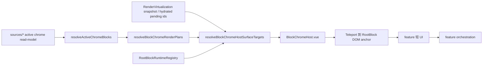

# BlockChromeHost

`blockChromeHost` 是 Editor 阶段 3 的块级 chrome 中央宿主。它只负责把大文档虚拟化路径中的轻量块级入口挂到当前 hydrated RootBlock 的 DOM 锚点上，不实现 Annotation、Revision、BlockHistory、blockActionMenu 等 feature 的业务规则。

一句话心智模型：

> Host 管挂载，业务回 feature。

## 文档树

```text
ui/blockChromeHost/
├─ README.md
├─ BlockChromeHost.vue
├─ BlockChromeHostSurfaceTeleport.vue
├─ BlockChromeHostLeftHandle.vue
├─ BlockChromeHostAnnotationHandle.vue
├─ BlockChromeHostAnnotationPanel.vue
├─ BlockChromeHostRevisionIndicator.vue
├─ BlockChromeHostRevisionToolbar.vue
├─ BlockChromeHostHistoryPanel.vue
├─ useActiveChromeBlocks.ts
├─ useBlockChromeHostSurfaceTargets.ts
├─ definitions/
│  ├─ activeChromeBlocks.ts
│  ├─ blockChromeRenderPlan.ts
│  └─ blockChromeRenderTarget.ts
├─ functions/
│  ├─ resolveActiveChromeBlocks.ts
│  ├─ resolveBlockChromeRenderPlans.ts
│  ├─ resolveBlockChromeRenderTargets.ts
│  ├─ resolveBlockChromeHostSurfaceTargets.ts
│  └─ readRootBlockIdFromChromeEventTarget.ts
├─ sources/
│  ├─ useAnnotationChromeSource.ts
│  ├─ useBlockActionMenuChromeSource.ts
│  ├─ useBlockHistoryChromeSource.ts
│  ├─ useRenderVirtualizationKeepAliveChromeSource.ts
│  ├─ useRevisionToolbarChromeSource.ts
│  ├─ useRootBlockDraggingChromeSource.ts
│  └─ useRootBlockHoverChromeSource.ts
└─ debug/
   └─ blockChromeHostRuntimePerf.ts
```

## 模块职责

- 收集 hover、focus、selection、menu、drag、annotation、revision toolbar、history mode、keep-alive 等 active chrome 来源。
- 把 active block 转成明确的 `BlockChromeRenderPlan`。
- 在 `useBlockChromeHostSurfaceTargets.ts` 中连接 runtime 只读端口、虚拟化 snapshot 与 hydrated pending ids。
- 通过 RenderVirtualization public runtime query 读取当前 block 的 `chromeAnchor`、revision header mount、rootBlock DOM 等 action-time handle；Host 不能 import registry 写能力。
- 通过 Teleport 渲染轻量 surface：left handle、annotation handle、annotation panel mount、revision indicator、revision toolbar、history panel。
- 暴露 `window.__BLOCK_CHROME_HOST_PERF__`，用于检查 Host 当前 active block、target ready 和 missing target 状态。

## 非职责

- 不直接读写 Annotation / Revision / BlockHistory / blockActionMenu 的内部 store。
- 不实现批注面板定位、修订接受/拒绝、历史版本恢复、菜单项生成等业务规则。
- 不扫描全文 DOM，不做窗口规划，不维护 hydrated 状态副本。
- 不替代 RenderVirtualization 的 keep-alive 事实源，也不直接操作 `pinnedSet`。
- 不把旧 `BlockChrome.vue` 的 props 链整套搬进 Host。

## 数据流



## Surface 边界

| Surface | Host 负责 | 业务回流 |
|---------|-----------|----------|
| `left-handle` | 拖拽柄、菜单入口、历史入口挂载 | 菜单通过 `blockActionMenu/orchestration`；历史通过 `BlockHistory/orchestration` |
| `annotation-handle` | 右侧批注入口按钮和轻量摘要 | 创建批注走 Annotation feature 的 `TRIGGER_ANNOTATION_CREATE_KEY` 注入契约 |
| `annotation-panel` | 把全局面板挂到当前 Editor 布局管理器解析出的 owner-scoped `.annotation-layer` | 面板编辑、删除、重叠避让和持久化留在 Annotation feature |
| `revision-indicator` | 当前 hydrated pending header 的文档流状态行 | canonical pending 摘要由 Revision read-model / functions 提供 |
| `revision-toolbar` | hover / selection 后出现的接受、拒绝按钮 | 点击走 `Revision/orchestration/applyBlockRevisionToolbarAction.ts` |
| `history-panel` | 历史头部、右侧对比面板、时间轴挂载 | 恢复、删除、保存当前版本等规则留在 BlockHistory feature |

## 开发规范

1. 新增 surface 前，先补 `definitions/blockChromeRenderPlan.ts` 契约，再补纯函数测试，最后接入 Vue。
2. DOM 目标解析只能放在 `functions/resolveBlockChromeHostSurfaceTargets.ts` 或更窄的函数里，不能散落在模板 computed 中。
3. 常驻 surface 必须说明为什么不属于 active chrome。当前典型例子是 `revision-indicator`：它来自 hydrated pending header ids，不来自 hover / focus。
4. Feature 数据只能通过 read-model / typed InjectionKey / public orchestration 进入 Host；禁止 import feature 内部 store 或复用旧组件的私有 composable。
5. Host 组件可以有显式分支渲染不同 surface，但不能把业务规则写进分支里。
6. Teleport 外壳只处理挂载，不接收业务 props，不决定渲染哪个 feature UI；同一个 blockId 换 DOM target 时必须换 key，避免文档切换时复用旧组件实例。不要用 `isConnected` 过滤 target：ProseMirror NodeView 可能先注册 runtime handle、随后才把 DOM 接入文档，提前过滤会让 pending header 错过挂载机会。
7. 与虚拟化协作时只消费 runtime 只读端口和 engine snapshot，不自行维护 hydrated / pinned 副本，也不 import `RenderVirtualization/internal`。
8. 如果需要 keep-alive，使用 `useRenderVirtualizationKeepAliveLease` 或对应公开入口，不能直接改 plugin state。
9. Annotation 面板禁止用字符串 Teleport target（如 `to=".annotation-layer"`）。Workspace 外壳和 Document Surface 可能存在同名容器，目标元素必须由 Annotation layout contract 显式提供，确保挂载目标与坐标原点是同一个 DOM 元素。

## 测试与观测

核心单元测试：

```bash
npm test -- \
  apps/renderer/domains/editor/ui/blockChromeHost/functions/resolveActiveChromeBlocks.test.ts \
  apps/renderer/domains/editor/ui/blockChromeHost/functions/resolveBlockChromeRenderPlans.test.ts \
  apps/renderer/domains/editor/ui/blockChromeHost/functions/resolveBlockChromeRenderTargets.test.ts \
  apps/renderer/domains/editor/ui/blockChromeHost/functions/resolveBlockChromeHostSurfaceTargets.test.ts
```

DevTools 观察入口：

```js
window.__BLOCK_CHROME_HOST_PERF__?.getSnapshot()
window.__BLOCK_CHROME_HOST_PERF__?.getHistory()
```

阶段 3 回归时至少检查：

- 1500 首开后 `finalNodeView.vue` 不回到每块一个 Vue。
- left handle 菜单、拖拽、历史入口正常。
- annotation handle / panel 创建与 hover 保活正常。
- revision indicator 保持文档流宽度，toolbar hover / selection 正常。
- history panel 恢复流程仍走 BlockHistory orchestration。

## 相关文档

- [虚拟化演进路线](../../docs/virtualization-evolution-roadmap.md)
- [RenderVirtualization](../../features/RenderVirtualization/README.md)
