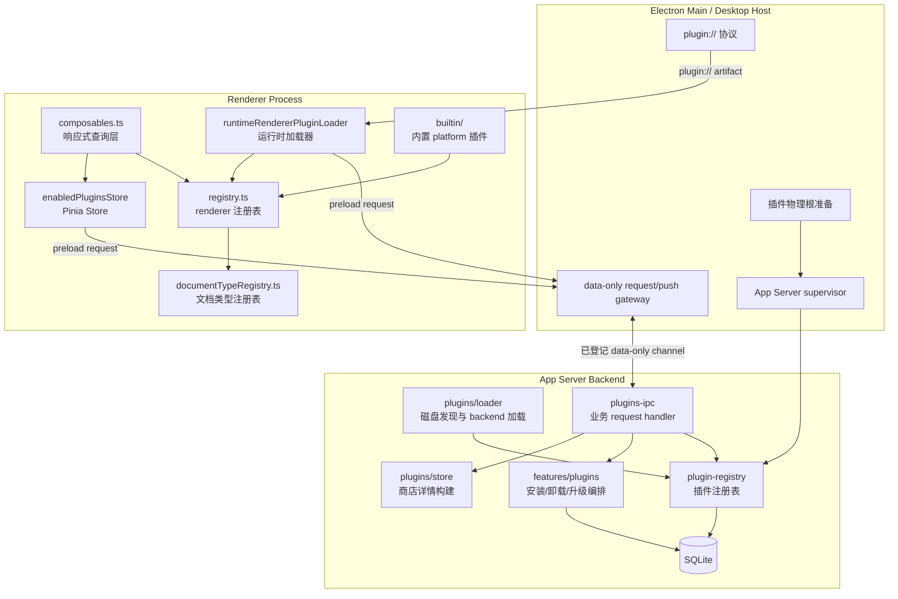
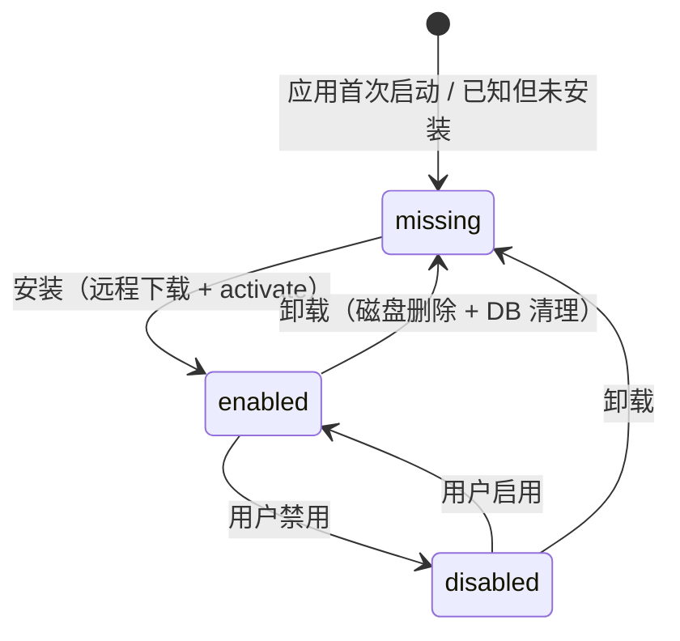
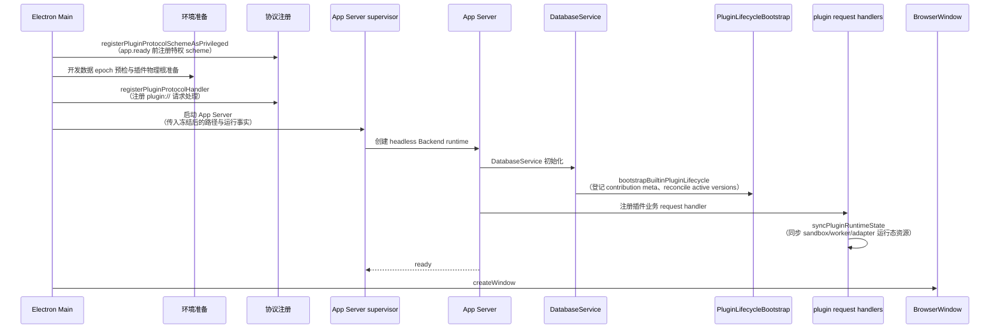
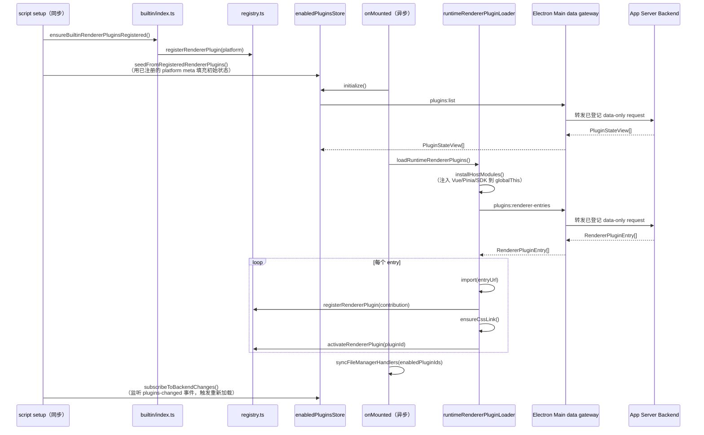
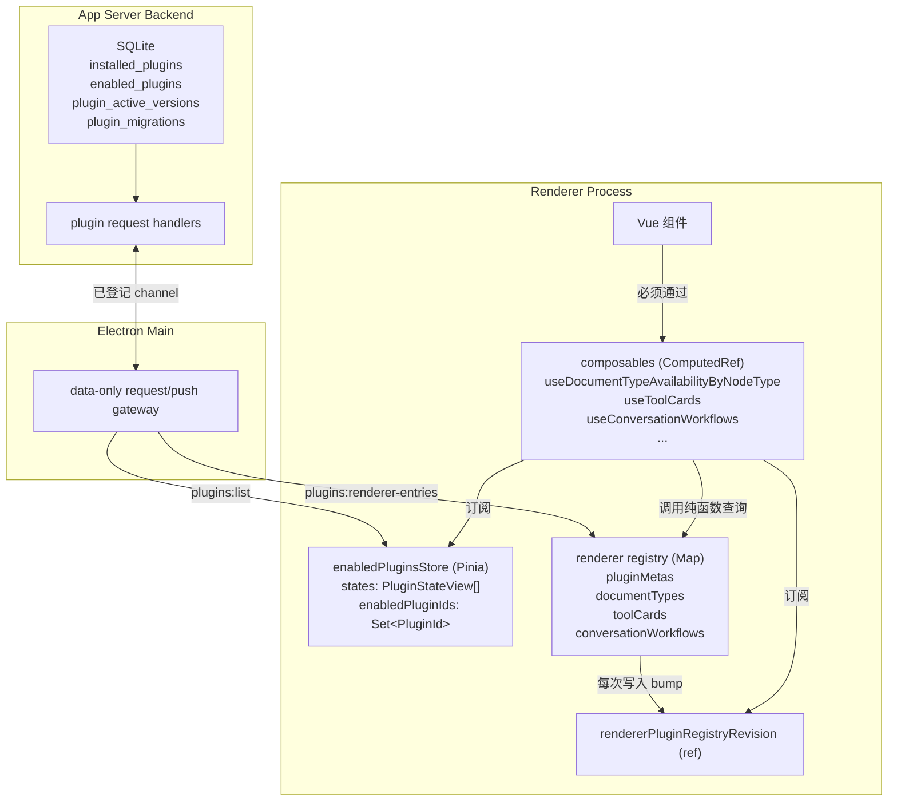
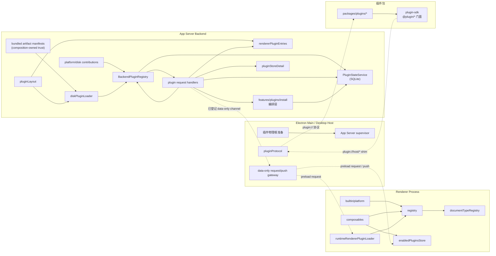

# 插件系统架构参考

本文档是 Linnya 插件系统的**架构参考**，描述系统的结构、模块、数据流、状态管理、加载时序和边界约束。如需了解如何开发插件，请查阅 [guides/](./guides/) 目录下的开发指南。

---

## 1. 进程架构

插件系统横跨 **App Server Backend、Electron Main Desktop Host 和 Renderer** 三个边界。App Server 拥有插件 backend registry、数据库、生命周期编排和业务 handler；Electron Main 只准备桌面运行环境、注册 `plugin://` 协议、监督 App Server，并在已登记的 data-only channel 上转发 Renderer request/push；Renderer 拥有界面侧 registry、加载器和响应式状态。

### Backend 与 Desktop 侧

| 运行 owner | 模块 | 路径 | 职责 |
| --- | --- | --- | --- |
| App Server | 插件注册表 | `src/app-hosts/linnya/plugin-registry/` | platform 与 disk contribution 登记、backend capability 管理、运行态状态管理 |
| App Server | 插件加载器 | `src/electron-main/plugins/loader/` | 磁盘插件发现、backend contribution 加载和 Renderer entry 构建 |
| App Server | Renderer request handler | `src/electron-main/ipc/handlers/plugins/` | 处理 `plugins:list`、`plugins:renderer-entries`、`plugins:set-enabled`、安装、卸载等业务请求 |
| App Server | 安装/卸载编排 | `src/features/plugins/` | 插件安装/卸载/升级、多步骤持久化和数据迁移 |
| App Server | 商店详情 | `src/electron-main/plugins/store/` | 从磁盘 `plugin.json` + `package.json` 构建商店展示数据 |
| Electron Main | 运行环境准备 | `src/electron-main/plugins/loader/prepareElectronPluginRuntimeEnvironment.ts` | 解析并准备插件物理根，将冻结后的路径事实交给 App Server |
| Electron Main | Renderer 协议 | `src/electron-main/plugins/loader/pluginProtocol.ts` | 注册 `plugin://`，向 Renderer 提供插件 artifact 与 host shim |
| Electron Main | 数据网关 | `src/electron-main/app-server-runtime/orchestration/registerBackendRendererRequestIpcHandlers.ts` | 只转发 App Server 已登记的 data-only request/push，不运行插件业务 handler |

`src/electron-main/plugins/loader/**`、`src/electron-main/ipc/handlers/plugins/**` 和 `src/electron-main/plugins/store/**` 中仍有 App Server 代码的历史物理目录债务。判断 owner 时以组合根和执行进程为准，不能因路径名把数据库、registry 或插件业务 handler 写回 Electron Main。

官方插件包位于 `packages/plugins/*`，也是 pnpm workspace 成员；workspace 只负责依赖安装、typecheck 和本地开发协作。除 Core 自带的 platform contribution 外，产品插件 backend 在开发和生产环境都通过磁盘 artifact 装配；开发态可使用独立构建的 direct-dir backend entry，Renderer 仍可通过 Vite 读取插件源码。生产态统一使用插件 artifact；electron-builder 明确排除 `node_modules/@plugin/**`，避免 workspace 软链被打进 asar。

#### 加载器子模块

| 文件 | 职责 |
| --- | --- |
| `pluginLayout.ts` | 从 `LINNYA_PLUGIN_ROOT`、通用 artifact direct dirs、backend 专用 direct dirs 和开发态 monorepo 插件目录发现插件；读取 `active.json` 解析版本指针；读取 `plugin.json` 解析 manifest 摘要 |
| `pluginProtocol.ts` | Electron Main 注册 `plugin://` 自定义协议；拦截 `plugin://host/*` 请求返回宿主依赖 shim（Vue、Pinia、SDK 门面模块）；拦截 `plugin://{pluginId}/*` 请求映射到插件磁盘文件 |
| `rendererPluginEntries.ts` | App Server 为 Renderer 构建插件入口列表；区分 direct / official-source / active 三种来源；开发态优先返回 Vite `/@fs/` 源码路径 |
| `diskPluginLoader.ts` | App Server 从磁盘加载 backend contribution（`require` 插件 backend 入口）；校验 manifest 与 contribution 一致性；加载失败时尝试回滚 `active.json` |

### Renderer Process 侧

| 模块 | 路径 | 职责 |
| --- | --- | --- |
| renderer 注册表 | `apps/renderer/app/plugins/registry.ts` | 管理已注册的 renderer contribution（pluginMeta、documentType、toolCard、documentActionMenu、documentRuntimeLoader、conversationWorkflow）；模块级 `Map`，非响应式 |
| 文档类型注册表 | `apps/renderer/app/plugins/documentTypeRegistry.ts` | documentType 的多键索引（按 activeDocumentType、nodeType、createRequestType、fileSessionType 查找）；普通 `Map`，非响应式 |
| 响应式查询层 | `apps/renderer/app/plugins/composables.ts` | 桥接非响应式 registry 与 Vue 响应式系统的 composable 集合 |
| Pinia Store | `apps/renderer/app/plugins/enabledPluginsStore.ts` | 管理插件启用态的响应式状态；经 Desktop data gateway 读取 App Server 的 SQLite 状态；提供安装/卸载/启停的 action |
| 运行时加载器 | `apps/renderer/app/plugins/loader/runtimeRendererPluginLoader.ts` | 动态 import 插件 renderer 入口 → 校验 contribution → 注册到 registry → 注入 CSS → 激活 |
| 内置插件 | `apps/renderer/app/plugins/builtin/` | 同步注册 platform 插件（文档/表格的 documentType、工具卡、对话工作流）；安装宿主模块到 `globalThis` |

---

## 2. 插件生命周期状态机

插件有三种状态，以 SQLite 为唯一真源：

| 状态 | 含义 | SQLite 表现 |
| --- | --- | --- |
| `enabled` | 已安装且启用，backend/renderer contribution 参与运行 | `installed_plugins` 有记录 + `enabled_plugins` 有记录 |
| `disabled` | 已安装但被用户停用，contribution 不参与能力筛选 | `installed_plugins` 有记录，`enabled_plugins` 无记录 |
| `missing` | 官方 registry/catalog 已知，但当前未安装 | `installed_plugins` 无记录 |

真源表结构：

- `installed_plugins` — 已安装插件的版本和元信息
- `enabled_plugins` — 已启用插件 ID 集合
- `plugin_active_versions` — 当前磁盘活跃 artifact 的版本指针
- `plugin_migrations` — 数据库迁移执行记录

---

## 3. 启动时序

### Desktop Host 与 App Server

### Renderer Process

**关键时序约束**：

1. `ensureBuiltinRendererPluginsRegistered` 在 `<script setup>` 同步执行，确保 platform 的 documentType 在首帧可用
2. `seedFromRegisteredRendererPlugins` 紧随其后，用已注册的 meta 填充 Pinia store 初始值，避免 UI 闪烁
3. `initialize()` 在 `onMounted` 异步执行，经 Desktop gateway 从 App Server 读取真实的 SQLite 状态覆盖 seed；Electron Main 不读取数据库
4. `loadRuntimeRendererPlugins()` 必须在 `initialize()` 之后，确保 `plugins:renderer-entries` 使用最新的 enabled 集合

---

## 4. 数据流与状态管理

系统有三层数据源，职责分明：

### 三层数据源

| 层级 | 位置 | 数据类型 | 响应式 | 说明 |
| --- | --- | --- | --- | --- |
| SQLite | App Server Backend | `installed_plugins`、`enabled_plugins`、`plugin_active_versions`、`plugin_migrations` | — | 持久化真源，跨重启保持；Electron Main 不访问 |
| enabledPluginsStore | Renderer Pinia | `PluginStateView[]`、`enabledPluginIds: Set` | Vue reactive | SQLite 状态的响应式镜像，经 Desktop gateway 与 App Server 同步 |
| renderer registry | Renderer 模块级 Map | documentType、toolCard、documentActionMenu 等 | 非响应式 | 已加载的 renderer contribution 实例 |

### composable 桥接机制

registry 内部使用普通 `Map`，Vue 的响应式追踪无法感知 `Map` 的读写。桥接方案：

1. registry 每次写入（注册/注销/激活/停用）时调用 `bumpRendererPluginRegistryRevision()`，递增一个 `ref(0)` 计数器
2. composable 内部同时订阅 `rendererPluginRegistryRevision` 和 `enabledPluginsStore` 的响应式状态
3. 返回 `ComputedRef`，当 revision 或 store 变化时自动重算

**不变式**：Vue 组件中消费 registry 数据**必须使用 composable**（如 `useDocumentTypeAvailabilityByNodeType`），禁止直接调用 registry 纯函数。纯函数保留给测试和命令式事件处理等非响应式场景。

---

## 5. 开发与生产环境差异

| 维度 | 开发环境 | 生产环境 |
| --- | --- | --- |
| Backend 加载 | Core platform contribution 随 App Server 装配；产品插件从独立构建的 direct-dir backend artifact 加载 | disk — App Server 从 `active.json` 指向的版本目录 `require` 独立构建产物 |
| Renderer 加载 | Vite `/@fs/` 直读插件源码（`package.json` `exports["./renderer"]`） | `plugin://` 协议读取 `dist/renderer/` 构建产物 |
| Renderer 入口来源 | `official-source` — 从仓库 `packages/plugins/*/` 发现 | `active` — 从 `LINNYA_PLUGIN_ROOT/{pluginId}/{version}/` 发现 |
| 入口优先级 | direct > official-source > active | direct > active |
| CSS 注入 | 无（Vite HMR 处理） | `plugin://{pluginId}/dist/renderer/assets/*.css` 动态 `<link>` |
| 安装/卸载 | 操作 SQLite，不影响源码目录 | 真正的磁盘文件下载/删除 + SQLite 更新 |
| 宿主依赖 | Vite 模块解析，共享同一份 Vue/Pinia | `plugin://host/*` shim — globalThis 注入的宿主模块代理 |

环境判断逻辑在 `shouldPreferSourceRendererPluginEntriesForEnvironment()` 中：

- `LINNYA_PLUGIN_RENDERER_BUNDLE=inline` → 强制源码态
- `LINNYA_PLUGIN_RENDERER_BUNDLE=disk` → 强制磁盘态
- 未设置时：`!app.isPackaged` 或 `NODE_ENV=development` 或 `LINNYA_DEV_MODE=true` → 源码态

这里的“开发/生产”只表示插件 Renderer 读取源码还是磁盘 artifact，不表示 Desktop
是否由 Linnya 官方发行。社区打包同样读取磁盘 artifact，但发行身份仍是 `community`；
官方服务统一消费 [`DistributionIdentity`](../../src/shared/distribution-identity/README.md)。

---

## 6. 关键约束与边界

### 隔离边界

- **host 不 import 具体插件**：通用宿主代码（registry、request handler、编排）不直接引用 `packages/plugins/*` 的内部模块。插件能力通过 contribution 注册表接入。
- **插件不 deep import host 内部**：插件只能通过 `@plugin/*` 门面（SDK 模块）访问宿主能力。renderer 侧通过 `plugin://host/*` shim 获取 Vue、Pinia 和 SDK 模块。
- **contribution 只声明能力，enabled 过滤由平台统一处理**：插件 contribution 注册时不关心自身是否 enabled，所有能力查询函数都接受 `enabledPluginIds` 参数进行过滤。
- **workspace 软链不是运行入口**：`node_modules/@plugin/*` 只服务 workspace 安装拓扑；宿主别名必须优先指向 `packages/plugins/<id>/src/*`，打包时也必须排除该软链。

### 状态约束

- **SQLite 是唯一真源**：插件启停状态以 `installed_plugins` + `enabled_plugins` 为准。禁止用模块级单例或内存缓存作为启停判断依据。
- **active artifact 指针双源 reconcile**：SQLite `plugin_active_versions` 与磁盘 `active.json` 保持一致，启动时由 `reconcilePluginActiveVersions` 校对。

### 响应式约束

- **Vue 组件必须通过 composable 消费 registry**：registry 是非响应式 `Map`，直接在 `computed` 中调用纯函数不会触发更新。composable 通过订阅 `rendererPluginRegistryRevision` ref 桥接响应式。

### 加载约束

- **builtin 插件同步注册**：platform 插件在 `<script setup>` 同步注册，确保首帧文档类型可用。
- **runtime 插件异步加载**：第三方/官方扩展插件在 `onMounted` 异步加载，经 Desktop gateway 从 App Server 获取入口列表。
- **宿主模块必须先安装**：`loadRuntimeRendererPlugins` 执行前必须调用 `installHostModules()`，将 Vue/Pinia/SDK 注入 `globalThis.__LINNYA_RENDERER_PLUGIN_HOST_MODULES__`。

### 生命周期约束

- **卸载不删数据表**：卸载只清理磁盘文件和 SQLite 安装记录，保留用户数据。
- **禁用仍迁移**：disabled 状态的插件仍执行数据库 schema 迁移，保证数据版本与 artifact 一致。
- **操作串行化**：同一插件的安装/卸载/启停操作通过 `pluginLifecycleSerialExecutor` 串行执行，防止竞态。
- **版本目录不可变**：同一 `pluginId@version` 的预置或远程 artifact 与既有版本目录必须拥有相同 `SHA512SUMS`；内容冲突直接终止 seed 或安装，不能覆盖目录、沿用旧内容或仅记录 warning。

---

## 7. 模块依赖图

**核心依赖方向**：

- App Server 侧：插件 request handler 是中枢，向上调用 `BackendPluginRegistry` 查询能力，向下调用 `features/plugins` 执行持久化操作
- Electron Main 侧：只负责环境准备、`plugin://`、App Server supervisor 与 data-only gateway，不拥有插件业务状态、数据库或 backend contribution
- Renderer 侧：`composables` 是 Vue 组件的唯一访问入口，同时依赖 `registry`（能力数据）和 `enabledPluginsStore`（启用态）
- 跨进程：Renderer 的 preload request/push 经 Electron Main data gateway 转发到 App Server；`plugins:list`、`plugins:renderer-entries`、`plugins:set-enabled` 等真实 handler 都在 App Server
- 插件包：通过 `plugin-sdk` 的 `@plugin/*` 门面访问宿主能力，renderer 侧通过 `plugin://host/*` shim 获取运行时依赖
