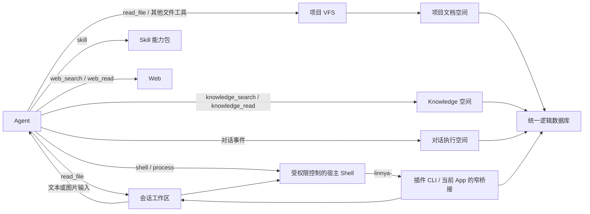

# Linnya 产品模型总览

> 状态：产品定义与愿景文档（Vision / PRD 层）
>
> 这份文档回答 Linnya 是什么、从哪里来、当前形成了哪些产品边界，以及未来希望演进成什么。
> 其中“不变式”描述长期方向，不是执行计划、迁移方案或排期；当前实现与愿景有差距时，以 owner 文档和代码说明已经落地的事实。
>
> 过程方案形成稳定结论后回写本文或对应 owner 文档，不把历史实现和阶段性选择误写成永久产品概念。

---

## 0. 一句话

**Linnya 是一个以 Agent 为中心的文档数据库。**

所有文档类型存在同一个逻辑数据库里，按项目组织；数据库通过 VFS 映射成一棵虚拟路径树；Agent 在一个真实的会话工作区里工作，并通过一组恒定的通用工具操作虚拟树、会话文件和宿主命令。文档类型可以无限扩展，基础工具面不变。插件通过 VFS 文本投影、CLI 和 Skill 接入 Agent；Agent 必须经通用 `shell` / `process` 调用插件 CLI，不为插件领域命令增加新的模型工具。推荐把适合文本表达的插件文档类型做成“代码即文档”。

### 0.1 公开历史

> Linnya 的开发始于 2025 年 3 月。出于隐私、安全和开源边界原因，公开 Git 历史从经过净化的首次源码发布开始。

- 2025-03：项目开始开发；
- 2025-07：发布 `0.0.31` 内测版本；
- 2026-02：发布 `0.0.34`；
- 2026-03：发布 `0.0.35`；
- 2026-04：Linnkit 首次独立发布；
- 2026-06：形成插件独立发布体系。

### 0.2 当前与未来

当前 Linnya 已经形成 Desktop Host、Renderer、独立 Linnkit npm 依赖、产品 Schemas、插件 Host 合同和开放官方插件等主要边界。具体目录和当前 owner 以根目录[工程协作指南](../AGENTS.md)为准。

未来方向由下文的产品模型与不变式描述：统一逻辑数据库，以 VFS 组织可扩展文档类型，让 Agent 通过稳定的基础工具、CLI 和 Skill 工作，同时保持内核、产品与插件之间的独立演进。文中明确标注的未决项仍是研究问题，不代表已经承诺的实现排期。

---

## 1. 四层坐标

| 层 | 内容 | 演进节奏 |
|---|---|---|
| **内核层** | linnkit：语义无关的 Agent 执行内核 | 独立开源包，与业务解耦 |
| **工具层** | 模型可见的基础工具面与正交扩展能力 | **基础面恒定**，这是本文最重要的约束 |
| **存储层** | 逻辑数据库 / 会话工作区 / 外部源 | 结构稳定，实例无限增长 |
| **接入层** | 插件 contribution：文档类型、VFS 投影、CLI、Skill、富文档交互界面 | **任意膨胀** |

核心张力只有一句话：**接入层可以持续扩展，基础工具面保持不变。**

这不是审美偏好。它是产品能否长期扩展的判据：如果新增一种文档类型就要新增一组 Agent 工具，模型需要理解的名称、schema 和选择分支就会持续累积，最终让插件扩展受限于模型上下文和工具选择质量。

---

## 2. 存储模型

从 Agent 的产品心智看，数据落在三类位置：**逻辑数据库**、**会话工作区**和**外部源**。三者的身份、寻址和权限边界不能被抹平；但项目文档与会话文件可以在明确的路径规则下共用 `read_file` 这个阅读动作。

### 2.1 逻辑数据库 —— 统一的数据底座

Linnya 的“同一个数据库”指同一个**逻辑数据库体系**，不要求所有字节物理上都塞进一张 SQLite 表。SQLite、向量索引、原始文件仓储和插件卫星表可以承担不同存储职责，但都由 Linnya 的数据模型统一管理。

这个逻辑数据库包含三个边界清楚的空间：

| 空间 | 主要内容 | 是否进入项目 VFS |
|---|---|---|
| 项目文档空间 | `projects`、`workspace_nodes`、各文档类型及其卫星表 | 是 |
| Knowledge 空间 | 知识库、知识文档、切片、索引及项目绑定关系 | 否，保持独立命名空间 |
| 对话执行空间 | `conversations`、`runs`、`events`、`messages` 及对话产物 | 否 |

同属一个数据模型，不等于同属一棵树。项目文档、Knowledge 和对话执行事实具有不同的身份、生命周期与寻址方式，因此保留不同的逻辑命名空间。

项目文档空间中，不变的是**项目 → 节点树**这层结构；可变的是节点背后由哪种文档类型、哪组插件表承载，也就是“结构骨架 + 卫星表”。除文件夹外，项目树里的每个内容节点都必须对应一个已声明的文档类型。一个技术对象只有在被某个文档类型正式接管后，才有资格成为项目文档节点。

节点可以在项目之间重新归类，但这是保持身份的树转移，不是复制后删除：`workspace_nodes.id` 与以该 ID 为 owner 的文档内容/卫星关系保持不变，项目与 path 地址随转移改变。知识库绑定、Conversation、Todo 和项目级资产关系仍由项目自身拥有，不随一个节点隐式迁移。

`asset`、`blob`、原始文件和缓存描述的是存储角色，不是产品实体类型。它们可以被项目文档、Knowledge 或对话事件引用，但不会因为写入了资产表就自动获得项目路径。用户可见的普通文件如果要进入项目树，也应由相应的文档类型接管；文档类型可以只保存原始文件引用，但必须拥有正式身份和生命周期。

### 2.2 VFS —— 项目文档空间的路径投影

数据库不直接暴露给 Agent。VFS 把项目节点树投影成虚拟路径，并把通用文件动作调度给对应文档类型。

VFS 只负责路径空间、节点映射和能力调度，不拥有业务数据，也不规定文档内部必须采用什么存储格式。主路径应与用户看到的项目树一致；模型侧使用 `workspace:/...` locator 表达当前路径，稳定身份仍由 `inode` 承担。

VFS 可以在实现层增加只读视图，但 `.linnya`、`systemView` 或某种固定的文档内部路径结构不是产品模型的前提。是否需要这些视图，应由真实工作流证明，而不是要求每种插件预先实现。

### 2.3 会话工作区 —— Agent 的真实工作目录

每个对话有一个稳定的本地目录。同一对话的 Agent 可以共享其中的过程文件；进程可以结束，文件可以在会话生命周期内保留。

Agent 执行 Shell 时默认以这个目录为工作区，并向 Linnya 传递相对路径。中间脚本、下载数据、CLI 渲染结果和临时转换文件都应默认落在这里，不污染项目文档树。

Shell 是**受权限控制的宿主命令能力**，不是严格的 conversation-only 沙箱。它可以在权限和审批允许的范围内访问显式宿主路径；会话工作区是默认工作目录和过程文件归宿，不是虚假的操作系统安全边界。`process` 负责同一宿主命令模型下的长进程生命周期。

三类 locator 的事实源不同，但都属于 `read_file` 的阅读范围：

| locator | Agent 入口 | 事实源 |
|---|---|---|
| `workspace:/...` | Workspace 五件套 | 逻辑数据库 |
| `conversation:/...` | `read_file` 只读；`shell`、`process` 仍使用普通 OS 路径 | 当前会话工作目录 |
| `file:///...` | `read_file` 只读；`shell`、`process` 仍使用普通 OS 路径 | conversation 外的宿主文件系统 |

同一套 locator 也可作为标准 Markdown link 的 destination 出现在 Conversation 回答中。`workspace:`
链接按该回答所属 Conversation 的项目解析，使用 Workspace 真实标题和已注册文档类型图标，并在应用内
打开；`conversation:` 与 `file:` 链接显示通用文件图标，点击后在系统文件管理器中定位。回答链接不公开
`documentId`，也不引入 `linnya://` 等第二套 Agent 地址协议。path 在移动、改名或删除后可以失效；它不
承诺永久引用或历史内容快照。

`list_files`、`grep`、`edit_file` 和 `write_file` 仍然只操作 `workspace:`；物理文件只能通过 Shell 命令写入。这样“阅读过程文件”和“修改用户文档”可以统一阅读动作，但不会混成同一种写入动作。裸路径不是模型合同，系统也不会通过文件是否存在来猜测地址空间。

### 2.4 产物边界

Linnya 不引入“中间产物库”。用户可见内容有两种稳定归宿：项目文档和对话产物；过程文件仍留在会话工作区。

| 东西 | 归宿 | 是否是文档节点 |
|---|---|---|
| Markdown、Slides、Sheet、MindMap 及未来文档类型 | 逻辑数据库 → 项目树 | 是 |
| AI 生成图片、图表、分析结果 | 对话事件流 | 否 |
| 中间脚本、临时数据、渲染缓存 | 会话工作区 | 否 |
| 用户明确要求的导出文件 | 获准的操作系统路径 | 否 |

对话产物和过程文件通过 `conversation:/...` locator 交给 Agent。它是跨工具阅读合同；Shell 和进程内部仍使用普通相对/绝对 OS 路径。Agent 可以通过 Shell 裁剪、转换、复制文件，也可以把 locator 交给理解该合同的插件。locator 本身只声明身份；`read_file` 的图片结果会把已校验像素作为模型附件送入当前回合，`generate_image` 则只在本次聊天模型和 route 支持工具结果图片时附加同一生成图。非视觉模型仍能完成生成并获得文字与 locator。

AI 生成图片当前就是对话产物，不进入项目树，也不需要 Image 插件。未来如果产品正式引入 Image 文档类型，它必须和其他插件一样定义数据库存储，并通过 VFS、CLI 和 Skill 接入；图片生成能力也应优先复用通用 Shell、CLI 与 Skill，而不是继续制造只能由专属 Agent 工具访问的项目资源节点。

对话产物与对话历史本来就在同一个数据模型中，但它们仍属于对话执行空间。**存进同一个数据库，不代表它们自动变成文档节点。**

同理，一张图片的二进制内容可以存入统一的 blob/asset 底座，但它当前的产品身份仍由对话事件拥有。未来把同一内容加入项目，需要显式创建 Image 文档节点或其他正式文档引用关系，不能依靠存储位置隐式“升级”。

### 2.5 Knowledge 与 Web

Knowledge 属于 Linnya 的逻辑数据库，但保持现有的独立命名空间。知识库与项目是多对多关系，其核心寻址是文档身份、切片游标和相关性，而不是项目路径。因此它暂不映射进项目 VFS，通过 `knowledge_search` 和 `knowledge_read` 访问。

Web 是外部源，不进入 Linnya 的路径空间，通过 `web_search` 和 `web_read` 访问。Knowledge 与 Web 都采用“搜索 + 阅读”的工具形态，但二者的数据归属、权限和实现仍然独立。

Knowledge 与 Web 给 Agent 的模型投影必须把 owner 生成的 canonical `[@ref]`、稳定来源锚点和预算状态留在可信骨架，把标题、摘要、正文和来源派生文本放入动态不可信边界。正文中看似引用或指令的文本仍只是来源数据，不能获得 citation 身份、工具权限或授权语义。

---

## 3. 工具面

### 3.1 分解

Linnya 的恒定基础面是 8 个工具：

| 基础能力 | 工具 | 数量 |
|---|---|---:|
| 文件工具族（`read_file` 兼读 VFS、conversation 与 host 文件） | `list_files`、`read_file`、`grep`、`edit_file`、`write_file` | 5 |
| 宿主命令操作 | `shell`、`process` | 2 |
| 能力学习 | `skill` | 1 |

这 8 个工具足以让通用 Agent 发现插件文档、理解插件用法，并通过文本投影或 CLI 完成访问与编辑。新增一种文档类型可以贡献自己的 CLI，但不新增模型可见工具名。

在基础面之外，还有几组正交能力：

| 能力族 | 典型工具 | 定位 |
|---|---|---|
| Agent 协作与运行管理 | `subagent`、`task_write`、`task_read`、`ask` | 管理执行过程，不访问某种文档类型 |
| Knowledge | `knowledge_search`、`knowledge_read` | 访问逻辑数据库中的 Knowledge 空间 |
| Web | `web_search`、`web_read` | 获取外部信息 |
| 运行时结果续读 | `tool_output_read` | 按 conversation scope 继续读取被截断的长工具文本，不属于文件或资源 URI 调度 |
| 引用证据解析 | `evidence_resolve`（过渡期专用加速器） | 按 `[@ref]` 读取对话执行空间中的 Knowledge/Web 证据；不暴露 bundle URI，也不属于文件工具 |
| 对话生成 | 图片等多模态生成能力 | 产出进入对话，不是项目文档访问入口 |
| 专用加速器 | 由特定 Agent 按需注册 | 优化窄小、稳定、高频的工作流 |

基础工具恒定，不等于所有 Agent 必须看到完全相同的工具集合，也不等于 Linnya 永远不能新增平台能力。真正的约束是：**插件扩展文档类型时，不能把新增专属工具当作唯一接入方式；领域命令必须由插件 CLI 拥有，并经通用 `shell` / `process` 执行。**

EvidenceStore 属于对话执行空间中的引用证据事实。`[@ref]` 是 Agent 和文档可见的引用身份，bundle id 只是存储、审计与冲突定位事实，不应成为模型第一层 URI 心智。Citation 文档读取已经能提供当前正文窗口的持久化来源快照；Web 长正文则由通用 ToolOutputStore 保存本次完整 observation，并通过 `tool_output_read` 分页续读，不再把 Evidence 当作大文本分页仓库。Evidence 仍覆盖未写入项目文档的对话级来源快照、引用复核和恢复，因此短期保留窄的 `evidence_resolve` 专用加速器。它只返回明确标记状态、受预算约束并置于不可信来源边界中的持久快照；退出条件由 [Evidence owner 文档](../src/domains/evidence/README.md) 维护，不能把它固化为第九个基础工具。

### 3.2 为什么这样切而不是别的切法

工具边界 = 权限边界 = 审计边界 = 心智边界。四者必须重合。

因此合并两个工具的前提是四个条件**同时**成立：权限边界相同、输入单位与分页语义一致、输出能用同一个稳定 schema 表达、模型不会因为分支增加而更容易误用。仅仅因为两者都“返回文本”不足以合并。这正是 `resource_read` 的教训：它统一了 URI 路由，却把 Workspace、Knowledge、Web、Skill 和运行时产物的领域合同耦合到了一起。

同理，拆分也需要理由。`web_search` 与 `web_read` 分开，是因为输入形态（自然语言 vs 确定 URL）、provider、计费、缓存、SSRF 策略、失败重试全都不同。`knowledge_search` 与 `knowledge_read` 分开，是因为相关性检索的分页合同和文档 chunk 读取的分页合同不同构。

### 3.3 恒定性

**新增或启停任何文档类型插件，8 个基础工具名不变。**

插件通过 VFS 文本投影、CLI 和 Skill 接入 Agent；富文档交互界面（Document Surface）是独立的前端贡献，不改变 Agent 工具面。进入项目树的文档必须能被 `list_files` 发现，并让 `read_file` 返回至少一种有意义的可读投影；但不要求这个投影完整表达全部结构，也不要求每种文档都支持通用编辑。结构化文档可以把精确查询和修改交给 CLI。

专用工具可以存在，但只能是可选加速器，不能成为某个插件的唯一访问入口。只有在通用工具难以可靠表达、能够显著减少稳定调用序列，或确实需要独立权限与审计合同的时候，才值得增加专用工具。

### 3.4 统一文件阅读与多模态结果

`read_file` 是统一的“文件阅读动作”，而不是只读数据库节点的工具。它只接受三类不可歧义的身份：`workspace:/...` 读取数据库 VFS，`conversation:/...` 读取当前对话工作目录，`file:///...` 读取宿主绝对文件。Workspace 还可单独使用 `inode`；一次调用只能在 locator 与 inode 中选择一个。

裸相对路径和裸绝对路径全部拒绝，系统不会按形状或存在性依次尝试多个来源。三档命令权限不修改 `read_file` 的只读范围：读取受当前操作系统用户权限、普通文件检查、内容格式和资源预算约束；命令档位继续只管理命令执行与写入。

文件类型按“能否直接给 Agent 理解”区分：

| 文件类型 | `read_file` 行为 |
|---|---|
| 文本、Markdown、JSON、代码、插件文本投影 | 返回文本，可分页 |
| 图片 | 返回文件事实，并通过工具结果的模型输入附件让视觉模型读取 |
| DOCX、PDF 等没有直接文本投影的二进制文档 | 明确提示使用 Shell/CLI 转换为 Markdown 或其他可读格式后再读取 |
| 其他不支持的二进制文件 | 返回类型不支持，不猜测或伪造文本 |

因此，“让 Agent 看图”不需要新增 `view_image` 工具。Agent 拿到 locator 后，可以用同一个 `read_file` 把 JPEG、PNG 或 WebP 送进模型上下文。地址交接和图片物化仍是两个内部阶段，但对模型暴露的是一个稳定的文件阅读动作。

实现上，这个图片分支与当前运行时读取本地图片的方式相同：按受控路径读取文件字节，校验文件类型、大小和权限，再把字节物化为模型支持的视觉输入。这里的“视觉输入”是阅读结果的内部形态，不是另一个 Agent 工具。

物理文本限定为严格 UTF-8，并在读取前执行 20 MiB 门禁；JPEG、PNG、WebP 复用受管图片 ingress 的 10 MiB、40 MP、完整解码与内容寻址合同。SVG 只按 UTF-8 文本返回。PDF、Office、压缩包、数据库、音视频和可执行文件必须先由 Shell/CLI 显式转换。插件 CLI 不需要理解 linnkit 的多模态协议，只需产生普通文件和 canonical locator。

---

## 4. 接入层：文档类型如何接进来

### 4.1 四种插件贡献彼此独立

一个文档类型可以按需要组合四种贡献：

| 贡献 | 作用 | Agent 是否直接使用 |
|---|---|---|
| **VFS 文本投影** | 让文档能被发现，并按文档能力以文本形式浏览或编辑 | 是，通过通用文件工具族 |
| **CLI** | 提供结构化查询、精确修改、渲染、导入导出等动作 | 是，通过 `shell` / `process` |
| **Skill** | 告诉 Agent 文档语义、操作规则和 CLI 工作流 | 是，通过 `skill` |
| **富文档交互界面（Document Surface）** | 提供前端展示与交互编辑体验 | 否 |

这四项不能互相推导。拥有富文档交互界面不代表文档可以文本往返；拥有基础可读投影也不代表不需要 CLI；没有可写文本投影的结构化文档，仍然可以通过 Skill + CLI 被通用 Agent 完整操作。

`Document Surface` 是插件层通用贡献名，不是某个具体 Editor runtime。当前 `apps/renderer/domains/editor` 只承载平台 Markdown 的 Tiptap/ProseMirror 富文本实现；它的历史目录名和 `activeDocumentType='editor'` 不能被外推为所有插件必须实现的接口。

平台 Markdown 是永久启用的内建文档领域，不是 Workspace 路径层的内部格式，也不是可安装插件。它拥有自己的数据库卫星表和业务规则，并通过与插件文档类型同构的公共文档合同接入 VFS；Workspace 只拥有节点树、路径与能力调度。

“代码即文档”是推荐形态，不是所有文档类型的强制协议。Markdown、Slides、MindMap 等适合文本表达的类型，应尽量让 Agent 直接读写稳定文本；Sheet 一类结构化活文档只需要让 `read_file` 返回便于理解的概览，把精确读取与修改交给 CLI。**`read_file` 负责通用理解，不负责替代结构化查询协议。**

暴露给 Agent 的格式与底层存储格式无关。底层可以是块结构、oplog、编译产物或插件自定义表；文本投影只是 Agent 接口，数据库模型仍由文档类型自己负责。

### 4.2 不在愿景层规定统一 Capability 字段

产品模型只要求边界稳定，不要求所有插件实现同构能力，也不预设 `textRoundTrip`、`systemView` 这类统一字段。VFS 只调用文档类型公开的窄接口；某个类型不支持通用写入时，应明确拒绝并由 Skill 指向 CLI，而不是让 host 理解这个插件的业务语义。

实现层未来可以根据真实调度需求增加能力声明，但它属于插件契约设计，不是“富文档交互界面是什么”或“文档是什么”的产品定义。能力声明应描述真实可调用的接口，不能用一个粗粒度布尔值假装所有结构化格式都能无损文本往返。

### 4.3 Skill 的读取边界

Skill 是能力包，不是项目文档。它的 `SKILL.md` 和附带资源属于系统、插件或用户安装的 Skill 目录，不进入项目 VFS，因此不应该通过 `read_file` 读取。

Skill 的完整渐进披露都由 `skill` 工具负责：激活时读取 `SKILL.md`，需要时列出资源，再按资源相对路径读取内容。这样 Skill 的来源、激活状态、目录边界和资源权限都归同一个领域管理，也可以直接删除 `skill://` → `resource_read` 这条重复链路。

`read_file` 读取项目 VFS 文档投影和会话工作区文件；Knowledge、Web 和 Skill 资源仍分别通过各自的领域工具读取。它们都能返回文本，不代表它们拥有相同的身份、权限和分页合同。

### 4.4 插件 CLI 与宿主复用边界

Agent 通过通用 `shell` / `process` 调用 `linnya-<plugin-id>` 形式的插件 CLI。CLI 的子命令、参数 schema、错误码、exit code 和领域输出全部归插件自己；`plugin.json.entry.command` 只声明当前 artifact 的 CLI 入口，不承载 Agent 参数 schema。

**host 不解析插件参数。** 一旦 host 开始理解插件子命令，Linnya 本体就会长出一份插件语义的副本，每新增一个子命令就要改两处。Host 只负责 active artifact、launcher、Shell 权限、进程生命周期、输出审计，以及 CLI 访问当前 App 能力时所需的通用窄桥接。

插件 CLI 如果需要复用当前 App 已拥有的数据库、coordinator 或受管 worker，可以由一个短生命周期的轻量 CLI client 连接当前 App 的受限桥接。这个 client 仍是同一次 Shell execution 管理的操作系统子进程；桥接不是 Agent 工具，不建立第二套 proposal、审批、owner、process handle 或审计，也不能把 CLI 参数提升为 Host 业务字段。Shell 取消、对话删除和 App 退出必须同时等待子进程与桥接调用完成清理。

CLI 产生的过程文件默认落在会话工作区里，不直接写项目文档账本。CLI 如果需要修改数据库文档，应调用插件自己拥有的正式文档接口，不能绕过文档类型的写入规则。

面向人、开发脚本或 CI 的独立 command mode 可以显式启动自身所需的运行时；Agent 路径不得在桥接不可用时隐式 fallback 到第二个 Electron。两种入口应复用同一套 parser 和领域 orchestration，不复制 CLI 语义。

---

## 5. Agent 与内核

### 5.1 linnkit 的位置

Linnya 早期内聚了 Agent 循环，后来抽成独立包 linnkit 并开源。linnkit 是**语义无关的执行内核**：graph loop、事件治理、上下文工程、可暂停可恢复的交互协议。

有一条边界是确定的：**linnkit 不内置任何业务工具。** 没有 `read_file`、没有 `web_search`、没有知识库、没有文档类型。这些是产品语义，属于消费者。

有一条边界是**未定的**：Agent 协作与运行管理工具最终由 linnkit 还是 Linnya 实现。

它们在概念上属于内核层 —— 都是内核协议的语法糖，跨产品通用。但"是协议的语法糖"不等于"应该现在内置"：薄包装必须等对应协议稳定之后才有意义，否则就是给未定型的协议加装饰层。这个判断本身是对的，所以当前由 Linnya 实现不是欠账。

本文的立场：**概念分层按内核层记账，物理归属留待协议成熟后再定。** 即使这些工具继续由 Linnya 装配，分层也依然成立；判断依据是能力是否携带 Linnya 业务语义，不是代码当前位于哪个包。

### 5.2 Agent 自由注册

Agent 本身可以自由注册。Subagent 的本质是**协同工作**，不是能力隔离：它主要用于节省主 Agent 上下文、并行完成独立任务，以及应用更专门的 prompt、步骤策略和输出格式。

Default Agent 和 Subagent 都应能通过基础工具、Skill 和 CLI 完成插件工作。某个 Agent 可以隐藏与任务无关的工具，也可以注册满足 §3.3 条件的专用加速器；但专用工具不能成为“只有这个 Agent 才能完成”的能力门槛。

### 5.3 工具的暴露策略

工具**可用性**和工具**可见性**是两件事。基础能力模型稳定，但单次模型请求不必看到全部 schema。Agent 注册、任务类型和 Skill 激活状态可以决定本次暴露哪些正交能力或加速器。

---

## 6. 产品不变式

这些不变式是本文的可检验内核。任何提案如果与它们冲突，需要先修改本文。

1. **逻辑数据库统一** —— 所有持久文档类型由同一套数据模型管理；物理存储可以按职责拆分。
2. **项目树只承载正式文档类型** —— 除文件夹外，每个项目内容节点都必须有已声明的文档类型；技术资源不会自动成为文档节点。
3. **VFS 提供基础可读投影** —— 每种项目文档都能被发现和理解，但不承诺通用可写或完整结构化表达。
4. **`read_file` 统一文件阅读动作** —— 它按 `workspace:`、`conversation:`、`file:` 三种显式 locator 读取；文本直接返回，图片作为模型输入，其他二进制明确交给 Shell/CLI 转换。
5. **命名空间保持隔离** —— Knowledge、对话执行事实和 Skill 资源不混进项目路径树；conversation 与 host 文件虽可由 `read_file` 阅读，仍不是项目文档节点。
6. **8 个基础工具恒定** —— 新增或启停文档类型插件，不新增必需的 Agent 工具名。
7. **读取边界清楚** —— 文件 locator 只统一文件阅读动作；Knowledge、Web、Skill 和运行时 blob 仍保留所属领域的身份、权限和分页合同，不恢复万能 URI 资源读取器。
8. **宿主不复制插件语义** —— 通用 host 只负责注册、调度、权限与审计，不硬编码具体插件的业务分支或 CLI 参数。
9. **过程与产物分开** —— 会话工作区文件不会隐式进入项目树；对话产物不会自动变成文档节点。
10. **Subagent 是协作机制** —— 专用 Agent 和专用工具可以优化工作流，但不能成为插件能力的唯一通路。
11. **Workspace locator 是当前地址，inode 是稳定身份** —— 重命名、同项目移动和跨项目转移不改变 node/inode 身份，但会改变项目作用域与 path；历史 locator 允许失效，不能跨项目猜测。成功结果同时发布 locator 与 inode 时，下一次命令只能选择一个权威身份。新建节点尚无 inode，只能用 locator；禁止虚构 inode，也禁止 inode 失败后偷偷改按 locator 执行。
12. **TaskState 是 Conversation 状态** —— 它由当前 Conversation 的正式工具事件派生，主 Agent 是唯一读写者；不属于项目 VFS、SharedMemory、conversation instance 或跨对话任务面板。父子 Agent 只通过 `subagent(prompt)` 交接当前子任务，Subagent 系统不读取或注入 TaskState。

---

## 7. 文档边界

当前产品模型层已经没有阻碍继续研究的核心未决项。以下问题属于下一阶段的工程差距与归属分析，不改变本文的数据模型：

- Agent 协作与运行管理工具最终由 linnkit 还是 Linnya 实现。
- linnkit 的通用能力发现协议与 Linnya 的 Skill 系统如何衔接。
- Skill 激活输出已经改为资源相对路径，并由 `skill(list_resources/read_resource)` 自持渐进披露；旧 `skill://` 仅由历史 schema 和 Renderer projector 严格解释，不再进入 live `resource_read`。
- `generate_image` 已停止新建 `project_asset_links`，直接写入当前会话工作区并返回 `conversation:` locator；只有当前聊天模型支持工具结果图片时，才通过 managed image ingress 与 tool-result claim 增加模型输入附件。Slides 已能解析 locator，历史 `text_to_image` 只在 Renderer replay 边界解释。
- conversation 与 host 图片已经可以通过 `read_file(locator=...)` 回流模型输入；`resource_read(conversation_file://...)` 的公开分支和项目树资源库投影均已删除。旧全局图片不迁移、不回填、不继续授权读取，未知旧关系不恢复为产品投影。
- Knowledge 已收口为 `knowledge_search` / `knowledge_read`，Web 已收口为 `web_search` / `web_read`；两者的旧 `resource_read` live 分支均已删除，历史事件只在严格 replay 边界中解释。
- 当前专用工具中，哪些应迁移到 CLI，哪些能证明自己是高价值加速器。
- ToolOutput 已恢复独立的 `tool_output_read(blob_id, offset?, limit?)` live 入口；`tool_output://` 只作为事件和任务状态中的持久引用，历史 Resource 结果由 strict schema/projector 回放，不再进入 live URI dispatcher。
- Asset URI 已退出 live `resource_read`；`asset://` 只作为领域工具内部的模型输入 selection，Agent 读取物理图片使用 `read_file(locator=conversation:/...)` 或 `read_file(locator=file:///...)`，正式项目图片必须先取得 VFS 文档身份。
- CitationSnapshot、SharedMemory 与 Evidence bundle 均已退出 live `resource_read`；Deep Research 协作产物已成为项目 VFS 正式文档，通过通用文件工具交换。Evidence 已归入独立领域，Agent 过渡期只按 canonical `[@ref]` 使用窄的 `evidence_resolve`，不理解 bundle URI 或存储身份。
- TaskState 只由成功且完成调用配对的 `task_write` Conversation 事件派生；legacy SharedMemory adapter、生产模块、instance 上下文和物理表均已删除。它不新增任务面板或 Runtime 特权，子 Agent 也不会自动继承父 TaskState。
- 工具实现目录已按稳定能力族 / 工具 feature 两层收口：Workspace 五件套、Commands 和 Agent Control 各有明确聚合入口；Subagent 与 host-only batch 共用 `agent_control/subrun/shared` 的 child-run runner，不再互相导入 feature 内部实现。文档领域独占工具随领域或插件贡献，例如 `markdown_create_annotations` 与 TableBlock 的 `write_to_table` 均归入内建 Markdown domain，并由 App Host 与通用工具清单汇集；普通 `text/markdown` 预览不会因此获得文档实体能力。该物理目录不改变产品工具面，也不成为新的运行时 registry。
- `apps/renderer/domains/editor` 实际承担 Markdown/富文本块编辑运行时，不是插件层的通用编辑器贡献；产品模型已改用“富文档交互界面（Document Surface）”，目录是否迁移另行评估。

这些问题应在差距文档中逐项以当前调用链和数据流为证据分析，再形成重构 proposal；不在愿景文档中提前写迁移结论。

---

## 8. 相关文档

| 主题 | 文档 |
|---|---|
| Workspace / VFS 文件工具 | `src/tools/workspace/README.md` |
| 工具开发与公开面 | `src/tools/README.md` |
| Knowledge 工具边界 | `src/tools/knowledgebase/README.md` |
| Web 工具边界 | `src/tools/web/README.md` |
| ToolOutput 续读边界 | `src/tools/tool_output/README.md` |
| Asset 模型输入边界 | `src/domains/assets/README.md` |
| 会话物理文件 | `src/domains/conversation-files/README.md` |
| 文档 Citation 阅读 | `src/domains/citation/features/document-read/README.md` |
| Evidence 边界 | `src/domains/evidence/README.md` |
| Deep Research | `src/app-hosts/linnya/agent-registry/agents/deep_research/README.md` |
| Linnkit 语义边界 | [独立 Linnkit 仓的定位文档](https://github.com/linnlabs/linnkit/blob/main/docs/framework/00-vision-and-positioning.md) |
| SharedMemory 退役 | `docs/shared-memory-canonical-identity-refactor.md` |
| TaskState | `src/domains/task-state/README.md` |
| Agent Control / Subagent | `src/tools/agent_control/README.md` |
| 数据库架构 | `docs/workspace-db-architecture.md` |
| 插件体系 | `docs/plugins/architecture.md` + `docs/plugins/guides/` |
| 命令执行 | `docs/command-execution/README.md` |
| ToolOutput 领域 | `src/tools/tool_output/README.md` |
| Agent 内核 | [独立 Linnkit 仓的定位文档](https://github.com/linnlabs/linnkit/blob/main/docs/framework/00-vision-and-positioning.md) |
| 文档总图 | [`docs/README.md`](./README.md) |
| 工程地图 | [`AGENTS.md`](../AGENTS.md) |
| 开发指南 | [`docs/development/README.md`](./development/README.md) |
