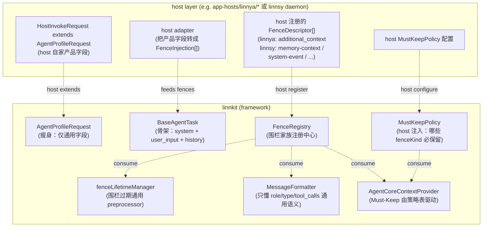

# 08 · Context Engineering 边界整治（linnkit ↔ host 解耦 + 围栏家族机制）

> **归档 / 后续机制已替代（2026-08-25）**：本文记录 2026-04 的边界设计过程；FenceRegistry、`context_injection` 与 agent-only 边界已经落地，本文不再是当前实施入口。文中 `SummarizationProvider`、三阶段 `Summarization` 和 `ContextCheckpoint` 等名称描述的是当时实现，现已由统一自动上下文压缩替代：Context Manager 只产出候选、校验和重建，Graph 用当前已锁定模型执行压缩；容量接纳后由 Host 先 durable commit，再发送 end 并经唯一 publisher fan-out `history_summary`。没有 checkpoint 工具或专用 Summary Agent。当前合同见 [Context Manager README](../../src/context-manager/README.md) 与 [Context Engineering 接入手册](../integration/context-engineering.md)。
>
> **2026-04-27 立稿**。本文回答一件事：**当前 linnkit `context-manager` 里漏到框架内的 host 产品语义，怎么剥出去；剥之后留下的"围栏注入位"漏洞，怎么沉淀成通用机制**。
>
> **读者画像**：要在 linnkit 内部修改 `context-manager/*` 的开发；要把 linnkit 接进自己产品并需要做 context engineering 的外部接入方；评审本设计的 framework 维护者。
>
> **配套实施计划**：[`09-context-engineering-package-boundary-plan.md`](./09-context-engineering-package-boundary-plan.md)。

---

## 0. 文档定位与读法

### 0.0 评审后修订记录

本版基于实施计划自检做了 4 个关键修订：

1. **新增一个通用消息类型 `context_injection`**。上一版试图只用 `metadata.fenceKind` 表达围栏，但 `AiMessage` 是 zod 闭合枚举；没有一个稳定 type，注入消息只能继续借用 `document_fragment` / `user_input`，会把迁移做成补丁。
2. **`FenceDescriptor.position` 改成明确的 `placement`**。上一版同时出现 `after-system` 和 `prepend-current-user`，枚举不一致；新版统一为 `after-system` / `before-current-user` / `after-current-user` / `after-last-tool-result`。
3. **`fenceLifetimeManager` 只处理独立的 `context_injection` 消息**。上一版把 `user_quote` 合进 `user_input` 后再清理，容易误删或重写用户真实输入；新版不改写用户原始 query。
4. **实施顺序改为“先加能力、再迁 host、最后删 legacy”**。上一版 Phase A 先删 contract、Phase B 才补 `FenceInjection`，会制造不可编译空窗；新版要求 framework 先具备兼容新旧两套输入的能力。

### 0.1 与现有 framework 文档的关系

| 文档 | 关注点 |
|---|---|
| [`04-protocol-roadmap.md`](./04-protocol-roadmap.md) | 6 条**新协议层**（N-1~N-6）+ 4 条治理升级（G-1~G-4） |
| [`07-roi-ranked-priorities.md`](./07-roi-ranked-priorities.md) | ROI 排序 + Phase F/G/H 时间表 |
| **本文 08** | **边界整治**：把现有 `context-manager` 里 linnya 产品语义剥出去 + 沉淀通用围栏机制 |

> 04/07 是"加新协议层"。本文是"治存量边界债"——**先把今天 linnkit 里不该是 linnkit 的东西剥掉，顺手抽出一个真通用的围栏注入抽象**。两件事必须一起做（详见 §3.4）。

### 0.2 与 host 产品文档的关系

本文**不锁定** linnsy / linnya 的产品语义；本文锁定的是 **linnkit 公共面**该长什么样。任何"linnsy 4 类围栏（`<memory-context>` 等）字面"的讨论都属于 linnsy 产品决策，不在本文范围。

> 一句话：**本文给宪法、不给具体法令**。

### 0.3 阅读建议

1. 第一次读：`§1 → §2 → §3 → §4 mermaid → §6 取舍`，约 25 分钟整体姿势
2. 评审 Phase A 时重点：`§2 / §3 / §4.1~§4.4`
3. 评审 Phase B 时重点：`§3 / §4.5~§4.8 / §5`
4. 实施时配套：[`09-context-engineering-package-boundary-plan.md`](./09-context-engineering-package-boundary-plan.md)

---

## 1. 背景：为什么必须做这件事

### 1.1 linnkit 的初衷

按 [`00-vision-and-positioning.md`](./00-vision-and-positioning.md) 与 [`02-current-state-evaluation.md`](./02-current-state-evaluation.md)，linnkit 的目标是**作为独立 Agent 框架**给多家接入方复用——不只是 linnya，也要支持 linnsy（IM 秘书）、未来其他 agent 形态（IDE coding agent / 数据分析 agent / etc.）。

### 1.2 当前出现的真实摩擦

通过对两份关键资料的交叉调研，现有 `context-manager/*` 暴露出**框架边界漏抽象**的硬伤：

1. **linnya 产品语义渗漏到 framework**——`document_fragment` / `project_context` / `<additional_context>` 标签字面 / `addContextualUserMessages` 里的中文文案 / `getTaskTypeText` 的 4 种 linnya 任务名，全部写死在 `packages/linnkit/src/context-manager/*` 里（详见 §2.1）。

2. **第二个接入方进来必撞墙**——linnsy 06 上下文工程文档明确写了它要"扩展围栏家族"（`<memory-context>` / `<system-event>` / `<subagent-summary>` / `<user-interjection>` 4 类，每类有不同的 role / 注入位 / 寿命），但 framework 当前**只支持一种围栏**（`<additional_context>`），且写在 `MessageFormatter` 内部的 switch 里。要么 linnsy 自己在 host 层重新发明一套（违反当时已退役的 `INTEGRATION_GUIDE §7` 所述"不要先造 bridge 再开发"），要么 linnsy 改 linnkit 源码（违反 [`DEVELOPMENT_GUIDE §3`](../DEVELOPMENT_GUIDE.md) AST boundary guard）。

3. **linnsy 实际上目前完全绕过了 `context-manager`**——它在 `linnkit-graph-executor.ts` 自塞了一个最朴素的 `contextBuilder`（`buildLlmMessages` 只是简单拼 history，没有三阶段填充、没有 Must-Keep、没有围栏）。这意味着 linnsy 06 §2 列举的"linnkit 已封装的 7 件机制"**目前 linnsy 一件都没在用**——他们在等 linnkit 把边界理清楚再接。

> **时机判断**：linnsy 即将进入 S5（Memory），那是它真正接入 `context-manager` 的时间点。**必须在 S5 启动前把 linnkit 边界整治好**——否则 linnsy 一旦在 host 层先实现一套围栏机制，反向绑死 linnkit 的边界，整治成本指数级上升。

### 1.3 本文不做的事（与 framework 已有 topic 不重叠）

- **不**改 graph-engine / runtime kernel 协议（属 04/07 范围）
- **不**新增 `MemoryPort` / `PermissionPort` / `AuditEnvelope`（属 G/H 范围，详见 [`07 §3`](./07-roi-ranked-priorities.md)）
- **不**碰 ToolPairMatcher / ToolPairTruncator / ToolHistoryCompressor / replacementSourceIds 这些**真通用机制**——它们是 linnkit 已经做对的部分（[`02 §3` 强项](./02-current-state-evaluation.md)），本文一行代码不动
- **不**为任何 host 产品定制围栏字面文案——本文只给抽象，字面留给 host 自己拍

---

## 2. 现状诊断（漏抽象的硬证据）

### 2.1 `AgentProfileRequest` contract 里写死了 linnya 文档协作语义

```text
packages/linnkit/src/context-manager/profiles/agent/contracts.ts:33-51
```

具体被污染的字段：
- `document_fragment` / `document_title` / `current_paragraph`
- `project_metadata` / `document_metadata` / `injected_context`（命名歧义）
- `user_quote` / `recentRejections` / `completionLengthHint`

**问题**：这些字段对"文档协作类产品"才有意义。linnsy（IM 秘书）、未来的 IDE coding agent 都不该被迫吃这个 shape。它本应是 host 在 `AgentInvokeRequest` 里 extends 一层提供的，而不是 framework 强制声明。

### 2.2 `BaseAgentTask.addContextualUserMessages` 里硬编码 linnya 产品标签

```text
packages/linnkit/src/context-manager/profiles/agent/tasks/BaseAgentTask.ts:104-140
```

直接用字符串拼出：
```text
<project_context>...</project_context>
<document_context>...</document_context>
[前置上下文] / [后置上下文]   ← 中文文案
```

**问题**：标签字面是 linnya 文档协作产品决策；中文文案是 linnya UI 文案。这一段**不该出现在 framework 内**。

### 2.3 `document_fragment` 是个"半官方"消息类型，全链路都识别它

不是在一个文件里特殊处理，而是**framework 多个核心组件全程把它当一等公民**：

| 位置 | 行为 | 文件:行 |
|---|---|---|
| `MessageFormatter.formatSingleMessage` | 把 `document_fragment` 包成 `<additional_context>` 转 `system` 消息 | `MessageFormatter.ts:124` |
| `AgentCoreContextProvider.isCoreMessage` | 认定 `document_fragment` 一律 must-keep | `AgentCoreContextProvider.ts:142-149` |
| `AGENT_CONTEXT_BUILDER_CONFIG.CORE_MESSAGE_TYPES` | 写死 `['system_prompt', 'user_input', 'document_fragment']` | `agent/context/config.ts:149` |
| `runContextPipeline.generateFinalMessages` | 强制让 `document_fragment` 排在 system 后第一位 | `shared/context-pipeline.ts:155` |

**问题**：三阶段填充模型隐含一个**强假设**——会有且只会有一种"必保留的注入消息"，且它叫 `document_fragment`。linnsy 想要的"`<memory-context>` 本轮自动剥离 + `<system-event>` 进 history + `<subagent-summary>` 不进主长记忆"在当前抽象下**没有挂载点**。

### 2.4 `MessageFormatter` 里写死 linnya 4 种任务名

```text
packages/linnkit/src/context-manager/shared/MessageFormatter.ts:166-177
```

```ts
const typeMap: Record<string, string> = {
  editor: '编辑器写作',
  annotation: '批注回复',
  table: '表格填充',
  transcription: '音频转录',
};
```

**问题**：framework 不该知道"linnya 有哪些任务类型"，更不该输出中文 UI 文案。

### 2.5 chat profile 已被 freeze 但仍在公开 API 表面

[`DEVELOPMENT_GUIDE §2.2`](../DEVELOPMENT_GUIDE.md) 已写明 "chat 兼容层冻结约定"——长期目标是 `chat = tools-disabled agent`。但当前 `linnkit/context-manager` 子入口仍 re-export `profiles/chat/*`，外部新接入方读 `INTEGRATION_GUIDE` 完全分不清主线是 agent。

**问题**：边界没收口。新接入方踩坑后才会发现"chat 不是主线"。

---

## 3. 设计目标

### 3.1 必须满足

1. **framework 不知道任何 host 产品语义**——`document_fragment` / `project_context` / `[前置上下文]` 这种字面绝不出现在 `packages/linnkit/src/*` 内
2. **任意 host 都能注册自己的围栏家族**——linnya 的 `<additional_context>`、linnsy 的 4 类围栏、未来 IDE agent 的 `<file_context>`，都通过同一套机制插入，不需要任何 host 改 framework 源码
3. **注入消息有稳定协议载体**——新增一个通用 `AiMessage.type = 'context_injection'`，`metadata.fenceKind` 只表达开放的 host kind；不再借用 `document_fragment` / `user_input`
4. **不破坏通用"机制层"不变量**——durable 事实、完整工具交互组、`replacementSourceIds` 与读时净化继续保留；当时的 `SummarizationProvider` / Context Checkpoint 形态不是长期合同，已按页首说明被自动压缩替代
5. **chat profile 从公开 API 摘掉**——保持源码兼容期，但新接入方看不到 chat 入口

### 3.2 显式不做

1. **不**为 linnsy 4 类围栏定制任何字段名 / 标签字面 / 寿命策略——只给"可声明任意围栏"的机制
2. **不**新增 `MemoryPort` / `MemoryProvider` 抽象——按 [`DEVELOPMENT_GUIDE §8` 按需触发项](../DEVELOPMENT_GUIDE.md)，memory port 仍在等 ≥2 个真实消费者
3. **不**改 `Checkpointer` / `EventStore` / `RunRegistryStore` 的 port 形状——这些和 context engineering 不相关
4. **不**改 graph-engine / tool runtime / LLM caller 的协议

### 3.3 边界判定原则（一条铁律）

> 一段代码该不该进 `packages/linnkit/src/*`，看一个问题：**"如果 host 是个 IDE coding agent / 数据分析 agent，它会用到这段代码吗？"** 答案为否的，必须在 host 层。

把这条铁律应用到现状，§2 的 5 处都该剥离，无一例外。

### 3.4 为什么能力建设与剥离必须一起规划、分步落地

- 只做 Phase A（剥离）：linnsy 进入 S5 后会在 host 层自己造一套围栏机制——这正是当时已退役的 `INTEGRATION_GUIDE §7` 第 1 条 "不要先造 bridge 再开发" 反对的
- 只做 Phase B（沉淀）：linnya 产品语义还卡在 framework 里，新机制无处下脚
- 正确顺序：**先加通用能力且保持旧行为，再迁 host，最后删 legacy**。不能在中间阶段留下 typecheck 红或功能空窗

---

## 4. 抽象设计

### 4.1 总览图



6 个抽象点：`AgentProfileRequest 瘦身` + `context_injection` 通用消息类型 + `BaseAgentTask 退化` + `FenceRegistry` + `fenceLifetimeManager` + `MustKeepPolicy`。下面逐个展开。

### 4.2 抽象点 1：`AgentProfileRequest` 瘦身

**目标**：framework 只声明"任意 agent 都需要"的字段，host 自由 extends。

**保留**（真通用）：
```ts
export interface AgentProfileRequest {
  query: string;
  promptKey: string;
  model_id?: string;
  modelId?: string;
  availableTools?: string[];
  conversationHistory?: AiMessage[];
  // 新增：声明本轮要注入哪些围栏（kind + content + meta）。
  // BaseAgentTask 会把它们展开成 AiMessage(type='context_injection')。
  fences?: FenceInjection[];
}
```

**移除**（host 产品语义）：
- `context_before` / `context_after` / `current_paragraph`
- `document_fragment` / `document_title` / `injected_context`
- `project_metadata` / `document_metadata`
- `user_quote` / `recentRejections` / `completionLengthHint`

**host 怎么处理**：`app-hosts/linnya/context/contracts.ts` 自己声明 `LinnyaInvokeRequest extends AgentProfileRequest`，把 linnya 字段挂在 host 一侧。linnsy 同理在 daemon 内声明自己的 invoke request shape。

> ⚠️ **隐患提示**：迁移时 `AgentProfileUserQuote` / `AgentProfileProjectMetadata` / `AgentProfileDocumentMetadata` 这 3 个 interface 也要从 contracts.ts 移走——它们是 linnya 文档协作产品的领域类型，不是框架契约。

### 4.3 抽象点 2：新增 `context_injection` 通用消息类型

**目标**：给围栏注入一个稳定协议载体，避免继续借用 `document_fragment`、`context_before`、`context_after` 或把围栏硬塞进 `user_input`。

```ts
export const UserMessage = BaseMessage.extend({
  role: z.literal('user'),
  type: z.enum([
    'user_input',
    'context_injection',
    'image',
    // legacy: 仅迁移期保留，Phase C 后从 framework 公开约束移除
    'context_before',
    'context_after',
    'document_fragment',
    'task_request',
  ]),
});

export const SystemMessage = BaseMessage.extend({
  role: z.literal('system'),
  type: z.enum([
    'system_prompt',
    'history_summary',
    'context_injection',
  ]),
});
```

**不变量**：
- `context_injection` 是**唯一新增的通用 type**；host 的开放命名仍放在 `metadata.fenceKind`
- `user_input` 永远只表示用户真实输入，不再被围栏生命周期逻辑改写
- legacy type（`document_fragment` / `context_before` / `context_after`）只保留到迁移完成，最终不应再由 framework 生成

### 4.4 抽象点 3：`BaseAgentTask` 退化为骨架

**目标**：BaseAgentTask 只负责"通用消息骨架"，把"项目 / 文档 / 工作区上下文"的拼装移交给 host。

**保留职责**：
- `system_prompt` 消息生成
- `user_input` 消息生成（含 history dedup）
- 把 history 数组按时序附加
- **新增**：把 `request.fences` 中声明的围栏展开为 `context_injection` 消息，按其 `FenceDescriptor.placement` 注入对应位置（`after-system` / `before-current-user` / `after-current-user` / `after-last-tool-result`）

**完全移除**：
- `addContextualUserMessages()` 整个方法
- `<project_context>` / `<document_context>` / `[前置上下文]` / `[后置上下文]` 字符串拼装
- `request.user_quote` 对 user query 的 wrap 逻辑（这条改放 host 注册的 `user-quote` fence，不再改写 `user_input`）

**host 怎么处理**：linnya 在 host 侧把 `project_metadata` / `document_metadata` / `user_quote` 等领域字段转成 `FenceInjection[]`。BaseAgentTask 只消费 `fences`，不再需要 host 子类覆盖 `addContextualUserMessages()`。

### 4.5 抽象点 4：`FenceRegistry` + `FenceDescriptor`（核心新抽象）

**目标**：把"围栏"从 framework 内部硬编码（`<additional_context>` 写死在 MessageFormatter 的 switch）变成**可由 host 声明式注册的通用机制**。

```ts
/**
 * 围栏描述符：声明一个围栏类别的所有元数据。
 *
 * - kind: 唯一标识（host 自定义命名，如 'memory-context' / 'additional-context'）
 * - llmRole: 注入到 LLM 消息的哪个 role
 * - placement: framework 三阶段填充模型在哪个位置摆放它
 * - lifetime: 决定它是"本轮剥离"还是"进 history"
 * - mustKeep: 是否一律视为 Must-Keep（覆盖 §4.6 默认策略）
 * - maxBudgetFraction: 可选截断上限，基于上下文总预算
 * - formatter: 字面字符串怎么拼（标签命名留给 host）
 */
export interface FenceDescriptor {
  kind: string;
  llmRole: 'user' | 'system';
  placement: 'after-system' | 'before-current-user' | 'after-current-user' | 'after-last-tool-result';
  lifetime: 'turn-only' | 'persisted';
  mustKeep?: boolean;
  maxBudgetFraction?: number;
  formatter: (content: string, attrs: Record<string, unknown>) => string;
}

/**
 * 一次注入实例：host 在 AgentProfileRequest.fences 里塞这个。
 */
export interface FenceInjection {
  kind: string;                   // 必须先在 FenceRegistry 注册
  content: string;
  attrs?: Record<string, unknown>;
  metadata?: Record<string, unknown>;
}

export interface FenceRegistryPort {
  register(descriptor: FenceDescriptor): void;
  get(kind: string): FenceDescriptor | undefined;
  list(): readonly FenceDescriptor[];
}
```

**framework 内置预设**：无。

迁移期兼容通过 `legacyDocumentContextAdapter` 完成：它只把旧的 `document_fragment` / `context_before` / `context_after` 转成 host 可注册的 `FenceInjection`，不在 framework 内内置任何 `additional-context` 字面。

**linnsy 后续怎么用**：在 daemon 启动时调 4 次 `fenceRegistry.register(...)`，分别声明 `memory-context` / `system-event` / `subagent-summary` / `user-interjection` 4 类，每类指定自己的 `placement` / `lifetime` / `formatter`。**framework 不需要任何改动**。

> ⚠️ **不变量**：`llmRole: 'user'` 是默认；`llmRole: 'system'` 仅用于"内容呈现像 system"的特殊情况（如 linnya 的 `<additional_context>`）。物理顺序只看 `placement`，避免 role 和位置混在一起。

### 4.6 抽象点 5：`MustKeepPolicy`（替代写死的 isCoreMessage）

**目标**：`AgentCoreContextProvider.isCoreMessage` 当前是几条写死的 if（system_prompt / user_input / document_fragment / fragmentType==='document'）。改成由 host 注入策略表。

```ts
export interface MustKeepPolicy {
  // 一律 must-keep 的消息类型
  alwaysKeepTypes: readonly AiMessage['type'][];
  // 一律 must-keep 的围栏 kind（自动从已注册 FenceDescriptor.mustKeep === true 派生）
  alwaysKeepFenceKinds: readonly string[];
  // 截断策略：按 fenceKind 声明，避免函数 hook 藏进闭包导致不可审计
  truncationRules?: readonly FenceTruncationRule[];
}

export interface FenceTruncationRule {
  fenceKind: string;
  maxPercentOfBudget: number;
}
```

**framework 默认值**：
```ts
{
  alwaysKeepTypes: ['system_prompt', 'user_input'],
  alwaysKeepFenceKinds: [],   // 空——任何围栏都不默认 Must-Keep
  truncationRules: []
}
```

**linnya 怎么配**：把 `additional-context` 加进 `alwaysKeepFenceKinds`，并把 `DOCUMENT_FRAGMENT_MAX_PERCENTAGE: 0.25` 迁成 `truncationRules: [{ fenceKind: 'additional-context', maxPercentOfBudget: 0.25 }]`。

**linnsy 怎么配**：4 类围栏中只有 `system-event` 和 `subagent-summary` 是"事件本身是事实"应进 history（详见 linnsy 06 §3.0.1），所以加进 `alwaysKeepFenceKinds`；`memory-context` / `user-interjection` 的语义由 §4.7 lifetime 处理，不进这里。

### 4.7 抽象点 6：`fenceLifetimeManager`（通用过期清理）

**目标**：当前 `userQuoteLifetime.ts` preprocessor 通过正则改写 `user_input` 内容，只服务 `<user_quote>` 一种语义。新版改为**根据 fence kind 注册的 lifetime 字段处理独立 `context_injection` 消息**。

```ts
// shared/preprocessors/fenceLifetimeManager.ts
export function createFenceLifetimeManager(registry: FenceRegistryPort): Preprocessor {
  return {
    name: 'fenceLifetimeManager',
    async run(messages) {
      // 找出最后一条 user_input 的 index，作为"本轮 vs 历史"的切分点
      const turnBoundary = lastIndexOfUserInput(messages);
      
      return messages.filter((msg, i) => {
        if (msg.type !== 'context_injection') return true;
        const fenceKind = msg.metadata?.fenceKind;
        if (typeof fenceKind !== 'string') return true;
        
        const descriptor = registry.get(fenceKind);
        if (!descriptor) return true;  // 未注册的 kind 默认保留
        
        // turn-only 寿命：仅当前轮保留；历史轮注入消息直接剥离
        if (descriptor.lifetime === 'turn-only' && i < turnBoundary) {
          return false;  // 旧轮的 turn-only 围栏被剥
        }
        return true;
      });
    }
  };
}
```

**关键点**：
- `userQuoteLifetime.ts` **整体退役**——它本来是 framework 内置但只服务 linnya 一种语义的临时方案，并且已有实现通过正则改写用户消息，边界不干净
- linnsy 的 `<memory-context>` 设 `lifetime: 'turn-only'`、`<system-event>` 设 `lifetime: 'persisted'`，自动分流
- 注入消息的元数据增加 `metadata.fenceKind: string` —— 这是 framework 唯一新增的内部字段（合 fence 注册表配套）

### 4.8 抽象点 7：`MessageFormatter` 解耦

**目标**：`MessageFormatter` 不再特殊认识 `document_fragment`、不再知道 linnya 4 种任务名。

**改动**：
1. 移除 `case 'document_fragment'` 整段——改为查 `metadata.fenceKind`，从 registry 拿到 `FenceDescriptor.formatter` 后调用
2. 移除 `getTaskTypeText()` 的 linnya 中文映射；`task_request` / `task_completion` 作为通用历史消息可以继续按原 content 透传，不输出产品文案
3. `messageFormatter` 单例保留为默认无 registry 实例；新增 `createMessageFormatter({ fenceRegistry })` 或 `formatAgentLlmMessages(messages, { fenceRegistry })`，避免把 host registry 塞进全局可变单例
4. `mergeThoughtAndAnswer` 这种 chat 兼容逻辑保留但只在 chat profile 内有效（chat profile 已 freeze export，外部看不到）

### 4.9 与现有不变量的兼容性

| 不变量 | 来源 | 本次改动是否破坏 |
|---|---|---|
| 上下文选择（Must-Keep / Working Memory / 自动压缩候选） | `context-manager/README §核心架构` | 围栏边界改造不改变选择语义；后续压缩执行已收口到 Graph |
| 工具组原子性（ToolPairMatcher / Truncator） | `context-manager/README §工作记忆` | ✗ 一行代码不动 |
| ToolHistoryCompressor + replacementSourceIds | 同上 | ✗ 一行代码不动 |
| HistoryPurification 自我吞噬闭环 | `context-manager/README §第一步` | ✗ 一行代码不动 |
| 自动压缩的工具组原子性与来源闭包 | `context-manager/README §自动压缩` | 当前由候选计划、固定保留最近工具组与 `replacedMessageIds` 闭包保证；不存在 Context Checkpoint 工具 |
| `tool_call_decision / tool_output` 准入规则 | `context-manager/README §事件进入上下文的不变量` | ✗ 一行代码不动 |
| `replacementSourceIds` 只指向真实替代来源 | `context-manager/README §协议治理` | ✗ 一行代码不动 |
| `payload.tool_calls` 是回放权威载荷 | `context-manager/README §回放协议不变量` | ✗ 一行代码不动 |
| `AiMessage` zod 闭合枚举 | `contracts/messages.ts` | △ **显式演进**：只新增一个通用 `context_injection`，不把 host kind 做成开放 type |
| AST boundary guard 10 条规则 | `DEVELOPMENT_GUIDE §3` | ✗ 不破坏；新抽象（FenceRegistry）属新增公开面，但需要新增 host 字面泄漏守卫 |

> **关键**：本文当次整治只处理 host 产品语义边界；之后的自动压缩重构独立演进了机制层。不要把本节的历史“原封不动”表述当成当前实现承诺。

---

## 5. 与 chat profile 冻结的衔接

### 5.1 当前状态
- `DEVELOPMENT_GUIDE §2.2` 已写明 chat 兼容层 freeze
- 但 `linnkit/context-manager` 子入口仍 export `chat` 相关 namespace

### 5.2 本次同步动作（Phase A 内一并做）
- `packages/linnkit/src/context-manager/index.ts` 不再 re-export `profiles/chat/*`
- chat 相关测试保留（当前 linnya 还有部分代码走 chat profile，过渡期靠 deep import 兼容）
- `INTEGRATION_GUIDE.md` 删除 chat profile 相关引用
- 新增 boundary guard 规则：**生产代码 import `linnkit/context-manager` 拿到的 surface 不再包含 chat**

### 5.3 长期处置
- linnya 的 chat profile 用法迁移成"agent profile + tools-disabled"形态后，整个 `profiles/chat/*` 可以删除（详见 [`07-roi-ranked-priorities.md` Phase F](./07-roi-ranked-priorities.md)）

---

## 6. 取舍 / 反例 / 决策记录

### 6.1 为什么 FenceRegistry 是 host 显式 register，而不是 framework 内置一组围栏

**反方观点**：framework 内置 4-5 类常用围栏（`memory-context` / `system-event` / `subagent-summary`），host 直接用，更省事。

**否决理由**：
- "常用"本质是 linnsy 一个产品的需求——其他 agent（IDE / 数据分析）不一定需要 `<system-event>`
- 一旦 framework 内置 4 类，命名权落 framework，linnsy 想换名字就破坏接口契约
- 内置等于"再次把 host 产品语义渗漏进 framework"——这正是本次要修的债

**结论**：framework **不内置任何 fence kind**。迁移期兼容靠 legacy adapter 把旧字段转成 host 注册的 fence，不能靠 framework 内置 `additional-context`，否则只是把硬编码换了个位置。

### 6.2 为什么不引入 FenceProvider（让 fence 内容也可以由 framework provider 自动生成）

**反方观点**：linnsy 06 §3.2 提到 `MemoryProvider` 自动 prefetch `<memory-context>`——把 prefetch 抽成 framework provider 不是更通用？

**否决理由**：
- 内容生成（去哪 query memory / 怎么做关键词 ranking / 是否依赖向量数据库）**纯属 host 产品决策**
- 同 [`DEVELOPMENT_GUIDE §8` 按需触发项](../DEVELOPMENT_GUIDE.md) 关于 `MemoryPort` 的判断 —— "产品层 wrap 一层就够"，达不到 ≥2 个真实消费者的门槛
- 本次只做"注入位 + 生命周期"机制；"内容怎么来"留给 host

**结论**：framework 提供"插槽"，host 提供"内容"。不在 framework 里做 prefetch / generator。

### 6.3 为什么要新增一个 `context_injection` type，而不是只放 `metadata.fenceKind`

**反方观点**：上一版希望不扩 `AiMessage.type`，只靠 `metadata.fenceKind` 标记围栏，降低协议变更。

**否决理由**：
- 当前 `AiMessage` 是 zod 闭合枚举，没有稳定 type 就只能继续借用 `document_fragment` / `context_before` / `user_input`
- 借用 `user_input` 会破坏一个重要不变量：用户真实输入和 host 注入上下文混在同一个消息里，生命周期管理时容易误删或正则改坏用户输入
- `metadata.fenceKind` 仍然必要，但它只能表达开放的 host kind；消息物理类别仍需要一个稳定 type

**结论**：新增**唯一一个**通用物理类型 `context_injection`；`metadata.fenceKind` 表达开放 kind。这样既不把 `memory-context` / `additional-context` 这种 host 命名塞进 type 枚举，又能让 context pipeline、lifetime、formatter 有稳定识别点。

### 6.4 为什么 `BaseAgentTask` 不抽成纯接口

**反方观点**：既然 host 子类化它，那 framework 一侧不如声明 `interface IAgentTask` 算了，实现全留 host。

**否决理由**：
- "system_prompt + user_input + history" 这三件骨架本身是真通用的（任何 LLM agent 都需要），一并抽空意味着 host 重复实现
- BaseAgentTask 退化后只剩约 30 行，刚好是"骨架基类"应有的厚度

**结论**：保留 `BaseAgentTask` abstract class，仅瘦身。`IAgentTask` 接口仍存在用于多态。

### 6.5 为什么 `MustKeepPolicy` 用配置对象而不是函数式 hook

**反方观点**：`isCoreMessage(msg) => boolean` 给 host 一个函数 hook 更灵活。

**否决理由**：
- 函数 hook 把行为藏进闭包，难以审计 / 难以序列化进 telemetry
- 实际场景 99% 的判断就是"按 type 列表 + 按 fenceKind 列表"——配置对象足够，且能直接 dump 出来 debug
- 复杂场景留 escape hatch：未来需要时再加 `customMatcher?: (msg) => boolean`

**结论**：用声明式配置对象，未来按需要扩 escape hatch。

### 6.6 为什么不追求迁移前后 LLM message 字节级完全一致

**反方观点**：A/B 迁移最好用 `deepEqual(llmMessages)` 保证 0 行为变化。

**否决理由**：
- `user_quote` 旧逻辑把 quote 正则拼进 `user_input`，新逻辑会把它作为独立 `context_injection`，这是为了修边界债，字节级一致会把旧债保留下来
- 真正要保证的是**语义等价与顺序稳定**：system prompt、注入上下文、用户真实 query、history 的相对顺序不能错；标签内容不能丢；工具消息不能被破坏
- 对 `document_fragment` 这类可独立表示的消息可以做字节级 parity；对 `user_quote` 这种旧实现改写用户输入的场景，只做结构化断言

**结论**：测试分两层：能字节级一致的做 parity；不能一致的做结构化语义断言，避免为了测试保留坏抽象。

---

## 7. 风险评估

| 风险 | 影响面 | 缓解 |
|---|---|---|
| 新增 `context_injection` type 影响 zod schema / 历史数据解析 | 所有读取 `AiMessage` 的链路 | 只新增通用 type，不删除 legacy type；历史数据无 `context_injection` 不受影响；新增 contract test 锁住 schema |
| linnya 现有 `addContextualUserMessages` 拼装逻辑迁移过程出 bug，导致项目 / 文档上下文漏掉 | linnya 写作 / 编辑场景全功能 | 实施计划要求先做 `legacyDocumentContextAdapter` + host fence 注册，再删 framework 旧逻辑；文档上下文做 parity，user quote 做结构化断言 |
| chat profile freeze export 破坏依赖 chat namespace 的下游代码 | linnya 部分历史调用方 | 保留 deep import `linnkit/context-manager/profiles/chat/*` 作为 grace period（绕过 boundary guard 白名单），3 个月后再硬删 |
| `metadata.fenceKind` 新字段影响序列化 / 持久化 | EventStore replay 链路 | `RuntimeEvent` schemaVersion 不变，因 fenceKind 仅出现在 AiMessage.metadata 而非 RuntimeEvent；replay 时若旧数据无此字段，fenceLifetimeManager 走"无 fenceKind = 普通消息"分支，向后兼容 |
| FenceRegistry 是新公开面，外部接入方学习成本 | 所有 linnkit 外部接入方 | Phase C 同步重写 DEVELOPMENT_GUIDE / INTEGRATION_GUIDE，提供至少 2 个端到端示例（linnya `additional-context`、linnsy `system-event`） |

---

## 8. 状态

- **2026-04-27 立稿**（本文）：基于 linnya 当前代码 + linnsy 06 上下文工程文档 + linnsy daemon 实际集成代码三方调研得出
- **2026-08-25 状态**：✅ **历史设计归档**——边界整治已完成；当前实现与接入合同由页首两份 owner 文档维护
- **后续机制变化**：旧 Summary Provider / Context Checkpoint 主链已直接删除并由自动压缩替代，不提供兼容字段、工具或设置项

---

## 9. 附 · 一句话总结

> linnkit 的 context engineering 边界整治 = **把 host 产品语义（document_fragment / project_context / linnya 任务文案）从 framework 剥出去** + **沉淀一套 host 可声明任意围栏家族的通用注入机制（FenceRegistry + lifetime + Must-Keep policy）**——**机制层一行代码不动，只重整边界**。
