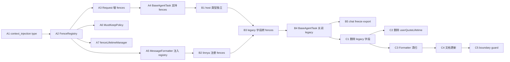

# 09 · Context Engineering 边界整治 · 实施计划

> 本文是 [`08-context-engineering-package-boundary.md`](./08-context-engineering-package-boundary.md) 的配套实施计划。**08 定边界，09 定顺序**。
>
> **2026-04-27 修订**：上一版计划最大问题是"先删旧 contract、后补新抽象"，会制造不可编译空窗；本版改为**先加通用能力且保持旧行为，再迁 host，最后删 legacy**。
>
> **必须完成时机**：linnsy S5（Memory）启动之前。

---

## 0. 评估结论

原计划方向正确，但执行顺序需要修订。主要问题有 6 个：

1. **A1 先删字段、B1 才补 `FenceInjection`，中间必然 typecheck 红**。这是不可接受的工作流，应该先新增通用能力再迁移旧调用方。
2. **只用 `metadata.fenceKind` 不够**。`AiMessage` 是 zod 闭合枚举，没有稳定 type 就只能继续借用 `document_fragment` / `user_input`，所以必须新增一个通用 `context_injection` type。
3. **`position` 枚举不一致**。设计里写 `prepend-current-user`，计划里又写 `after-system`；新版统一叫 `placement`。
4. **`user_quote` 不能继续嵌进 `user_input` 再用正则清理**。这会改写用户真实输入；新版让 quote 作为独立 `context_injection` 消息。
5. **`MessageFormatter` 不能依赖全局可变 registry**。要保留默认 singleton，同时新增可注入 registry 的 formatter 创建方式。
6. **parity 测试不能一刀切 deep-equal**。`document_fragment` 可字节级对齐；`user_quote` 这类旧设计本身有边界债，只能做结构化语义断言。

因此本计划重排为：

```text
Phase A · Framework 基础能力（不改行为）        2 人周
Phase B · linnya host 迁移 + public surface 收口 2 人周
Phase C · legacy 清扫 + 文档/守卫                 1.5 人周
```

**关键原则**：任何一个 PR 都必须 typecheck 可恢复；不允许用"这个阶段预期红，下一阶段修"作为计划的一部分。

---

## 1. Phase A · Framework 基础能力（不改行为）

目标：先让 linnkit 具备通用 context engineering 能力，同时保留现有 `document_fragment` 行为。这个阶段完成后，旧调用方应该完全不感知。

### A1 · 新增 `context_injection` 通用消息类型

**文件：**
- 修改：`packages/linnkit/src/contracts/messages.ts`
- 测试：`packages/linnkit/src/contracts/__tests__/messages.context-injection.test.ts`

**改动：**
- `SystemMessage.type` 增加 `context_injection`
- `UserMessage.type` 增加 `context_injection`
- `PersistentMetadata` 增加通用字段：
  - `fenceKind?: string`
  - `fenceAttrs?: Record<string, unknown>`
  - `fencePlacement?: string`

**测试：**
- system role + `context_injection` 能通过 zod parse
- user role + `context_injection` 能通过 zod parse
- 旧 `document_fragment` / `context_before` / `context_after` 仍能 parse

**完成判据：**
- `messages.context-injection.test.ts` 绿
- 现有 messages 相关测试绿

### A2 · 新增 FenceRegistry / FenceDescriptor

**文件：**
- 新建：`packages/linnkit/src/context-manager/shared/fences/FenceRegistry.ts`
- 新建：`packages/linnkit/src/context-manager/shared/fences/index.ts`
- 测试：`packages/linnkit/src/context-manager/shared/fences/__tests__/FenceRegistry.test.ts`
- 修改：`packages/linnkit/src/context-manager/shared/index.ts`

**接口：**

```ts
export interface FenceDescriptor {
  kind: string;
  llmRole: 'user' | 'system';
  placement: 'after-system' | 'before-current-user' | 'after-current-user' | 'after-last-tool-result';
  lifetime: 'turn-only' | 'persisted';
  mustKeep?: boolean;
  maxBudgetFraction?: number;
  formatter: (content: string, attrs: Record<string, unknown>) => string;
}

export interface FenceInjection {
  kind: string;
  content: string;
  attrs?: Record<string, unknown>;
  metadata?: Record<string, unknown>;
}
```

**测试：**
- register / get / list
- 重复 kind 抛错
- kind 只接受 kebab-case
- `maxBudgetFraction` 必须在 `(0, 1]`

**完成判据：**
- registry 单测绿
- `linnkit/context-manager` 能 export 类型和 `createFenceRegistry`

### A3 · `AgentProfileRequest` 先新增 `fences`，不删除 legacy 字段

**文件：**
- 修改：`packages/linnkit/src/context-manager/profiles/agent/contracts.ts`
- 测试：`packages/linnkit/src/context-manager/profiles/agent/__tests__/agent-profile-request.contract.test.ts`

**改动：**
- 加 `fences?: FenceInjection[]`
- legacy 字段保留但标 `@deprecated`：
  - `context_before`
  - `context_after`
  - `document_fragment`
  - `document_title`
  - `injected_context`
  - `project_metadata`
  - `document_metadata`
  - `user_quote`
  - `completionLengthHint`
  - `recentRejections`

**完成判据：**
- typecheck 不因本 task 变红
- contract 测试确认新旧字段都存在

### A4 · BaseAgentTask 展开 `fences`，但保留旧逻辑

**文件：**
- 修改：`packages/linnkit/src/context-manager/profiles/agent/tasks/BaseAgentTask.ts`
- 测试：`packages/linnkit/src/context-manager/profiles/agent/tasks/__tests__/BaseAgentTask.fences.test.ts`

**改动：**
- 新增 `createFenceMessages(request.fences ?? [])`
- 把每个 `FenceInjection` 转成 `AiMessage(type='context_injection')`
- 按 `FenceDescriptor.placement` 插入到 system / current user / history 附近
- 暂时保留 `addContextualUserMessages()`，确保旧调用方行为不变

**注意：**
- `user_input` 内容不再因为新 fence 被改写
- 旧 `request.user_quote` wrap 逻辑仍保留到 Phase B 完成

**测试：**
- `after-system` 出现在 system prompt 后
- `before-current-user` 出现在当前用户输入前
- `after-current-user` 出现在当前用户输入后
- 未注册 kind 抛错并带清晰错误信息

**完成判据：**
- BaseAgentTask 旧测试绿
- 新 fence 测试绿

### A5 · MessageFormatter 支持 registry 注入

**文件：**
- 修改：`packages/linnkit/src/context-manager/shared/MessageFormatter.ts`
- 测试：`packages/linnkit/src/context-manager/shared/__tests__/MessageFormatter.fences.test.ts`

**改动：**
- 保留 `messageFormatter` 默认 singleton，避免旧代码全改
- 新增 `createMessageFormatter({ fenceRegistry })`
- 新增 `formatAgentLlmMessages(messages, { fenceRegistry })`
- 遇到 `context_injection`：
  - 从 `metadata.fenceKind` 查 descriptor
  - 用 `descriptor.formatter(content, attrs)` 得到最终 content
  - 用 `descriptor.llmRole` 决定输出 role
- 移除 `getTaskTypeText()` 的 linnya 中文映射；`task_request` / `task_completion` 先按原 content 透传

**完成判据：**
- 默认 `formatAgentLlmMessages(messages)` 行为兼容旧调用
- 传入 registry 时 fence 能正确格式化
- formatter 内不再出现 `编辑器写作` / `批注回复` / `表格填充` / `音频转录`

### A6 · MustKeepPolicy 与 truncationRule 表驱动

**文件：**
- 新建：`packages/linnkit/src/context-manager/shared/policies/MustKeepPolicy.ts`
- 新建：`packages/linnkit/src/context-manager/shared/policies/index.ts`
- 修改：`packages/linnkit/src/context-manager/profiles/agent/context/providers/AgentCoreContextProvider.ts`
- 修改：`src/app-hosts/linnya/context-policies/defaultAgentProviderRegistry.ts`
- 测试：`packages/linnkit/src/context-manager/profiles/agent/context/providers/__tests__/AgentCoreContextProvider.mustKeepPolicy.test.ts`

**改动：**
- `AgentCoreContextProvider` 构造函数接收 `MustKeepPolicy`
- 默认 policy：
  - `alwaysKeepTypes: ['system_prompt', 'user_input']`
  - `alwaysKeepFenceKinds: []`
  - `truncationRules: []`
- host 默认 registry 暂时传入 legacy policy：
  - 保留 `document_fragment`
  - 保留 `metadata.fragmentType === 'document'` 的旧行为
  - 文档片段截断比例仍是 0.25

**完成判据：**
- framework 默认不再写死 `document_fragment`
- host 通过 policy 保持旧行为

### A7 · fenceLifetimeManager 先接入，但默认只处理 `context_injection`

**文件：**
- 新建：`packages/linnkit/src/context-manager/shared/preprocessors/fenceLifetimeManager.ts`
- 修改：`packages/linnkit/src/context-manager/shared/preprocessors/index.ts`
- 测试：`packages/linnkit/src/context-manager/shared/preprocessors/__tests__/fenceLifetimeManager.test.ts`

**改动：**
- 只处理 `msg.type === 'context_injection'`
- `turn-only` 的历史注入消息剥离
- `persisted` 保留
- 未注册 kind 报 debug 日志并保留
- 暂时不删除 `userQuoteLifetime.ts`

**完成判据：**
- 新 preprocessor 测试绿
- 旧 `userQuoteLifetime.test.ts` 仍绿

---

## 2. Phase B · linnya host 迁移 + public surface 收口

目标：让 linnya 自己注册并注入它的产品上下文。这个阶段完成后，framework 不再生成 linnya 语义，但 legacy 字段仍短暂保留供过渡。

### B1 · linnya 自定义领域类型，不再继承 framework 产品类型

**文件：**
- 修改：`src/app-hosts/linnya/context/agent/contracts.ts`

**改动：**
- 本地定义：
  - `AgentProjectMetadata`
  - `AgentDocumentMetadata`
  - `AgentUserQuote`
  - `AgentRecentRejection`
- 不再从 `contextManager.agentContracts.AgentProfileProjectMetadata` 等类型继承
- `AgentInvokeRequest extends AgentProfileRequest` 暂时保留，但产品字段全部在 host 文件内声明

**完成判据：**
- `context/agent/contracts.ts` 不再引用 `AgentProfileProjectMetadata` / `AgentProfileUserQuote` / `AgentProfileRecentRejection`

### B2 · linnya 注册 fence 家族

**文件：**
- 新建：`src/app-hosts/linnya/context/agent/registerLinnyaFences.ts`
- 修改：`src/app-hosts/linnya/adapters/context-injection/defaultGraphExecutorContextBuilder.ts`
- 修改：`src/app-hosts/linnya/context-policies/defaultAgentProviderRegistry.ts`

**注册：**
- `additional-context`
  - `llmRole: 'system'`
  - `placement: 'after-system'`
  - `lifetime: 'persisted'`
  - `mustKeep: true`
  - `maxBudgetFraction: 0.25`
  - formatter 输出 `<additional_context>`
- `project-context`
  - `llmRole: 'user'`
  - `placement: 'before-current-user'`
  - `lifetime: 'turn-only'`
  - formatter 输出 `<project_context>`
- `document-context`
  - `llmRole: 'user'`
  - `placement: 'before-current-user'`
  - `lifetime: 'turn-only'`
  - formatter 输出 `<document_context>`
- `user-quote`
  - `llmRole: 'user'`
  - `placement: 'before-current-user'`
  - `lifetime: 'turn-only'`
  - formatter 输出 `<user_quote>`

**完成判据：**
- linnya context builder 拥有自己的 `FenceRegistry`
- `formatAgentLlmMessages(processingResult.messages, { fenceRegistry })` 被接入

### B3 · host adapter 把 legacy request 字段转成 `fences`

**文件：**
- 新建：`src/app-hosts/linnya/context/agent/createLinnyaFenceInjections.ts`
- 测试：`src/app-hosts/linnya/context/agent/__tests__/createLinnyaFenceInjections.test.ts`

**改动：**
- 从 `AgentInvokeRequest` 读取：
  - `project_metadata`
  - `document_title`
  - `document_fragment`
  - `injected_context`
  - `context_before`
  - `context_after`
  - `user_quote`
- 输出 `FenceInjection[]`
- `document_fragment` / `document_title` 合并成 `document-context`
- `project_metadata` 转 `project-context`
- `user_quote` 转 `user-quote`
- `context_before` / `context_after` 先转成 `document-context` 的 attrs 标记方向，后续可单独注册 kind

**完成判据：**
- 测试覆盖每种 legacy 字段
- 不使用 `any` 类型断言；需要读类型定义后写窄化函数

### B4 · BaseAgentTask 关闭 legacy 拼接路径

**文件：**
- 修改：`packages/linnkit/src/context-manager/profiles/agent/tasks/BaseAgentTask.ts`
- 修改：调用 `BaseAgentTask.buildMessages` 的 host adapter，在进入 linnkit 前把 `request.fences` 补齐
- 测试：`src/app-hosts/linnya/context/agent/__tests__/linnya-fence-parity.test.ts`

**改动：**
- 删除 `addContextualUserMessages()`
- 删除 `request.user_quote` 对 user query 的 wrap
- BaseAgentTask 只处理：
  - system prompt
  - `context_injection` fences
  - 当前 `user_input`
  - history

**测试策略：**
- `document_fragment` / `project_metadata`：做字节级 parity，确保最终 LLM content 标签不变
- `user_quote`：做结构化断言，确保 quote 与 query 都存在且顺序正确，不要求仍在同一个 user message
- 工具消息回放测试必须绿

**完成判据：**
- `grep -r "project_context\|document_context\|前置上下文\|后置上下文\|user_quote" packages/linnkit/src/context-manager/profiles/agent/tasks` 0 条结果

### B5 · chat profile freeze public export

**文件：**
- 修改：`packages/linnkit/src/context-manager/index.ts`
- 修改：可能引用 `chatContracts` 等 namespace 的 linnya 生产代码
- 测试：`packages/linnkit/src/__tests__/public-surface.test.ts`

**改动：**
- `linnkit/context-manager` 不再 re-export `chatContracts` / `chatContext` / `chatTasks` 等 namespace
- deep import `linnkit/context-manager/profiles/chat/*` 暂时保留
- 现有 host 调用方若需要 chat 类型，改成 deep import

**完成判据：**
- public-surface 测试确认主入口不含 chat namespace
- host typecheck 绿

---

## 3. Phase C · legacy 清扫 + 文档/守卫

目标：移除 framework 里的产品语义残留，把新边界写进文档和 CI 守卫。

**边界声明**：Phase C **不物理删除** `profiles/chat/*`。chat 是跨前端、后端、host task、历史数据兼容的整链路迁移；真正删除 chat profile 必须放到后续 chat 收敛阶段，等所有调用都迁成 tools-disabled `AgentSpec` 后一次性做干净。Phase C 只做 framework legacy 字段与 LLM-facing host 字面的清扫。

### C0 · 开 C 前只读核验

**文件：**
- 只读：`packages/linnkit/src/context-manager/shared/preprocessors/fenceLifetimeManager.ts`
- 只读：`packages/linnkit/src/context-manager/shared/summarization/SummarizationCandidateSelector.ts`
- 只读：`src/app-hosts/linnya/context/agent/createLinnyaFenceInjections.ts`
- 只读：`src/app-hosts/linnya/context/agent/registerLinnyaFences.ts`

**核验：**
- `user_quote` 已由 host 转成 `kind: 'user-quote'` 的 `FenceInjection`
- `user-quote` 在 host registry 中是 `lifetime: 'turn-only'`
- `FenceLifetimePreprocessor` 已进入 agent 默认 preprocessor pipeline
- `SummarizationCandidateSelector` 不再依赖 `metadata.user_quote` 语义；旧轮 turn-only quote 应在进入摘要 provider 前被 fence lifetime 清理

**完成判据：**
- C0 只读核验报告给出“可开 C 段”或明确指出要回 A7/B3 补什么
- fenceLifetimeManager 有显式 user-quote turn-only 回归测试

### C1 · 删除 framework legacy 字段与文档片段逻辑

**文件：**
- 修改：`packages/linnkit/src/context-manager/profiles/agent/contracts.ts`
- 修改：`packages/linnkit/src/context-manager/profiles/agent/context/config.ts`
- 修改：`packages/linnkit/src/context-manager/profiles/agent/context/providers/AgentCoreContextProvider.ts`
- 修改：`packages/linnkit/src/context-manager/shared/context-pipeline.ts`

**删除：**
- `AgentProfileProjectMetadata`
- `AgentProfileDocumentMetadata`
- `AgentProfileUserQuote`
- `AgentProfileRecentRejection`
- `document_fragment` 在 `CORE_MESSAGE_TYPES` 中的默认身份
- `DOCUMENT_FRAGMENT_MAX_PERCENTAGE`
- `generateFinalMessages` 对 `document_fragment` 的特殊排序

**完成判据：**
- `grep -r "document_fragment\|project_metadata\|document_metadata\|AgentProfileUserQuote" packages/linnkit/src/context-manager/profiles/agent` 0 条结果

### C2 · 删除 `userQuoteLifetime`

**文件：**
- 删除：`packages/linnkit/src/context-manager/shared/preprocessors/userQuoteLifetime.ts`
- 删除：`packages/linnkit/src/context-manager/shared/preprocessors/__tests__/userQuoteLifetime.test.ts`
- 修改：所有引用它的 barrel 和 tests

**完成判据：**
- `rg "UserQuoteLifetime|userQuoteLifetime" packages/linnkit/src` 0 条结果
- fenceLifetimeManager 覆盖 turn-only quote 场景

### C3 · MessageFormatter 清扫 legacy formatter 分支

**文件：**
- 修改：`packages/linnkit/src/context-manager/shared/MessageFormatter.ts`
- 测试：`packages/linnkit/src/context-manager/shared/__tests__/MessageFormatter.no-host-leakage.test.ts`
- 新建：`packages/linnkit/src/context-manager/shared/contracts/chatLineMessage.ts`
- 修改：`packages/linnkit/src/context-manager/profiles/chat/contracts.ts`

**删除：**
- `case 'document_fragment'`
- `<additional_context>` 字面
- `case 'task_completion'` 的 `[任务完成]` 中文包装；`task_request` / `task_completion` 保留为 framework 协议 type，但 formatter 只做纯透传
- `getTaskTypeText()`
- linnya 4 个中文任务名
- `profiles/chat/contracts.ts` 对 shared formatter 所需 `ChatMessage` 类型的所有权；采用 shared contracts 承载，chat profile 反向 re-export

**完成判据：**
- `grep -r "additional_context\|\\[任务完成\\]\|编辑器写作\|批注回复\|表格填充\|音频转录" packages/linnkit/src/context-manager/shared` 0 条结果

### C4 · 文档更新

**文件：**
- 修改：`packages/linnkit/docs/DEVELOPMENT_GUIDE.md`
- 修改：`packages/linnkit/docs/INTEGRATION_GUIDE.md`
- 修改：`packages/linnkit/src/context-manager/README.md`

**内容：**
- FenceRegistry 端到端示例
- MustKeepPolicy 示例
- `context_injection` 消息生命周期说明
- host 如何把产品字段转成 `FenceInjection[]`
- chat profile freeze 说明

**完成判据：**
- 外部开发者能只读 INTEGRATION_GUIDE 写出一个自定义 fence
- 内部开发者能只读 DEVELOPMENT_GUIDE 知道哪些内容不能进 framework

### C5 · boundary guard 与 no-host-leakage 测试

**文件：**
- 修改：实际 boundary guard 脚本位置（先用 `rg "boundary|check-boundaries"` 找到）
- 新建（后续扩为全包扫描并上移）：`packages/linnkit/src/__tests__/no-host-leakage.test.ts`

**规则：**
- 禁止 `packages/linnkit/src/**/*.ts` 出现：
  - `document_fragment`
  - `project_context`
  - `document_context`
  - `user_quote`
  - `additional_context`
  - `前置上下文`
  - `后置上下文`
  - `编辑器写作`
  - `批注回复`
  - `表格填充`
  - `音频转录`
  - `[任务完成]`
- 禁止 `linnkit/context-manager` 主入口 re-export chat namespace
- 禁止 `packages/linnkit/src/context-manager/shared/**` import `profiles/**`，防止 shared 层重新依赖 chat/agent profile

**完成判据：**
- no-host-leakage 绿
- CI 中 boundary guard 绿

### C6 · 非阻塞 host 风险登记

`src/app-hosts/linnya/context/agent/schemas.ts` 目前维护了一份与 framework `AiMessage` 类似的 zod schema 副本。Phase C 收窄 framework type 后，如果 host 副本继续保留旧 enum，host 仍可能在入口层接收 legacy `document_fragment` 等字段。

这不是 Phase C 的阻塞项，因为责任边界在 host；但 Phase C 完成后，linnya host 应该用 0.5 天把本地 schema 副本迁成从 `linnkit/contracts` import `AiMessage` / `UserMessage` / `AssistantMessage`，避免协议漂移。

---

## 4. 依赖图



**关键路径**：A1 → A2 → A4 → B3 → B4 → C1 → C5。

---

## 5. 回归测试矩阵

| 阶段 | 必须绿的测试 |
|---|---|
| A1 | messages schema contract test |
| A2 | FenceRegistry 单测 |
| A3 | AgentProfileRequest contract test；全量 typecheck 不红 |
| A4 | BaseAgentTask 旧测试 + fences 新测试 |
| A5 | MessageFormatter legacy + fence 测试 |
| A6 | AgentCoreContextProvider mustKeepPolicy 测试；host 默认 provider registry 测试 |
| A7 | fenceLifetimeManager 测试；userQuoteLifetime 旧测试仍绿 |
| B1 | host agent contracts typecheck |
| B2 | registerLinnyaFences 测试；context builder formatter 注入测试 |
| B3 | createLinnyaFenceInjections 单测 |
| B4 | linnya-fence-parity 测试；工具回放测试；主链路 agent 测试 |
| B5 | public-surface 测试；host typecheck |
| C1-C3 | no-host-leakage 测试 |
| C4-C5 | docs 链接检查（如已有）；boundary guard CI |

> 如果测试遇到 sql 版本不匹配，按工作区规则先跑 `npm run rebuild:better:node`，再跑 `npm run rebuild:better:electron`。

---

## 6. 回滚策略

| 失败点 | 处理方式 |
|---|---|
| A1-A7 任一步失败 | 可独立 revert；旧行为未删除，风险低 |
| B3 legacy 转 fences 语义不对 | 只 revert host adapter；framework 新能力保留 |
| B4 关闭 legacy 后主链路断 | revert B4，继续让 BaseAgentTask legacy 路径兜底 |
| B5 chat freeze 撞下游 | 恢复 namespace export 或给明确 deep import 白名单 |
| C1-C3 清扫后发现隐藏依赖 | revert 对应清扫 commit；不影响 A/B 已接入的新能力 |

**禁止的回滚方式**：不要用 `git reset --hard`；逐 commit revert 或手动恢复对应文件。

---

## 7. 验收清单

- [x] `context_injection` 已加入 `AiMessage` schema，并有 contract test
- [x] `FenceRegistry` / `FenceDescriptor` / `FenceInjection` 已 export
- [x] `AgentProfileRequest.fences` 已存在，legacy 字段最终已移出 framework contract
- [x] BaseAgentTask 只构建 system / context_injection / user_input / history，不再拼 linnya 标签
- [x] MessageFormatter 通过 registry 格式化 fence，不再写死 `<additional_context>`
- [x] `AgentCoreContextProvider` 通过 MustKeepPolicy 判断 must-keep
- [x] `userQuoteLifetime.ts` 已从 shared 删除；chat 兼容层自持旧 quote 预处理
- [x] linnya host 注册自己的 fence 家族
- [x] linnya host 把产品字段转成 `FenceInjection[]`
- [x] `linnkit/context-manager` 主入口不再导出 chat namespace
- [x] no-host-leakage 测试绿
- [x] DEVELOPMENT_GUIDE / INTEGRATION_GUIDE / context-manager README 已更新
- [x] linnkit typecheck / guard / context-manager + contracts 相关测试绿

---

## 8. 后续登记

| 项 | 关系 | 时机 |
|---|---|---|
| linnsy 注册 `memory-context` / `system-event` / `subagent-summary` / `user-interjection` | 本计划完成后可直接在 linnsy daemon 注册，不需要改 linnkit | linnsy S5 |
| 物理删除 `profiles/chat/*` | 需要 linnya 所有 chat deep import 迁完 | Phase F chat 收敛 |
| `MemoryPort` / `memory_read` / `memory_write` | 与内容生成有关，不属于本计划 | N-4 MemoryPort 立项 |

---

## 9. 状态

- **2026-04-27 立稿**
- **2026-04-27 修订**：按评估结果重排实施顺序，新增 `context_injection`，去掉"阶段性 typecheck 红"假设
- **2026-05-11 执行**：Phase A/B 已落地到源码：framework 拥有 `context_injection` / `FenceRegistry` / `MustKeepPolicy` / `FenceLifetimePreprocessor`，linnya host 已注册并注入自己的 fence 家族，`linnkit/context-manager` 主入口已冻结 chat namespace。
- **2026-05-11 完成**：Phase C 已落地：agent profile legacy host 字段清扫、shared `userQuoteLifetime` 删除、MessageFormatter legacy 包装删除、no-host-leakage 与 boundary guard 加固、0.4.0 release 线收口。`profiles/chat/*` 不在本阶段物理删除，后续随 tools-disabled AgentSpec 收敛。
- **当前**：✅ Phase E A/B/C 完成；下一步进入 Phase F 起手三件（AgentSpec / RunSupervisor / AuditEnvelope）。
