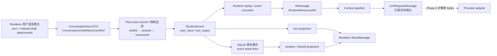

# 19 · Agent 多模态 Phase 1 实施 Runbook

> **状态**：已归档。Phase 1 的 P1.0–P1.9 已于 2026-07-22 完成；下一阶段回到 18 号提案推进 Phase 2。
> **建立日期**：2026-07-22。
> **当前稳定合同**：[`src/features/conversation/attachments/README.md`](../../../../src/features/conversation/attachments/README.md)。本文中的 workspace `ManagedAssets`、自动项目归属和旧类型名是 Phase 1 当时的实施事实，已被后续 AppData sidecar、v48 清理和 conversation domain 归属替代。
> **本文生命周期**：Phase 1 实施归档。本文保留实际文件、测试结果、偏差和风险作为验收证据，不作为永久架构真源。
> **本阶段目标**：只打通 durable 合同、资源引用、当前轮身份、持久化和回放；不让图片字节进入 provider。

---

## 1. Phase 1 的交付边界

Phase 1 要建立的是“以后不会丢图、串图、留下死链”的事实链，而不是“模型已经能看图”。完成后，同一张图片必须能以稳定引用随用户消息或工具结果经过请求、事件、数据库、Context Manager 消息、UI projection、刷新恢复、编辑重发、重新生成、截断和删除。

### 1.1 必须交付

1. Linnya Renderer/host 上行 `ConversationDraftAttachmentRef` 与下行 durable `ConversationAttachmentRef`。
2. linnkit provider-neutral 合同 `RuntimeResourceRef`。
3. `RuntimeEvent`、`AiMessage`、`LlmRequestMessage` 对有序附件引用的无损传播。
4. `currentUserEventId` 与当前轮附件聚合，替代 `query` 文本反查身份。
5. 受管临时目录、真实图片解码校验、发送时登记 asset 的 host port 与编排。
6. immutable conversation event → asset 引用账本。
7. live、window、rebuild 三条 UI projection 的附件一致性。
8. 截断、会话删除和孤儿文件清理的完整生命周期。
9. 图片-only、重复文本、刷新、edit、regenerate 的端到端业务门禁。

### 1.2 明确不做

| 不做项 | 后续阶段 | Phase 1 只留下什么 |
|---|---|---|
| model `image_input` 能力与 adapter 声明 | Phase 2 | 稳定附件引用与 placement 信息 |
| resolver/materializer 读取图片字节并转 provider parts | Phase 3 | `LlmRequestMessage` 仍只携带引用 |
| 图片 token、摘要排除、checkpoint 保留规则 | Phase 3 | 保证附件引用不丢，不改变现有预算算法 |
| 选择、粘贴、拖拽、预览 UI | Phase 4 | Renderer 消息聚合与 DTO 能表达附件 |
| 工具产生模型图片、`resource_read` 图片分支 | Phase 5 | `tool_output` 事件和消息可保存附件 |
| Slides/bash screenshot 接入 | Phase 6 | 不建立专用图片通道 |
| draft lease、remote count、provider file cache | v1 推迟 | 严格遵守 18 号提案 §13.0 的简化方案 |

Phase 1 禁止新增 standalone image message，禁止把附件塞入 metadata，禁止复用只服务 UI 的 `StructuredToolResult.media`，禁止在事件、数据库和审计中保存 base64、data URL、绝对路径或 provider file ID。

---

## 2. 已确认的全链路

### 2.1 当前真实运行时序

代码审计确认当前顺序是：

1. `FlowRunPreparationService.prepareForRun` 处理截断并读取历史。
2. `HistoryBuilder.buildForAgent` 构造 `AgentInvokeRequest`。
3. 确保 conversation、注册 run、打开 root run。
4. 持久化本轮传入事件。
5. 启动 `AgentRunner`。

因此 HistoryBuilder 构造请求时，新 `user_input` 尚未落库，也不在 `contextHistoryEvents` 中。只增加 `currentUserEventId` 不够：请求还必须显式携带当前消息附件；否则图片-only 当前轮仍然无法被 `BaseAgentTask` 构造。

### 2.2 当前根因

`BaseAgentTask` 目前用 `request.query` 在 history 中寻找当前 user message：

- 空文本直接无法创建当前消息；
- 重复文本可能匹配到旧轮次；
- 新轮事件尚未落库，history 不一定包含当前轮；
- 附件没有进入 query，也不应该进入 query。

Phase 1 的规则固定为：有 ID 时只按 immutable ID 定位；ID 不在 history 时，以同一 ID、`query` 和 `currentUserAttachments` 创建当前消息；文本为空但附件非空时消息合法；禁止退回文本猜测。

---

## 3. 合同与所有权

### 3.1 两层 durable 合同必须独立

| 字段 | `ConversationAttachmentRef` | `RuntimeResourceRef` | 约束 |
|---|---|---|---|
| 附件身份 | `id` | `id` | 消息内稳定且不可变 |
| 类型 | `kind: image` | `kind: image` | 首期只有图片 |
| 资源身份 | `assetId` | `resourceId` | 只能由 Flow host 映射 |
| 格式 | `mediaType` | `mediaType` | 只信 host 真实解码结果 |
| 大小 | `byteLength` | `byteLength` | 正整数 |
| 尺寸 | `width`、`height` | `width`、`height` | 新图片必须为正整数 |
| 完整性 | `sha256` | `sha256` | 内容寻址与复核依据 |
| 展示 | `fileName?`、`label?` | `fileName?`、`label?` | 不参与寻址 |

附件数组有业务顺序，provider 转换时固定为文本在前、图片按数组顺序在后。`content` 始终是 string；图片-only 消息用空字符串加非空附件数组表达。

`ConversationDraftAttachmentRef` 与 `ConversationAttachmentRef` 归 `packages/schemas/src/conversation/`；`RuntimeResourceRef` 归 `packages/linnkit/src/contracts/`。linnkit 不 import workspace 类型，即使首期 `assetId` 与 `resourceId` 取相同字符串，也不能合并两个 durable 合同。

**wire 合同有方向性，不能用同一个 ref 双向复用**：`assetId` 在发送时 commit 才产生，Renderer 发出 `ConversationNextRequest` 那一刻不可能知道它。因此：

| 方向 | 载荷 | 内容 |
|---|---|---|
| 上行（Renderer → host 发送请求） | `ConversationDraftAttachmentRef` | host 签发的 opaque draft ID + 展示信息（fileName/label），不含 assetId、绝对路径 |
| 下行（host → Renderer 的 event/projection/history DTO） | `ConversationAttachmentRef` | commit 后的 durable ref（assetId、mediaType、尺寸、hash 等） |

host 在提交编排中完成 draft ref → durable ref 的一次性替换；draft ID 不进入任何 durable 合同（§4.1 已禁止）。edit/regenerate 上行只提交原消息 ID，host 在截断前从事实事件恢复原 durable refs，并把它们放入新的当前轮聚合；不能把 durable ref 反向塞回上行 DTO，也不经过 draft 通道。

### 3.2 当前轮请求合同

`AgentInvokeRequest` / `AgentProfileRequest` 增加两个显式信息：

| 字段 | 语义 |
|---|---|
| `currentUserEventId` | 当前 immutable user event 身份 |
| `currentUserAttachments` | 当前轮尚未进入 history 时所需的 `RuntimeResourceRef[]` |

`query` 继续只表示当前轮文本，不再承担消息身份。可在 linnkit 内部定义窄的 current-user 聚合，但不能因此隐藏 event ID。

**一致性不变量**：`currentUserEventId`、`query`、`currentUserAttachments` 与 `persistIncomingEvents()` 落库的 `user_input` event 必须出自同一个当前轮聚合的一次构造，禁止请求侧和持久化侧各自组装。请求上的附件是同一事实的提前副本，不是第二个事实源；一旦二者可能分叉，就复刻了 Phase 0 修掉的漂移模式。该不变量必须有测试锁住（见 P1.4、P1.7 门禁）。

### 3.3 domain 边界

| Owner | 职责 | 禁止事项 |
|---|---|---|
| conversation domain | 用户消息聚合、请求 DTO、projection、edit/regenerate 语义 | 直接 import workspace 内部 SQL |
| workspace/assets domain | 图片校验、受管文件、asset 账本的窄公共 port | 认识 Agent/Context Manager |
| linnkit | provider-neutral event/message/resource 合同 | 依赖 Linnya workspace schema |
| Flow/app-host orchestration | temp → asset → RuntimeEvent 映射和跨 domain 协调 | 把业务规则藏进 persistence adapter |
| SQLite adapter | 短事务写入 event、link、projection、统计 | 成为新的全局 asset manager |

当时的 `registerGeneratedImagesAsProjectAssets.ts` 与 `createWorkspaceAssetLocalPathResolver` 都已退役：前者把对话产物错误登记为项目资源，后者只暴露未经归属授权的本地路径。Phase 1 最终通过受管 ingress、durable link 与 verified-image loader 闭合，不能恢复这两条旧链。

---

## 4. 资源进入与提交时序

### 4.1 Ingress policy

首期只接受 JPEG、PNG、WebP。生产门禁：单图 10 MB、单消息 10 张、总量 20 MB、单图 4000 万像素；由 Flow incoming-events feature 的 app-level policy 明确配置。Renderer 自报的 MIME、hash、尺寸都不是事实源；host 必须读取 magic bytes 并用现有 `sharp` 完成真实解码。

草稿导入只复制到受管临时目录并在 host 进程内注册，不进入 `assets` 账本。草稿注册表以 host 生成的 opaque draft ID 为 key，保存 host 验证后的 MIME、字节、尺寸和 hash；Renderer 只持有不泄露绝对路径的草稿引用。draft ID 不是 asset ID，也不能写入 durable message。

**草稿注册表只存在于 host 进程内存，不落磁盘 manifest 文件**。产品语义随之固定：草稿不跨应用重启存活——重启后输入区附件清空，用户重新添加。这样崩溃恢复就只有一条路径：启动时清空受管临时目录即可，不需要 manifest 文件格式、解析和损坏处理。若未来要求草稿跨重启恢复，属于新的产品决策，再评估持久化 manifest，不在 Phase 1 预留。

### 4.2 文件系统与 SQLite 的 crash consistency

文件移动和 SQLite 事务不能组成一个原子事务。Phase 1 固定以下顺序：

1. staging 时生成 draft ID 并完成 host 校验。
2. 发送前从 host 进程内草稿注册表取出记录，并复核临时文件仍存在且 hash 一致。
3. 在同一文件系统内原子 rename 到 content-addressed 最终路径。
4. 在 `appendEventToRun()` 的同一短事务内登记/确认 asset、写 event、写 immutable event link、按会话归属写 project link，并更新 materialized message、UI projection 和 conversation stats。
5. DB 失败留下的无引用最终文件，由应用启动清理回收。

禁止先写 DB 再移动文件；那会在崩溃时留下历史中永久不可读的死链。也不能另造一条附件 repository 旁路当前 event 事务。

### 4.3 canonical asset ID：沿用现有账本约定

代码复核后，该问题不再留作实施时临场决策。现有 `assets.id` 使用 UUID，`assets.uri` 有唯一约束；`registerGeneratedImagesAsProjectAssets.ts` 也采用“候选 UUID 插入，冲突后按 URI 读取已有 canonical ID”的模式。Phase 1 沿用这个约定，并把草稿身份与 durable asset 身份分开。

| 方案 | 优点 | 缺点 | 适用场景 |
|---|---|---|---|
| A. 由 SHA256 派生 asset ID | 并发草稿天然收敛，ID 可预测 | 改变现有 UUID 约定；身份暴露内容等价关系；把内容寻址和实体身份绑死 | 新建且明确采用 content ID 的独立账本 |
| B. draft ID 与 asset ID 分离；asset 用 UUID，URI 按 SHA256 内容寻址（采用） | 沿用现有表约束与登记模式；草稿不污染账本；同内容通过唯一 URI 收敛到首个 asset | commit 后才能知道 canonical asset ID；编排必须把 draft ref 映射成 durable ref | 当前共享 `assets` 账本 |

采用 B：最终 URI 使用不含绝对路径的受管逻辑 URI，`local_path` 单独保存实际路径。commit 对唯一 URI 执行幂等登记并回读 canonical asset ID，再构造 `ConversationAttachmentRef` / `RuntimeResourceRef`；`fileName`、`label` 留在消息附件引用，不复制 asset row 表达展示差异。

---

## 5. SQLite、引用与回收

### 5.1 v46 migration

P1.6 已把 schema version 从 45 升到 46，并同时更新 fresh database 的权威建表定义。Asset 表当前由 `src/domains/assets/features/asset-ledger/infrastructure/sqlite/schemas/assetLedger.schema.ts` 拥有；conversation schema 位于 `src/app-hosts/linnya/adapters/persistence/event-store/conversation.schema.ts`。migration 与 fresh schema 的列、约束和索引语义由同一业务测试比较；SQLite `ALTER TABLE` 追加列的物理 ordinal 不作为合同。

v46 与 fresh schema 同时完成：

1. `assets` 增加 nullable `width_px`、`height_px`。旧资产允许 null；新会话图片由 host port 保证为正整数。
2. 新增 `conversation_event_asset_links`，至少包含 `conversation_id`、`event_id`、`attachment_id`、`ordinal`、`asset_id`、`source`、`created_at`。
3. 主键 `(event_id, attachment_id)`；唯一约束 `(event_id, ordinal)`。
4. 索引 `(asset_id)`、`(conversation_id, event_id, ordinal)`。
5. conversation/event 外键 cascade，asset 外键 restrict。

`source` 首期只允许 `user_input` / `tool_output`。link 是 immutable event 的事实，不因 projection 重建而改变。

**v46 不需要再次触发全量 projection rebuild**。存量事件没有附件，v45 已重建过的 projection 对它们仍然正确；附件字段只影响 v46 之后写入的新事件。照抄 Phase 0 的 rebuild 迁移属于无意义的昂贵操作，禁止顺手加上。

### 5.2 v47 UI attachment projection

P1.8 把 schema version 从 46 升到 47，并在 fresh schema 与升级 migration 中为 `conversation_ui_messages` 增加 nullable `attachments_json`。该列只保存通过 `ConversationAttachmentRef` schema 校验的有序 durable refs；无附件消息继续写 null。

这里不能复用 `payload_json`：payload 属于事件/工具展示数据，附件是消息本体合同，把两者混在一起会重新引入 Phase 0 已修复的 metadata/payload 漂移。window 读取也不能临时回查 event，否则 UI read model 不再自包含，分页读取与 force rebuild 会走不同事实路径。

v47 会把已有 `ready` projection 标成 `pending`，保留 revision；启动维护随后从 durable events 重建。与 v46 不触发重建并不矛盾：v46 只新增 event link，存量 UI rows 仍正确；v47 新增 UI 本体字段，只有失效旧 projection 才能让升级后的历史与 fresh database 语义一致。

附件映射边界固定为：RuntimeEvent / linnkit 使用 `resourceId`；host 和 Renderer conversation DTO 使用 `assetId`。增量 append 与 force rebuild 共用同一 projector 和序列化规则，live Renderer projector 使用等价的纯映射函数；user_input 与 tool_output 都纳入 parity fixture。

### 5.3 写入、截断、删除

`src/app-hosts/linnya/adapters/persistence/event-store/sqlite.implementation.ts` 的 `appendEventToRun()` 已在一个短事务中完成 event、materialized messages、UI projection 和 stats，附件登记必须加入这个事务。conversation domain 不直接 import workspace SQL；workspace/assets port 产出经验证的提交计划，Flow/app-host 把计划连同 event 交给 host persistence adapter，由后者在同一连接的短事务内写 host-owned 表。

项目会话还要在同一事务中按既有资源归属规则写 `project_asset_links`；全局会话只依赖 event link 拥有资源。两种会话都不能靠本地文件存在与否猜测归属。

`truncateFromMessage()` 有 materialized-message 与 event-id 两条定位分支，两条都要先删除受影响 event links，再删除 events/runs。`deleteConversation()` 与批量删除同理显式删除 links。测试中的裸 SQLite connection 可能没有启用 FK，因此不能只依赖 cascade；显式删除也是对真实执行顺序的业务文档。

删除 link 不代表立刻删 bytes。GC 必须复核 event link、project link 均不存在，再按 18 号提案 §4.3 的 tombstone 顺序处理；Phase 1 只建立可判断归属的账本和启动孤儿清理，不扩张为 lease 状态机。

---

## 6. 消息、Context 与 projection 传播

### 6.1 所有字段重建点

下列位置都会重新构造对象，必须逐一检查，不能因为源类型新增字段就假设附件会自动传播：

| 位置 | 当前风险 | Phase 1 要求 |
|---|---|---|
| `packages/linnkit/src/context-manager/profiles/agent/utils/eventConverter.ts` | user/tool event 转消息时只拷贝文本 | 显式保留附件及顺序 |
| `packages/linnkit/src/runtime-kernel/events/runtime-to-ai-message.ts` | memory port 只接收文本/id | 扩窄 port 合同并传附件 |
| `packages/linnkit/src/runtime-kernel/events/provider-sidecar.ts` | `addUserMessage` / `addToolResponse` 无附件参数 | 扩展 provider-neutral memory port |
| `packages/linnkit/src/context-manager/profiles/agent/context/ConversationSession.ts` | message factory 丢附件 | 构造/快照 round-trip 保留附件 |
| `packages/linnkit/src/context-manager/shared/context-pipeline.ts` | `generateFinalMessages()` 显式只重建六个字段 | 保持消息本体，只覆盖 content/metadata |
| `packages/linnkit/src/context-manager/shared/MessageFormatter.ts` | 目前输出纯字符串 wire message | Phase 1 输出引用；Phase 3 才物化 bytes |

`CurrentTurnMessageAssembler` 目前用对象展开，理论上可自然保留附件，但仍必须用业务测试锁住“经过 fence 组装后附件身份和顺序不变”。

### 6.2 Renderer 三条 projection

同一个附件字段必须同时进入：

1. live：`apps/renderer/domains/conversation/services/messageProjection/projectors/userInput.ts`。
2. window：`src/features/conversation/history/ui-messages.schemas.ts` → `apps/renderer/domains/conversation/message-window/functions/mapUiMessageDto.ts`。
3. rebuild：`src/app-hosts/linnya/adapters/persistence/event-store/ui-projection/projectEvent.ts`。

Renderer `BaseMessage` 增加明确的 attachments 字段。Phase 0 建立的 `UserMessageContent` 在 Phase 1 扩为 `text + userQuote? + attachments`；`readUserMessageContent()` 必须恢复完整聚合，使 regenerate 原样复用附件，edit 默认只替换文本并保留附件。编辑时增删附件 UI 属于 Phase 4。

附件不能进入 projection metadata/payload 的非结构化角落。live、window、force rebuild 必须用同一 fixture 比较附件数量、ID、顺序和字段。

### 6.3 Provider、工具、审计的后续边界

Phase 1 只记录影响点，不提前实现：

- GPT Responses、OpenAI/OpenRouter/Gemini compatibility、Claude、Ollama 路径目前对非文本内容行为不一致，Phase 3 各自使用 typed converter。
- `src/infra/adapters/llm/types.ts` 的局部 `image_url` 不是框架合同，且存在 `any` 债，Phase 3 随 adapter typed contract 一起清理。
- `StructuredToolResult.media` 继续只服务 UI；Phase 5 另建 `modelInput.attachments`。
- `resource_read` 当前只有文本读取，Phase 5 才加图片分支。
- `TokenCalculator` 当前只统计 `String(message.content)`；Phase 3 才加非零图片估算、摘要排除和 checkpoint 规则。
- HTTP 日志已有 data URL 截断，但 `llm-run-audit` 仍可能落完整请求；Phase 3 必须增加独立的持久化脱敏合同。

---

## 7. 实施批次

每批都必须可编译、可独立回滚，并更新本文实施日志。P1.2 与 P1.3 可在编译依赖确实无法拆开时合并；不得提交半个合同再依赖下一提交修复。

### P1.0 · 固定合同与业务 fixture

- 固定 draft ID → content-addressed URI → canonical UUID asset ID 的映射合同。
- 固定字段、MIME/大小/数量/像素 policy、附件顺序与图片-only 语义。
- 建立跨层共享的业务 fixture 语义，不以纯 schema 快照代替业务测试。

**门禁**：18/19 文档无冲突；所有 owner、非目标、阶段边界明确。

### P1.1 · Linnya conversation wire contract

- 在 `packages/schemas/src/conversation/` 定义并导出 `ConversationAttachmentRef`（下行）与 `ConversationDraftAttachmentRef`（上行）。
- `ConversationNextRequest` 携带 draft ref；输入事件、history/UI DTO 携带 durable ref（见 §3.1 方向性表）。

**门禁**：合法/非法附件解析测试；空文本 + 附件合法；纯文本请求不变；上行 DTO 不含 assetId/绝对路径，下行 DTO 不含 draft ID。

### P1.2 · linnkit durable resource contract

- 在 `packages/linnkit/src/contracts/` 定义 `RuntimeResourceRef`。
- 扩 `RuntimeEvent.user_input/tool_output`、`AiMessage`、`LlmRequestMessage`。
- 保持 `content: string`，附件字段只开放给既定 placement。

**门禁**：runtime event validate、snapshot/replay、public exports 与纯文本 testkit。

### P1.3 · 修复 replay/context 所有丢字段点

- 按 §6.1 清单升级 event converter、runtime memory、ConversationSession、context pipeline、formatter。
- 用合同测试证明附件经过转换、fence、selection 后 ID 和顺序不变。

**门禁**：user/tool-output round-trip；`generateFinalMessages()` 不再白名单式丢消息本体字段。

### P1.4 · 当前轮按 immutable ID 绑定

- HistoryBuilder 的 `findLastUserInput()` 返回 `id/content/attachments/metadata`。
- `buildBaseAgentInvokeRequest()` 写入 `currentUserEventId/currentUserAttachments`。
- `BaseAgentTask` 按 ID 精确定位；当前轮不在 history 时以同 ID 创建。
- Flow 编排入口为缺失身份的 incoming event 只生成一次 ID，HistoryBuilder、持久化和 AgentRunner 共同消费补全后的同一请求对象。
- 明确非 Flow 旧调用的迁移策略，禁止继续文本匹配 fallback。

**门禁**：图片-only、连续两轮相同文本、history 中有同文旧消息、当前事件尚未落库；无附件 Flow 请求的 ID/文本与落库 event 同源。draft → durable commit 尚未发生时，HistoryBuilder 明确拒绝把 draft ref 当作 runtime ref；附件与落库 event 的完整同源门禁在 P1.7 随 commit 编排闭合。

### P1.5 · Host staging/import port

- 在 workspace/assets domain 导出窄的 validate/stage/commit/resolve identity 合同。
- 用 `sharp` 做 magic bytes、真实格式、尺寸校验。
- 建立受管临时目录、进程内草稿注册表、content-addressed 最终目录与启动清理：ingress 初始化时整体清空上次进程的临时目录；延迟维护只回收早于本进程启动且未登记到 `assets` 的最终文件。已登记但失去 event/project link 的资源要等 P1.6 引用账本落地后再判断。
- Flow/app-host orchestration 负责跨 domain 调用。

**门禁**：伪扩展名、损坏图片、超限、重复内容、并发草稿、DB 失败后的孤儿清理。

### P1.6 · v46 asset metadata 与 event links

- 同步更新 fresh schemas，并增加 dimensions 和 `conversation_event_asset_links` v46 migration。
- 扩 `appendEventToRun()`、`truncateFromMessage()`、`deleteConversation()`、批量删除。
- 项目会话同步建立 project link，全局会话只建立 event link。
- FK 开启/关闭的测试连接都验证显式清理。

**门禁**：fresh database 与 v45 → v46 升级结构一致；迁移幂等；event/link/project-link/projection/stats 原子；共享 asset 不误删；两条 truncate 分支一致。

### P1.7 · Flow DTO → Runtime 映射与提交编排

- Flow host 完成 draft ref → durable ref 替换与 `assetId ↔ resourceId` 映射。
- 发送前复核草稿注册表，先原子落最终文件，再在 event 事务登记。
- 当前轮请求与落库 event 出自同一聚合构造（§3.2 不变量）。
- 失败不能产生部分 user event、错误 link 或历史死链。

**门禁**：正常发送、图片-only、文件落盘后 DB 失败、重复提交/幂等冲突、请求与 event 附件同源一致。

### P1.8 · Projection parity 与 Renderer 消息聚合

- live/window/rebuild 加明确附件字段。
- `BaseMessage`、`UserMessageContent`、`readUserMessageContent()` 无损携带附件。
- edit 保留附件只换文本；regenerate 原样复用附件。

**门禁**：live/window/force rebuild parity；刷新后 edit/regenerate；纯文本 UI 无回归。

### P1.9 · Phase 1 端到端收口

- 覆盖跨包、host persistence、Renderer orchestration 的模块化端到端测试。
- 扫描事件、projection、audit fixture，确认无 base64/data URL/绝对路径。
- 更新 18 号长期结论、本文实际日志和 Phase 1 完成状态。

**门禁**：§8 矩阵全部通过；无未解释的临时兼容分支或 fallback。

---

## 8. 业务测试矩阵

| 场景 | 必须证明的结果 | 主要层级 |
|---|---|---|
| 文本 + 单图 / 多图 | 文本不变，附件顺序不变 | schema → event → context → projection |
| 图片-only | 创建同 ID user message，不因空 query 丢失 | HistoryBuilder / BaseAgentTask |
| 重复文本轮次 | 当前 ID 精确命中，不绑定旧消息 | Flow / linnkit |
| 刷新恢复 | live/window/rebuild 相同 | host persistence / Renderer |
| edit | 只替换文本，保留附件身份与顺序 | Renderer orchestration / truncate |
| regenerate | 完整复用原消息聚合 | Renderer orchestration / truncate |
| truncate 两条路径 | link 先于 event 删除，asset 仍由引用决定生命周期 | SQLite contract |
| 删除会话/批量删除 | links 显式清理，无 FK 测试连接也正确 | SQLite contract |
| 同图跨消息/项目复用 | 删除一个引用不删除共享 bytes | asset GC |
| 文件损坏/伪 MIME/超限 | ingress 失败，不写 user event | host asset port |
| 应用重启 | 草稿清空、临时目录清空，历史消息附件不受影响 | host asset port / crash recovery |
| rename 成功、DB 失败 | 不出现历史死链；孤儿最终文件可清理 | crash recovery |
| 请求与 event 同源 | 当前轮请求附件与落库 event 附件完全一致 | Flow orchestration |
| Runtime replay / fence / context selection | 附件不被重建点丢弃 | linnkit invariant |
| `tool_output` 附件 | 能持久化与回放，但 Phase 1 不发送 provider | runtime/persistence |
| 安全扫描 | event、projection、audit 不含 bytes/path/provider ID/draft ID | storage/audit fixture |

不写 UI 样式快照、README 快照或只锁某个枚举字段的测试。测试重点是消息与资源在真实流程中的归属、顺序、事务和恢复。

---

## 9. 已发现的隐患与维护债

1. 当前 `BaseAgentTask` 文本反查既是图片阻塞，也是既有重复文本 bug；P1.4 必须根治，不能加空文本 fallback。
2. `generateFinalMessages()` 采用字段白名单重建，未来任何新消息本体字段都会再次丢失；应改成保持本体、只覆盖实际变更字段。
3. provider 路径对非字符串 content 的行为不一致：Claude 本地拒绝，其他 compatibility 路径多为透传。Phase 1 不碰 provider，但 Phase 3 不能继续依赖局部 `image_url` 类型。
4. `assets` 原本没有真实图片尺寸；P1.6 已在 v46/fresh schema 同步补 `width_px` / `height_px`，旧资源允许 null，新会话附件写入时必须与 durable ref 一致。
5. SQLite 裸测试连接不一定启用 FK；truncate/delete 只依赖 cascade 会造成测试与生产语义漂移。
6. SQLite 与文件系统不存在跨介质原子事务；任何“DB 先提交、文件后移动”的实现都会制造不可恢复死链。
7. `StructuredToolResult.media` 与模型输入语义不同；复用它会让 UI 展示字段变成持久化权威合同。
8. 当前 token/summary/checkpoint 仍按纯文本工作。Phase 1 只是保证引用不丢，真正调用 provider 前必须先完成 Phase 2、3，不能把 Phase 1 状态误标为“Agent 已支持识图”。
9. `ConversationSession.getHistory()` 当前只复制数组，不复制消息和附件；“避免外部修改”的注释强于实际保证。P1.3 不引入深拷贝或 readonly 迁移，后续应单独收紧会话内存的可变性合同。
10. P1.4 审计确认 `IncrementalEvent.id` 允许缺省，而 HistoryBuilder、持久化和 AgentRunner 原本会各自生成 ID；现已在 Flow 编排入口一次性补齐，但 P1.7 仍需把附件 commit 结果并入同一个 current-turn 聚合，不能重新出现第二条构造路径。
11. Flow 全目录聚合测试仍有 8 项既有失败：1 项 persistence mock 仍期待已删除的 mode 参数，4 项缺少 plugin runtime database 初始化，3 项 summarization 测试仍断言已移除的 `GraphExecutor.prime()`。P1.4 承重的普通请求、工具续跑、edit/resend、forced-tool 与 run-preparation 12 项业务测试均独立通过；这 8 项测试债不能被当成多模态实现回归，也不应长期保留。
12. 现有启动维护默认延迟 10 秒，不能直接承担草稿目录清理，否则会删除启动后新加入的草稿；P1.5 已把 staging 清理绑定到 ingress 单例初始化。最终文件清理也只能处理早于本进程启动的未登记文件，否则会撞上 rename 成功、SQLite 事务尚未开始的窗口。本进程 DB 失败留下的文件在下次启动回收。
13. P1.6 审计发现旧 `appendEventToRun()` 未校验 `event.conversation_id === session.conversationId`，附件上线后会让 payload 身份、asset link 和实际会话归属分叉；现已在事务入口拒绝并用回滚测试锁住。
14. 新 link 表的 asset FK 暴露了部分 EventStore 测试夹具只搭 conversation schema、遗漏 workspace `assets` 前置表；生产 provider 顺序一直是 workspace → conversation，受影响夹具已补最小事实表。`database-service.idempotent-init.test.ts` 仍有 1 项既有 builtin plugin seed 失败（期待 `sheet`，本地 lifecycle 列表未包含），与 v46 schema 无关，不能在多模态链路加 fallback 掩盖。
15. edit/regenerate 仍是“先 truncate、后 append 新 event”的跨步骤流程，不是一个 SQLite 原子事务；P1.7 已保证 truncate 前恢复 durable refs，但中途失败可能留下已截断、尚未重发的会话。这是既有 rerun 一致性债，不能靠附件 fallback 掩盖，后续应单独设计可恢复 workflow。
16. `packages/schemas/src/index.ts` 先 `export *`，随后又把 `ConversationNextRequest` 显式 type-only 重导出，导致公共入口无法把同名 Zod schema 当运行时值使用；P1.9 测试改用公开 validator，没有扩大本批范围。后续整理 schemas 公共出口时应消除这种 value/type 遮蔽。
17. 静态扫描仍会在既有 `ImageRenderer.vue` 和虚拟列表性能 fixture 中看到 Data URL；它们属于 UI 图片展示旧链路，不进入 RuntimeEvent、conversation projection、LLM request 或 audit。Phase 1 的安全门禁只对 Agent durable surfaces 作否定扫描；Phase 3 物化后仍必须独立处理 provider request 与持久化 audit 脱敏。

以下第 18–23 条来自 Phase 1 归档后的独立审计（2026-07-22，三路并行复核持久化/迁移、linnkit 上下文链、ingress/Flow 编排；审计结论为全部合同符合，无阻塞问题）：

18. **【Phase 2 门禁必须处理】附件引用会原样进入 provider HTTP 请求体**。`MessageFormatter` 按 Phase 1 合同在 wire message 上输出引用，但 host 的 OpenAI-compat adapter（如 `src/infra/adapters/llm/openrouter.ts` 的 `buildChatCompletionsRequestBase`）把 messages 原样放进请求体，`src/infra/adapters/llm/` 对 `attachments` 字段零处理。Phase 1 因 Renderer 入口未开而无实际流量；一旦 Phase 2 打开入口而 Phase 3 typed converter 未落地，严格校验请求体的 provider 会对未知字段报 400，且 `resourceId`/`sha256`/`fileName` 会泄漏到第三方请求和 `llm-run-audit` 落盘。Phase 2 的调用前 gate 必须显式覆盖这个真空期（剥离或阻断），不能等 Phase 3。
19. 删除纪律不一致：`truncateFromMessage()` 两分支全显式删除，但 `deleteConversation()` 只显式删 links 和 UI rows，events/runs/messages 仍依赖 FK cascade——FK 关闭的测试/维护连接会留下"links 已删、events 还在"的半删除状态。另外 `SqliteRunRegistryStore.delete()` 直接 `DELETE FROM runs`，是绕过显式删除纪律的潜在旁路（当前无生产调用方）。后续应补齐 delete 路径的显式删除并处理该旁路。
20. §3.2 同源不变量的测试是两级拼合（preparer 单测锁 batch → request，集成测试锁 batch → 持久化），缺少一个贯穿真实 `FlowOrchestrator.next()`、同时断言请求附件与落库 event 附件一致的单一测试；若未来有人在 orchestrator 层重新组装 events，现有测试不会直接抓住。
21. edit/regenerate 经 truncate 恢复的 durable refs 会附着到 new_events 中任意一个无附件的 `user_input`，未校验其 ID 与 `truncateFromMessageId` 的关系；现实调用（Renderer 复用原 messageId）正确，但"truncate + 全新消息"的组合请求会静默继承旧附件。Phase 4 开放编辑附件前应补 ID 绑定校验。
22. `contracts/messages.ts` 的 `createUserMessage()` 工厂不接受 attachments 参数，是 §6.1 清单之外的潜在新丢字段点；当前无调用方用它构造当前轮消息，但未来经工厂构造带附件的 `user_input` 会静默丢附件。
23. 事务内 URI 归属冲突采用 fail-fast 抛错，而非 §4.3 文字描述的"冲突后按 URI 读取已有 canonical ID"——单进程下 identity resolver 候选表保证该路径不可达，fail-fast 语义更安全（ref 已烙上 resourceId，事务中途换 ID 会腐蚀 event），确认为有意偏差。若未来出现多进程共享同一 workspace DB，发送会失败但 draft 可重试、无数据损坏。另：truncate 分支中 `deleteForRuns` 通过 events 子查询定位 links，必须先于 events 删除执行，这一顺序依赖应在代码处加注释防误改。

---

## 10. 实施日志

| 批次 | 状态 | 提交 | 实际改动与验证 | 偏差/新风险 |
|---|---|---|---|---|
| P1.0 | 已完成 | `dc314575c` | 冻结 draft/durable 方向、rerun 恢复语义、数量/大小/MIME 与 asset identity 约定 | edit/regenerate 的 host 恢复在 P1.7 落地 |
| P1.1 | 已完成 | `b5fa4576a` | 新增 `attachment-ref.ts`；上行 user event 使用 draft refs；history/window DTO 使用 durable refs；schemas 33 tests、window/history 22 tests、schemas CJS/ESM build 通过 | 根级 `tsc` / Renderer `vue-tsc` 仍被既存类型错误阻塞，本批文件无新增报错 |
| P1.2 | 已完成 | `98d814fcd` | 新增 provider-neutral `RuntimeResourceRef`；`user_input` / `tool_output` event、message 与 LLM request 开放有序附件；非法 placement 在类型层和运行时均拒绝；linnkit typecheck、build、59 项定向合同测试通过 | replay/context 重建点仍会丢附件，按阶段边界留给 P1.3 集中修复 |
| P1.3 | 已完成 | `cfeaaeba2` | 两套 event replay、memory port、session snapshot、fence 组装、context selection 与 native formatter 无损传播附件；`generateFinalMessages()` 改为保持消息本体、只覆盖变更字段；反向 converter 移除不安全事件断言并保证输出通过 RuntimeEvent schema；33 项定向测试、191 项 context/runtime 回归、linnkit typecheck/build 与根级 tsc baseline 通过 | `getHistory()` 仍只做浅复制；当前轮 immutable ID 绑定按边界留给 P1.4 |
| P1.4 | 已完成 | `1d70d7862` | agent/profile/runtime port 与 host schema 增加当前轮 ID/附件合同；`BaseAgentTask` 删除文本反查并按 immutable ID 定位或构造；HistoryBuilder 传播同一 user event 的 ID/文本/durable refs/metadata；Flow 入口一次性补齐 event ID；wait-user 恢复保留新一轮身份；24 项定向与同轮工具续跑测试、12 项 Flow 承重回归、699 项 linnkit context/runtime 回归、linnkit typecheck/build、boundary guard 与根级 `289/289` baseline 通过 | draft refs 在 P1.7 commit 前明确拒绝；附件与落库事实的完整同源聚合仍由 P1.7 闭合；Flow 全目录有 8 项既有测试债 |
| P1.5 | 已完成 | `a02fb256b` | 新增 workspace/assets `image-ingress` feature：显式 policy、真实 magic + `sharp` 全像素解码、受管副本、进程内 draft registry、消息级数量/总量校验、提交前 hash 复核、同文件系统原子 rename、content-addressed URI/path、幂等/并发收敛与 release；Workspace 启动维护回收上次进程未登记最终文件；10 项业务测试通过 | staging 清理不能挂到延迟维护，已绑定 ingress 初始化；最终清理增加进程启动时间门槛；已登记但无 link 的 GC 等 P1.6/P1.7 闭合 |
| P1.6 | 已完成 | `5d91959ce` | schema v46：assets dimensions + immutable event asset links；新增窄 `WorkspaceAssetCommitRecord` 和独立 `SqliteEventAssetLinks`，在 append 短事务原子完成 asset/event/link/project-link/materialized/UI/stats；truncate 两分支、单个/批量删除显式删 links；8 项 P1.6 业务测试、54 项 EventStore/RunRegistry/UI projection、30 项 workspace 回归通过，tsc `289/289` | 修复 event/session conversation 身份漂移；fresh/upgrade 只比较 schema 语义而非 ALTER 列 ordinal；既有 DatabaseService plugin seed 测试仍有 1 项环境失败 |
| P1.7 | 已完成 | `baa10c2e0` | 新增 Flow `incoming-events` feature，一次构造完整 `RuntimeEvent[]`、event asset commit 计划和待释放 draft IDs，HistoryBuilder、EventStore 与 AgentRunner 消费同一批次；生产 ingress policy 固定单图 10 MB/4000 万像素、单消息 10 张/20 MB；DB 已有 URI 复用 canonical UUID，未落库并发请求按 URI 收敛同一候选 UUID；edit/regenerate 在 truncate 前恢复 durable refs；18 项 P1.7 定向业务测试、29 项 Flow 承重回归、backend build、agent boundary 与根级 tsc baseline `289/289` 通过 | draft 只在 event/link 事务成功后释放，DB 失败保留可重试状态并由下次启动回收未登记最终文件；`persist=false` 明确拒绝新 draft；Renderer staging 入口仍按 Phase 4 边界未开放 |
| P1.8 | 已完成 | `eb5f328fe` | schema v47 新增显式 `attachments_json` 并失效 ready projection；host 增量/重建/window、Renderer live/window、user/tool output 统一传播 durable refs；`BaseMessage` 与 `UserMessageContent` 保存完整聚合，edit 只换文本、regenerate 原样复用附件；78 项定向测试、24 文件 81 项 projection/history/Flow 较广回归、backend build、agent boundary 与根级 tsc baseline `289/289` 通过 | v47 重建是 UI 本体列变更所必需，不照搬 v46；window DTO 明确拒绝 draft ref；Renderer 图片选择/staging 入口仍属于 Phase 4 |
| P1.9 | 已完成 | 本批提交 | 新增真实图片跨模块验收：`sharp` 解码与 staging → Flow draft/durable 映射 → 同一 SQLite event/link/projection 事务 → history window DTO → Renderer message → force rebuild；新增 audit durable-ref 安全门禁。集中验收 81 文件 382 项测试通过，linnkit 双 tsconfig typecheck/build、backend build、agent boundary 与根级 `289/289` baseline 通过 | durable surfaces 否定扫描通过；既有 UI Data URL 不属于本链；edit/regenerate 跨步骤原子性与 schemas value/type 出口遮蔽记入风险台账 |

Phase 1 验收结论：§8 矩阵全部通过；18 号提案已回写最终合同；本文已归档；Phase 2 只依赖已公开的 durable ref、current-user 聚合和 host attachment ingress/identity/persistence 合同，不依赖未记录的临时结构。
