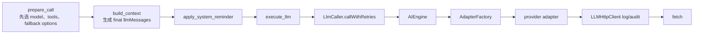

# Phase 2 实施 runbook：图片能力、fallback 保真与调用前门禁

> **状态**：已归档。P2.F、P2.0-P2.9 已于 2026-07-22 完成；P2.0 是随对应实现批次转绿的复现基线，没有单独形成红测提交。本文现作为 [`18-multimodal-context-lifecycle-proposal.md`](./18-multimodal-context-lifecycle-proposal.md) Phase 2 的实施证据；Phase 1 durable 链路归档见 [`19-multimodal-phase-1-implementation-runbook.md`](./19-multimodal-phase-1-implementation-runbook.md)，Phase 3 全链路调研与实施批次见 [`21-multimodal-phase-3-implementation-runbook.md`](./21-multimodal-phase-3-implementation-runbook.md)。

> **目标**：让模型能力、实际 adapter 能力、显式选模、policy fallback、cloud quota fallback 和每一次真实 LLM 调用共享同一套图片输入校验；在 Phase 3 尚未物化图片前，任何 durable attachment 都不得进入 provider HTTP 请求或 HTTP audit。

---

## 0. 结论先行

Phase 2 不负责“把图片发给模型”。它负责在真正开放图片发送前，先把能力真源、切模纪律、错误合同和隐私门禁铺好。

本轮采用以下硬约束：

1. 模型能力新增独立的 `image_input`，不得复用知识库 OCR 的 `vision`，也不得按模型名推断。
2. v1 的 route 能力不建 placement × transport 矩阵，只由实际 adapter descriptor 声明两个布尔：user 图片、tool-result 图片。
3. `ModelInputRequirement` 是每次对 final `LlmRequestMessage[]` 运行的纯函数结果，不持久化、不进入 checkpoint、不由 Renderer 上报。
4. `ModelResolver` 负责筛选候选，`LlmCaller` 的每个真实 attempt 才是最终 egress gate；二者不能互相替代。
5. Phase 2 期间所有生产 adapter 的两个图片布尔都必须保持 `false`。Phase 3 完成某个 adapter 的 typed converter 后，才能在同一批提交里把对应 placement 改为 `true`。
6. attachment 不能通过“删除字段后继续请求”来兼容纯文本 adapter。删除后继续调用会让模型在不知道图片被丢弃的情况下作答，属于静默数据损失。
7. `AIEngine` 到 adapter/HTTP 的边界增加 Phase 2 临时硬门禁：只要仍出现 durable `attachments`，就在构造请求日志、audit 和 `fetch` 之前失败。Phase 3 用“先物化和转换、再断言 provider body 不含 durable ref”替换这条临时门禁。
8. 能力错误必须携带稳定 code，并完整经过 AgentEvent → RuntimeEvent → SSE → Renderer；不得再依赖 provider 400 文案或前端字符串匹配。
9. Phase 2 不新增草稿附件 UI。草稿含图时禁用不兼容模型属于 Phase 4，因为当前 Renderer 没有草稿附件状态；提前加筛选参数会形成无消费者死代码。

这组约束同时解决两个不同问题：能力 gate 防止选错模型或 fallback 降级，host 出口硬门禁防止框架或未来旁路把 durable ref 泄漏给第三方。二者不是重复业务判断。

---

## 1. 本轮边界

### 1.1 必须交付

| 能力 | Phase 2 交付 |
|---|---|
| 模型语义能力 | `image_input` 进入本地 model catalog、自定义模型设置、Linnya Cloud/admin 三个入口 |
| adapter 能力 | 与 AdapterFactory 实际选路同源的 user/tool-result 两个静态布尔 |
| 输入要求 | 从 final LLM messages 纯函数派生 placement 集合 |
| 选模 | 显式模型、默认模型和 policy fallback 按当前 requirement 校验或筛选 |
| quota fallback | 固定目标同样校验；不兼容时禁止重放带图消息 |
| 调用门禁 | `call`、`callStream`、`callWithRetries` 和其中每个真实 attempt 共享同一 validator |
| 防泄漏 | 未物化 durable ref 在任何 provider request/log/audit 前 fail closed |
| 错误链 | 稳定 code、结构化 details、RuntimeEvent/SSE 透传、Renderer 本地化文案 |
| Phase 1 审计闭环 | 先完成 P2.F 的删除纪律、同源贯穿测试、消息工厂合同和顺序注释，再进入能力系统改造 |
| 验收 | 覆盖纯文本、user 图片、tool-result 图片、retry、两类 fallback、wait-user、child run 的业务测试 |

### 1.2 明确不做

- 不读取 asset bytes，不生成 base64/data URL，不选择 transport。
- 不实现 OpenAI Responses、Chat Completions、Anthropic 或 Gemini content parts；这些属于 Phase 3。
- 不做图片 token 估算、含图摘要排除、checkpoint coverage 或 remote count。
- 不开放选择、粘贴、拖拽、预览、删除等 Renderer ingress；这些属于 Phase 4。
- 不开放工具图片 schema 或 `resource_read` 图片输出；这些属于 Phase 5。
- 不新增 provider file cache，不做 OCR 自动降级，不把图片转成隐藏文本。
- 不为旧 adapter 宽泛 `any` 做无关全量重构；只收窄本轮触达的 descriptor、gate 和错误合同。

### 1.3 完成语义

Phase 2 完成后允许存在“模型声明支持图片，但当前 adapter 仍不支持”的状态。这不是矛盾：

- `image_input` 表示模型本身的语义能力上限。
- adapter 两个布尔表示当前 API surface 和本地实现是否已打通对应 placement。
- 有效能力必须同时满足两者。

Phase 3 会逐 adapter 打开第二层能力。Phase 2 不应为了制造绿色路径，提前把未实现 converter 的 adapter 标成支持。

### 1.4 Phase 1 遗留与归档后审计项处置

19 号文档的风险台账同时包含已在 Phase 1 根治的事实、图片后续阶段事项和独立技术债。不能把“已记录”误当成“Phase 2 会处理”，也不能为了清台账把无关重构塞进能力系统批次。以下矩阵是这些项目的唯一排期解释；实施中发现归属变化时，必须先更新本表再改代码。

| 19 号编号 | 状态 | 明确归属 |
|---|---|---|
| 1 | 已完成 | P1.4 已删除文本反查和空文本 fallback，不再安排 |
| 2 | 已完成 | P1.3 已让 `generateFinalMessages()` 保持消息本体，只覆盖实际变更字段 |
| 3 | 后移 | provider typed content 合同属于 Phase 3 |
| 4 | 已完成 | P1.6 已补图片尺寸事实与迁移 |
| 5 | 已完成 | P2.F 与第 19 条合并关闭，删除语义不再依赖连接是否开启 FK |
| 6 | 已完成 | P1.5/P1.7 已采用先移动文件、后提交数据库并保留可恢复草稿的顺序 |
| 7 | 已决策 | `StructuredToolResult.media` 不作为模型输入真源，无代码待办 |
| 8 | 分阶段 | Phase 2 负责能力与调用门禁；图片预算、摘要和 checkpoint 规则属于 Phase 3 |
| 9 | 独立技术债 | `ConversationSession.getHistory()` 可变性合同不阻塞图片能力，单独收紧，不并入 P2 批次 |
| 10 | 已完成 | P1.7 已建立 current-turn 单一聚合；第 20 条补真实 orchestrator 贯穿测试 |
| 11 | 独立测试债 | 8 项 Flow 旧失败单独修复；P2.9 必须区分既有失败与本轮回归，不在能力代码中加兼容分支 |
| 12 | 已完成 | staging 清理已绑定 ingress 单例初始化并避开提交窗口 |
| 13 | 已完成 | event/session conversation identity 已在事务入口校验并有回滚测试 |
| 14 | 部分已完成 | asset FK 测试夹具已修；builtin plugin seed 失败单独处理，不借 Phase 2 扩大范围 |
| 15 | 独立 workflow 债 | edit/regenerate 原子性需单独设计可恢复 workflow，最晚在 Phase 4 开放附件编辑前明确方案 |
| 16 | 独立 schema 债 | schemas value/type 公共出口单独修订，不作为 Phase 2 能力合同前置 |
| 17 | 分阶段 | P2.3 阻断 durable ref 外发；provider bytes、typed converter 和持久化 audit 脱敏由 Phase 3 完成 |
| 18 | 本阶段阻塞项 | P2.0 复现，P2.3 根治真空期，P2.9 做 provider/audit 否定验收 |
| 19 | 已完成 | P2.F 统一会话删除纪律并关闭 `SQLiteRunRegistryStore.delete()` facts 旁路 |
| 20 | 已完成 | P2.F 增加真实 `FlowOrchestrator.next()` 请求侧与落库侧同源测试 |
| 21 | 后移 | truncate 目标消息 ID 绑定在 Phase 4 开放附件编辑前完成 |
| 22 | 已完成 | P2.F 修正 `createUserMessage()` 的附件输入合同并锁住保持顺序 |
| 23 | 已完成既定部分 | URI 冲突 fail-fast 保持为有意设计；P2.F 已给 link-before-events 删除顺序补原因注释和回归断言 |

P2.F 只接收边界明确、能在不扩大图片能力架构面的前提下关闭的 Phase 1 缺口。第 9、11、14、15、16 条仍需独立任务承接；“独立”不等于取消，也不得在 P2.9 归档时改写为已完成。

---

## 2. 已核实的真实链路

### 2.1 主 Agent 调用顺序

`GraphAgentExecutor` 当前固定按以下顺序运行：

承重事实：

- `prepareCallStage.ts` 在 final context 产生前调用 `resolveModelId()`，所以这里不能成为 final requirement 的唯一校验点。
- `buildContextStage.ts` 才产出 `llmMessages`；Phase 1 已保证 user/tool attachment 引用与顺序保留到这里。
- `executeLlmStage.ts` 把同一批 `llmMessages` 交给 `callWithRetries()`。
- `retry-fallback.ts` 在循环中改变 `activeModelId`，同一批 messages 会被原样重试或重放给 fallback。

因此 Phase 2 的最小正确改动不是重排整条 tick pipeline，而是：`prepare_call` 保留候选选择；final messages 到达 `LlmCaller` 后派生 requirement；每次 attempt 前校验当前 active model。完整 pipeline 重排继续留在长期提案，不在本轮扩大范围。

### 2.2 三类调用入口

`LlmCaller` 有三个公开调用入口：

| 入口 | 当前生产消费者 | Phase 2 要求 |
|---|---|---|
| `callWithRetries` | Graph 主链、benchmark judge、知识图谱抽取 | 初次 attempt、同模型 retry、policy fallback、quota fallback 全部校验 |
| `call` | Context Manager 的内部摘要调用 | 同样从本次 messages 派生 requirement，禁止成为旁路 |
| `callStream` | 公开框架入口及测试/其他 host | 同样校验，不能只保护 Graph 主链 |

主链只使用 `callWithRetries` 不代表另外两个入口可以忽略。框架公开合同一旦允许 attachment，任何公开出口都必须 fail closed。

### 2.3 fallback 现状

| 路径 | 当前事实 | 图片风险 |
|---|---|---|
| 显式/默认模型 | `resolveModelId()` 只做 requested ID 或默认 chat model | 不校验存在、enabled、chat、`image_input` 或 adapter placement |
| policy fallback | `pickFallbackChatModel()` 只看 chat、enabled、API key、excluded IDs，并偏好非 OpenRouter | 可切到不支持图片的模型或 API surface |
| cloud quota fallback | `prepareCallStage` 为 continuation 注入固定 `cloud-deepseek-reasoner` | 会把同一批带图 messages 原样重放给固定纯文本目标 |
| 同模型 retry | 网络/5xx 等可重试错误复用同一 `activeModelId + messages` | 若首个出站已错误，retry 会重复泄漏 |
| 固定模型 | `allow_model_fallback=false` 已禁止两类切模 | 仍缺当前模型的输入能力校验 |

`maxTotalAttempts`、excluded model IDs 和现有 policy 决策仍保留；Phase 2 只让候选资格增加 requirement 约束，不重写重试预算。

### 2.4 provider 透传与 audit

审计已确认：

- OpenRouter `buildChatCompletionsRequestBase()` 直接把 `messages` 放入 request body。
- 通用 OpenAI adapter 会合并连续消息，但对象扩展仍保留未知 `attachments`。
- 其他 adapter 没有统一删除或转换 durable attachments。
- `LLMHttpClient.logRequest()` 在 `fetch` 前处理最终 request；它会复制消息对象，未知 `attachments` 会进入开发调试快照。
- `sanitizeLLMHttpAuditPayload()` 当前只把有限 HTTP 元数据写入 HTTP audit，但不能把这当成请求安全边界；`LLMHttpClient` 调试快照和请求策略仍能先观察到完整 request。Context Manager 的本地 lifecycle audit 还会保存 durable message refs，这是 Phase 1 的既有审计合同，完整脱敏仍按 18 号提案留给 Phase 3。

所以 Phase 2 的防泄漏门禁必须位于 `AIEngine`/adapter 出口、且早于 adapter request body、policy、`logRequest()`、HTTP audit tracker 和 `fetch`。测试必须直接证明这四者均未被调用，而不是只断言 provider 返回错误。Phase 2 不顺带改写 Context Manager lifecycle audit；Phase 3 需要继续完成其附件脱敏合同。

### 2.5 模型配置三入口

| 入口 | 当前真源 | 当前缺口 |
|---|---|---|
| 内置 catalog | `src/domains/model-catalog/features/default-catalog/assets/default_models.json` → catalog admission → registry | 无 `image_input` 值；registry 公共合同仍以开放字符串数组表达能力 |
| 自定义模型 | `AddModelTab.vue` → models store/service → `POST /api/v1/models` → `modelRouter.ts` | 表单没有图片能力；router 默认 `['chat']`；Ollama/API 两条表单都必须默认关闭 |
| Linnya Cloud | admin `CAPABILITY_OPTIONS` → KV `ModelConfig` → Worker `/v1/models` → `cloud-models.ts` | Worker/admin union 无 `image_input`；下发与客户端透传路径已经存在 |

Cloud 的 `/v1/models` 和客户端 `fetchCloudModels()` 已原样传递 capability 数组，不需要另造同步协议。应只放行新枚举值并用端到端合同测试锁住。

### 2.6 错误链真实缺口

现有骨架是：异常 → `ErrorClassifier` → agent `error` → `agentEventToRuntime()` → RuntimeEvent → SSE → `normalizeConversationError()` → ErrorBanner。

但链路当前并未真正保住结构化错误：

1. `ErrorClassifier` 支持 `llm.unsupported_capability`，但主要靠 provider 文案匹配。
2. `agentEvents.ts` 的 `ErrorEvent` 只有 `error/details`，没有 `error_code/retryable`。
3. `retry-fallback.ts` 的 `emitFinalError()` 只构造 message 和 stack。
4. `agent-to-runtime.ts` 的 error 分支没有把 code/retryable 写入 RuntimeEvent，尽管 RuntimeEvent 与 SSE schema 已支持这两个字段。
5. Renderer normalizer 能读取稳定 code，但目前没有图片能力专用映射；ErrorBanner 最终只能显示泛化文案。

Phase 2 必须修整条链，不能只增加 ErrorClassifier 字符串规则。

---

## 3. 权威合同与所有权

### 3.1 分层归属

| 概念 | owner | 说明 |
|---|---|---|
| durable image ref | linnkit contracts | Phase 1 已完成；只表达资源身份和已验证元数据 |
| `image_input` model capability | Model Catalog public contract | 表达模型语义能力，不表达 route 是否已实现 |
| adapter placement 支持 | host LLM adapter descriptor | 与实际 AdapterFactory 选路同源，不能由 linnkit 猜具体 provider |
| `ModelInputRequirement` | linnkit LLM feature definitions/functions | 从 provider-neutral final messages 纯派生 |
| active candidate 校验 | linnkit LLM caller orchestration | 每次真实 attempt 前组合 model + adapter 声明 |
| 未物化 ref 防泄漏 | host AI egress boundary | 保护 provider、日志和 audit，不参与 fallback 业务选择 |
| 稳定错误投影 | linnkit runtime event contract + Renderer conversation domain | 后端产 code/details，前端只做本地化展示 |

禁止把 adapter 选择逻辑复制到 linnkit，也禁止让 host adapter 反向依赖 Renderer 或 workspace 草稿类型。

### 3.2 `image_input` 与旧 `vision`

| capability | 含义 | 允许用于 Agent 图片 gate 吗 |
|---|---|---|
| `image_input` | 聊天上下文中的模型可以理解图片 | 是 |
| `vision` | 现有知识库 OCR/视觉解析场景 | 否 |
| `image_generation` | 生成图片 | 否 |
| `chat` | 可用于普通聊天 | 必要但不充分 |

Cloud union、admin options、registry 能力查询和展示标签必须保持语义一致。registry 的底层 `capabilities: string[]` 可继续兼容插件扩展，不需要为了一个新值把全部能力收窄成封闭 enum。`src/shared/types.ts` 的旧 `ModelCapability` 目前只服务 transcription 与 legacy adapter type，缺少多项现有 registry capability；它不能成为本轮新真源。若触达它，只能作为清理 legacy 类型依赖的一部分，不能再复制一份封闭能力表。

### 3.3 adapter descriptor

adapter 图片能力必须挂在“实际会被 AdapterFactory 创建的 descriptor”上，而不是维护第二张按 provider/model 名称匹配的表。

descriptor 首期只暴露：

| 字段 | 语义 |
|---|---|
| user image input | 当前 adapter/API surface 已实现 user message 图片转换 |
| tool-result image input | 当前 adapter/API surface 已实现 tool result 图片转换 |

实施约束：

- descriptor 的解析必须复用 `adapter` 显式配置、OpenRouter、GPT、Gemini、Anthropic、Ollama 和通用 OpenAI 的现有选路结果。
- `createAdapter()` 与能力查询消费同一个 resolver 结果，禁止各写一套启发式判断。
- integrations 注册表返回的 adapter 也必须提供同样 descriptor；缺失时默认两个布尔均为 `false`。
- `true` 只能与 converter 实现和 adapter 级请求体测试同批提交；Phase 2 全部生产 adapter 均为 `false`。
- tool-result 不得从 user 支持推导；两者独立声明。

为避免 framework 反向依赖 host 实现，`defaultModelCatalog` 对 linnkit 暴露的是已经组合好的 model entry：模型原始 capabilities + host 从 descriptor 解析出的 placement 支持。测试 catalog 可以显式构造能力，不必创建真实 provider adapter。

### 3.4 `ModelInputRequirement`

首期 requirement 只需要表达三项事实：

| 字段 | 派生规则 |
|---|---|
| requires image input | final messages 中至少一个合法 attachment |
| user placement | 任一 user message 带 attachment |
| tool-result placement | 任一 tool message 带 attachment |

规则：

- 输入是 `readonly LlmRequestMessage[]`，输出是不可变值。
- 只读取权威 union 上的 `role + attachments`，不扫描任意 metadata，不读取 bytes。
- attachment 数组为空不应出现在权威合同；若测试或外部 host 绕过 schema，按“不产生 requirement”处理即可，不新增无业务意义异常。
- 同一消息多个附件不改变能力要求；数量与大小属于 Phase 1 ingress/未来 provider limit，不属于 Phase 2 gate。
- 每次真实调用重新派生，因此 wait-user、child run 和跨 run 无需 requirement 状态机或快照字段。
- requirement 不进入 `LlmCallOptions`，避免内部控制字段被 adapter 展开进 provider body；它应作为 caller 内部值显式传给校验与 fallback 选择函数。

### 3.5 校验顺序

每次真实 attempt 按固定顺序检查：

| 顺序 | 检查 | 失败行为 |
|---|---|---|
| 1 | 模型存在且 enabled | 稳定模型不可用错误；零 provider 调用 |
| 2 | 模型具备 `chat` | 稳定模型用途不兼容错误；零 provider 调用 |
| 3 | requirement 是否为空 | 为空立即通过，纯文本行为不变 |
| 4 | 模型具备 `image_input` | `llm.image_input.model_unsupported` |
| 5 | adapter 支持全部实际 placements | `llm.image_input.placement_unsupported` |
| 6 | host resolved request 已完成物化 | Phase 2 固定以 `llm.image_input.materialization_pending` 阻断；Phase 3 替换 |

候选兼容模型列表只包含同时满足 enabled、chat、`image_input` 和所需 adapter placements 的模型；不把只满足 model capability 的模型误导给用户。

### 3.6 fallback 规则

1. `pickFallbackChatModel()` 接收 current requirement，并在现有 enabled/API key/excluded/preferred-order 规则之前过滤不兼容候选。
2. policy engine 仍只决定“是否切模”；具体候选仍由 resolver 选择。
3. quota fallback ID 不是可信白名单，返回前必须按同一 validator 检查。
4. fallback 候选不兼容时，不发起一次“试试看”的 HTTP 请求，不删除附件，不消耗 attempt budget。
5. 没有兼容 fallback 时保留原始失败为终态，并在结构化 details/audit 中记录 fallback 因能力不满足被拒绝。不要用第二个能力错误覆盖最初的 quota/provider 根因。
6. 同模型 retry 也重新执行 validator。requirement 通常相同，但这保证所有真实调用统一经过门禁，并允许未来 route catalog 热更新后 fail closed。
7. `allow_model_fallback=false` 继续禁止两类 fallback；它不绕过当前模型 gate。

### 3.7 稳定错误

Phase 2 新增三个窄错误码：

| code | 触发点 | Renderer 行为 |
|---|---|---|
| `llm.image_input.model_unsupported` | active model 缺少 `image_input` | 提示当前模型不支持图片，并展示可兼容模型名称（若有） |
| `llm.image_input.placement_unsupported` | adapter 不支持 user 或 tool-result placement | 提示当前连接方式尚不支持该来源图片，建议切换兼容模型/连接 |
| `llm.image_input.materialization_pending` | Phase 2 出口仍发现 durable ref | 提示图片发送能力尚未完成，禁止重试同请求 |

错误 details 只记录：active model ID、required placements、缺失条件、兼容 model IDs、fallback rejection 摘要。不得放 attachment ref、asset ID、文件名、hash、路径或 provider request body。

能力错误类必须携带结构化 `errorCode`、`recoverable=false` 和安全 metadata。`ErrorClassifier` 应优先读取结构化字段；字符串匹配只保留给第三方 provider 错误的最后分类，不作为本地能力错误真源。

---

## 4. 分批实施

### P2.F · 关闭 Phase 1 审计缺口（已完成）

**目标**：先关闭会破坏 durable identity 或让未来调用方静默丢附件的已知缺口，再改模型能力与调用链。该批次是 P2.0 的前置，不与 capability feature 混在同一个提交。

交付：

- `EventStore.deleteConversation()` 在同一事务中显式删除 attachment links、UI projection、messages、events、runs 和 conversation；测试/维护连接即使 `foreign_keys=OFF` 也得到与生产连接一致的结果。
- `RunRegistryStore.delete()` 的公共语义保持“删除 registry metadata”。SQLite 实现若目标 run 已有 conversation events/messages/asset links，必须拒绝并引导调用方走由 EventStore 负责的会话/历史删除 workflow；不得从 run-registry adapter 反向依赖 EventStore 内部实现，也不得在这里复制一套级联删除规则。无关联 facts 的空 run 仍可按 port 合同删除。
- 在 `eventAssetLinks.deleteForRuns()` 调用处写明必须先于 events 删除的原因；现有两个 truncate 分支均由业务测试锁住这一顺序，禁止依赖 FK cascade 掩盖。
- 增加一个经过真实 `FlowOrchestrator.next()` 的测试：同一次 `prepareFlowIncomingEventBatch()` 产出的 attachment IDs 与顺序，必须同时出现在 `registerRun()` 收到的 `currentUserAttachments`、持久化 event payload 和 `conversation_event_asset_links`，测试不得在 orchestrator 外手工拼合两侧输入。
- 让 `createUserMessage()` 的类型化输入只在 `type='user_input'` 时接受 `RuntimeResourceRef[]`；工厂保持附件身份与顺序，其他 user context type 在编译期和 schema 层都不能携带附件。现有纯文本调用签名保持可迁移，不用宽 union 或类型断言兜底。

门禁：

- 分别在 FK 开启与关闭的连接删除同一会话，两者均不留下 links、projection、messages、events 或 runs；事务中途失败必须完整回滚。
- SQLite registry 对有 facts 的 run fail closed，对空 run 正常删除；生产调用面审计确认不存在绕过 EventStore 的直接 facts 删除路径。
- Flow 贯穿测试同时断言请求侧、event payload 与 link 表的 attachment identity/ordinal；删掉 orchestrator 任一侧的同源传递时测试必须失败。
- `createUserMessage('user_input', ...)` 的带图与纯文本合同均通过，附件不会被工厂静默丢弃。

### P2.0 · 锁定能力边界与复现基线

**目标**：先用业务测试证明当前真实缺口，避免后续只修 happy path。

调研动作：

- 用最小测试复现 final messages 含 user attachment 时，当前 OpenAI-compatible 链会把 durable ref 带到 adapter request。
- 用最小测试复现 policy fallback、quota fallback 会重放同一 attachments。
- 用最小测试复现 agent error → RuntimeEvent 当前丢 `error_code/retryable`。
- 固定纯文本请求、纯文本 retry/fallback 的现有行为基线。

门禁：前三项先红且失败原因与本节事实一致，随后分别随 P2.3、P2.5、P2.6 转成绿色业务合同；不得提交停留在红色的中间 commit，也不通过 snapshot 或 README 文本测试代替业务断言。P2.0 本身是审计/复现步骤，不要求单独代码提交。

### P2.1 · 建立 framework 输入能力 feature

**目标**：在 linnkit LLM domain 内新增高内聚的小 feature，不把规则散进 caller、resolver 和 stage。建议落在 `packages/linnkit/src/runtime-kernel/llm/input-capabilities/`，按职责分为 `definitions/` 与 `functions/`；不新增 manager/service/utils。

建议归类：

- `definitions/`：requirement、placement、adapter input support、稳定 error metadata。
- `functions/`：从 final messages 派生 requirement、判断 model entry 是否满足 requirement、列兼容候选。
- caller/resolver 只做 orchestration，调用这些纯函数。

交付：

- `ModelCatalogEntry` 能承载 host 已解析的 adapter placement 支持。
- requirement 派生同时覆盖 user、tool 和二者共存，保持 attachment 顺序但不关心数量。
- 模型 + adapter 的校验返回可解释的判别结果，不抛泛化字符串。

门禁：无 `any`、无 provider/model 名称嗅探、无 requirement 持久状态；纯文本 requirement 为空。

### P2.2 · 让 AdapterFactory 与能力声明同源

**目标**：消除“调用选了 adapter A，能力检查查的是另一张表 B”的漂移可能。

交付：

- 把当前 AdapterFactory 的选路结果收口成 host LLM adapter feature 内部 descriptor；实例创建和能力查询共享它，definitions/functions 与具体 adapter 实现保持单向依赖。
- 显式 adapter、integration adapter 和现有启发式分支全部纳入同一 resolver。
- host `defaultModelCatalog` 向 linnkit 返回组合后的 adapter placement support。
- 所有生产 adapter 两个布尔先显式为 `false`；测试 fake 可声明不同组合。

门禁：每个现有 adapter 路由的实例类型与改造前一致；未知 integration/adapter 默认 false；不存在“只改能力表不改实际 adapter”的入口。

风险提示：`adapter-factory.ts` 与 `src/infra/adapters/llm/types.ts` 存在大量历史 `any` 和基于名称的选路债。本批只收口 descriptor 解析，不借机重写全部 adapter；但新合同和新增代码不得继续使用 `any`。

### P2.3 · 加入 Phase 2 出口防泄漏门禁

**目标**：先封住 durable ref 到 provider/audit 的真空期，再开放任何 `image_input` 配置入口。

交付：

- `AIEngine.chatCompletion()` 与 `chatCompletionStream()` 在 adapter request 前检查 provider-neutral messages 中是否仍有 durable attachments。
- 命中时抛出结构化 `materialization_pending`，不创建 request body，不执行 policy，不调用 `LLMHttpClient`。
- 同一检查覆盖 stream fallback 到 non-stream 的分支。

门禁：spy 证明 adapter method、`logRequest`/HTTP audit tracker 和 `fetch` 调用数均为 0；错误日志不序列化 messages；纯文本路径不变。

Phase 3 接管条件：当 attachment resolver + typed converter 落地时，本门禁迁移到 converter 之后，改为断言 provider request 中不存在 `attachments`、`resourceId`、`sha256` 等 durable 字段；不能简单删除测试。

### P2.4 · 每次真实调用统一 egress 校验

**目标**：让 `call`、`callStream`、`callWithRetries` 全部使用同一 requirement 和 validator。

交付：

- `call` / `callStream` 在触发 AI engine 前派生并校验。
- `callWithRetries` 在循环外从 final messages 派生 requirement，在每次增加 `actualAttempts` 之前校验 active model。
- capability failure 不计入真实上游 attempt，不进入 retry delay，不触发 policy/quota fallback。
- 当前 active model 的 ID、requirement 与校验结果进入窄 audit evidence；不记录 attachment 内容。

门禁：user/tool placement 各自命中正确错误；同一模型 retry 每次都经过 validator，但纯文本 retry 次数和预算不变。

### P2.5 · resolver、policy fallback 与 quota fallback 保真

**目标**：任何切模都不能弱化 final requirement。

交付：

- 显式/default model 的候选检查增加 exists、enabled、chat 与 requirement。
- `pickFallbackChatModel()` 在现有偏好排序前过滤 requirement 不兼容模型。
- cloud quota fallback 在切换 active ID 前使用同一判别函数；不兼容时记录拒绝原因并保留原错误。
- fallback audit 增加 required placements 与 capability outcome，不增加新的全局 manager/service。

门禁：

- primary user-image compatible → policy fallback tool-only adapter：不调用 fallback。
- primary 额度错误 → 固定 quota fallback 不含 `image_input`：不调用 fallback。
- 多个 policy candidates 时跳过不兼容项，选择首个兼容项并保持现有 preferred order。
- `allow_model_fallback=false` 时 current model 仍校验。

### P2.6 · 修通稳定错误事件链

**目标**：本地产生的能力错误到 Renderer 始终保留结构化语义。

交付：

- 扩展 agent `ErrorEvent` 的 `error_code/retryable/details` 合同。
- streaming `onError` 与 `emitFinalError()` 使用一次分类结果，不重复字符串分类。
- `agentEventToRuntime()` 保留 code、retryable 和安全 details。
- RuntimeEvent → SSE 沿用现有 schema，增加端到端断言。
- `normalizeConversationError()` 按三个稳定 code 映射本地化文案和兼容模型信息；ErrorBanner 继续只负责展示，不解析业务字段。

门禁：live SSE 与 durable replay 对同一错误给出相同用户文案；provider 原始 body/stack 不进入 ErrorBanner。window read model 只保存时间线消息，error 继续作为可持久化、可回放的页面表面状态，不伪造成消息行；测试必须锁住其明确 skip reason。

顺带修复：结构化 `errorCode` 当前不会被 `ErrorClassifier` 优先采用，是通用错误合同债。本批应根治这个 owner 问题，而不是给图片错误新增特殊字符串匹配。

### P2.7 · 补齐本地与自定义模型能力入口

**目标**：本地 catalog 与用户自定义模型都能显式声明 `image_input`，默认关闭。

交付：

- registry 能力查询/展示标签增加 `image_input`，保留 `vision` 原语义；不把旧 `src/shared/types.ts` enum 扩成新的能力真源。
- 内置模型逐项按已核实的模型语义声明；mock、DeepSeek、OCR、图片生成模型不得因名称或类别被自动补值。
- 当前唯一 production 内置 chat entry `gemini-3-flash-preview` 即使声明模型能力，其 adapter placement 在 Phase 2 仍保持 false。
- `AddModelTab.vue` 增加“支持图片识别”复选框，API 与 Ollama 表单均默认不勾选。
- 表单类型、models store/service payload 和 `modelRouter.ts` 显式传递 capabilities；后端不信任缺省值扩大能力。
- 更新自定义模型时同样允许修改能力，避免只能新增时选择、之后无法纠正。

门禁：未勾选得到 `['chat']`；勾选得到 `['chat', 'image_input']`；非法/重复值按现有 model config 纪律归一化；重启后能力保持。

维护风险：`AiAssistantInput.vue` 当前把全部非 system 模型列入聊天下拉，不检查 `enabled`、`chat` 或 `ui_visibility`，且用 `as unknown as ChatModelInfo[]` 绕过 store 类型。这是既有模型选择边界债。Phase 2 应在 conversation domain 下建立 `model-selection` feature 的 typed 纯 selector，由 UI 消费公开结果，不直接操作 store 内部结构；草稿含图筛选留到 Phase 4 接真实草稿状态时完成。不要为了本批把整个既有 models store 搬家。

### P2.8 · 补齐 Linnya Cloud/admin 能力入口

**目标**：Cloud 配置、下发和客户端同步不丢 `image_input`。

交付：

- `cloud/src/types.ts` 的 capability union 增加 `image_input`。
- `cloud/admin/src/api.ts` 的 `CAPABILITY_OPTIONS` 增加同值；既有 `ModelForm` 勾选区直接消费。
- Worker KV 保存、`/v1/models` 下发、客户端 `isCloudModelItem()` 和 `fetchCloudModels()` 保持原样透传。
- Cloud 管理配置默认不自动添加 `image_input`；管理员按真实上游模型和 API surface 明确勾选。

门禁：admin 保存 → Worker list → client local `ModelConfig` 的模块链测试保留能力；未知 capability 不导致整份 Cloud payload 静默失效；quota fallback 测试使用真实 `cloud-` ID 规则。

注意：Cloud model capability 只证明模型语义，不证明桌面端当前 adapter 已映射图片。Phase 3 未完成前，adapter false 仍会阻断。

### P2.9 · 全链路验收、审计与归档

**目标**：用真实 Graph/Flow 边界证明门禁覆盖所有运行形态，并把稳定结论回写长期文档。

交付：

- 跑 §5 测试矩阵和 TypeScript/audit 门禁。
- 搜索 provider adapter 请求体，确认 durable `attachments` 不可能到达 HTTP。
- 搜索新增 `any`、不安全断言、model-name image capability 推断和重复 adapter capability 表。
- 回写 18 号提案的最终合同、批次提交与 Phase 3 前置条件；本文标记归档。

门禁：Phase 2 不宣称“Agent 已能识图”；所有 production adapter 仍为 false；下一阶段只依赖本文公开合同。

---

## 5. 业务测试矩阵

| 场景 | 期望 |
|---|---|
| 纯文本 + 现有 chat model | requirement 为空；请求、retry、fallback 行为与当前一致 |
| user 图片 + model 无 `image_input` | `model_unsupported`；0 次 AI engine/HTTP 调用 |
| user 图片 + model 有能力 + adapter user=false | `placement_unsupported`；0 次 HTTP 调用 |
| tool 图片 + adapter user=true/tool=false | `placement_unsupported`；不能用 user 支持代替 tool 支持 |
| user + tool 图片同时出现 | requirement 同时含两个 placement；必须全部满足 |
| 能力全部满足但仍是 durable ref | `materialization_pending`；adapter/log/audit/fetch 均未调用 |
| 同模型网络 retry | 每个 attempt 都校验；纯文本仍按预算 retry |
| policy fallback 首候选不兼容、次候选兼容 | 跳过首候选，按原偏好选次候选 |
| policy fallback 无兼容候选 | 保留原始 provider 错误；audit 记录 capability rejection |
| quota fallback 不兼容 | 不重放带图 messages；不消耗额外 attempt |
| `allow_model_fallback=false` | 不切模，但 current active model 仍校验 |
| wait-user 恢复后 final context 含图 | 无 requirement 快照；本次调用从 final context 重新派生并阻断 |
| child run 只带文本 | 不继承父 run 图片要求 |
| child run 自身 final context 含图 | 独立派生并校验 |
| Context Manager 内部 `call` 含图 | 不能绕过 gate；Phase 3 摘要规则前 fail closed |
| AgentEvent 能力错误 live + replay | code/retryable/details 和 Renderer 文案一致 |
| 自定义模型默认提交 | 不含 `image_input` |
| 自定义模型明确勾选并重启 | 能力保持，未被 router 覆盖回 `['chat']` |
| Cloud admin 勾选并同步 | Worker 与本地 catalog 均保留 `image_input` |
| 生产 adapter 能力审计 | Phase 2 全部 user/tool 布尔为 false |
| FK 开/关连接删除同一含图会话 | facts、links、projection 与 conversation 均清空，结果一致 |
| SQLite registry 删除有 facts 的 run | fail closed；必须经由 EventStore 负责的删除 workflow |
| 真实 `FlowOrchestrator.next()` 提交含图当前轮 | request、event 与 link 表保持同一 attachment identity 和顺序 |
| `createUserMessage()` 构造带图 `user_input` | 保留附件；其他 user context type 不能接受附件 |

不写 UI padding、颜色或大面积 snapshot 测试。Renderer 只测试模型 selector 业务过滤和错误文案纯函数；主保障放在 caller/fallback/egress 以及 Graph/Flow 模块链。

---

## 6. 验收命令与静态审计

实施时至少执行：

- linnkit contracts、LLM functions、caller、resolver、fallback 和 event mapper 定向测试。
- Host inference capability、Model Catalog 与窄业务 port 定向测试。
- Renderer models store、AddModelTab 相关业务函数、error normalizer、message projection 测试。
- Cloud types/model list/admin model form 的定向测试。
- Graph/Flow 图片附件 lifecycle 集成测试，确认 Phase 1 durable identity 没有回归。
- P2.F 的 FK on/off 删除合同、SQLite registry 旁路和真实 Flow 同源贯穿测试。
- 仓库 TypeScript baseline、`git diff --check` 和现有 audit guards。

静态搜索门禁：

1. `src/infra/adapters/llm/` 不得存在把 durable `attachments` 原样放入 provider body 的可达路径。
2. 新增代码不得按 `gpt`、`gemini`、`vision` 等名称推导 `image_input`。
3. 新增代码不得使用 `any`、双重断言或通过扩大 union 绕过类型。
4. `image_input` 必须在本地 catalog、自定义 payload、Cloud Worker/admin 三个入口均可追踪。
5. stable error code 必须在 agent event、RuntimeEvent、SSE 和 Renderer 各有消费者。
6. provider request、请求调试快照、HTTP audit 和本轮新增 capability audit/telemetry 不得出现 attachment ref、asset ID、sha256、文件名、路径、base64 或 data URL；Phase 1 已存在的 Context Manager lifecycle audit 由 Phase 3 继续脱敏。
7. `deleteConversation()` 不得因 FK pragma 不同而选择只删除部分 durable facts；run-registry adapter 不得复制 EventStore 删除逻辑。
8. 所有创建 `user_input` 的公共工厂必须显式决定是否接收 attachments，禁止白名单重建时默认丢弃。

---

## 7. 风险台账

1. **高，P2.3 已关闭：Phase 1 attachment 曾会原样进入 provider body。** `AIEngine` 两个聊天入口现于 AdapterFactory 之前阻断 durable refs；Phase 3 必须以 typed converter 和 provider body 否定断言接管，不能直接删除这道测试。
2. **高，P2.2 已关闭：adapter capability 与 AdapterFactory 若分开维护会漂移。** 实例创建和能力查询现共享同一个 descriptor resolver，不存在第二张映射表。
3. **高，P2.5 已关闭：quota fallback 固定目标曾不保真。** 固定目标现使用与普通候选相同的输入兼容判别；不兼容时不切模、不增加 attempt，并保留原始额度错误。
4. **中，P2.6 已关闭：结构化 error code 曾在 agent-to-runtime 桥丢失。** AgentErrorEvent、RuntimeEvent、SSE 与 durable replay 现保留同一 code/retryable/details；Renderer 按三个稳定 code 精确映射，不再从图片错误文案猜测。
5. **中，P2.4 已关闭：`LlmCaller.call()` 曾是 Context Manager 内部调用旁路。** `call`、`callStream` 与 `callWithRetries` 现均从各自 final messages 派生 requirement 并在 AI engine 前校验；retry 的每次真实 attempt 还会重新读取 active model。
6. **中：内置 model capability 与 route 支持是两层事实。** 给 Gemini 等模型加 `image_input` 不代表 feiai/OpenRouter/Claude 等当前连接已经能发图；adapter 在 Phase 3 前必须 false。
7. **中，P2.2 已关闭：integration adapter 可绕过主 AdapterFactory 分支。** descriptor 已覆盖 integration registry；未声明 input support 时默认 false。integration 一旦匹配但创建失败会 fail-fast，不再静默切换到与 descriptor 不一致的通用 adapter。
8. **中，P2.7 已关闭：Renderer 聊天下拉曾列出全部自定义模型。** conversation domain 现以 typed selector 只暴露 enabled + chat 模型；system 模型还必须声明 `ui_visibility=chat`，自定义 chat 模型保持既有可见语义。UI 已删除双重断言；草稿含图筛选仍留给 Phase 4 接真实草稿 requirement。
9. **中，P2.7 已关闭：自定义模型 update router 曾使用宽合并。** router 现只接受五个可编辑字段，capabilities 经统一归一化并保留开放扩展值；未知 body 字段不能再覆盖 registry 内部配置。
10. **低，P2.7 已决策：`src/shared/types.ts` 的 enum 不是 registry 唯一真源。** 本批没有把 `image_input` 复制进缺少多项既有能力的 legacy enum；registry 公共合同继续使用开放字符串数组，避免产生第三套封闭能力表。旧 adapter 类型迁移仍应作为独立任务处理。
11. **低，Phase 2 风险已关闭、Phase 3 继续：LLM HTTP debug formatter 会复制未知消息字段。** P2.3 已在它之前阻断 durable refs；Phase 3 仍要补 provider body 的白名单式 typed converter，不能把 logger 当 sanitizer。
12. **低：当前 `AIEngine` 和 adapter factory 有大量既有 `any`。** 本轮只清理触达面并记录剩余债，禁止借 Phase 2 做大范围无行为收益重写。
13. **中，P2.4 已关闭：纯文本显式模型的 exists/enabled/chat 校验扩大了行为面。** 知识图谱 worker、benchmark judge、memory benchmark、quickstart 与 testkit 装配均已盘点并补入真实 chat catalog；`LlmCaller` 构造期现强制要求 `modelCatalog`，不再用空 catalog 掩盖缺失装配。
14. **中，P2.F 已关闭：Phase 1 删除语义曾受 FK pragma 影响。** 事实删除现已收口到 EventStore；run-registry 对有 facts 的 run fail closed，没有形成第二套跨表删除编排。
15. **中，P2.F 已关闭：Phase 1 同源不变量曾缺真实 orchestrator 贯穿测试。** 当前测试观察同一次真实调用的 supervisor request snapshot、runner event、SQLite event payload 与 link ordinal。
16. **低，P2.F 已关闭：消息工厂曾是附件字段的潜在白名单丢失点。** 工厂现只允许 `user_input` 接受附件并保持身份与顺序；P2.9 静态审计继续检查新增消息重建点。
17. **中，归档审计后已关闭：新增自定义模型曾把明文 API key 写入日志。** add router 的入站日志只记录 ID、provider、model name 与 capabilities，成功日志只记录模型 ID；Renderer 提交请求前不再打印原始表单或转换后的请求体。模型配置仍按既有合同返回给本机调用方，但凭据不会进入这条创建链的 console 日志。
18. **低，新发现、独立 Cloud 规则债：`free_until` 的日期语义与管理界面文案不完全一致。** Worker 当前把 `YYYY-MM-DD` 按 UTC 零点比较，界面写“截止某日”却可能在该日开始时就失效。P2.8 提取纯投影时保持既有行为，未把额度策略变更混入图片能力提交；应单独明确时区与“包含截止日”语义后修订。
19. **中，新发现、独立供应链债：Cloud 子项目依赖审计存在 high 告警。** 2026-07-22 按 lockfile 安装时，Worker 报告 6 个漏洞（5 high），admin 报告 12 个漏洞（9 high）。不能在本批盲跑 `npm audit fix` 改写运行时依赖；需独立评估受影响路径、升级范围和 Cloudflare/Vite 构建兼容性。

以下第 20–22 条来自 Phase 2 归档后的独立审计（2026-07-22，三路复核：能力入口三链、错误链与 P2.F 闭环、egress/caller 核心链；结论为核心合同全部符合，P2.3 出口门禁、三入口统一校验、fallback 保真、生产 placement 全 false 均经代码与复跑测试证实）：

20. **低，删除纪律的测试门禁弱于 runbook 表述。** `deleteConversationFacts()` 实现正确（单事务显式删 links → projection → messages → events → runs → conversation），但只有 FK OFF 的测试，缺少 FK ON 对照用例和"事务中途失败完整回滚"专项测试；`SQLiteRunRegistryStore.delete()` 的 facts 检查只查 events/messages/ui_messages 三表，未显式检查 `conversation_event_asset_links`（正常路径下 links 依附 events 被间接覆盖，仅孤立 links 边缘态可能漏拒）。补测时一并处理。
21. **低，已关闭：descriptor 启发式路由与 placement 翻转的耦合提醒。** 后续 Phase 3 与 Provider Catalog 重构已删除按模型名/顶层地址选择 adapter 的旧链；Host 只按 typed route 的 capability/profile 创建 Provider package，图片 placement 也由同一 route 显式声明。
22. **信息，审计确认无按名推断、无 Phase 4 提前实现。** 全库无按 `gpt`/`gemini`/`claude`/`vision` 名称推导 `image_input` 的代码；聊天下拉 selector 无草稿含图筛选死代码；legacy `ModelCapability` enum 未被扩成新真源；Cloud 链路测试贯穿 admin 保存 → Worker 投影 → 客户端 `ModelConfig`。

---

## 8. Phase 3 交接条件

> **已完成交接**：Phase 3 的代码级调研、P3.0-P3.11 实施记录与最终验收已归档在 [`21-multimodal-phase-3-implementation-runbook.md`](./21-multimodal-phase-3-implementation-runbook.md)。Phase 3 已用 resolver、短生命周期 resolved input、active-profile admission、typed converter 和审计脱敏接管本节前置；这不修改本文的 Phase 2 历史事实。

Phase 3 开工前必须拿到以下稳定前置：

- model `image_input` 与 adapter placement support 已可查询且默认关闭；
- final messages requirement 纯函数与 active candidate validator 已成为 caller 公共纪律；
- policy/quota fallback 已保持 requirement；
- 未物化 durable refs 已在 HTTP/audit 前 fail closed；
- 三个稳定错误码已打通 Renderer；
- adapter descriptor 能在 converter 与请求体测试同批提交时安全翻转单个 placement。

Phase 3 已按上述边界完成：没有重做能力系统，而是新增 host attachment resolver、provider-neutral resolved input/estimator port、每 attempt 的 active-profile admission 复核与物化编排、typed converter，并逐 surface 将经过请求体测试证明的 `user_image` 从 `false` 改为 `true`。`tool_result_image` 继续留给 Phase 5。Phase 2 的归档终态仍是“能力可声明、错误可解释、任何图片请求都不会泄漏或静默丢失”；“provider 已能看图”由 Phase 3 归档负责证明。

---

## 9. 实施日志

| 批次 | 状态 | 提交 | 实际改动与验证 | 偏差/新发现 |
|---|---|---|---|---|
| P2.F | 已完成 | `0933c3248`、`06a491920` | EventStore 显式删除完整会话 facts；SQLite registry 拒绝删除有 facts 的 run；`createUserMessage()` 收窄并保持附件；真实 `FlowOrchestrator.next()` 同时锁 supervisor snapshot、runner event、event payload 与 link ordinal。3 个定向文件 16 项测试、真实图片生命周期 1 项、linnkit 双 tsconfig、两次 pre-commit 和根级 tsc baseline `289/289` 通过 | `deleteConversationsWithoutProject()` 存在与单会话删除相同的 FK 漂移，已复用同一 EventStore 私有删除能力一并根治；assets 仍按共享资源账本保留，不随会话删除 |
| P2.1 | 已完成 | `20df1ad17` | linnkit 新增 `input-capabilities` feature；从 final messages 纯派生 user/tool placements，并统一校验 model exists/enabled/chat/`image_input` 与 adapter placement。13 项定向测试、linnkit 双 tsconfig、pre-commit 和根级 tsc baseline `289/289` 通过 | requirement 保持纯函数临时值，不进入 checkpoint、run 或 Renderer；模型语义能力与 adapter route 能力保持两层事实 |
| P2.2 | 已完成 | `17fa53c79` | AdapterFactory 的实例创建与能力查询共享 descriptor resolver；显式、integration、OpenRouter、GPT、Gemini、Anthropic、Kimi、Ollama、通用 OpenAI 路由全部纳入；host catalog 注入实际 adapter support。3 个定向文件 26 项测试、linnkit 双 tsconfig、六项 pre-commit 和根级 tsc baseline `289/289` 通过 | integration registry 的工厂入参由 `unknown` 收紧为 `ModelConfig`；已匹配 integration 创建失败改为 fail-fast，避免旧逻辑静默 fallback 造成 descriptor 与实例漂移。Phase 2 所有生产 adapter 仍为 user/tool `false` |
| P2.3 | 已完成 | `881a54dc9` | linnkit 增加三个稳定图片输入错误码与结构化不可恢复错误；host 新增 `input-egress` feature；`AIEngine.chatCompletion()` 与 `chatCompletionStream()` 在 AdapterFactory 之前阻断 durable refs。3 个定向文件 14 项测试、linnkit 双 tsconfig、六项 pre-commit 和根级 tsc baseline `289/289` 通过 | 测试保留真实 AdapterFactory/OpenAI adapter：附件路径的 factory、policy、HTTP、audit、fetch 均为 0，纯文本真实走到 policy/HTTP；触达的 `messages: any[]` 收紧为 linnkit durable message 与既有 provider content-parts 的联合类型。stream 路径沿用既有 `onError` 合同回传同一结构化错误 |
| P2.4/P2.5 | 已完成 | `21837307e` | 三个 caller 入口共享 final-message requirement；每次真实 attempt 在计数前重新读取 active model 并校验；policy fallback 在原排序前过滤不兼容候选，quota fallback 不兼容时保留原错误；Graph 对 fallback 拒绝写 `model.fallback/denied` audit。10 个定向文件 90 项测试、linnkit 双 tsconfig、六项 pre-commit 和根级 tsc baseline `289/289` 通过 | `modelCatalog` 改为 `LlmCaller` 构造期必填并补齐 quickstart、worker、benchmark、testkit 装配；requirement 不进入 options/provider body。新增窄 `LlmFallbackObserver` 统一 applied/rejected 观察点，审计只含模型 ID、required placements 与拒绝原因，不含附件 ref 或内容 |
| P2.6 | 已完成 | `6e3c91c1d`、`94f96d06d` | ErrorClassifier 优先采用错误对象的 `errorCode/recoverable/metadata`；流式 onError 与 retry/final emit 复用同一次分类；AgentEvent → RuntimeEvent → JSON replay → SSE 保持结构化字段。Renderer 为三个图片 code 增加中英文文案并展示安全的兼容模型 ID。linnkit 6 个文件 74 项、Renderer/host projection 4 个文件 25 项测试，双 tsconfig、两次六项 pre-commit 和根级 tsc baseline `289/289` 通过 | LLM error details 不再携带 stack，只保留分类事实；Renderer projector 日志不再展开原始 event/details。后端 window read model 明确跳过 error，因为它是页面表面状态而非时间线消息；live 与 durable replay 共用同一 normalizer，窗口测试锁住 skip reason |
| P2.7 | 已完成 | `e7dc7364c`、`57b37f6ab` | registry 增加开放 capability 归一化与可编辑字段白名单；内置 Gemini chat entry 显式声明 `image_input`；conversation domain 新增 typed 模型 selector。API/Ollama 新增与编辑表单均可显式开关图片能力，默认关闭；更新时保留未知扩展能力。7 个定向文件 33 项测试、两次六项 pre-commit 和根级 tsc baseline `289/289` 通过 | 模型声明只表达语义上限，全部 production adapter user/tool placement 仍为 false。system 模型需 `ui_visibility=chat`，custom chat 模型沿用既有可见规则；未复制 legacy capability enum。新增模型日志同时移除明文 API key |
| P2.8 | 已完成 | `a86d65841` | Cloud Worker 与 admin 能力入口加入 `image_input`；admin 保存 payload 与 Worker 模型列表投影拆成纯函数。仓库级模块链测试贯穿 admin 保存语义 → Worker 公开响应 → desktop `ModelConfig`，并锁住未勾选仍只有 `chat`；桌面端测试证明未知扩展 capability 不会让整份 payload 失效。2 个文件 11 项定向测试、Worker 独立 tsc、admin production build、六项 pre-commit 和根级 tsc baseline `289/289` 通过 | Cloud 只透传模型语义，不改变 production adapter placement；默认表单仍仅声明 `chat`。测试放在仓库级集成面，避免把 Worker 专属全局类型注入桌面端 tsconfig。另发现 `free_until` 截止日语义和 Cloud 子项目依赖审计风险，已列为独立事项 |
| P2.9 | 已完成 | `14b8242e3` | 补 wait-user 恢复与 child run 独立派生 requirement 的合同测试；随后按 §5/§6 汇总复跑 linnkit、host、Renderer、Cloud、持久化与 Flow 全链路，并完成 provider body、production placement、类型安全和名称推断静态否定审计 | 最终正确状态仍是“能力可声明、切模不降级、错误可解释、未物化引用不会外发”；所有 production adapter placement 继续为 false，Phase 3 converter 未落地前 Agent 仍不能识图 |

---

## 10. 归档验收结论

2026-07-22 的 P2.9 最终验收结果：

- linnkit requirement、caller、retry、两类 fallback、错误事件与 Graph 边界：11 个文件 99 项测试通过。
- host egress、AdapterFactory、模型目录、Renderer 错误/选模/设置与 Cloud 链：13 个文件 78 项测试通过。
- Phase 1 durable identity、删除纪律与真实 `FlowOrchestrator.next()`：3 个文件 15 项测试通过。
- linnkit 双 tsconfig、Cloud Worker 独立 tsc、Cloud admin production build 通过；根级 TypeScript baseline 精确保持 `289/289`。
- 静态审计确认：production 代码没有 `user_image: true` / `tool_result_image: true`；本阶段新增生产代码没有 `any`、双重断言或 `as any`；provider adapter 请求构造没有 durable `attachments` 可达路径；`image_input` 没有按 GPT/Gemini/Claude/vision 名称推断。
- `AIEngine` 出口合同测试确认 durable ref 在 AdapterFactory、policy、请求日志、HTTP audit 与 fetch 之前失败，错误日志不含 attachment ID、resource ID、sha256 或文件名。

Phase 2 到此关闭。Phase 3 只能在 attachment resolver、短生命周期 resolved input、typed provider converter、审计脱敏和 provider request body 否定测试同批落地后，逐 adapter 把对应 placement 从 `false` 改为 `true`；不得先开 capability 再补转换器，也不得通过删除 attachment 后继续请求来制造绿色路径。
