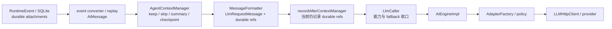
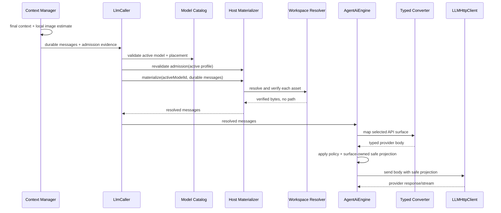

# 21 · Agent 多模态 Phase 3 实施 Runbook

> **历史 Runbook / 压缩机制已替代（2026-08-25）**：本文只保留 Phase 3 当时的实施与验收事实。正文中的摘要屏障、`CheckpointSummarizationProvider`、Context Checkpoint keep set、图片保护终态和相应测试不再是 live 合同；图片现在随所属消息或完整工具交互组服从统一自动上下文压缩，且不存在 checkpoint 工具或专用 Summary Agent。当前合同见 [Context Manager README](../../src/context-manager/README.md) 与 [Context Engineering](../integration/context-engineering.md)。除本提示外，正文不按新机制重写。
>
> **状态**：已归档。P3.0-P3.11 已于 2026-07-22 完成；本文保留为 Phase 3 全链路实施与验收证据。Phase 4 已于 2026-07-23 完成并归档于 [`22-multimodal-phase-4-implementation-runbook.md`](./22-multimodal-phase-4-implementation-runbook.md)。
> **建立日期**：2026-07-22。
> **长期架构真源**：[`18-multimodal-context-lifecycle-proposal.md`](./18-multimodal-context-lifecycle-proposal.md)。
> **前置归档**：[`19-multimodal-phase-1-implementation-runbook.md`](./19-multimodal-phase-1-implementation-runbook.md)、[`20-multimodal-phase-2-implementation-runbook.md`](./20-multimodal-phase-2-implementation-runbook.md)。
> **本文生命周期**：Phase 3 实施归档。逐批提交、验证、偏差、新风险与最终门禁均保留在本文；长期结论已回写 18 号提案。
> **本阶段目标**：在不改变 durable history 语义的前提下，让被最终上下文保留的用户图片经过 workspace 完整性复核、短生命周期物化和 typed provider converter 真正进入已声明支持的模型；同时补齐图片预算、摘要/checkpoint 安全规则与审计脱敏。
>
> **2026-08-12 后续修订**：本文记录的“图片作为摘要/checkpoint 屏障”与 Context Manager 图片保护终态断言只代表
> Phase 3 当时的实施事实，现已废止，不是 live 合同。当前图片随所属消息或完整工具交互组服从统一的 tool history、
> working memory、摘要和 checkpoint 生命周期；`summarizationProtectedRanges`、checkpoint 图片 keep set 与 Context
> Manager 专属预算断言已经删除。`llm.image_input.context_budget_exceeded` 错误码仍由 materializer 的最终 active-route
> token preflight 合法使用；图片估算、trace、admission evidence、能力检查、完整性校验和 provider 映射均继续保留。
> 本文各验收批次记录的“最多 10 张”也是当时事实；当前用户消息入口和四类已支持 route 均为最多 100 张，其他
> 单图/总字节、像素和 token 边界不变。

---

## 0. 结论先行

Phase 3 已完成，但它从来不是“给 adapter 加一个 base64 字段”。代码与最终验收确认，本阶段同时闭合了六条合同：

1. **物化与图片 admission 复核必须按本次 active model、在每个真实 attempt 前执行。** `LlmCaller` 已经是显式选模、policy fallback、quota fallback 和 retry 的共同收口点；若只在 `AIEngine` 外围预处理一次，切模后会复用错误的 route policy。Context Manager 不在 fallback 内重跑，因此还必须用新 profile 对已保留 final context 做一次只校验、不重裁剪的预算复核。
2. **workspace 解析器必须按本次 runtime 装配注入，不能绑到应用级 `AIEngineImpl` 单例。** 数据库和受管目录属于当前 workspace；全局单例持有它们会破坏切换工作区、并发隔离和测试。
3. **Context Manager 必须先把图片计入本地预算，再决定 keep/drop。** 当前 tokenizer 对图片-only 消息几乎计零；文本与附件必须作为同一个消息状态原子裁剪，但 trace/ledger 要能分别解释文本与每张图片的成本。
4. **含图消息是摘要和 checkpoint 的语义屏障。** v1 不做多模态摘要与 coverage，因此摘要替换范围不能跨过含图消息，checkpoint 也不能 purge 含图消息或其所属工具交互组；保留后仍超预算就明确失败。
5. **provider body 可以含字节，但任何持久化或调试面都不能含。** 当前 lifecycle audit 保存的是 durable ref，仍可回放；真正危险的是 `LLMHttpClient.lastRequestSnapshot.rawRequest`、调试路由和只认识 Chat Completions `image_url` 的日志格式化器。
6. **能力按 API surface 分批打开，不按模型品牌打开。** 当前 `gpt` 走 OpenAI Responses，`gemini`/`openrouter`/generic `openai` 走 Chat Completions，`claude` 走 Anthropic Messages，`ollama` 走原生 `/api/chat`。converter、非流式/流式请求体测试和 adapter placement 必须同批提交。

本阶段只开放 `user_image`。`tool_result_image` 虽然已有 durable 合同，但生产者、工具 schema 过滤和 ToolNode 二次校验属于 Phase 5；所有 route 在 Phase 3 终态仍保持 `tool_result_image: false`。

---

## 1. 本轮边界

### 1.1 必须交付

1. provider-neutral、短生命周期的 resolved attachment/message 合同；字节只存在于该合同和 provider request body。
2. linnkit `LlmInputMaterializerPort`，由 `LlmCaller` 在每次真实 attempt 前调用。
3. workspace asset 的严格 resolver：账本、受管路径、普通文件、实际字节、hash、magic bytes、真实解码尺寸全部一致。
4. host app-level materializer：组合 workspace resolver、active adapter surface、route limit 和 processing policy，不让 linnkit 依赖 workspace SQL。
5. root run、wait-user、retry/fallback、child run 使用同一 workspace-scoped materializer 装配；fallback 切换 profile 后重算图片分项并复核 final context admission。
6. Context Manager 通过窄的图片估算 port 获得保守分桶结果，实现消息/附件原子预算、attachment token component、显式 admission evidence 和 ContextTrace；不直接依赖 host profile。
7. 含图消息不进入摘要替换范围；checkpoint 不 purge 含图消息或其原子工具组；超预算返回稳定错误。
8. `CanonicalLlmUsage.imageInputTokens?`，只承载 provider 明确上报的输入分项，不与 `inputTokens` 重复相加。
9. 按 owner 分离可回放 durable 投影与各 API surface 的 debug 投影；lifecycle audit、run transcript、tool replay、HTTP debug snapshot 和错误日志都不含 bytes、base64、data URL 或本地路径。
10. OpenAI Chat Completions、OpenAI Responses、Anthropic Messages、Ollama Chat 四类 typed converter。
11. 每类 converter 的流式/非流式同源请求构造、provider body 否定断言和至少一条 durable ref → resolver → provider body 模块链测试。
12. 对已完成 converter 且有显式 model `image_input` 的 route 逐批打开 `user_image`；未完成 route 和 integration 继续 fail closed。

### 1.2 明确不做

| 不做项 | 归属 | Phase 3 只留下什么 |
|---|---|---|
| Renderer 选择、粘贴、拖拽、预览和发送交互 | Phase 4 | 继续用测试/host fixture 构造已有 draft/durable ref |
| 工具声明图片要求、工具结果图片生产、`resource_read` 图片分支 | Phase 5 | converter 明确拒绝未开放的 `tool_result_image` |
| Slides/bash 截图接入 | Phase 6 | 不新增 Slides 专用图片通道 |
| provider file upload/cache | 后续优化 | v1 只用 inline bytes/data URL |
| remote token count + admission rebuild | 后续独立批次 | 含图上下文禁用旧 pre-materialization remote counter，并记录原因 |
| 多模态摘要和 checkpoint coverage | 后续优化 | 图片作为摘要/checkpoint 屏障，超预算明确失败 |
| 自动 OCR、静默删图、图片转路径文本 | 不采用 | 保持图片语义，失败时给稳定错误 |
| 全量清理 `AIEngine`/adapter 历史 `any` | 独立治理 | 新合同、触达的 converter 与 egress 边界不得新增或继续依赖 `any` |
| 默认打开所有 OpenAI-compatible gateway | 不采用 | model capability 仍默认 false；只对完成 typed converter 的 adapter surface 声明实现能力 |

### 1.3 完成语义

Phase 3 完成不等于“任何叫视觉模型的配置都能发图”，而是同时满足：

- final context 中保留的图片一定计入预算并保持消息原子性；
- active model 和 adapter placement 在每个 attempt 前已通过 Phase 2 校验，final context 也已按该 attempt 的图片 profile 复核预算；
- host 从当前 workspace 账本读取并复核了同一资源；
- adapter 用自身 API surface 的 typed converter 生成请求；
- provider body 含真实图片输入，但 durable/event/audit/debug/log 面只含安全证据；
- 未实现、资源异常、route 超限和 context 超限都明确失败，不丢图继续请求；
- 纯文本请求行为、fallback 语义和现有工具协议不回归。

---

## 2. 已核实的真实链路

### 2.1 从 durable history 到 provider 的当前顺序

Phase 2 在 `AIEngineImpl.chatCompletion()` 和 `chatCompletionStream()` 第一行调用 `assertLlmInputMaterialized()`。因此当前 durable ref 在 AdapterFactory、policy、日志、audit 和 fetch 之前被拒绝；Phase 3 必须用“materializer → resolved input → typed converter → provider body 否定断言”接管，不能只删除门禁。

### 2.2 调用与 fallback 收口点

`packages/linnkit/src/runtime-kernel/llm/` 已形成三条入口：

| 入口 | 当前能力校验 | Phase 3 物化位置 |
|---|---|---|
| `LlmCaller.call()` | 调用前派生 requirement 并校验 model/placement | 校验后，按 active profile 复核 admission，再在调用 `AgentAiEngine` 前物化 |
| `LlmCaller.callStream()` | 同上 | 同上，流式/非流式共用复核与物化函数 |
| `callWithRetryFallback()` | 每个 active model attempt 前重新校验 | 每次校验后按新 profile 复核并重新物化；本地失败不计 provider attempt |

policy fallback 与 quota fallback 都会改变 `activeModelId`，所以 resolved input 不能在进入 retry loop 前一次性构造。Context Manager 已在 fallback 之前完成，不能在 retry loop 内重跑摘要或裁剪；它必须把 final context 的输入预算与非图片成本作为短生命周期 admission evidence 交给 `LlmCaller`。每个 active profile 重新估算图片分项后，若 final context 超出同一输入预算，直接返回 `context_budget_exceeded`。资源缺失/完整性失败与 context 预算失败不因换模型而改善，应直接结束且不进入 provider retry/fallback；route limit 或 mapping 失败也不自动换模，Renderer 可提示用户显式切换。上述本地 preflight 虽然不进入 provider retry `catch`，仍必须走现有单次分类与 `AgentErrorEvent` 发射链，不能只抛异常导致 live/replay 文案漂移。

### 2.3 workspace 与 runtime 装配

- `AIEngineImpl` 在 `ServiceInitializer` 中作为应用级单例创建，没有 workspace DB/root 依赖。
- root Graph 的默认 `LlmCaller` 由 `graphRuntimeFactory.ts` 创建；生产 Graph 在 `src/electron-main/routes/index.ts` 注册，此处同时持有当前 `db`、`DatabaseService` 和 `getWorkspaceRoot()`。
- child run 在 `childRunInvokerFactory.ts` 中重新创建默认 `LlmNode`，不会自动继承 root node 内部依赖。
- `DatabaseService` 和 `pathManager` 都是 workspace-aware 的 host 能力，不能进入 linnkit。

因此生产装配应在 routes/application use case 创建一个 workspace-scoped materializer，再显式注入 root 和 child 的 `LlmCaller`。不得把 DB、workspace root 或 resolver 放进全局 Model Catalog、全局 `AIEngineImpl` 或 adapter descriptor。

### 2.4 workspace asset 事实与历史 resolver 缺口

`assets` 表已经持有 `media_type`、`size_bytes`、`width_px`、`height_px`、`sha256`、`storage_status` 和 `local_path`；Phase 1 图片 ingress 已用 `sharp` 做真实解码并把文件移动到 `ManagedAssets/v1/content/<hash-prefix>/...`。

历史 `createWorkspaceAssetLocalPathResolver()` 只返回 asset ID + path，并只用 `existsSync` 判断文件存在；该无授权插件查询口已退役。它不能作为 LLM 物化器，因为它不验证：

- `storage_status === local`；
- path 是否仍位于当前 workspace 的 managed content root；
- 目标是否为普通文件；
- durable ref、asset row 与实际 bytes 的 MIME、长度、尺寸、sha256 是否一致；
- 实际文件是否仍能被图片解码器读取。

因此实现没有扩大该插件 resolver，而是建立了窄的 LLM 图片解析 feature；ingress 与 resolver 共同需要的“从 bytes 识别 MIME/尺寸/hash”能力位于明确的 domain 边界，不能把整个 ingress feature 变成跨 feature 工具箱。

### 2.5 Context Manager 与预算缺口

当前 `TokenizerPort.estimateMessage()` 只计算文本、tool call 和固定 overhead。图片-only user message 因而接近零成本。`AgentContextManager` 在 pipeline 完成后又调用 `countMessagesWithRemoteCounter()`；host token counter 会再次把 messages 转成 provider 请求，但此时图片仍是 durable ref。

Phase 3 固定以下规则：

1. 本地估算只读取 durable ref 的 width/height 和 active route 的窄 processing profile，不读取 bytes。
2. 同一消息的 state token = 文本/协议成本 + 所有附件估算；keep/drop 仍只操作整条 message。
3. token component 拆成消息本体和每张附件，二者相加等于 state token；不能让父组件重复包含附件成本。
4. 含附件时不调用现有 remote counter，`RemoteTokenCountTrace` 记录 `attempted=false` 和稳定原因；纯文本继续沿用现状。
5. 不用一个全局图片常数，也不把 `avgCharsPerToken` 用到图片。
6. remote count、provider aggregate count 反馈和最多一次 admission rebuild 按 18 号提案继续推迟。
7. Context Manager 输出短生命周期 admission evidence：输入预算、非图片成本、初始 profile ID 与每图估算；fallback 只用新 profile 重算图片分项并核验 `nonImage + activeImages <= inputBudget`，不从 trace 反推业务输入，也不在 retry loop 内重建上下文。

### 2.6 摘要与 checkpoint 的真实风险

`AISummaryGenerator.formatMessagesForSummary()` 当前只拼 `role: content`。`SummarizationCandidateSelector` 先选核心对话，再用最小/最大 index 扩成替换范围；即使只从 prompt candidates 排除图片，`allCandidates` 仍可能跨过含图消息并把它替换掉。

所以 v1 不是简单 `filter(!attachments)`：

- 含图消息把候选历史切成不相交区段，摘要范围不能跨越它；
- user + assistant 对、assistant tool call + 全部 tool results 继续原子选择；任一成员含图，整组不进入摘要替换范围；
- 若无安全候选或摘要后仍超预算，返回 `llm.image_input.context_budget_exceeded`，不执行纯文本摘要后替换含图历史；
- `AgentContextManager` 当前 catch 会把内部错误重建为普通 `Error`，实施时必须保留结构化 code/metadata，不能让稳定错误在这里丢失。

`CheckpointSummarizationProvider` 当前会把 checkpoint 前除 must-keep/最近工具对外的候选全部降为 `skip`。Phase 3 要把含图消息及其原子工具交互组加入 keep set；若因此超预算，使用同一稳定预算错误。EngineState checkpointer 只保存运行状态，不属于这条语义。

### 2.7 审计、日志与调试面

现有观测面分为：

| 表面 | 当前内容 | Phase 3 风险 |
|---|---|---|
| context lifecycle audit | clone `contextMessages` / `llmMessages` | 当前是 durable ref，安全；若未来误传 resolved input 会落盘 bytes |
| run transcript | RuntimeEvent → AiMessage | 当前是 durable ref，需继续只保存可持久化投影 |
| tool protocol replay | 从 latest after snapshot 复制 LLM messages | 必须保留 durable refs 才能复现，但不能保留 resolved/provider parts |
| HTTP audit | `sanitizeLLMHttpAuditPayload()` 白名单 HTTP 元数据 | 已不保存 request body，保持现状 |
| last request debug snapshot | `rawRequest: requestData` | 会在内存和 debug HTTP route 暴露完整 base64/data URL |
| request logger | 只截断 Chat `image_url` data URL | 不覆盖 Responses `input_image`、Anthropic `source.data`、Ollama `images[]` |

Phase 3 应建立共享的图片载荷识别/拒绝规则，并区分两种输出：可回放的 durable 安全投影保留完整文本、完整工具协议和 durable refs；仅供 debug/log 展示的投影才截断文本与参数。两者都明确丢弃 raw bytes、base64、data URL、local path 和 provider file ID。不能为了脱敏破坏 tool protocol replay 的输入真实性。

`LLMHttpClient` 不应继续保存完整 `rawRequest` 再寄希望于 formatter 识别各种 provider 形状。每个 API surface 应在 policy 完成后用自己的窄 projector 产出安全 debug projection，HTTP client 只保存该投影；调试路由与 README 同步改名/改语义。provider body 只在调用栈和 mock fetch 断言中短暂存在。

### 2.8 adapter 实际 API surface

| route | 仓库实际 endpoint | 用户图片目标形态 | Phase 3 处理 |
|---|---|---|---|
| `gemini` | OpenAI-compatible `chat/completions` | `content[]` 的 text + `image_url` data URL | 复用 typed Chat converter，不实现 Gemini native `inlineData` |
| `openrouter` | OpenAI-compatible `chat/completions` | 同上 | 复用 typed Chat converter；model capability 仍显式声明 |
| generic `openai` | OpenAI-compatible `chat/completions` | 同上 | 用户明确声明 model `image_input` 后可用；默认 false |
| `gpt` | OpenAI Responses `/responses` | `input_text` + `input_image` data URL | 替换宽松 `sanitizeMessagesForResponsesAPI()` |
| `claude` | Anthropic Messages SDK | image block + base64 source | 扩展现有 converter，保留 thinking/tool 协议 |
| `ollama` | 原生 `/api/chat` | message `images: string[]` 裸 base64 | 扩展 `prepareMessagesForOllama()`；model capability 默认 false |
| `smart-tool` | Chat Completions + XML 特殊链 | 未验证且当前会打印 message content | 保持 false，先不纳入 Phase 3 |
| integrations | 注册式自定义 adapter | 未知 | 默认 false；converter 与 registration 声明必须同批提供 |

官方协议入口见 18 号提案 §17。实施每个 converter 前仍要按仓库锁定的 SDK 版本复核类型；第三方 gateway 的 provider 行为不能从“OpenAI-compatible”名称推断，但 adapter 是否已实现标准 Chat image parts 可以作为独立事实声明。

---

## 3. 权威合同与所有权

### 3.1 三层消息合同

| 层级 | Owner | 允许内容 | 禁止内容 |
|---|---|---|---|
| durable | linnkit contracts / RuntimeEvent / SQLite | string content + `RuntimeResourceRef[]` | bytes、data URL、path、provider file ID |
| resolved | linnkit ports（短生命周期） | durable identity 的窄副本 + verified bytes + placement | local path、workspace SQL row、provider content part |
| provider request | 各 host adapter converter | 对应 API surface 的 typed content | `attachments`、`resourceId`、`sha256`、draft/asset path |

resolved 类型不进入 `AiMessage`、`RuntimeEvent`、context state、checkpoint、telemetry schema 或 Renderer DTO。它只存在于 `LlmInputMaterializerPort.materialize()` 返回值到 adapter request body 完成构造之间。

类型边界必须是单向替换，而不是扩大现有类型：`LlmRequestMessage` 继续只表示 Context Manager → `LlmCaller` 的 durable 输入；新增 `ResolvedLlmInputMessage`（实施时可按仓库命名校准）作为 `AgentAiEngine.chatCompletion/chatCompletionStream` 的唯一消息入参。纯文本调用通过无 I/O 的提升函数进入同一 resolved 合同；不得让 `AgentAiEngine` 接受 `LlmRequestMessage | ResolvedLlmInputMessage`、两个 overload，或保留 durable fallback。这样 TypeScript 才能阻止 durable ref 再次直接进入 host adapter。

resolved attachment 需要保留 attachment/resource identity，方便 converter 错误与安全投影关联；不携带 `localPath`。bytes 使用只读 `Uint8Array`/`Buffer` 兼容合同，不编码成 base64 后跨层传递；base64 由最终 converter 在本次调用内生成。

### 3.2 port 与 domain 边界

| Owner | 新增/调整职责 |
|---|---|
| linnkit `ports` | `LlmInputMaterializerPort`、`LlmImageInputEstimatorPort`、resolved input/admission evidence type；不认识 workspace、SQLite、host profile 对象或 provider SDK |
| linnkit `runtime-kernel/llm` | 每个 active attempt 的“能力校验 → 物化 → provider call”编排与结构化错误事件 |
| linnkit Context Manager | 本地图片估算、消息原子性、summary/checkpoint 屏障、trace/ledger |
| workspace/assets domain | 按 asset ID 读取账本并验证受管文件，返回 verified bytes；不认识 LLM route |
| host LLM egress feature | 持有 processing profile registry，并从同一真源实现 estimator port、组合 workspace resolver/descriptor/route limit、映射到 resolved input |
| adapter converter | resolved input → typed provider request；同 surface projector 在 policy 后生成 safe debug projection |
| app-level runtime assembly | 用当前 db/workspace root 创建 materializer，并注入 root/child run |
| linnkit audit | 只生成可回放 durable 投影与执行载荷否定校验，不解析 workspace 文件/provider body |
| host egress audit/debug | 只生成 materialization evidence 与 surface-owned debug projection，不承担 durable replay |

新增 host 代码不得放入 `utils`、`helpers`、`manager` 或泛化 `service`。workspace 解析属于 `workspace/assets/features/llm-image-resolution`；跨 workspace 与 LLM route 的组合属于 app-host egress orchestration，不强塞进任一 domain。

### 3.3 真实调用顺序

严格顺序：

1. Context Manager 用 durable metadata 做本地估算和选择，不读文件。
2. `LlmCaller` 对本次 active model 校验 Phase 2 requirement。
3. materializer 查询 active descriptor/profile，先验证 route 限额，再用 admission evidence 复核 final context 预算；两者都在读取任何文件前 fail closed。
4. workspace resolver 一次读入 bytes，并在同一 buffer 上完成长度、hash、magic bytes 和解码尺寸复核。
5. materializer 返回 resolved messages；此时才开始持有图片 bytes。
6. typed converter 生成 provider body，policy 只在该 surface 的 typed body 上调整允许字段。
7. 在 policy 后、日志/audit/fetch 前断言 provider body 不含 durable 字段；随后由该 API surface 的窄 projector 生成安全观测投影，policy 不能重新注入 refs。
8. HTTP client 同时接收真实 body 和已构造的安全投影，只发送前者、只保存后者。
9. 调用结束、失败或取消后不缓存 resolved messages/base64；由局部引用自然释放。

### 3.4 workspace resolver 不变量

每个附件都必须满足：

1. durable `resourceId` 对应唯一 asset row；
2. row `storage_status` 为 `local`；
3. `local_path` 经 realpath 后仍位于当前 workspace `ManagedAssets/v1/content`；
4. 路径存在、为普通文件，不跟随受管根外符号链接；
5. 一次读取的实际 bytes 长度与 row、durable ref 一致；
6. 实际 sha256 与 row、durable ref 一致；
7. magic bytes/真实解码得到的 MIME、width、height 与 row、durable ref 一致；
8. media type 仍属于 Phase 1 的 JPEG/PNG/WebP 白名单；
9. 所有附件验证完成后才返回整批 resolved messages，禁止部分成功后删掉失败图片继续。

这里的复核不是对 ingress 的无意义重复：asset 文件在持久化后可能被用户、磁盘故障、迁移或外部程序改变，provider egress 是最后可信边界。

### 3.5 稳定错误合同

| error code | 触发 | retryable | Renderer 行为 |
|---|---|---:|---|
| `llm.image_input.materialization_pending` | 支持图片的 runtime 未装配 materializer | false | 提示当前安装/运行环境尚未完成图片发送能力 |
| `llm.image_input.attachment_unavailable` | asset 不存在、非 local、文件缺失/非普通文件 | false | 指向对应消息附件，提示重新添加或移除 |
| `llm.image_input.attachment_integrity_failed` | 长度、hash、MIME、尺寸或解码不一致 | false | 提示资源已损坏/变化，禁止原请求重试 |
| `llm.image_input.route_limit_exceeded` | 当前 API surface 的数量/总字节/单图限制不满足 | false | 提示切换连接或移除图片 |
| `llm.image_input.mapping_unsupported` | placement 已声明支持但 converter 无法穷尽映射 | false | 视为实现/配置错误，禁止 fetch |
| `llm.image_input.context_budget_exceeded` | 图片作为 summary/checkpoint 屏障后仍超预算 | false | 提示移除旧图片、切换更大上下文模型或新建会话 |

错误 metadata 只放 active model、placement、message/attachment 的稳定 ID、附件序号、limit 类别和安全数值；不得放 local path、base64、data URL、raw bytes、sha256 或 provider body。结构化错误必须继续经过现有 ErrorClassifier → AgentEvent → RuntimeEvent → SSE → durable replay → Renderer 单次分类链。

### 3.6 processing profile 与估算同源

Phase 2 保留的 `AdapterInputSupport` 两个布尔仍是能力真源，不扩张成完整 route profile。但 Phase 3 必须新增一个窄的 host-owned `ImageInputProcessingProfile`，只表达会影响预算与请求体的事实：

- API surface/transport（v1 固定 inline）；
- provider 图片处理参数或 detail/media resolution 的最终值；
- 本地尺寸分桶估算函数/版本；
- 数量、单图字节、请求总字节等 egress limit；
- safe profile ID，供 trace/audit 关联。

同一个 profile 同时供本地估算、materializer limit validator 和 converter 使用，禁止三处按 model name 各写一套判断。它不声明模型是否支持图片，也不进入 durable history；model `image_input` + `AdapterInputSupport` 仍负责能力判断。

`ImageInputProcessingProfile` 的值与解析逻辑留在 host。linnkit Context Manager 只能调用 `LlmImageInputEstimatorPort`，输入 active model ID 和 durable 图片元数据，输出 estimated tokens、safe profile ID 与估算版本；不得 import adapter descriptor 或拿到 transport/provider 参数。host materializer 与 converter 再从同一个 profile registry 取完整事实。这样“估算同源”靠装配和合同成立，不靠 linnkit 反向依赖 host。

Context Manager 记录的是初始 route 的估算；`LlmCaller` 在 fallback 后必须用 active profile 重算 final context 的图片成本。这里不做第二次 keep/drop 或 summary，避免同一次 provider retry 改写已审计的上下文；只允许“仍满足原输入预算则继续，否则稳定失败”。目标模型自身更小的纯文本上下文窗口属于现有模型配置治理，不在 Phase 3 借图片链路重做，但图片 profile 引入的增量差异必须在本阶段闭合。

### 3.7 token component 与 usage

`ContextTokenComponentKind` 增加图片附件分项。每张附件 component 至少记录：

- component ID；
- owner message ID、attachment ID/resource ID、placement；
- width/height 与 processing profile ID；
- estimated tokens、source=`local-estimate`、confidence=`estimate`；
- 与 owner message 相同的 kept/action/reason。

消息本体 component 只记录文本、协议和 tool overhead；附件 components 记录图片成本，二者总和必须等于 Context Manager 使用的 state token。ledger 聚合不允许重复相加。

供调用链使用的 `ImageInputAdmissionEvidence` 是短生命周期业务输入，不等同于 `ContextTrace`：至少包含 input budget、non-image estimated tokens、initial profile ID 和附件身份/估算。trace 可以记录它的安全副本用于解释，但 materializer 不允许再解析 trace JSON 来决定是否发送。

`CanonicalLlmUsage.imageInputTokens?` 是 `inputTokens` 的可选组成说明：

- provider 明确报告时写入，可为 0；
- provider 不报告时为 `undefined`；
- cost/total 聚合仍以 `inputTokens` 为准，不把该分项再次加到 total；
- 禁止用本地估算或 input token 差值伪造 provider actual。

### 3.8 可持久化投影

不建立一个同时认识 durable、resolved 和所有 provider request 的通用 sanitizer。三层由各自 owner 产生窄投影，并共用最小的敏感载荷否定规则：

- **linnkit durable projector**：只接受 durable messages，保留 role/type、完整文本、完整 tool calls/tool results、已压缩的 reasoning sidecar，以及 durable attachment 的 ID、resource ID、MIME、字节数、尺寸、数量和顺序；
- **host materialization evidence projector**：只从 resolved input 提取稳定 ID、profile、数量、尺寸和状态，不返回 bytes，也不试图重建 provider body；
- **surface-owned debug projector**：Chat Completions、Responses、Anthropic、Ollama 各自在 policy 后从自己的 typed body 生成截断文本、工具名称/参数摘要、route/profile/transport、provider 结构标签和 image block 数量。

lifecycle audit、run transcript 和 tool protocol replay snapshot 只使用第一种投影；materialization audit 使用第二种；HTTP debug snapshot 与普通日志使用第三种。tool replay 仍保存可重放的 durable messages，不能保存 resolved/provider request；resolved input 只能产出不可回放的安全 evidence，禁止假装从 resolved/provider body 反向恢复 durable 消息。

---

## 4. Provider converter 合同

### 4.1 共同门禁

每个 converter 必须：

1. 接受 typed resolved messages，不接受 `unknown[]`/`any[]` 作为新公开边界；
2. 穷尽 system/user/assistant/tool 和 tool call replay，不用 spread 原消息进入 provider body；
3. 文本在前，图片按 durable attachment 数组顺序映射；图片-only 消息仍生成合法 user message；
4. 流式与非流式共用同一个 request builder，只在 `stream` 和流专属选项上分叉；
5. Phase 3 遇到 tool message attachments 直接以 placement gate/mapping error 失败，不改写成 user sidecar；
6. 输出 typed provider body，并提供同 surface 的安全 projector；projector 在 policy 后读取最终 typed body；
7. 断言输出中没有 `attachments`、`resourceId`、`sha256`、asset/draft ID、本地路径；
8. 不在 converter、policy、错误信息或 logger 中打印 base64/data URL。

### 4.2 OpenAI Chat Completions surface

适用 `gemini`、`openrouter` 和 generic `openai` route。user message 由 text part 加有序 `image_url` part 组成，inline transport 使用 data URL。纯文本 user message继续允许 string content，避免无意义改变现有请求体；只有含图 user message转换为 parts。

现有 `mergeConsecutiveMessages()`、Gemini/OpenRouter request builder 和 generic OpenAI adapter 都是字段重建点。typed converter 必须位于 policy 之前，并保证 reasoning details、tool calls 和 tool response 时序不回归。`smart-tool` 不复用这次 placement 翻转，因为其 XML 路径和内容日志尚未验证。

### 4.3 OpenAI Responses surface

适用 `gpt` route。替换当前宽松且使用 `any`/对象 spread 的 `sanitizeMessagesForResponsesAPI()`：user input 映射为 `input_text` + `input_image`；assistant tool call 与 tool result 继续映射为 Responses item。不能把 Chat Completions `image_url` part 直接塞进 `input`。

官方与第三方 Responses gateway 可能支持不同参数；converter 只生成仓库实际使用且有类型/请求体测试覆盖的 v1 字段。是否打开某个 model 仍取决于显式 `image_input`。

### 4.4 Anthropic Messages surface

扩展 `claude-converters.ts`，在现有 thinking block、assistant merge、tool_use/tool_result 顺序上增加 user image block，source 固定 base64 + verified media type。不得为了图片重写 thinking/tool 协议。

P3.9 已按仓库锁定的 `@anthropic-ai/sdk@0.78.0` 类型实现：resolved bytes 只在 converter 内编码成 `image` block 的 base64 source，流式与非流式调用在进入 SDK 前共用最终请求校验和 metadata-only projector。当前 ingress 只允许 JPEG/PNG/WebP，不因为 SDK 合同包含 GIF 就扩大 durable 媒体类型。

`anthropic-messages-inline-base64-v1` profile 采用 28px patch 估算，并按当前 route 无法可靠区分模型分辨率层级的事实，保守封顶 4784 visual tokens；单图 raw bytes 限制为 7 MiB，给 base64 的约 4/3 膨胀预留空间，最多 10 图、总 raw bytes 20 MiB。`claude.user_image` 表示 converter 已实现，具体 Claude/MiniMax/兼容网关模型仍必须显式声明 `image_input`，禁止按模型名或 Anthropic route 自动推断。

Phase 3 仍不把 tool attachment 注入 `tool_result.content`；该 placement 与 Phase 5 工具合同同批实现。Anthropic 支持 URL/Files API 不代表 v1 要启用，transport 继续 inline base64。

### 4.5 Ollama Chat surface

扩展 `prepareMessagesForOllama()`，把每条 user 图片映射为该 message 的 `images: string[]` 裸 base64，`content` 继续是 string。不能发送 data URL 前缀。

Ollama server 能接收 `images[]` 不代表任意本地模型能看图；自定义模型 `image_input` 默认 false，只有用户明确声明后才通过 Phase 2 model gate。禁止按 `llava`、`gemma` 等模型名自动推断。

P3.10 已按 [Ollama 原生 Chat API](https://docs.ollama.com/api/chat) 的 message `images[]` 合同实现独立 typed feature；resolved bytes 只在最终 converter 内编码为裸 base64。流式与非流式共用 builder/finalizer/projector，`model/messages/stream` 归 adapter 所有，调用方 options 不能覆盖。

Ollama 图片 token 语义随实际本地模型变化，当前 route 没有可验证的模型级计数元数据。因此 `ollama-chat-inline-base64-v1` 暂用 28px patch、4784 token 封顶的保守 admission profile，单图 10 MiB、最多 10 图、总 raw bytes 20 MiB；未来只有模型目录能提供稳定专属 profile 时才按模型细分，不在 adapter 里按名称猜测。

---

## 5. 分批实施

每批只做一个可验证合同并立即提交。文档在每批代码提交后单独回写，避免把多个未验证阶段压成一个大提交。

### P3.0 · 锁定基线、fixture 与否定门禁

**交付物**：

- 固定四类 API surface 的纯文本请求体基线与图片目标 fixture；
- 保存 Phase 2 `AIEngine` 早期门禁测试，改造成后续可迁移的红灯 fixture；
- 增加仓库级静态扫描：production placement 仍全 false、provider body 不含 durable 字段、持久化面不含图片载荷；
- 记录当前定向测试与 TypeScript baseline。

**门禁**：本批不改生产行为，不打开任何 placement。

### P3.1 · 建立 resolved input、materializer port 与稳定错误

**交付物**：

- linnkit ports 增加 resolved attachment/message 和 `LlmInputMaterializerPort`；
- 增加 provider-neutral 的 `LlmImageInputEstimatorPort`；只暴露 durable metadata → token estimate/profile ID，不暴露 host profile/adapter descriptor；
- 同批定义 `ImageInputAdmissionEvidence` 与 materializer attempt 入参；含图物化必须携带 evidence，不能到 P3.4 再改变 port 方向；
- 复用 Phase 2 已有 `materialization_pending`，新增其余五个 Phase 3 稳定错误 code，并接通 ErrorClassifier/AgentEvent/Renderer 文案；
- 定义 `ImageInputProcessingProfile` 的 host 合同；
- `LlmRequestMessage` 固定为 durable caller 输入，`AgentAiEngine` 改为只接受 resolved input；纯文本用无 I/O 提升函数进入 resolved 合同，不增加联合类型、overload 或 durable fallback。

**门禁**：类型测试证明 resolved 类型与 admission evidence 进不了 RuntimeEvent/AiMessage schema；含图物化缺 evidence 明确失败；错误详情无敏感字段；纯文本调用不要求 materializer。

### P3.2 · workspace 严格图片 resolver

**交付物**：

- 在 workspace/assets domain 新增 `llm-image-resolution` feature；
- 把 ingress 与 egress 共同需要的 bytes inspection 核心提升到 domain shared；
- 查询完整 asset row，验证 managed root、普通文件、bytes/hash/MIME/尺寸/解码一致性；
- 返回 verified bytes + 安全身份，不返回 local path 给 LLM 层。

**门禁**：真实临时 workspace + SQLite 覆盖成功、缺 row、non-local、缺文件、路径越界/符号链接、长度/hash/MIME/尺寸不一致和损坏图片；任一附件失败时整批无结果。

### P3.3 · 每个 attempt 的物化编排与 runtime 装配

**交付物**：

- `LlmCaller.call/callStream/callWithRetries` 在能力校验后调用 materializer；
- materialization 失败不计 provider attempt、不创建 adapter、不执行 policy/fetch，也不进入 fallback；
- 本地 capability/admission/materialization 失败由独立 preflight 错误收口分类一次，并在有 event handler 时发出一个稳定 error event；不得为复用 provider retry `catch` 而允许 fallback；
- active model 发生 fallback 时按新 route/profile 重新物化；
- routes/index 用当前 db/workspace root 创建 host materializer并注入 root node；
- `childRunInvokerFactory` 显式复用同一 workspace materializer；testkit/harness 通过 override 注入 fixture。

**门禁**：root、wait-user、retry、policy fallback、quota fallback、child run 均证明调用顺序；纯文本不读 asset；切模不复用上一 route 的 resolved input；preflight 失败的 live event 与 durable replay 共用同一 code/details，且 provider attempt 仍为 0。

### P3.4 · Context Manager 原子预算、trace 与 usage

**交付物**：

- Context Manager 通过 `LlmImageInputEstimatorPort` 做非零保守分桶；host port 与 materializer/converter 共用同一 profile registry；
- state token 包含附件，但 keep/drop 仍只操作整条 message；
- `ContextTokenComponent` 增加图片分项并保证总和不重复；
- Context Manager 显式输出 admission evidence；fallback 用 active profile 重算图片分项，只核验、不重建上下文；
- root 与 child 的 context builder 注入由同一 host profile registry 实现的 estimator port，不能只给 root 配预算能力；
- 含图时跳过旧 remote counter并记录稳定 trace reason；
- `CanonicalLlmUsage`、ledger/aggregate 增加可选 `imageInputTokens` 分项语义。

**门禁**：linnkit 对 host profile/descriptor 零依赖；图片-only 非零；同尺寸不同 profile 可得到不同估算；文本/附件不会被拆开；component 合计等于 Context Manager final estimate；fallback profile 成本上升后在 HTTP 前明确失败、成本仍在预算内则继续；`imageInputTokens` 不重复计费。

### P3.5 · 摘要与 checkpoint 图片屏障

> **实施状态**：已完成（`a3a50f239`、`61e249a7b`、`a62384532`）。

**交付物**：

- summary candidate 以含图消息为区段屏障，replacement range 不跨图；
- 对话 pair/tool interaction group 任一成员含图时整组排除；
- checkpoint keep set 纳入含图消息及其原子工具组；
- 仍超预算时抛 `context_budget_exceeded`，并修复 `AgentContextManager` 对结构化错误的包装丢失。

**门禁**：不能只测“prompt 没图片”，必须证明 `replacedMessageIds`/skip states 也不包含图片消息；checkpoint 前含图历史不被 purge；超预算错误经过 live/replay 显示一致。

### P3.6 · 审计、调试快照与日志脱敏

> **实施状态**：已完成（`cc8ae6247`、`f47548012`、`d3f570db6`）。

**交付物**：

- linnkit audit 增加可回放 durable 投影；host egress 增加 materialization evidence 投影；二者共用最小载荷拒绝规则但不跨层解析；
- lifecycle audit、run transcript、tool replay snapshot 保存完整文本/工具协议和安全 durable refs，不能因脱敏失去 replay 能力；
- `LLMHttpClient` 改为接收调用方构造的 safe debug projection，不再保存或自行解析 raw provider body；本批先让所有现有 adapter 提供 metadata-only 安全投影，各 typed converter 批次再补对应 surface 的结构投影；
- `/debug/llm/last-request` 与 README 改为返回脱敏请求投影；
- 删除/替换只识别 Chat `image_url` 的局部 base64 formatter，不新增按字符串猜 provider payload 的 sanitizer。

**门禁**：分别用 Chat data URL、Responses input image、Anthropic source data、Ollama images fixture 扫描 audit 文件、checkpoint、debug route、日志和错误，全部无载荷/路径；mock fetch 仍收到完整合法图片，证明没有把发送体一起删掉。

### P3.7 · Typed Chat Completions converter 与首批 route

> **实施状态**：已完成（`f9c71d1a6`、`a97d9199c`）。

**交付物**：

- 共享但窄化的 Chat Completions typed converter 与 post-policy safe projector；
- Gemini、OpenRouter、generic OpenAI 流式/非流式共用 request builder；
- 同批将这三个 built-in adapter route 的 `user_image` placement 改为 true，`tool_result_image` 保持 false；这只表示 route 已实现映射，不会替任何模型补 `image_input` capability；
- 内置 Gemini 显式 `adapter: gemini`，避免图片能力依赖名称启发式选路。

**门禁**：text + 多图、图片-only、工具历史 + 当前 user 图、reasoning details 的请求体合同；generic custom model 未声明 `image_input` 仍在 model gate 失败；内置 Gemini 同时有显式 route 与既有 model capability；smart-tool/integration 不被顺带打开。

### P3.8 · Typed OpenAI Responses converter

> **实施状态**：已完成（`a80d802b3`、`a6d2a5e2c`）。

**交付物**：

- 替换 `sanitizeMessagesForResponsesAPI()`；
- user 图片映射为 Responses `input_text` + `input_image`；
- function call/output、reasoning 与流式响应转换保持原行为；
- 同批打开 `gpt.user_image`，tool result 继续 false。

**门禁**：非流/流请求体同源；Chat parts 不进入 Responses；provider body 无 durable 字段；未声明 model capability 仍失败。

### P3.9 · Typed Anthropic user image converter

**交付物**：

- 扩展 Anthropic converter 的 user content blocks；
- 保持 system promotion、assistant merge、thinking replay 和 tool result 顺序；
- 同批打开 `claude.user_image`，tool result 继续 false。

**门禁**：多图顺序、图片-only、thinking + tool history + user image 的完整请求体；base64 只存在 mock SDK/fetch 入参，不进入 snapshot/audit。

### P3.10 · Typed Ollama user image converter

**交付物**：

- Ollama message 增加有序裸 base64 `images[]`；
- 清理本批触达的 request/stream 类型边界，不新增 `any`；
- 同批打开 `ollama.user_image`，tool result 继续 false。

**门禁**：确认没有 data URL 前缀；未声明视觉能力的本地模型在 HTTP 前失败；流/非流 body 结构一致。

### P3.11 · 全链路验收、文档回写与归档

**交付物**：

- 用真实 Flow ingress fixture 打通 draft → durable event → context → resolver → 至少一个 provider mock body；
- 覆盖图片-only、刷新后历史、retry/fallback、wait-user 和 child run；
- 汇总四类 converter、预算、summary/checkpoint、audit/debug 与错误 UX；
- 可选 provider live smoke 只对本机已配置 route 执行，不作为离线 CI 唯一证据；
- 回写 18 号提案、20 号交接和本文实施日志，明确 Phase 4 前置。

**门禁**：所有打开 `user_image: true` 的 route 都有 converter + request body + 防泄漏测试；全仓 `tool_result_image: true` 仍为零；未实现 route/integration 保持 false。

---

## 6. 业务测试矩阵

| 场景 | 必须证明 |
|---|---|
| 纯文本主调用 | 不访问 asset DB/文件；请求体与 Phase 2 前一致 |
| 当前轮 text + 多图 | 文本与图片顺序稳定，provider 收到全部图片 |
| 图片-only | Context 估算非零，生成合法 user provider message |
| 刷新后的历史图片 | 只靠 durable ref 重新解析同一 managed asset，不依赖 draft/Renderer path |
| 同消息一张图损坏 | 整批 fail closed，不发送剩余图片或纯文本 |
| asset missing/non-local/path escape | 稳定 unavailable/integrity 错误，adapter/policy/fetch 未调用 |
| provider route 超限 | `route_limit_exceeded`，不进入 provider retry/fallback |
| policy/quota fallback | 新 active route 重新校验、重算 final context 图片成本并重新物化；预算不满足时不 fetch，不复用旧 processing profile |
| 同模型网络 retry | 每个真实 attempt 重验资源；actual attempt 只统计已发 HTTP 的次数 |
| wait-user 恢复 | 从恢复后的 final messages 重派生 requirement 并物化 |
| child run 无图片 | 不继承父 run 图片 requirement，不读取父附件 |
| child run 显式图片 | 使用同一 host profile registry 的 estimator、同一 workspace materializer 与 route gate |
| Context keep/drop | 文本和附件同进同退；trace 有每图成本和原因 |
| summary 历史中间有图 | replacement range 不跨图；图和配对消息均不被替换 |
| checkpoint 前有图工具组 | 整组保留；仍超预算时明确失败 |
| remote count enabled + 图片 | 不调用旧 counter，trace 说明 local-only 原因 |
| canonical usage 有图片分项 | 保存 `imageInputTokens` 但不重复加总/计费 |
| 四种 provider surface | 流/非流共用 builder，输出协议精确且无 durable 字段 |
| audit/debug/log | 无 bytes/base64/data URL/path；durable replay 仍可复现 |
| Phase 4 尚未开放 UI | host fixture 可端到端验证，不提前新增 Renderer 附件交互 |

测试以模块链和端到端业务行为为主，不写 provider 类型字段快照、UI 样式快照或 README 快照。请求体合同应通过 mock HTTP/SDK 边界检查真实 body，而不是只测 converter 返回某个局部字段。

---

## 7. 验收与静态审计

每批按影响范围运行定向测试；P3.11 至少汇总：

1. linnkit contracts/ports、Context Manager、LLM caller/fallback、Graph execution 与 error events。
2. workspace image ingress/resolution、SQLite asset/event links 和 Flow image lifecycle。
3. AdapterFactory/descriptor、Chat/Responses/Anthropic/Ollama 流式与非流式请求。
4. audit context、HTTP client/debug route、Renderer error normalizer。
5. root/child run runtime assembly 与 testkit harness。
6. linnkit 双 tsconfig、根级 TypeScript baseline、pre-commit 边界/`any`/断言门禁。

静态否定扫描必须证明：

- RuntimeEvent、AiMessage、SQLite JSON、telemetry、audit 和 debug snapshot 无 base64/data URL/raw bytes/local path/provider file ID；
- provider body 无 `attachments`、`resourceId`、`sha256`、draft ID 或 workspace path；
- `image_input` 和 Ollama/GPT/Gemini/Claude 视觉能力不按模型名推断；
- production `tool_result_image: true` 为零；
- 每个 `user_image: true` route 都能定位到 typed converter 和请求体测试；
- 本阶段新增生产代码无 `any`、双重断言或用断言绕过 schema；
- 不存在把图片删除后继续 provider 调用的 fallback。

---

## 8. 风险台账

1. **已关闭（P3.3/P3.11）：materializer 装配到 root、漏掉 child run。** root 与 child 复用 workspace-scoped materializer 和 processing profile registry；`7c3d887e9` 进一步通过真实 child `LlmNode` 锁住 estimator、route gate、materializer 与 resolved-only AIEngine 的完整调用顺序。
2. **已关闭（P3.1/P3.7-P3.10）：删除 Phase 2 gate 后 durable/resolved 边界仍是联合类型。** `AgentAiEngine` 已收紧为 resolved-only；四类 surface 均在 placement 翻转同批完成 typed converter、policy 后 schema/敏感字段门禁和流/非流请求体测试，不保留 durable overload。
3. **已关闭（P3.6）：`lastRequestSnapshot.rawRequest` 会暴露完整图片。** `cc8ae6247` 已删除 HTTP client 的 raw body 读取、复制与保存能力，改由每个 adapter 显式提供 metadata-only 安全投影；tracked fetch、debug route 和 Renderer 也只处理该投影。`f47548012` 进一步让 durable audit 使用严格安全投影，并单独记录不含 bytes/path/hash 的物化证据。
4. **已关闭（P3.5）：摘要只过滤 prompt candidate，但 replacement range 仍跨图。** `a3a50f239` 已按真实会话轮次与工具交互组构造图片区段屏障，候选和 replacement range 都不能进入或跨越该区段，`replacedMessageIds` 也不再覆盖图片轮次。
5. **已关闭（P3.5）：checkpoint 只保留含图 message、却拆散 tool interaction。** `61e249a7b` 已将含图消息及其所属工具交互组整体提升到 keep set，包括位于旧历史、原本会被 checkpoint purge 的工具组。
6. **已关闭（P3.4）：现有 remote counter 在物化前生成 provider 请求。** 含图上下文明确跳过 pre-materialization remote counter，并在 trace 记录 `image_input_local_only`；active route 只使用本地 profile 估算与 admission 复核。
7. **已关闭（P3.3）：应用级 `AIEngineImpl` 与 workspace 生命周期不同。** resolver/materializer 由当前 workspace 的 runtime assembly 创建，作为窄依赖注入 root/child caller；应用级 AIEngine 不持有 DB 或 workspace root。
8. **中：descriptor 仍有按模型名/API base 的历史启发式选路。** P3.7 给内置 Gemini 加显式 adapter；其他 route 翻转只能表达 converter surface，不能把启发式命中当 model capability。
9. **中：base64 会产生额外内存副本。** v1 依靠 Phase 1 字节/张数上限、按最终 context 才读取和调用后立即释放控制峰值；不增加进程级 cache。
10. **已关闭（P3.7-P3.10）：policy 在 converter 后仍可变更 request body。** 四类 surface 都在 policy 后、日志/fetch 前执行最终 schema 与 durable 字段否定门禁，并从 surface-owned 白名单事实生成 metadata-only debug projection。
11. **已关闭（P3.5）：`AgentContextManager` 重包 Error 会丢结构化 code。** `61e249a7b` 保留已有 `Error` 身份，并让 Context Manager 与 provider preflight 共用同一个 `LlmImageInputError` class；结构化 code、recoverable 与安全 metadata 不再丢失。
12. **已关闭（P3.4）：context component 拆分可能重复计数。** parent message 只计文本/协议，attachment component 单独计图；kept component、final estimate、canonical usage 与父子 run 聚合测试锁住图片分项不重复累计。
13. **中：generic OpenAI-compatible gateway 不一定支持标准图片 part。** model capability 默认 false；用户显式开启表示接受该 endpoint 的声明，provider 仍可能返回明确非重试错误，但不能静默删图。
14. **低：Anthropic 官方还支持 URL/file，OpenAI 还支持 file ID。** v1 不因协议存在而提前做 cache；resolved/durable 合同不保存 provider file ID。
15. **低：`smart-tool` 有 XML 特殊路径。** P3.6 已删除消息预览、成功响应片段和原始错误正文日志，但 Phase 3 仍保持 false；未来若要支持，仍需独立 converter 和请求体测试。
16. **已关闭（P3.6）：provider 错误正文可能回显图片载荷。** `d3f570db6` 从 LLM/OCR provider error 合同中删除 `responseBody`，通用 HTTP、Ollama、SmartTool 和 PaddleOCR 的 HTTP/job 错误只保留状态、阶段与 retryable；DeepSeek 也不再记录完整 normalized response。恶意 data URL 回显测试证明异常 message 与错误对象不含载荷。
17. **低：已有 adapter/interface 大量 `any`。** 本阶段只收紧触达的 egress 与 converter，不借机重写 response/stream 全栈；但新增类型不得继续扩大债务。
18. **低：provider 官方限制会变化。** processing profile 带版本/ID，具体数字由 host 配置与官方文档复核，不写死在 linnkit 通用合同。
19. **已关闭（P3.4/P3.11）：fallback 换 route 后沿用初始 Context Manager 的图片估算。** Context Manager 输出显式 admission evidence；每个 active profile 只重算图片分项、重新核验原输入预算并重新物化，超出时 fail closed，不依赖 provider 400 或静默裁剪。
20. **已关闭（P3.3/P3.5）：本地 preflight 放在 provider `try/catch` 外后只抛错、不发事件。** P3.3 已补独立 preflight 事件收口；`a62384532` 进一步让 Flow 只创建一次 classified error event，并用同一结果驱动 RunRegistry 失败状态与 EventBus 发布，消除同一次失败出现两套错误码的残留。
21. **已关闭（P3.11）：child `inheritTurns` 曾隐式继承父事件附件。** `772428126` 将默认历史继承收紧为只带文本；只有调用方显式设置 `includeAttachments: true` 才保留 durable refs。这样普通 delegate/research child 不会无意读取父图，显式图片 child 才触发独立 requirement、预算、route gate 与物化链。

以下第 22–25 条来自 Phase 3 归档后的独立审计（2026-07-22，三路复核 resolver/物化编排、四类 converter/脱敏面、预算屏障/child 继承，加 egress 核心链人工核查；结论为全部承重合同符合，24 个测试文件 129 项复跑通过，无阻断问题）：

22. **已关闭（2026-08-20）：流式失败曾同时发布 agent error 与 run-level error。** `LlmNodeEventBridge` 现在把唯一已发布的 classified Runtime failure fact 通过窄 `RuntimeFailureFactSink` 交给 AgentRunner；Graph 尚未发布错误时才由 AgentRunner 创建一次 run failure fact。`ExecutionSettlement` 只消费同一事实写 RunHandle，不再发布第二条 error。真实 AgentRunner 集成测试同时锁住“EventBus 只有一条 error”和“同一 code/retryable 驱动 failed 终态”。
23. **低，Chat Completions 最终门禁对 `image_url.url` 只校验 `typeof string`**，不如 Responses/Ollama 的 data URL/裸 base64 正则严格；当前唯一生产者是内部 converter，实际风险低，后续对齐三个 surface 的校验强度即可。
24. **低，测试缺口**：缺"预算压力下文本+图整条消息原子 drop"的显式端到端用例（架构上 keep/drop 已按整条消息操作）；摘要屏障的真实 AgentContextManager → 摘要生成组合用例偏薄；host usage normalizer 尚未回填 provider 明确上报的 `imageInputTokens`（当前 fail-closed 保持 `undefined`，非伪造）。
25. **信息，host `AIEngineImpl` 入参保持 `LlmRequestMessage | ResolvedLlmInputMessage | ChatMessage` 联合**：linnkit `AgentAiEngine` port 已是 resolved-only（编译期保证），host 宽入口是为 OCR/知识库旧调用保留，durable ref 由运行时门禁拦截。host 侧的编译期收紧属于 legacy `ChatMessage` 调用面清理，为独立治理项。

---

## 9. Phase 4 交接条件

Phase 4 开始用户入口前必须具备：

- 至少一条 production user-image route 已完成 converter、placement 和全链路 mock 验收；
- Flow fixture 的 draft → durable → provider 链已通过，证明 UI 只是接入已有能力；
- 图片-only、资源损坏、route limit、context budget 和 model/placement 错误都有稳定 Renderer 文案；
- audit/debug/log 防泄漏门禁覆盖全部已开放 API surface；
- 草稿含图的 model selector 可以复用 Phase 2 catalog 结果，不需要读取 provider/adapter 内部实现；
- `tool_result_image` 仍关闭，Phase 4 不通过 UI 顺带开放工具图片。

Phase 4 的职责是把选择、粘贴、拖拽、预览、移除、异步校验与发送状态接到这条已验证链上，不再设计第二套上传、图片消息或 provider 转换协议。全链路调研确认还必须先关闭 edit/regenerate 的跨事务 truncate/append 窗口，并用 app-level durable commit ack 解决 draft → Renderer 消息的身份切换；具体合同与批次见 22 号 runbook。

> **交接兑现**：22 号归档证明上述条件均已落地；用户入口没有重做 Phase 3 的 resolver、materializer 或 provider converter，production `tool_result_image` 仍保持关闭。

---

## 10. 实施日志

| 批次 | 状态 | 提交 | 实际结果 | 偏差/风险 |
|---|---|---|---|---|
| P3.0 | 已完成 | `edaba80f2` | 新增四类 API surface 共用纯文本消息 fixture、图片目标协议标签和 provider body durable 字段递归否定检查；锁住 generic OpenAI/Gemini/OpenRouter、Responses、Anthropic、Ollama 的流式/非流式请求体基线，并复跑 Phase 2 AIEngine 出口门禁，共 4 文件 9 项测试通过；production `user_image/tool_result_image: true` 均为零，TypeScript baseline 保持 289 | 本批未改生产代码、descriptor 或 placement；图片目标 fixture 将由 P3.7-P3.10 的真实 converter 请求体测试消费 |
| P3.1 | 已完成 | `ac91a35c1` | 新增 linnkit resolved attachment/message、materializer、图片 estimator 与 admission evidence ports；`AgentAiEngine` 收紧为 resolved-only，纯文本通过无 I/O 提升函数跨越边界，含 durable 附件且未装配 materializer 时继续稳定失败；新增五类独立图片资源/route/预算错误并打通 ErrorClassifier、AgentEvent、RuntimeEvent/SSE replay 与 Renderer 中英文文案；host 新增 processing profile 合同但未声明或打开任何 route 能力。linnkit LLM 目录、类型边界与 Renderer 共 13 文件 115 项测试通过，双 tsconfig 通过，根级 TypeScript baseline 保持 289 | 资源/预算错误归属 `input-materialization` feature，不混入模型能力错误。Phase 2 的图片 fallback 测试已下沉到 retry/fallback 编排层，用显式 requirement + 纯文本 resolved attempt 保留规则覆盖；P3.3 注入 materializer 后必须在 `LlmCaller` 公共入口恢复真实图片 retry/fallback 测试。当前 pending gate 仍位于 attempt 调用内部，日志会把本地拒绝计入 actual attempt；P3.3 必须将 capability/admission/materialization preflight 整体移到 provider attempt 计数之前 |
| P3.2 | 已完成 | `c5cadd39e` | 在 workspace/assets 下新增 `llm-image-resolution` feature：按 asset ID 读取完整账本，校验 local 状态、ledger 与 durable ref 同一性、workspace/content root realpath、普通文件、实际长度、hash、magic MIME、Sharp 解码尺寸与完整像素遍历；批量解析保持输入顺序，任一失败整批无返回，成功结果只含安全身份和 bytes、不含路径/hash。Phase 1 的 bytes inspection 与内容寻址 storage paths 分别提升到 assets domain shared，ingress 继续复用同一实现。真实临时 workspace + SQLite、ingress 与 maintenance 共 3 文件 16 项测试通过，TypeScript baseline 保持 289 | workspace feature 只产生 `attachment_unavailable` / `attachment_integrity_failed` domain 错误及窄 failure reason，不依赖 linnkit runtime；P3.3 由 app-level materializer 映射稳定 error code，并补 active model、placement 与 message/attachment index。额外封堵了整个 managed content root 被符号链接到 workspace 外的路径逃逸；没有扩大插件 local-path resolver 合同 |
| P3.3 | 已完成 | `52b214388`、`b74815aa0` | linnkit 新增独立 `LlmCallInvocationContext`，把 admission evidence 从 context build 经 tick pipeline 旁路透传到 caller，不进入 provider options；`call/callStream/callWithRetries` 共用 provider 前 preflight，并严格执行“active model 能力校验 → evidence/materializer 校验 → resolved input → provider attempt 计数”。同模型 retry、policy switch 与 quota fallback 均重新物化；本地失败只分类一次、在有 handler 时发一个稳定 error event，不进入 retry/fallback，也不增加真实 attempt。host 在 app-host 下新增 `llm-input-materialization` feature，组合 profile registry、route 限额/预算复核与 P3.2 workspace resolver，映射资源错误并输出无 path/hash 的 resolved input；`routes/index` 用当前 db/root 创建唯一 workspace-scoped 实例，root node 直接注入，child node 从 runtime singleton 读取同一实例。AIEngine 出口门禁校准为只拒绝 durable ref，不再误判 resolved attachment。linnkit 双 tsconfig、根级 baseline 289、边界 guard 通过；10 文件 40 项模块链测试通过 | 默认 processing profile bindings 有意保持为空：P3.3 尚无 typed converter，提前登记会让 resolved input 跨过未完成的 surface 映射。P3.7-P3.10 必须继续按“profile + converter + placement + 请求体门禁”同批登记。P3.4 前 Context Manager 尚不产生真实 evidence，因此生产图片即使未来误开 placement，也会稳定停在 `materialization_pending`，不存在伪造 evidence 或 durable fallback。`usage-telemetry`/streaming adapter 中 P3.1 遗留的二次 text-only lift 已删除，物化现在只有 caller preflight 一个 owner |
| P3.4 | 已完成 | `425ae21e0`、`7557cb75a` | linnkit Context Manager 通过窄 `LlmImageInputEstimatorPort` 把图片 token 纳入 message state，keep/drop 继续以整条消息为原子；文本/协议成本与每张 `image-attachment` component 分开记录，kept component 合计与 final estimate 同源且不重复。图片 token 不经过文本 calibration coefficient；含图上下文明确跳过 pre-materialization remote counter，并记录 `image_input_local_only`。Context Manager 直接输出 input budget、非图片成本、初始 profile 与逐图身份/估算组成的 admission evidence，Host Builder 结构化读取后交给既有 graph tick 旁路；runtime factory 将同一个默认 processing profile registry 同时作为 Context Manager estimator 和 materializer profile 真源，root/child 共用 `createDefaultLlmNode()` 装配路径。`CanonicalLlmUsage`、ledger aggregate 与 host 父子 run 聚合新增 `imageInputTokens?` 组成说明，cost、legacy input 和 provider total 均不重复累计。7 个相关测试文件 53 项通过；linnkit 双 typecheck、agent boundary guard 通过，根级 TypeScript baseline 保持 289 | 默认 profile bindings 仍有意为空：在 P3.7 首个 typed converter 与 placement 同批落地前，生产图片会 fail closed，不会提前进入 provider body。旧 remote counter 只接受 durable/text 请求，无法可靠模拟 resolved provider body，因此本阶段选择含图 local-only，而不是把 provider estimate 与本地 profile 结果混加。`AgentContextManager` 对结构化错误的包装问题仍按既定计划在 P3.5 根治 |
| P3.5 | 已完成 | `a3a50f239`、`61e249a7b`、`a62384532` | 摘要候选按真实会话轮次和既有工具交互组切分，图片区段同时约束候选、replacement range 与 `replacedMessageIds`；checkpoint keep set 原子保留含图消息及其所属工具组，即使 `keepPairsBefore: 0` 也不会 purge 更早的含图工具交互。final context 保留图片后若仍超过 input budget，抛出 `llm.image_input.context_budget_exceeded`，metadata 只含 active model、placement、稳定附件身份、profile 与预算数值。Context Manager 与 provider preflight 共用同一结构化错误身份；Flow 由同一个 classified error event 同时驱动 RunRegistry 与 EventBus。10 个相关测试文件 47 项通过，linnkit 双 typecheck、agent boundary guard 通过，根级 TypeScript baseline 保持 289 | 图片与文本继续以整条消息共同 keep/drop，摘要与 checkpoint 都不读取或物化 bytes。超预算不会静默删图、降级纯文本或进入 provider retry/fallback。Flow 原先把 registry 固定写成 `RUN_FAILED`、而 durable event 保留图片错误码的真实漂移已在本批根治 |
| P3.6 | 已完成 | `cc8ae6247`、`f47548012`、`d3f570db6` | HTTP client 不再接触 provider request body，所有 adapter 显式提供 metadata-only debug projection；并发响应以 request ID 约束，旧请求不能覆盖最新 snapshot。linnkit 新增严格 durable audit projector，拒绝 resolved bytes、provider image parts、data URL 与本地路径；host 的 before/after、system reminder、tool protocol、root/child transcript 统一使用该投影，并在物化后记录独立安全证据。通用 LLM、Ollama、SmartTool、PaddleOCR 错误不再保存或拼接原始 provider response body，DeepSeek/SmartTool 的成功响应内容日志也已删除。P3.6 汇总 12 个测试文件 112 项通过；linnkit 双 typecheck、agent boundary guard 通过，根级 TypeScript baseline 保持 289 | typed surface projector 会随 P3.7-P3.10 converter 同批补充；本批所有 production placement 仍保持 false，没有提前发送图片。错误诊断保留 provider、endpoint/phase、HTTP 状态和 retryable，分类不依赖原始正文 |
| P3.7 | 已完成 | `f9c71d1a6`、`a97d9199c` | 新增窄化的 Chat Completions typed provider 合同、resolved input converter、流式/非流式共用 request builder 与 post-policy safe projector；generic OpenAI、Gemini、OpenRouter 共用同一映射，支持文本加有序多图、图片-only、assistant tool calls、tool result replay 与 `reasoning_details`，并稳定拒绝 tool-result 图片。provider body 递归拒绝 durable 字段，debug 只保存 surface-owned metadata。三条 route 同批登记冻结的 Chat processing profile 并打开 `user_image`，`tool_result_image` 保持 false；内置 Gemini 增加显式 `adapter: gemini`。P3.7 汇总 9 个测试文件 59 项通过，linnkit 双 typecheck、agent boundary guard 通过，根级 TypeScript baseline 保持 289 | generic OpenAI 的 route placement 只声明 converter 已实现，未声明 model `image_input` 的自定义模型仍在 model gate 失败。实施中发现旧 builder 在核心字段之后展开 `options`，调用方可覆盖 `model/messages/stream` 并绕过 converter；本批已改为受控字段最后写入并用合同测试锁定。Chat profile 与生产 ingress 同源采用单图 10 MiB、最多 10 张、总计 20 MiB，transport 固定 data URL、detail 固定 `auto`；GPT/Claude/Ollama/SmartTool/integration 均未顺带开放 |
| P3.8 | 已完成 | `a80d802b3`、`a6d2a5e2c` | 在 `openai-responses` feature 内新增 typed input/body 合同、resolved message converter、function tool/tool choice 映射、流式/非流式共用 request builder、post-policy schema/敏感字段门禁和 surface-owned debug projector；user 文本与有序多图映射为 `input_text` + `input_image` data URL，图片-only 合法，assistant tool calls 与 tool results 继续映射为独立 `function_call` / `function_call_output` item，Responses 响应与 SSE converter 保持原链路。`GPTAdapter` 收紧为 `ModelConfig` + `ResolvedLlmInputMessage`，删除宽松 `sanitizeMessagesForResponsesAPI()`、重复请求构造、未使用的官方端点判断和文件内既有 `any`。新增 Responses 独立冻结 profile，并与 Chat profile 共用 OpenAI 保守 tile 估算；同批登记 `gpt` profile、打开 `gpt.user_image`，`tool_result_image` 继续 false。P3.8 汇总 11 个测试文件 90 项通过，linnkit 双 typecheck、agent boundary guard 通过，根级 TypeScript baseline 保持 289 | 原 GPT builder 同样允许调用方 `options` 覆盖 `model/input/stream`，且把 Chat 形态 `tool_choice` 原样发给 Responses；本批已由 adapter-owned field 顺序与 typed 映射根治。仓库当前没有内置 GPT model 配置，因此没有自动新增任何 model capability；自定义/Cloud 模型仍必须显式声明 `image_input`，chat-only GPT 在 HTTP 前拒绝。Responses profile 使用单图 10 MiB、最多 10 张、总计 20 MiB，detail=`auto`；Claude/Ollama/SmartTool/integration 未顺带开放 |
| P3.9 | 已完成 | `62e6cd5f8`、`89e8868f8` | 扩展现有 Anthropic converter，新增 durable/resolved 两个单向入口；user 文本 block 在前、图片按附件顺序映射为 SDK typed base64 source，图片-only 合法，连续 user 与 tool result 仍按 Anthropic 交替规则合并且 block 顺序不变。system promotion、assistant merge、thinking replay、tool_use/tool_result 与 token count 纯文本入口保持原行为，tool-result 图片稳定拒绝。新增 SDK 调用前最终请求 schema/durable 字段门禁和 surface-owned metadata-only projector，流式/非流式共用同一 converter。登记独立 Anthropic profile 并打开 `claude.user_image`，模块链测试覆盖 durable ref → materializer → SDK body；10 个相关测试文件 66 项通过，linnkit 双 tsconfig、agent boundary 与根级 TypeScript baseline 289 通过 | route placement 只声明 Anthropic Messages converter 可处理 user image；模型仍须显式声明 `image_input`，chat-only Claude 在 provider 前失败。SDK 虽接受 GIF，但 durable ingress 未开放，P3.9 不扩大媒体合同。profile 使用 28px patch、4784 token 保守封顶，单图 raw 7 MiB、最多 10 图、总 raw 20 MiB。实施中发现旧工具转换用断言接收 schema，且调用方 `parameters.type` 可覆盖 `object`；本批改为运行时窄化并对非 object schema fail fast。`tool_result_image`、Ollama、SmartTool 和 integration 均未顺带开放 |
| P3.10 | 已完成 | `1479f0d4e`、`fbe1125d1` | 新增独立 `ollama-chat` typed request feature：user 图片按附件顺序映射为 message `images[]` 裸 base64，图片-only 合法；system/assistant/tool 与工具历史经窄合同重建，tool-result 图片稳定拒绝。流式/非流式共用 builder、最终 schema/durable 字段门禁和 metadata-only projector，adapter-owned `model/messages/stream` 不可被 options 覆盖；登记独立 Ollama profile 并打开 `ollama.user_image`，模块链测试覆盖 durable ref → materializer → 原生 fetch body。四类 surface 汇总 12 个测试文件 82 项通过，linnkit 双 tsconfig、agent boundary 与根级 TypeScript baseline 289 通过 | route placement 不代表任意本地模型支持视觉，模型仍须显式声明 `image_input`，chat-only Ollama 在 provider 前失败。Ollama 没有 route 级统一图片 token 语义，当前 profile 使用 28px patch、4784 token 保守封顶，单图 10 MiB、最多 10 图、总 raw 20 MiB。实施中发现旧请求允许 options 覆盖核心字段、非法工具 arguments 静默回退 `{}`、AbortSignal 未进入 fetch、NDJSON 按网络 chunk 切行会丢半行；本批均按根因收口并删除 adapter 文件内既有 `any`。`tool_result_image`、SmartTool 和 integration 均未顺带开放 |
| P3.11 | 已完成 | `d202fa946`、`772428126`、`7c3d887e9`、`ec1fc0a97` | 真实 Flow fixture 使用 Sharp PNG/WebP 打通 draft → SQLite asset/event/link 事务 → projection/rebuild → SQLite 历史重读 → Context Manager/admission → workspace resolver/materializer → Chat Completions mock HTTP body；覆盖图片-only 与有序两图，并证明 durable/context/debug 面无 bytes/base64/data URL/path。child 历史默认不再继承父图，显式图片 child 通过真实 `LlmNode` 复用 estimator、materializer 与 route gate；wait-user 恢复只取稳定配置，新一轮 event/attachments 不被旧 checkpoint 覆盖。最终定向回归 34 个文件 204 项通过，linnkit 双 tsconfig、agent boundary、根级 TypeScript baseline `289/289` 与静态否定扫描通过 | Flow 会把空 `raw_content` 包装为含 local time/user request 的标准 prompt，因此 provider 的图片-only user message 仍有合法 text part；这是现有 Flow prompt 合同，不是伪造用户文本。审计同时发现并根治 child `inheritTurns` 隐式带父附件的真实漏洞；Phase 4 不得再创建第二套上传、消息或 provider 转换链 |

---

### 10.1 归档验收结论

2026-07-22 的 P3.11 最终验收结果：

- linnkit 图片预算、摘要/checkpoint、caller/fallback、Graph、child history 与 durable audit projection：7 个文件 41 项测试通过。
- workspace ingress/resolver/materializer、Flow/child/wait-user/runtime assembly 与 AIEngine 出口：12 个文件 44 项测试通过。
- Chat Completions、OpenAI Responses、Anthropic Messages、Ollama、AdapterFactory、HTTP debug、audit 与 Renderer 错误链：13 个文件 89 项测试通过。
- SQLite event/asset links、事务回滚、truncate/delete 与 projection 合同：2 个文件 30 项测试通过。
- 合计 34 个文件 204 项定向业务测试通过；linnkit 双 tsconfig、agent package boundary、`git diff --check` 通过，根级 TypeScript baseline 精确保持 `289/289`。
- 静态审计确认 production `tool_result_image: true` 为零；`user_image` 只开放 `gemini/openrouter/openai/gpt/claude/ollama` 六条已有 typed converter 与请求体证据的 route；模型仍须显式声明 `image_input`，没有按模型名推断。
- Phase 3 新增生产代码无 TypeScript `any`、`as any`、双重断言或静默删图 fallback；bytes/base64 只存在于短生命周期 resolved input 与 provider body，durable/audit/debug/log 不保存载荷或本地路径。

Phase 3 到此关闭。Phase 4 已按 22 号 runbook 把选择、粘贴、拖拽、预览、删除、异步校验与发送状态接入既有 Flow ingress，并修复提交确认与 edit replace 原子性；没有重做 durable 附件合同、资源账本、materializer 或 provider converter。`tool_result_image` 继续留到 Phase 5。

---

## 11. 调研结论

Phase 2 已经把“什么模型/route 有资格接收图片”收口，Phase 3 不需要重做能力系统。真正的实施主线是：

**final durable context + admission evidence → active attempt 能力/预算校验 → workspace 严格解析 → resolved input → typed API-surface converter → provider body，同时让摘要、checkpoint 和所有观测面遵守同一附件生命周期。**

这条链路中没有可省略的旁支。只做 adapter 会让图片计零、摘要删图和 debug 泄漏继续存在；只做 resolver 会在 fallback、child run 或 provider mapping 上断链。按 P3.0-P3.11 小批推进，可以让每次 placement 翻转都有完整证据，也为 Phase 4 用户入口提供稳定后端，而不是让 UI 成为第一个发现协议问题的地方。
