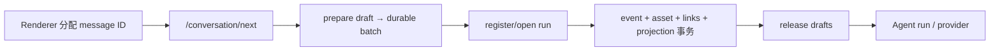

# Phase 4 实施 runbook：用户图片草稿、提交确认与历史交互

> **状态**：已归档。P4.0-P4.10 已于 2026-07-23 完成。本文保留为 [`18-multimodal-context-lifecycle-proposal.md`](./18-multimodal-context-lifecycle-proposal.md) Phase 4 的实施与验收证据；Phase 1-3 的 durable、能力与 provider 链分别归档于 [`19`](./19-multimodal-phase-1-implementation-runbook.md)、[`20`](./20-multimodal-phase-2-implementation-runbook.md)、[`21`](./21-multimodal-phase-3-implementation-runbook.md)。

> **目标**：把选择、粘贴、拖拽、预览、删除、图片-only、模型提示、编辑重发和历史恢复接到已经验收的 draft → durable event → context → materializer → provider 主链；不建立第二套上传、消息、资源或 converter 协议。

> **本文生命周期**：实施期间持续记录每批提交、测试、偏差和新风险；Phase 4 归档后仍保留为用户入口的验收证据，长期架构结论回写 18 号提案。

> **当前稳定合同**：[`src/features/conversation/attachments/README.md`](../../../../src/features/conversation/attachments/README.md)。本文中的 `WorkspaceImageIngressPort`、Workspace staging 等名称是 Phase 4 当时的历史实现；后续已迁移为 conversation attachment domain 和 AppData sidecar，不应据此恢复旧归属。

> **标题规则已演进**：本文关于“图片-only 使用文件名或通用标题”的内容只记录 Phase 4 当时的实现，不是当前合同。当前标题唯一 owner、durable ack 门禁和输入规则以 [`conversation-title/README.md`](../../../../apps/renderer/domains/conversation/features/conversation-title/README.md) 为准：标题只消费 `user_input_committed.raw_content`，不消费附件或文件名。

> **2026-08-12 后续修订**：本文表格与验收记录中的“单消息最多 10 张”只代表 Phase 4 当时的实施事实，不是
> live 产品限制。当前单条用户消息入口和四类已支持 LLM route 均为最多 100 张；单图/总字节、解码像素和上下文
> token 等其他边界保持独立且不变。现行入口合同以
> [`src/features/conversation/attachments/README.md`](../../../../src/features/conversation/attachments/README.md) 为准。

---

## 0. 结论先行

Phase 4 不是给现有文本框旁边补一个文件按钮。用户图片在发送前是 host 进程内草稿，发送后才是 durable asset；这两个身份不能同时塞进 Renderer 消息模型。全链路必须遵守以下结论：

1. 新增 conversation domain 内建的 `image-attachments` feature。草稿状态放 feature store，异步上传、移除、提交和清理放 orchestration，UI 组件只负责展示和触发动作；不把附件塞进全局 `conversationState`。
2. Renderer 通过当前 workspace 本地 HTTP API 用 `FormData` 上传 bytes。host 在受限内存中接收单图，复用 Phase 1 ingress 的真实解码与受管 staging；不把绝对路径、base64、data URL 或 `File` 放进 `/conversation/next`、store 或 durable JSON。
3. 给 ingress 增加 `stageImageBytes()` 是本阶段的正确边界。HTTP adapter 不先落一份临时文件再让 ingress 复制第二遍；`stageImage(sourcePath)` 继续保留给可信 host 调用者，两条入口共用同一个验证和写入函数。
4. 普通发送不再先插入一条伪 durable 的 optimistic `BaseMessage`。Renderer 先分配稳定 message ID，host 在 event/asset/link/projection 事务成功后、Agent 开始前发送 app-level `user_input_committed` 确认；Renderer 收到确认后才追加或替换消息、清草稿、生成标题和同步历史。
5. `user_input_committed` 是 host/Renderer 的提交确认，不是第二条 RuntimeEvent。它直接走当前 SSE sink，不进入 EventBus 和 `RunEventPersistence`，避免已经落库的 user event 被再次持久化。
6. ingress、draft 解析或数据库事务失败时，不写 user event、不改旧历史、不清 composer；模型/provider egress 在提交后失败时，保留 durable 用户消息和 failed run，继续遵守 Phase 2/3 错误合同。
7. edit/regenerate 在开放附件操作前，必须先把“inclusive truncate + 新 user event/asset links append”收成 EventStore 单事务。当前两个事务之间存在丢历史崩溃窗口，不能靠 Renderer rollback 或重载兜底。
8. 编辑附件的上行合同只表达有序选择：保留哪个既有 attachment ID、加入哪个新 draft ID。Renderer 不回传 durable asset 元数据；host 必须验证既有 attachment 确实属于 `truncateFromMessageId` 指向的 user event。
9. 草稿含图时，模型下拉按 catalog 的显式 `image_input` 禁用不兼容项并说明原因；当前模型不兼容时禁止发送，但不自动切模、不删图。host 的 model + route + budget gate 仍是最终真源。
10. durable 历史图片通过受鉴权的 asset content endpoint 懒加载。endpoint 只接受 asset ID，并复用 Phase 3 的 ledger、managed-root、hash、magic、尺寸和解码校验；Renderer 永远拿不到本地路径。
11. 图片-only 是一等输入：有至少一张 ready 图片即可发送、消息气泡可无文本、编辑后仍至少保留文本或图片。标题优先使用用户文本；无文本时使用首张安全文件名，仍为空才用本地化通用标题。
12. 当前 input extension 合同不接图片。所有内建 extension 显式声明 `acceptsAttachments: false`，激活时选择/粘贴/拖拽入口不可用；不得默默忽略 composer 中已有图片。
13. `tool_result_image` 继续全部关闭。Phase 4 只开放用户图片，不改 Phase 3 provider converter、materializer、摘要/checkpoint 或 child 继承规则。

---

## 1. 本轮边界

### 1.1 必须交付

| 能力 | Phase 4 交付 |
|---|---|
| 草稿入口 | 文件选择、剪贴板粘贴、拖拽；JPEG/PNG/WebP，最多 10 张 |
| host staging | multipart 单图上传、真实解码、稳定错误 code、安全草稿 DTO、显式 release |
| 草稿状态 | 有序 pending/ready/failed 状态、并发取消、object URL 生命周期、workspace 隔离 |
| 发送 | 文本+图、图片-only、ready/preflight/model gate、draft refs 上行 |
| 提交确认 | 事务成功后的 `user_input_committed`、按 immutable message ID append/replace |
| 历史展示 | durable attachment 列表、鉴权图片读取、加载/缺失/损坏/重试状态 |
| 模型交互 | 草稿含图时禁用不兼容模型、展示原因、阻止当前不兼容模型发送 |
| edit/regenerate | 原子 replace workflow；编辑保留/删除/新增/排序，regenerate 原样保留 |
| 生命周期 | 移除、清空、发送成功、组件重挂载、切 workspace 和进程重启的明确清理纪律 |
| 错误 UX | staging、commit、能力、资源、预算和 provider 错误使用稳定 code 与中英文文案 |
| 验收 | Renderer 模块链 + host API/事务 + 真实 Flow/provider mock 的业务测试 |

### 1.2 明确不做

- 不修改 durable attachment 或 asset ledger 的核心结构，不新增数据库 migration，除非实施中发现当前表无法表达已承诺语义并先更新本文。
- 不在 SQLite、RuntimeEvent、Pinia 持久化或日志中保存图片 bytes、base64、data URL、object URL 或绝对路径。
- 不允许 Renderer 直接读取 `assets.local_path`，不新增通用静态目录暴露受管图片。
- 不把草稿做成跨重启恢复，不新增 draft manifest、lease、数据库表或后台续传。
- 不做图片压缩、裁切、编辑、OCR、EXIF 展示、provider file cache 或远端图片 URL。
- 不自动把不兼容模型切成兼容模型，不对纯文本模型做 OCR 降级，不静默删除附件。
- 不开放 input extension/plugin 图片输入；扩展合同只补显式拒绝能力。
- 不开放 tool output 图片、`resource_read` 图片或 Slides/bash 截图链，这些属于 Phase 5/6。
- 不借本阶段清理 CustomSelect、EventStore、Renderer store 或 adapter 中全部 legacy 类型债；只收紧触达边界。

### 1.3 Phase 1-3 复用边界

| 已有能力 | Phase 4 的使用方式 | 禁止事项 |
|---|---|---|
| `ConversationDraftAttachmentRef` | `/conversation/next` 普通发送与 edit 新增图片的唯一草稿身份 | 不扩成路径、bytes 或 durable 元数据 |
| `ConversationAttachmentRef` | commit ack、history DTO 和 `BaseMessage` 的唯一 durable UI 身份 | 不在普通发送中由 Renderer 构造 |
| `WorkspaceImageIngressPort` | staging、batch preflight、commit、release | 不复制另一套图片验证器 |
| event/asset/link 事务 | 普通 append 继续复用；edit 扩成同事务 replace | 不先 truncate 再另开 append 事务 |
| model/route capability | Renderer 只消费 model catalog；host 继续最终校验 | 不按模型名或 provider 猜图片能力 |
| materializer/converter | durable commit 后沿原链进入 provider | UI 不读取或调用 provider converter |
| Phase 3 asset resolver | 抽取可复用的 verified image loader 供 preview feature 调用 | preview 不直接依赖 LLM 语义或返回 hash/path |

---

## 2. 已核实的真实链路

### 2.1 Renderer composer 与发送

当前入口位于 `AiAssistantInput.vue`：

- `canSend` 只检查 `inputText.trim().length > 0`，所以图片-only 当前必然失败。
- `handleSubmit()` 再次硬拒绝空文本，并在网络请求前调用 `clearComposerDraft()`。
- composer 草稿只有全局 `inputText` 与 reference chips，没有图片 staging 状态。
- 普通发送在 `chatFlowOrchestrator.sendChatMessage()` 中先调用 `assistantStore.addUserMessage()`，生成本地消息 ID并立即写 live projection、标题候选和历史列表，然后才请求 host。
- `assistantService.invokeAssistant()` 已携带稳定 `messageId`，但尚未把图片 draft refs写入 `new_events[0].attachments`。
- `UserMessageContent` 和 `BaseMessage` 只接受 durable refs，这是正确边界；把 draft ref 塞进去会破坏 Phase 1 的方向性合同。

因此不能在现有 `addUserMessage(...attachments)` 参数上直接传草稿。发送编排必须从“先投影、后请求”改为“先分配 ID、请求 host、收到 durable ack 后投影”。

### 2.2 host ingress 与提交时序

当前 workspace assembly 已创建唯一 `imageIngress`，并注入 `FlowIncomingEventPreparer`：

- `stageImage(sourcePath)`、`resolveDraftBatch()`、`commitDraftFile()` 和 `releaseDraft()` 已完成真实解码、受管 staging、内容寻址移动和进程内 draft registry。
- 单图限制 10 MiB，单消息最多 10 图、总计 20 MiB，只支持 JPEG/PNG/WebP。
- `FlowIncomingEventPreparer` 把 draft refs 解析成 RuntimeResourceRef 和 asset commit，并在 DB 事务成功后释放 draft。
- 当前 route assembly 没有向 Renderer 暴露 stage/release API；`stageImage(sourcePath)` 也不能接收剪贴板/拖拽得到的浏览器 `File` bytes。
- `knowledgeBaseRouter` 已有 busboy multipart 先例，但其“写临时文件后再交给 service”的实现不应照搬到图片 ingress；图片验证本就需要受限 Buffer，直接进入 `stageImageBytes()` 可以少一次磁盘复制和临时目录清理。

### 2.3 实时投影缺少提交确认

Flow 的关键顺序是：

当前 E/F 与 G 之间没有发给 Renderer 的 user commit ack：

- linnkit `SSEEvent` 不包含 `user_input`；`runtimeEventToSSEEvent()` 对 user input 返回 null。
- `conversationService` 没有 `onUserInput` 或 commit 回调。
- Renderer `projectUserInputEvent()` 只 append，不按同 ID upsert；若直接把 user event 当 replay SSE 发出，会与 optimistic message 重复。
- `RunEventPersistence` 订阅整个 EventBus。把已经手工持久化的 user event再 publish 到 EventBus，会排队重复写库。
- `stream_end.metadata.user_message_id` 虽已存在，但它发生在 Agent 完成后，既不含 durable attachments，也不能让长任务期间及时展示用户图片。

结论是新增 app-level `user_input_committed` wire event：只表示“该 user event 已 durable commit”，直接由 `FlowHostSessionService` 写入 SSE sink，不进入 RuntimeEvent/EventBus/persistence。Renderer 的 projection action 按 message ID执行 append 或 replace。

### 2.4 edit/regenerate 的真实一致性缺口

当前 rerun 流程是：

1. Renderer 立即 truncate live/window 投影并更新文本。
2. host 在 `FlowRunPreparationService.prepareForRun()` 中读取 truncate 前历史。
3. `FlowIncomingEventPreparer` 在内存里恢复目标 user event 的全部 attachments，或 commit 新 drafts。
4. `HistoryHandlerService.processEvents()` 单独执行 `truncateFromMessage()` 事务。
5. Flow 注册新 run，再用另一个事务 append 新 user event。

这有三项 Phase 4 阻塞问题：

- 第 4 步成功、第 5 步失败或进程崩溃时，旧消息及其后历史已永久删除。
- `findTruncatedUserAttachments()` 只按 ID 找 event，没有把目标类型、conversation、请求中的新 user event 和附件选择绑定成一个存储层不变量。
- 上行 `attachments` 只能表达 draft refs；若 UI 允许删除一张旧图、保留另一张并新增一张，现有“有新 draft 就不恢复旧附件”的二选一语义无法表达。

P4.0 必须新增 EventStore `replaceUserInputFromMessage()` 一类窄操作：验证目标是同 conversation 的 materialized user event，排除本次 destination run，在一个 SQLite 事务内删除目标及后续 facts、写入新 user event、asset/link、materialized message、UI projection 和 stats。Renderer 不再提前改投影，只在 commit ack 后收敛。

### 2.5 历史图片预览缺口

`UserMessage.vue` 当前只渲染文本和 quote，不读取 `message.attachments`。刷新后 history/window DTO 已带 durable refs，但 Renderer 只有 asset ID，没有安全内容 URL：

- 直接使用 `assets.local_path` 会泄露 workspace 绝对路径并绕过完整性校验。
- `` 无法可靠注入当前 `X-API-Token`。
- 现有 `/static/images/:filename` 是通用静态文件路由，不以 asset ledger 为真源，不能承载 conversation attachments。
- Phase 3 LLM resolver 已实现完整 ledger/managed-root/hash/magic/尺寸/解码复核，但其 port 接受完整 durable ref、返回 provider 物化 bytes，语义不应直接暴露给 UI。

正确方案是在 workspace assets domain 抽取内部 verified-image loader，让 `llm-image-resolution` 与新的 `image-preview` feature 共用校验事实。preview router 只收 asset ID，成功返回 bytes + 正确 Content-Type；失败返回稳定 JSON code，不返回路径、hash 或 provider 结构。Renderer 用 `apiFetch()` 取得 Blob 并创建短生命周期 object URL。

### 2.6 模型选择与 input extension

- `selectChatModels()` 已按 enabled/chat/ui visibility 过滤，但返回的 `SelectableChatModel` 丢掉了 `capabilities`。
- `ModelSelectOption` 没有 `disabled`/原因字段，尽管底层 `CustomSelect` 运行时已经跳过 `option.disabled`；当前 UI 合同无法稳定展示不兼容原因。
- `effectivePrimaryModelId` 可给出本次 UI 选中的实际模型，host 仍会在真实调用前重新解析和校验。
- input extension 只声明 `acceptsReferences`，submit payload 只有 text/references。默认把图片一起交给 extension 会形成无消费者的静默丢图。

Phase 4 需要保留 model capabilities，新增纯函数从“模型 + 草稿是否含图”派生 option availability；CustomSelect 展示 disabled reason。input extension 增加必填 `acceptsAttachments`，现有实现全部显式 false。

### 2.7 图片-only 的周边行为

除了发送按钮，还有四处必须同步：

- `handleSubmit()` 的空文本二次校验必须改成“文本或 ready 图片至少一个”。
- `UserMessage.vue` 的编辑保存条件必须允许空文本 + 至少一张附件。
- conversation title 当前只消费 `userText`；空文本会得到空 fallback 和无意义自动标题请求。
- `renderableConversationMessage`、虚拟列表高度估算和 user bubble 当前主要按文本计算，必须把附件计入“可渲染”与稳定高度，避免空气泡和滚动跳动。

---

## 3. 权威合同与所有权

### 3.1 目录归属

Renderer 新代码按 conversation 内建 feature 组织：

| 职责 | 建议归属 |
|---|---|
| draft、upload item、edit selection、wire DTO 类型 | `domains/conversation/features/image-attachments/definitions/` |
| 数量/总字节、可发送、模型可用性、附件选择计划纯规则 | `.../functions/` |
| stage/remove/clear/submit ack/workspace change/preview load | `.../orchestration/` |
| feature 运行时状态与同步 action | `.../store/` |
| composer strip、picker、drop overlay、message gallery、edit gallery | `.../ui/` |
| composer“+”菜单分组、动作值命名空间与排序规则 | `domains/conversation/features/input-action-menu/`；只发出能力意图，不持有 File 或 staging 副作用 |

host 代码继续归 workspace assets domain：

| 职责 | 归属 |
|---|---|
| bytes ingress | `workspace/assets/features/image-ingress` |
| ledger + 文件完整性共用读取 | `workspace/assets/shared/verified-image` 或同等窄命名 |
| UI preview port | `workspace/assets/features/image-preview` |
| multipart/HTTP 状态映射 | Electron route adapter |
| truncate + append 原子事实 | EventStore 持久化 adapter + Flow app orchestration |

不新增 `utils`、`helpers`、`manager` 或全局附件 store。跨 domain 只通过 schema、port 和 app-level Flow orchestration 协作。

### 3.2 草稿状态

每个 Renderer item 使用客户端稳定 `clientId` 保持插入顺序，状态只允许：

| 状态 | 含义 | 可发送 |
|---|---|---|
| `uploading` | 持有本次 `File`、object URL、AbortController，host 尚未签发 draft | 否 |
| `ready` | 持有 host draft ref 和安全展示元数据 | 是 |
| `failed` | 本文件 staging 失败，持有安全错误 code；不影响已有 ready items | 否，移除或重试后再发 |

store 只执行同步写操作；读取 File、创建/revoke object URL、HTTP 上传和 release 都属于 orchestration。顺序按用户添加时的 `clientId` 列表，不按并发上传完成顺序。

### 3.3 staging HTTP 合同

建议挂载在当前 conversation workspace router：

| API | 输入 | 成功输出 | 失败 |
|---|---|---|---|
| `POST /api/v1/conversation/attachments/images` | multipart，恰好一个 `file` | draft ref + mediaType/byteLength/width/height/sha256 | JSON `{ code }` + 400/413/415/422 |
| `DELETE /api/v1/conversation/attachments/images/:draftId` | path 中只有 draft ID | 204 | 未找到仍 204，release 保持幂等 |
| `GET /api/v1/conversation/assets/images/:assetId/content` | path 中只有 asset ID | verified bytes + Content-Type | JSON `{ code }` + 404/422 |

约束：

- 三条 API 都经过现有 origin/token middleware；不另开 IPC 或无鉴权静态服务。
- multipart 只允许一个文件、显式 10 MiB 上限；字段/文件数超限立即终止解析。
- 不信任 multipart MIME、扩展名、尺寸或文件名；所有事实来自 ingress decode。
- draft response 的 sha256 只用于 Renderer 展示态去重/诊断，不进入消息上行；是否启用重复内容提示由 UI 决定，不改变 host 允许同图多次附加的合同。
- preview 响应不得包含 `Content-Disposition` 本地路径或 ledger JSON；文件名来自 message durable ref 展示，不从 endpoint 查询。

### 3.4 上行附件选择合同

普通发送仍只使用 `new_events[].attachments: ConversationDraftAttachmentRef[]`。

edit/regenerate 另增加 user event 级的窄 `attachment_selection`：

| mode | 语义 |
|---|---|
| `preserve` | 原样保留目标 user event 的 durable attachments；regenerate 固定使用此模式 |
| `replace` | 按 items 顺序重建附件；item 只能是既有 `attachmentId` 或新的 draft ref |

host 必须在 prepare 阶段验证：

1. 只有 `truncateReason=edit/regenerate` 才能出现 selection。
2. `truncateFromMessageId` 必须指向同 conversation 的 user event。
3. 每个 existing attachment ID 只能引用该目标 event 当前拥有的附件，不允许跨消息或跨会话借用。
4. `replace` 中 existing/draft 合并后统一执行张数和总字节 preflight，并保持声明顺序。
5. regenerate 只允许 `preserve`；附件改变属于 edit。
6. 新 user event ID 必须等于被替换 message ID，保证 UI/window/event 身份稳定；EventStore 在同事务中先删旧事实再写新事实。

这份 selection 是上行 mutation command，不是第二份 durable message aggregate。commit 后仍只有 `UserMessageContent`/`BaseMessage` 中的 `ConversationAttachmentRef[]`。

### 3.5 `user_input_committed` 合同

commit ack 至少包含：

| 字段 | 用途 |
|---|---|
| `id/type/timestamp/conversation_id/turn_id` | SSE 基础归属与幂等身份 |
| `operation: append | replace` | Renderer 选择追加或截断替换投影 |
| `replaced_from_message_id?` | replace 的目标绑定，必须等于 message ID |
| `content/raw_content/metadata` | 与历史回放相同的用户展示事实 |
| `attachments?` | host commit 后的 ordered durable refs |

发射顺序固定为：DB transaction commit → release committed drafts → sink ack → Agent run。ack sink 异常不能回滚已提交 DB；连接丢失时刷新/窗口历史仍以 durable projection 恢复。

Renderer 收到 ack 后：

- `append`：若同 ID 已存在则验证/替换，不重复 append；正常路径创建新 user message。
- `replace`：live/window 都从目标之后截断，并用 ack 的完整消息本体替换目标。
- 清除与本次 submission snapshot 对应的本地草稿和 object URL，但不再 DELETE host draft，因为 commit 已释放。
- 触发 title/history timestamp/scroll 等“已提交”副作用。
- commit 前的错误不调用以上动作，composer 保持不变。

### 3.6 preview 合同

preview 是展示能力，不是第二个 materializer：

- 共用 ledger 与受管文件完整性读取，但输出只允许 `{ mediaType, bytes }`。
- 读取失败不删除消息 attachment，也不把附件当成空白；UI 显示文件名/尺寸和稳定错误状态。
- component mount 时 lazy fetch，unmount/asset change 时 abort pending request 并 revoke object URL；不把 object URL 存入 durable store。
- workspace 切换时统一清理所有 preview runtime；不得让旧 token/asset 缓存跨 workspace。
- 初版不做永久 blob cache。虚拟列表 remount 时允许重新读取本地文件，优先保证内存可回收和边界简单。

### 3.7 composer 生命周期

| 事件 | pending upload | ready draft | object URL/File |
|---|---|---|---|
| 用户移除一项 | abort；若晚到 draft 响应则立即 release | DELETE release | revoke/释放 |
| 用户清空草稿 | 全部 abort | 并行 best-effort release，单项失败不恢复 UI | 全部 revoke/释放 |
| commit ack | 理论上已无 pending | 只清本地，host 已 commit/release | 全部 revoke/释放 |
| commit 前失败 | 保留可重试 | 保留 | 保留 |
| composer 组件临时 unmount | 保留 feature 任务 | 保留同 workspace 草稿 | 保留；remount 继续展示 |
| 切 workspace | abort；忽略晚到响应 | 在旧 scope 尚可用时请求 release，然后清本地 | 全部 revoke/释放 |
| app/host 崩溃 | 无恢复 | 启动时 ingress 清 staging | Renderer runtime 自然销毁 |

composer 组件不是草稿 owner；侧栏折叠、视图切换造成的临时 unmount 不得清草稿。清空流程也不能因为某个 DELETE 失败而把 item 塞回 store；draft 本来就不跨进程，host 启动清理是最终回收边界。这里是明确生命周期，不是静默业务 fallback。

普通 composer 与现有文本输入保持同一所有权：它属于当前 workspace，不绑定某个 conversation，同 workspace 切换会话或组件 remount 都保留；edit session 则绑定具体 user message，切 conversation/workspace 必须清理。提交中的 edit 先标记延迟清理，等 ACK 按 committed 路径回收，或请求失败后再 release，禁止 scope 切换与 host commit 竞争同一个 draft。app close 不新增退出阶段 HTTP 清理：Renderer runtime 随进程释放，host 下一次创建 ingress 时在开放入口前清空 staging，避免把不可靠的关机网络请求误当一致性保证。

### 3.8 模型与发送 preflight

Renderer 只做即时 UX gate，host 仍做最终判定：

1. 所有 attachment item 都是 ready，且至少一张图或非空文本存在。
2. 当前 effective model 显式包含 `chat` 和 `image_input`；未知/加载中时含图发送不可用。
3. active input extension 为 null，或未来明确声明 `acceptsAttachments=true`；本阶段全部 extension 为 false。
4. 本地计数/总字节只用于即时提示；host `resolveDraftBatch()` 是安全真源。
5. 不兼容 model option 保留可见但 disabled，原因显示“当前模型不支持图片”；不从列表删除，避免用户误以为模型消失。
6. 若当前选中模型变成不兼容，附件和选择都保留，发送按钮 disabled；用户必须显式切换或移除图片。

---

## 4. 用户交互完成语义

### 4.1 选择、粘贴与拖拽

- composer 通过“+”统一能力菜单中的“添加附件 → 图片”打开原生 file picker，`multiple` + JPEG/PNG/WebP accept；图片项带图片图标，菜单按“添加附件 / Agent”分组，dev-only 基准测试入口固定在末尾。编辑消息与 dev fixture 仍可复用 picker 自带的图标触发器。
- paste 只消费 clipboard 中的图片 File；存在普通文本时继续交给 Tiptap，不阻断文本粘贴。
- drop 只在 composer 区域接收图片 File，drag overlay 不覆盖模型选择和发送按钮；混合文件中非图片逐项报错。
- 每次添加按用户文件顺序先创建 item，再并发 staging；完成顺序不改变视觉顺序。
- 允许相同内容重复附加，预算按出现次数计算；不基于 name/size/lastModified 猜重复内容。
- 单项失败只标记该 item，不清除已有草稿；达到数量上限时拒绝新增部分并给出明确提示。

### 4.2 预览与移除

- composer 使用原始 File 的 object URL，host staging 成功后仍保持同一预览，避免闪烁。
- 每项显示缩略图、文件名、上传/失败状态和移除图标；失败项提供重试，不用文本按钮替代熟悉图标。
- durable message 使用 attachment gallery；图片-only 消息不渲染空文本容器。
- 图片加载失败显示稳定占位、文件名和重试操作，不折叠整条用户消息。

### 4.3 发送与失败

- 点击发送后冻结本次 submission snapshot，禁止同一草稿重复提交；composer 可显示短暂提交中状态。
- host ack 前不清文本、references 或图片，不写 durable-looking user bubble。
- ack 后一次性清除与 snapshot 对应的 composer 内容；如果用户在请求期间不应可编辑，沿用当前 loading/streaming 禁用纪律。
- ingress/事务失败：composer 原样保留，错误指向具体图片或提交阶段。
- model/route/budget/provider 失败发生在 durable commit 后：用户消息和图片留在历史，failed run 可见，用户可换模型后 regenerate。

错误展示按事实归属分层，不能同一错误同时落两个表面：

| 错误阶段 | 展示 owner | 状态纪律 |
|---|---|---|
| 单文件 staging | 对应 composer/edit item inline | 只把该项标成 failed，可移除或 retry；其他 item不变 |
| 批次数量/总字节、extension、当前模型 preflight | composer/edit 顶层提示 | 不创建部分批次，不清任何已有草稿 |
| durable preview | 对应 history gallery item inline | 保留消息身份、文本和 attachment占位，可 retry |
| draft commit/事务 | conversation `ErrorBanner` | ACK 前失败，composer/edit session和旧历史原样保留 |
| route/budget/materializer/provider | conversation `ErrorBanner` | durable ACK 后失败，用户消息和图片继续留在历史 |

staging、commit、preview 共用 `conversation.image.*` 稳定码到中英文 message key 的映射；surface 由调用链 owner决定。禁止把单项 preview/staging错误再提升成全局执行错误，也禁止把 commit/provider错误塞回某张图片 item。

### 4.4 edit/regenerate

- 进入 edit 时创建独立 edit session：现有 durable attachments 显示为 existing items，新加入图片走同一个 staging orchestration。
- 删除 existing item 只改变 selection，不立即删 asset/link；真正变化随原子 replace 事务提交。
- 取消 edit 时 release 该 edit session 新增的 drafts，原消息和 composer 草稿不受影响。
- 保存 edit 时至少保留非空文本或一个附件；无附件变化可发送 `preserve`，发生增删/排序则发送 `replace`。
- commit ack 前不截断 live/window，不改目标消息；ack 后同时收敛两个投影槽。
- regenerate 不进入 edit session，始终 `preserve` 文本、quote 和全部 attachments。

---

## 5. 分批实施计划

### P4.0 · 原子 replace workflow 与目标绑定

**目的**：先关闭 Phase 1 风险 15/21，再允许用户修改附件。

**交付物**：

- EventStore/port 新增窄的 user-input replace 操作；验证 target user event、conversation、destination run 和稳定 message ID。
- 单事务执行 affected facts/link/projection 删除、新 event/asset/link/materialized/UI projection/stats 写入。
- Flow preparation 拆成“无副作用准备并推导预期 post-op request → register/open run → persist append/replace → 读取真实 post-op history并重建执行 request”，不再在 prepare 中提前 truncate。RunHandle 的 immutable request snapshot使用同一批输入事实推导，runner只消费事务后重建结果。
- 事务注入失败测试证明旧历史完整、新 event/link 均不存在；成功测试证明 retained asset ID 和顺序不变。

**门禁**：truncate 成功后 append 失败的崩溃窗口消失；错误 target/type/conversation 不删除任何 facts；destination run 不被 truncate 删除。

### P4.1 · app wire 合同与错误码

**交付物**：

- schemas 新增 stage response、attachment selection、`user_input_committed` 与 preview/staging error code。
- normal send draft-only、edit selection、durable ack 三个方向使用 strict schema。
- 扩展 Flow SSE sink 与 Renderer stream parser 的 app-level event union，不把 ack 混入 linnkit RuntimeEvent。
- 中英文错误文案覆盖 staging、draft commit 和 preview；沿用 Phase 2/3 model/resource/budget/provider code。

**门禁**：draft ID 不能进入 ack/history，durable ref 不能进入普通 send，existing selection 只有 attachment ID；未知字段 fail closed。

### P4.2 · bytes staging/release API

**交付物**：

- ingress 增加 `stageImageBytes()`，与 source-path 入口共用 draft ID、文件名、inspection 和 staging write。
- 新增 conversation attachment router：busboy 单文件限额、stage、release、稳定 HTTP 映射。
- route assembly 将同一个 workspace-scoped `imageIngress` 同时注入 Flow preparer 和 attachment router。
- 覆盖上传取消、超限、伪 MIME、损坏图片、非法文件名、release 幂等。

**门禁**：API 响应/日志无 bytes、绝对路径或 data URL；失败不创建可解析 draft；旧 `stageImage(sourcePath)` 测试保持通过。

### P4.3 · durable preview endpoint

**交付物**：

- 从 Phase 3 resolver 抽取 workspace 内部 verified image loader，LLM resolver 行为不变。
- `image-preview` feature 只按 asset ID读取已验证 bytes/mediaType。
- 鉴权 GET endpoint 映射 unavailable/integrity code，不接受 path/URI/hash query。
- 安全 header、错误响应和跨 workspace 隔离测试。

**门禁**：路径逃逸、symlink root、缺文件、长度/hash/magic/尺寸/解码不一致全部拒绝；成功响应不泄露 ledger/path/hash。

### P4.4 · Renderer 草稿 feature 与三类入口

**交付物**：

- 建立 definitions/functions/orchestration/store/ui 分层。
- file picker、paste、drop 共用 `stageFiles()`；有序并发、单项 retry、pending remove、clear/workspace switch 清理完整。
- composer preview strip 与 object URL 生命周期。
- input extension 显式 `acceptsAttachments=false`，激活时阻止入口并解释原因。

**门禁**：移除上传中 item 后晚到响应会 release；任一失败不影响已有 ready item；store action 无 HTTP/FileReader/object URL 副作用。

### P4.5 · 模型下拉与图片-only preflight

**交付物**：

- `SelectableChatModel` 保留 capabilities，新增纯函数派生 availability。
- `ModelSelectOption`/CustomSelect 支持 disabled reason，父子 reasoning options 遵守同一禁用状态。
- `canSend` 和 submit validator 支持图片-only、pending/failed/model/extension 状态。
- 无兼容模型时保留草稿并提供明确设置引导；不自动切模。

**门禁**：能力只看 catalog `image_input`；模型名、provider、adapter 字符串不参与判断；host gate 测试继续作为最终防线。

### P4.6 · durable commit ack 与普通发送

**交付物**：

- Flow 在 append transaction + draft release 后发 `user_input_committed`，再启动 Agent。
- conversationService/assistantService 支持 ack 回调和统一路由。
- chat orchestration 在请求前只分配 message ID，不插 optimistic BaseMessage；ack 后投影、标题、历史同步、滚动和清草稿。
- `assistantService` 将 submission snapshot 的 draft refs 写入 `new_events[0].attachments`。
- 图片-only 标题与历史 preview 采用明确 fallback。

**门禁**：commit 前错误不清草稿、不写消息；ack 消息只有 durable refs；长 Agent run 中用户图片立即可见；刷新后与 live 内容一致。

### P4.7 · 历史消息 gallery 与虚拟列表

**交付物**：

- UserMessage attachment gallery、lazy authenticated Blob preview、loading/error/retry 状态。
- object URL/AbortController 在 unmount、asset change、workspace change 时释放。
- renderable predicate 与高度 estimator 识别图片-only，使用稳定 aspect ratio/尺寸约束减少滚动跳动。
- live projection、tail/window、refresh/rebuild 使用同一 durable ref renderer。

**门禁**：图片-only 无空气泡；缺失/损坏图片仍保留消息身份和文本；虚拟滚动反复 mount/unmount 无 object URL 泄漏。

### P4.8 · edit/regenerate 附件交互

**交付物**：

- edit session 支持 existing remove/reorder、新 draft stage/remove、取消清理。
- 编辑命令携带窄 attachment selection，`UserMessageContent` 继续只承载 durable 聚合。
- host 从目标 event 验证/恢复 existing refs，与 drafts 合并后统一 preflight，再交 P4.0 原子 replace。
- ack 后同时替换 live/window；regenerate 固定 preserve。

**门禁**：保留附件复用同 asset/attachment identity，不复制 bytes；删除只删除新 event link；跨消息 existing ID、空文本+空附件、regenerate replace 全部拒绝且旧历史不变。

### P4.9 · 错误、生命周期与入口完整性

**交付物**：

- staging/commit/preview code 的中英文映射与 ErrorBanner/inline item 分工。
- workspace switch、conversation switch、composer 临时 unmount/remount、app close的生命周期测试；临时 unmount 必须保留同 scope 草稿。
- selection/paste/drop 三入口共享 model/extension/count gate，避免只保护文件选择器。
- provider egress 失败保留 durable message；换兼容模型 regenerate 复用图片。

**门禁**：没有入口能绕过 host ingress；没有错误路径清除未提交草稿；没有失败路径把图降成纯文本继续执行。

### P4.10 · 全链路验收、文档回写与归档

**交付物**：

- 真实 Renderer orchestration fixture 打通 File → multipart draft → `/next` → atomic commit ack → provider mock body → history reload/preview。
- 覆盖 text+image、图片-only、有序多图、edit preserve/replace、regenerate、刷新、资源损坏和模型不兼容。
- 桌面/窄窗口 Playwright 验证选择、paste/drop 状态、gallery、错误占位和文本不溢出；不写样式 snapshot。
- 回写 18/21/22 和 framework README，记录实际提交、测试与剩余风险。

**门禁**：Phase 1-3 回归通过；production `tool_result_image: true` 仍为零；durable/audit/debug/log 无 bytes/path/object URL/draft ID。

---

## 6. 业务测试矩阵

| 场景 | 必须证明 |
|---|---|
| 纯文本普通发送 | 不创建 FormData、不访问 ingress/preview；现有行为和 provider body不变 |
| 选择单图 | host 真实解码后返回 draft，UI ready，发送后 ack 为 durable ref |
| paste/drop | 与 picker 共用同一 staging/preflight；非图片不进入 request |
| 有序多图并发 | UI、draft request、durable event、history、provider 顺序一致，不按上传完成顺序重排 |
| 图片-only | 可发送、非零预算、消息/标题/历史/虚拟列表可见，provider 收到图片 |
| pending/failed item | 发送禁用；重试只影响该 item，已有 ready item不丢 |
| 移除 pending | abort；晚到 draft 被 release，不回插 UI |
| 清空/切 workspace | ready drafts release、object URL revoke、旧 scope 状态不泄漏 |
| commit 前 ingress 失败 | 无 user event/asset link/run 执行，composer 原样保留 |
| DB replace 回滚 | 旧 events/runs/messages/UI projection/links/stats 全部不变 |
| commit ack | 严格位于 DB/release 后、Agent 前；Renderer 按同 ID只出现一条 user message |
| provider egress 失败 | durable 用户图片和 failed run保留，草稿已清，可显式 regenerate |
| 当前模型不兼容 | 三种入口可 staging，但发送禁用并说明原因；不自动切模、不删图 |
| 发送时模型配置变化 | host gate 用当前 catalog/route 再验，失败后 durable 消息保留 |
| history refresh/window | live/tail/window/rebuild attachment identity、顺序和 gallery 一致 |
| preview missing/corrupt | endpoint fail closed，UI 有稳定占位和重试，不隐藏消息 |
| edit preserve | 文本变化，附件 identity/order 与旧 event一致，单事务 replace |
| edit replace | existing + new draft 有序合并，删除项不再链接，新图只登记一次 |
| edit cancel | 原消息不变，新 drafts release，composer 草稿不受影响 |
| regenerate | 文本、quote、attachments 全保留，reason=`regenerate`，不进入 replace 分支 |
| 跨消息 existing ID | host 拒绝，旧历史不变，无 asset/link 写入 |
| input extension active | picker/paste/drop 均明确不可用，extension payload 不吞附件 |
| 隐私否定 | request JSON/durable/store/log/audit 无 File/bytes/base64/path/object URL；provider body 规则仍由 Phase 3 保证 |

测试优先使用业务函数、feature orchestration、真实 SQLite/router 和 Flow/provider mock 的模块链。组件测试只覆盖用户动作与状态，不锁 padding、颜色或整页 snapshot；Playwright 用于最终可见性、布局、拖拽和图片非空像素检查。

---

## 7. 验收与静态审计

每批运行定向测试，P4.10 至少汇总：

1. schemas draft/durable/selection/ack strict contracts。
2. workspace ingress bytes/source 两入口、verified preview、SQLite append/replace/link/projection rollback。
3. Flow normal/edit/regenerate commit ack 与 Phase 3 provider mock。
4. Renderer attachment store/orchestration、model selector、conversation stream projection、history window 和 title。
5. picker/paste/drop/edit/preview 的 Playwright 桌面与窄窗口关键流程。
6. linnkit 双 tsconfig、根级 TypeScript baseline、agent boundary 和 pre-commit 门禁。

静态否定扫描必须证明：

- `ConversationDraftAttachmentRef` 不出现在 BaseMessage、history DTO、RuntimeEvent、SQLite payload、ack durable message或 provider body。
- `File`、Blob、object URL 不进入 Pinia 持久化、conversation state、request JSON、日志或 audit。
- Renderer 不出现 `assets.local_path`、workspace managed path 或直接 `file://` 图片读取。
- `image_input` UI gate 不按 model name/provider/adapter 推断。
- production `tool_result_image: true` 仍为零。
- 新增 TypeScript 生产代码无 `any`、双重断言或以断言绕过 schema。
- 不存在 attachment 失败后删除图片继续调用模型的 fallback。

### 7.1 P4.10 归档证据

- `f2459f3a7` 扩展真实 Flow fixture：production Renderer draft controller/FormData adapter 经真实 Express router、workspace ingress、Flow 原子事务、durable ACK、Context Manager/materializer 和 provider mock 后，再由 production preview adapter 经真实 preview router 读回；有序两图、图片-only、刷新恢复、provider 脱敏和受管文件篡改均有同一条链路证据。
- `a7378294b`、`912e59ac9` 增加 dev-only 图片交互 fixture，并用应用内 Browser 在桌面 `1280×900` 与窄窗口 `390×844` 验证 picker、系统剪贴板 paste、ready/failed 草稿、有序多图、durable gallery、missing/corrupt 占位及图片预览。图片自然尺寸与渲染尺寸非零，窄窗口无横向溢出、文字或控件重叠。当前 Browser runtime 不提供携带本地文件的原生 drop 注入；drop 的同源选择、非图片送 host 拒绝与事件消费纪律由业务测试锁定，fixture 保留真实 DOM drop handler供人工拖放复核，没有为自动化增加伪产品入口。
- P4 验收修订再次使用同一 fixture 复核：草稿缩略图固定 `64×64`、durable gallery 缩略图固定 `200×200`，图片使用 `cover` 填满正方形画布；单图草稿在桌面和 `390×844` 窄窗口均满足 `scrollWidth === clientWidth`，页面无横向溢出；草稿区顶部与左侧 gutter 统一为 `12px`；删除按钮默认隐藏且不接收指针事件，hover 后使用与图片工具控件一致的半透明黑底，草稿图片区不使用原生 `title` hover 提示；专用图片预览的遮罩、图片点击隔离与 Escape 关闭合同通过组件测试和浏览器交互验证。
- Phase 5 人工验收发现，资源库侧栏曾把受管图片账本中的 `local_path` 直接交给 `media://`；该目录不属于通用媒体协议白名单，加载失败后只显示图片 `alt` 文件名。修订后，资源库受管图片与会话图片共用 host verified-image 出口，按 `assetId` 获取 Blob 并维护短生命周期 Object URL；只有没有 durable identity 的历史生成图片继续使用 `media://`。路由归属同步从 conversation 收口为 workspace image preview，并保留旧 conversation endpoint 兼容现有会话 UI。
- `a513fe413` 将 composer 外置图片按钮收口进 `200px` 宽的统一“+”菜单：附件与 Agent 使用独立分组，图片动作带图标并通过窄事件调用图片 feature 的程序化 picker，dev-only 基准测试子菜单固定排在末尾。菜单展示数组不新增结构测试，避免锁定文案和排列这类持续调整的 UI 细节；Renderer production build、strict style audit、既有图片入口业务测试及 TypeScript baseline `289/289` 作为门禁。完整 composer 依赖 Electron host，现有 Browser 图片 fixture 不挂载输入底栏，因此没有为本次菜单视觉验收新增伪产品入口；运行中的 Electron 由 Vite HMR 提供人工视觉复核。
- `c7c7819f3` 完成 composer 菜单触达的共享 CustomSelect 结构收口：Portal 与非 Portal 改为同一份 options 模板，删除两套分组、分隔线、行内数字输入和 ARIA 渲染分支；Portal 定位与菜单持有 DOM 焦点时的导航分别下沉到内部 composable。编辑器持有焦点的 `useKeyboardNavigation` 继续保持独立，SlashMenu/引用建议的外部按键委托合同不变。组件 README 记录了两类键盘所有权和维护边界；本次不新增锁 DOM 结构或样式的单测，以 production build、strict style audit、调用方扫描及 TypeScript baseline `289/289` 为门禁。
- `a7922a5b7` 修复 CustomSelect 焦点导航引入的子菜单回归：打开主菜单只把焦点放到当前项，不再把 focus 复用为 hover 并隐式展开子菜单；子菜单仅由真实 hover 或右方向键显式打开，左方向键仍返回父项。子菜单顶部改用稳定布局偏移，不再读取主菜单 `translateY` 进入动画中的视觉坐标；模型选择由 conversation option 明确标记当前有效 reasoning effort，子菜单渲染选中态并在键盘进入时优先聚焦。新增一条行为测试只锁“打开不展开、右键展开并聚焦已选子项”，不锁 DOM 快照和视觉数值。
- Phase 1-4 汇总回归为 52 个测试文件 297 项；linnkit `tsconfig.json`/`tsconfig.src.json`、Renderer production build、strict style audit、agent boundary 与根级 TypeScript baseline `289/289` 全部通过。
- 静态否定扫描确认 production `tool_result_image: true` 为零；draft ref只在 Renderer 上行与 Flow ingress出现，object URL只在非持久草稿/preview runtime出现，图片 bytes/base64只在 Phase 3 resolved input/provider converter出现；durable/audit/debug/log 无载荷、绝对路径或 draft ID。图片 UX gate仍只读取显式 catalog `image_input`，没有按模型名、provider 或 adapter 推断。

---

## 8. 风险台账

1. **已关闭，P4.0：edit/regenerate truncate 与 append 原先不是原子操作。** EventStore 现通过窄 `replaceUserInputFromMessage()` 在一个事务内验证目标、保护 destination run并替换 facts/link/projection/stats；注入 asset事实冲突会完整回滚旧历史。
2. **已关闭，P4.0/P4.8-A：truncate 目标与 existing attachment 必须完成选择级绑定。** P4.0 强制目标为同 conversation 的 materialized user event并保持稳定 message ID；P4.8-A 要求 edit/regenerate 显式携带 selection，host 在提交任何 draft 前验证每个 existing attachment ID只来自该目标事实，并拒绝重复身份。
3. **已关闭，P4.6：没有 commit ack 时 draft 与 durable 消息存在身份真空。** host 在 event/asset/link/projection 事务和 draft release 成功后、Agent 启动前发 app-level ack；普通发送不再插 optimistic message，Renderer 只在同 conversation/同 message ID 的 append ack 后投影、清 composer并回收本地 draft runtime。
4. **已关闭，P4.6：若通过 EventBus 发已落库 user event，会被 RunEventPersistence 重复持久化。** ack 直接走 host SSE sink，使用独立 wire type，并有回调测试证明不进入统一 RuntimeEvent 路由；`FlowHostSessionService` 是唯一发射点。
5. **已关闭，P4.3/P4.7：历史预览若暴露本地路径或通用静态目录，会绕过 Phase 3 resolver 安全边界。** host preview endpoint 与 Phase 3 resolver 共用 verified-image loader；Renderer 只按编码后的 asset ID 走鉴权 API，响应仅转为短生命周期 Blob/object URL，不接触 path、hash、ledger 或 provider 结构。
6. **已关闭，P4.4：移除正在上传的 item 与响应晚到存在竞态。** feature controller 以稳定 clientId + attempt AbortController 绑定 runtime；remove/clear 先失效 runtime，晚到 draft 只执行 release，不再回插 store。
7. **已关闭，P4.4/P4.7：object URL 生命周期容易随 workspace 切换和虚拟列表泄漏。** composer URL 由长生命周期 orchestration 持有，同 scope 临时 unmount保留；历史 gallery controller 则随虚拟 item mount/unmount 建立和回收，attachment replacement、workspace `scopeWillChange` 与 unmount 均先 abort 再 revoke。晚到响应以 runtime identity 丢弃，不再创建 URL。
8. **已关闭，P4.5：CustomSelect 运行时支持 disabled，但 conversation option 类型和原因展示缺失。** `SelectableChatModel` 现保留 catalog capabilities，纯函数只按显式 `image_input` 派生 availability；CustomSelect 的窄 `disabledReason` 合同可见展示原因，reasoning child 继承父模型状态。
9. **已关闭，P4.6：现有 `invokeAssistant()` 吞掉错误，不能驱动草稿清理。** 清理现只由 commit ack 驱动，不以函数 resolve/reject 或 stream_end 猜提交结果；`sendChatMessage()` 返回值改为是否实际收到并处理 durable ack，commit 后 provider 失败仍保留已提交消息。
10. **已关闭，P4.8：`UserMessageContent` 只有 durable refs，而 edit 新图只有 draft refs。** 上行 `attachment_selection` 已接通 Renderer → schema → host，durable 聚合保持不变；独立非持久 edit-session store/controller 管理新 draft runtime，取消时 release，commit ack 后只回收本地 URL，失败时保留会话供重试。
11. **中低：本地 API 响应在 stage 成功后丢失会留下当前进程 orphan draft。** v1 不引入 lease/idempotency manifest；正常 abort 在签发前无 draft，极小的响应丢失窗口由进程重启清理。若实测频繁出现，再单独设计上传 request identity。
12. **中低：相同图片多次添加会重复计入 provider 输入和预算。** 当前允许用户显式重复，content store仍去重 bytes；不按文件名/size 猜重复。若产品要阻止，使用 host sha 明确提示而非静默合并。
13. **中低：图片-only 标题缺少文本语义。** 首张安全文件名优先，通用本地化标题兜底；不为标题生成提前物化图片或调用额外视觉模型。
14. **中低：run/agent 两级 error 可能双发。** 这是 21 号风险 22 的既有协议债，本阶段错误 UI需按表面状态保持幂等；不只改 attachment preflight 一侧。
15. **低：Chat Completions `image_url.url` 最终校验偏松。** 继承 21 号风险 23；Phase 4 未修改 converter，P4.10 静态回归已确认 Renderer bytes 只能经既有 materializer 进入 provider。
16. **低：host `AIEngineImpl` 保留 legacy 宽联合入参。** 继承 21 号风险 25；不阻塞用户入口，但 Phase 4 不新增调用旁路。
17. **信息：input extension 当前没有附件消费合同。** 本阶段显式 false 并阻止入口；未来插件图片输入必须单独设计 capability/ownership，不把 File 直接加到现有 payload。
18. **已关闭，P4.1：Flow SSE sink 的 `any` 曾掩盖 app-level event 和 linnkit SSE 的边界。** sink 现使用显式 `ConversationRealtimeEvent` 联合；收紧后暴露并修正了一处摘要集成夹具把百分比误写成数值的旧合同漂移，未扩大 SSE schema。
19. **已关闭，P4.2：Flow preparer 曾依赖包含 staging 能力的完整 `WorkspaceImageIngressPort`。** Flow 实际只消费已签发草稿，现改为 `resolveDraftBatch`/`commitDraftFile`/`releaseDraft` 窄 port；HTTP ingress 与 Flow 仍注入同一个 workspace 实例，但上传入口不再泄漏进提交编排合同。
20. **已关闭，P4 验收修订：图片全屏预览曾有四套实现。** 现已抽取 shared 专用 `ImagePreviewModal`，conversation 生成图、editor 图片块、侧栏和 conversation 附件全部复用同一 Teleport、遮罩、Escape 和图片约束合同；附件缩略图统一为固定正方形画布上的 `cover`，草稿和编辑态改为换行布局，不再产生横向滚动。
21. **低：Renderer app 的部分 Electron gateway 仍在模块求值期 eager 实例化，并保留 legacy `any` 边界。** P4.10 浏览器 fixture 因 `workspaceGateway` 在 feature import前要求 `window.electronAPI` 而暴露此债；dev fixture 现通过 app-level bootstrap 先安装窄 host合同，生产链未改。若后续继续扩展浏览器 fixture或 web renderer，应单独把 gateway改为显式装配/惰性获取并收紧类型，不在图片归档中顺手重构 workspace IPC。
22. **已关闭，P4 验收修订：图片工具 Renderer 曾为复用展示元数据类型而导入完整 linnkit runtime-kernel。** `ToolResultImageMedia` 本是后端工具 UI 元数据，却被 `TextToImageCard` 和 `ImageRenderer` 当作前端类型入口，违反 browser-safe 边界。现由 conversation 图片工具定义最小 `ToolImageMedia` DTO，`TextToImageCard` 在序列化边界完成结构校验后再传给纯展示组件，Renderer 不再反向依赖 Agent runtime。

---

## 9. Phase 5 交接条件

Phase 5 开放工具图片前，Phase 4 必须归档证明：

- 用户图片三入口、图片-only、普通发送、edit/regenerate、刷新和 preview 全部稳定。
- draft 只存在于 Renderer runtime/host staging，durable ref只存在于 event/history/context。
- atomic replace 已关闭 Phase 1 风险 15/21，附件 link 删除与共享 asset bytes 生命周期正确。
- user commit ack 不进入 RuntimeEvent/EventBus/persistence，实时和历史投影按同 ID一致。
- model selector 只是 UX gate，host model/route/budget/materializer gate 仍完整。
- preview feature 不暴露路径，不复用 provider body，不改变 Phase 3 resolver语义。
- `tool_result_image` 仍全部关闭；Phase 5 必须从工具结果的独立 requirement/placement 开始，不能复用 composer draft 命令。

---

## 10. 实施日志

| 批次 | 状态 | 提交 | 实际结果 | 偏差/风险 |
|---|---|---|---|---|
| P4.0 | 完成 | 本批提交 | 新增原子 user-input replace port/SQLite事务；Flow preparation移除写副作用，destination run注册后统一 append/replace，事务后重读历史构建 runner request；补齐 SQLite成功/回滚与真实 Flow edit/regenerate合同测试 | RunSupervisor注册要求 immutable request，故注册 snapshot由无副作用历史推导；实际 runner request仍严格在事务后重读重建。真实入口每次生成新 turn ID，host/store同时拒绝 destination run落入删除集合 |
| P4.1 | 完成 | 本批提交 | schemas 落地普通发送 draft、edit/regenerate selection、stage/error response 与 durable commit ack 的 strict 方向合同；Flow sink 改为 app-level实时事件联合，Renderer parser 对 ack 严格解析并分发；补齐 staging/draft/preview 中英文稳定错误码映射 | sink 去除 `any` 后暴露摘要集成夹具的旧类型漂移，已按既有 SSE 字符串百分比合同修正。5 个定向测试文件 24 项通过，TypeScript 基线保持 289 |
| P4.2 | 完成 | `3cca750db` + 本批提交 | `WorkspaceImageIngressPort` 新增 bytes 入口，path/bytes 共用文件名校验、真实解码、受管 staging 与 registry 登记；Flow 草稿提交依赖收窄为三方法 port；新增单文件 multipart stage、幂等 release 与稳定 HTTP 错误映射，并把同一 workspace ingress 注入 Router 和 Flow | multipart 完整合法后才签发 draft，取消/多文件/字段/超限均不落第二份临时文件；显式使用 UTF-8 文件名参数，调用方 MIME 不参与事实判断；新增通用 `staging_failed` 处理未知 I/O 故障。7 个定向测试文件 32 项通过，TypeScript 基线保持 289 |
| P4.3 | 完成 | `b448ab386` + 本批提交 | 从 LLM resolver 抽出 workspace assets domain 内的批量 verified-image loader；账本 expectation、managed-root、普通文件与同 buffer 长度/hash/解码/MIME/尺寸复核保持原失败顺序；装配级单实例同时注入 LLM wrapper和 `image-preview` feature，鉴权 endpoint只按 asset ID返回 bytes/mediaType | preview不返回 path/hash/ledger/provider结构，拒绝全部 query 旁路并使用 `no-store`/`nosniff`；LLM wrapper继续恢复准确 attachment身份。5 个定向测试文件 20 项通过，TypeScript 基线保持 289 |
| P4.4 | 完成 | 本批提交 | 新增 conversation `image-attachments` vertical slice：共享上限合同、纯批次规则、非持久 Pinia 展示态、runtime controller、multipart adapter 与 picker/paste/drop 三入口；并发上传保持用户顺序，单项失败/retry互不污染，pending remove/clear/scope switch 的晚到 draft会回收；input extension 增加必填 `acceptsAttachments`，table-fill 显式 false；草稿 strip 支持状态、移除、重试并复用 shared 专用图片预览，样式通过 conversation feature CSS/token 接入 | composer 临时 unmount不清理草稿，workspace `scopeWillChange` 才清理。为了不在 P4.6 前静默漏掉附件，当前只要存在草稿就阻止 legacy text-only send；P4.5/P4.6 将用正式 preflight + submission snapshot替换该阶段门闩。修复了复用的 ImageIcon 一处无效 SVG path。6 个定向测试文件 20 项、schemas build、style strict 与 TypeScript baseline 289通过 |
| P4.5 | 完成 | `d4fe1e61c` + 本批提交 | `selectChatModels()` 保留 capabilities；纯 availability 与统一 submit preflight 只认 catalog `image_input`，共同覆盖图片-only、uploading/failed、当前模型和 extension；含草稿时不兼容父模型及 reasoning child 同步禁用并显示原因 | composer 的 `canSend` 与 submit 共用同一个纯结果；不按名称/provider/adapter 推断，不自动切模或删图。模型选择与本批 Renderer 宽回归合计 12 个文件 51 项通过 |
| P4.6 | 完成 | `ff78525b3` + 本批提交 | Flow 在 persistence + draft release 后、Agent 前直接向 SSE sink 发 `user_input_committed`；assistant callback 不把 ack 送入 RuntimeEvent；普通发送预分配 ID、上行 immutable draft snapshot且不插 optimistic message，匹配 ack 后才投影、标题、历史时间戳、滚动和清 composer；图片-only 标题依次使用文本、首张安全文件名、本地化通用标题 | ack 的 `content` 可能含 host 注入上下文，UI 固定优先 `raw_content` 并保留空字符串。提交点击立即冻结 snapshot和 remove/retry，commit 前失败原样保留 composer，commit 后 provider 失败保留 durable 消息。普通 chat 是 durable 入口；显式 `persist: false` 不产生 ack，非持久任务继续使用专用编排。schemas build、style strict 与 TypeScript baseline 289通过 |
| P4.7 | 完成 | 本批提交 | durable 用户消息新增 attachment gallery；按 asset ID 走鉴权 Blob preview，使用固定正方形缩略图画布和 `cover` 填满展示，并复用 shared 专用图片预览放大；controller 统一持有 AbortController/object URL/retry，asset replacement、workspace change和虚拟 item unmount均释放；图片-only renderable predicate 与虚拟列表估高同步识别附件 | missing/corrupt 只让对应图片进入稳定错误占位，不隐藏消息文本和身份；晚到响应在 runtime 失效后不创建 URL。10 个定向测试文件 41 项、style strict 与 TypeScript baseline 289通过 |
| P4.8 | 完成 | `4ddb0a79e` + `de50cb0c9` + 本批提交 | edit/regenerate 显式发送 `replace`/`preserve` selection；host 在任何 draft commit 前验证 existing ID归属与唯一性，按声明顺序合并并拒绝空文本+空附件。编辑会话用 feature 内非持久 store/controller 管理 existing remove/reorder、新 draft stage/retry/remove、提交冻结和取消释放；复用鉴权 preview 与 shared 专用图片预览。Renderer 不 optimistic truncate，合法 replace ack 后才以同一 durable 消息同步 live/window；regenerate 固定 preserve | 提交中不允许另一消息抢占 edit session；commit 前失败保留旧历史与编辑内容，ack 后 draft 已由 host释放，Renderer只 revoke object URL。宽回归 15 个文件 86 项、style strict 与 TypeScript baseline 289通过 |
| P4.9 | 完成 | `92a7c2458` + `c4b9317a6` + 本批文档提交 | edit session 绑定 conversation/workspace 切换，提交中延迟清理以避开 host commit；普通 composer feature owner 跨临时 remount保留。picker/paste/drop 经同一入口决策与 staging controller，paste不吞普通文本，drop非图片不再静默过滤而由 host逐项拒绝；count/bytes/extension gate同源，model gate仍统一在 submit preflight且保留草稿。`conversation.image.*` commit错误接入 ErrorBanner本地化链，staging/preview留在item。provider在ACK后失败保留durable消息，换兼容模型regenerate固定preserve原附件 | app close不引入退出HTTP清理，沿用“Renderer runtime自然销毁 + 下次host ingress初始化清staging”的确定边界。17个测试文件75项宽回归、style strict与TypeScript baseline 289通过；未发现入口绕过host ingress、失败降级成纯文本或错误路径清除未提交草稿 |
| P4.10 | 完成 | `f2459f3a7` + `a7378294b` + `912e59ac9` + 本批归档提交 | 真实 Renderer adapter/controller 接入 Express/Flow/SQLite/Context Manager/materializer/provider/history/preview；dev fixture 复用生产 picker、draft strip、gallery和shared专用图片预览完成桌面/窄窗口交互与像素验收。最终汇总52个文件297项业务回归，linnkit双tsconfig、production build、style strict、agent boundary、TypeScript baseline与静态泄漏扫描通过 | Browser runtime无法注入携带本地文件的原生drop，故drop由同源业务测试加真实DOM handler覆盖并保留人工复核入口，不增加测试专用产品控制。fixture启动同时暴露eager workspace gateway债，已记风险21，不阻塞Electron生产链 |

---

## 11. 调研结论

Phase 4 的真实主线是：

**File runtime → authenticated bytes staging → host draft → atomic durable commit → user commit ack → Renderer durable projection/history preview → Phase 3 context/materializer/provider。**

其中最容易被误判成“UI 细节”的两处，实际都是事实一致性问题：发送后何时把 draft 替换成 durable 消息，以及编辑时如何让 truncate 与 append 原子化。P4.0-P4.10 已先关闭事实层漏洞，再逐步接入入口、模型提示和视觉呈现；实施没有重做 Phase 1-3 已验收的资源与模型调用链。Phase 4 到此关闭，Phase 5 若开放工具图片必须从独立 requirement/placement 开始。
