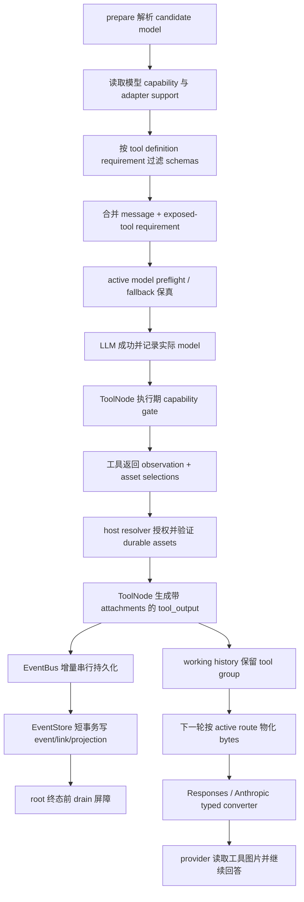

# 23 · Agent 多模态 Phase 5 实施 Runbook

> **状态**：已完成，P5.0-P5.11 全部归档。本文于 2026-07-23 完成全链路代码与 provider surface 调研及实施，是 [`18-multimodal-context-lifecycle-proposal.md`](./18-multimodal-context-lifecycle-proposal.md) Phase 5 的实施证据；Phase 1-4 已分别归档于 [`19`](./19-multimodal-phase-1-implementation-runbook.md)、[`20`](./20-multimodal-phase-2-implementation-runbook.md)、[`21`](./21-multimodal-phase-3-implementation-runbook.md)、[`22`](./22-multimodal-phase-4-implementation-runbook.md)。长期模型与工具合同已迁移到稳定 integration/provider/tool 文档；附件存储、回放与读取合同见 [`src/features/conversation/attachments/README.md`](../../../../src/features/conversation/attachments/README.md)。本文不再承担接入真源。

> **目标**：让工具以独立、可校验的模型输入附件返回已登记 workspace 图片，使 `tool_output` 经 durable event、Context Manager、active-route 能力门禁、短生命周期物化和 typed provider converter 进入下一轮模型；同时让 `resource_read` 在不影响任何文本 URI 的前提下读取真实图片资产。

> **本文生命周期**：本文与 18-22 号多模态 Phase 文档都属于实施期临时材料，只用于记录批次、测试、偏差和风险，不是长期协议真源。Phase 5 收口时必须先把仍有效的合同迁移到正式协议或 provider 接入文档；迁移完成后，18-23 号文档可统一删除，稳定 README 不得把它们列为长期导航。

---

## 0. 结论先行

Phase 5 不是给 `resource_read` 增加一个图片字段，也不是把既有 `media.path` 透传给模型。全链路必须遵守以下结论：

1. `observation`、`data`、`media` 和 `modelInput.attachments` 是四个不同合同。只有 observation 文本和 modelInput 附件进入模型；`media.path` 继续只服务 UI，绝不作为模型输入或 durable 身份。
2. 工具声明分两类。结果必然给模型图片的静态工具声明 `tool_result_image` requirement，在 schema prepare 阶段按实际 model + adapter placement 过滤；`resource_read` 是动态混合工具，始终可见，只有 URI 实际解析为图片时才做执行期能力校验。
3. `ToolContext.modelId` 不是 active model 真源。prepare 默认解析、policy fallback 和 cloud quota fallback 都可能改变真实模型；LLM tick 必须把最终成功 attempt 的 model ID作为短生命周期执行事实交给后续 ToolNode。
4. 静态图片工具的 requirement 必须并入本次 LLM 调用 requirement。否则初始模型虽支持图片，provider 失败后仍可能 fallback 到只支持文本的模型，再由后者发出一条框架无法安全执行的图片工具调用。
5. ToolNode 必须在真实执行、host-forced tool 和幂等 cache hit 三条路径上做同一 capability 判定。prepare 过滤控制“模型能看到什么”，执行期门禁保护“框架实际执行什么”，二者不是重复判断。
6. 工具 JSON 不能自行伪造 `RuntimeResourceRef`。工具只声明有序 asset selection；ToolNode校验一次structured result后调用host-owned resolver port，后者校验asset已登记、属于当前项目或当前会话、是受支持图片并通过verified-image事实复核，再生成durable ref。
7. Phase 5 v1 只接受 `asset://assets/<assetId>` 指向的已登记资产，不接受绝对路径、相对路径、`file://`、base64、data URL 或任意远端 URL。新生成图片必须先通过 workspace asset domain 成为独立 durable asset，再被工具结果引用。
8. 因 v1 只引用既有 asset，`tool_output` 落库时不需要第二套图片 ingress，也不需要新的 asset commit manifest；现有 EventStore 事务负责 event、event-asset link、project link、projection 和 stats。找不到既有 asset 时整条工具结果失败。
9. ToolNode 生成的 `tool_output.attachments` 是唯一 durable 模型图片事实。Context Manager、MessageFormatter、placement 派生、预算、materializer 和 event link 已支持这条形态，不新增 sidecar 消息或伪 user message。
10. 幂等重放必须恢复附件。当前两层 cache 都只恢复 output 字符串；Phase 5 必须让历史 cache hit、同进程 in-flight 合并和首次执行得到同一附件身份与顺序，不能静默退化为纯文本 observation。
11. 首批只实现 `gpt` 的 OpenAI Responses surface 与 `claude` 的 Anthropic Messages surface。具体模型必须声明统一的 `image_input` 能力；`user_image` / `tool_result_image` 是 runtime 请求来源，是否可编码由与真实选路同源的 adapter descriptor 决定，不再由模型二次配置。
12. OpenAI Responses 的 function output 使用 observation 文本在前、图片按附件顺序在后的结构化 output；Anthropic 使用 `tool_result.content` 内部的 text/image blocks。两者都必须从已物化 bytes 构造，最终 body 不含 asset ID、hash、文件名、本地路径或 durable `attachments` 字段。
13. 工具图片整批 fail closed。任一 selection 不可访问、资产不完整、能力不兼容、物化失败或 converter 不支持时，不得只发送 observation 文本，也不得丢掉坏图继续处理剩余附件。
14. `text_to_image` 当前仍只通过 `media` 给 UI 展示，不在 Phase 5 自动升级为模型图片工具；Phase 6 的截图 CLI 先把截图登记为 workspace asset，再通过本阶段统一的 asset selection / `resource_read` 链交给模型。

---

## 1. 本轮边界

### 1.1 必须交付

| 能力 | Phase 5 交付 |
|---|---|
| 工具定义 | 可选的模型输入 requirement；只表达 placement，不携带 provider 格式 |
| 工具结果 | 独立 `modelInput.attachments` asset selections；与 UI `media` 解耦 |
| active model | 从成功 LLM attempt 到 ToolNode 的明确短生命周期事实，覆盖两类 fallback |
| schema prepare | 静态图片工具只向兼容 model + route 暴露，requirement 并入 fallback 判定 |
| 执行门禁 | normal、host-forced、历史 cache hit 和 in-flight 路径统一校验 |
| asset resolution | host 按项目/会话授权解析既有 asset，复用 verified-image loader并返回 durable refs |
| durable event | tool output 写入有序 attachments，事务建立 event/project asset links |
| `resource_read` | 增加 `asset://assets/<assetId>`，图片返回 observation + modelInput，文本 URI 零变化 |
| context/replay | tool attachment 经 event conversion、MessageFormatter、预算、checkpoint、materializer 保真 |
| provider | OpenAI Responses 与 Anthropic Messages typed tool-result image converter |
| 模型能力 | 具体模型只声明统一的 `image_input`；Cloud/admin 与本地配置不再维护图片来源 |
| 兼容判定 | requirement 必须同时满足模型 `image_input` 与 adapter transport support |
| 能力声明 | converter + finalizer + body 测试通过后翻转首批 route 的对应 placement |
| 验收 | 真实 Agent loop 从 tool call 到下一轮 provider body、SQLite replay与幂等重放 |

### 1.2 明确不做

- 不接受工具返回本地路径并由 ToolNode 读取；不把 `media.path`、workspace VFS payload 或插件 artifact path 变成模型输入合同。
- 不让工具或第三方插件直接构造可信 durable ref；不根据文件名、URI 后缀或调用方 MIME 猜资产事实。
- 不做未登记文件的隐式 ingress、临时 manifest、lease 或后台 asset commit。新资产登记属于 workspace asset workflow。
- 不新增数据库 migration。Phase 1 的 `assets`、`conversation_event_asset_links` 和 `project_asset_links` 已能表达既有 asset 的 tool-output link。
- 不开放 Chat Completions、OpenRouter、Gemini-compatible 或 Ollama 的工具图片侧车；不把 tool 图片改写成 user 图片规避 placement。
- 不升级 `text_to_image`、Slides 或 PPT 工具；不提前实现 Phase 6 的 screenshot CLI。
- 不做 provider file cache、远程 URL传输、GIF/BMP/SVG、图片压缩、OCR fallback、多模态摘要或 remote count。
- 不在没有真实 provider 差异时提前增加模型专属图片处理 profile；Phase 5 沿用 route 默认 profile，模型级 override 归入 Phase 6 的按需扩展。
- 不把 route capability、workspace DB 或 Model Catalog 注入 `StructuredToolResult`；跨 domain 只通过窄 public contract/port/app-level orchestration 协作。
- 不为字段定义、文档文本、CSS 或 snapshot 数量写测试；测试只锁业务链路与失败语义。

### 1.3 Phase 1-4 复用边界

| 已有能力 | Phase 5 使用方式 | 禁止事项 |
|---|---|---|
| `RuntimeResourceRef` | host resolver 产出、tool event持久化和下一轮上下文的唯一 durable 图片身份 | 工具 JSON 不自行拼装 |
| event/asset links | 对既有 asset 在 tool-output 事务中建立新 link | 不绕过 EventStore 单独写 link |
| verified-image loader | 复核 ledger、managed root、普通文件、长度/hash/magic/尺寸/解码 | 不只查 `local_path` 或后缀 |
| `tool_result_image` placement | schema、fallback、ToolNode、materializer、converter 共用同一语义 | 不从 `user_image` 推导支持 |
| model catalog | 提供具体模型 `image_input` capability，并注入与真实选路同源的 route descriptor | 不在模型配置层复制 adapter 协议能力 |
| Context Manager | 保留含图 tool group、非零预算、checkpoint 原子性 | 不新增图片 sidecar user message |
| materializer | 每次真实 attempt按 active profile 重新解析 bytes | 不在工具结果或历史保存 bytes |
| EventStore transaction | tool event + event link + project link + projection + stats | 不为既有 asset伪造 commit record |
| 错误链 | 复用稳定 domain code → SSE → Renderer ErrorBanner | 不解析 provider 文案猜能力 |

---

## 2. 已核实的真实链路

### 2.1 工具定义与结果当前只有文本/UI合同

- `ToolRuntimeDefinition` 通过 `parameters`、`idempotency` 与模型输入 requirement 描述执行合同；前端展示配置不属于 runtime definition。
- `ToolExecutionResult` 当前成功面是 JSON 字符串 `result`；它适合继续作为工具执行传输合同，不应混入 workspace-specific 解析结果。
- `StructuredToolResult` 当前包含 `data`、`observation`、`media`、`observationPreviewMeta` 和 `control`；`media.path` 明确是 UI 元数据，且可能携带路径。
- Linnya `ToolRegistry.executeTool()` 调用 `BaseTool.run()` 后原样返回字符串；ToolNode 自己解析并校验 observation。
- `ToolNodeEventBridge.emitToolOutput()` 只接受 payload，映射出的 `tool_output` 从未赋值 attachments。

因此正确拆分是：工具在structured result中声明asset selection，ToolNode完成一次通用合同校验后调用注入的`ToolModelInputResolverPort`，host实现产出已验证durable refs，ToolNode再生成event。这样首次执行、历史cache hit和in-flight合并都经过同一后处理；workspace解析规则不进入linnkit，host也不绕过ToolNode自行造event。

### 2.2 durable、context 与物化下半链已经存在

Phase 1-3 已经完成大部分下游合同：

- RuntimeEvent 与 AiMessage 的 `tool_output` 均允许 ordered attachments。
- EventStore 会读取 user/tool event attachments；既有 asset无需 commit record即可建立 event link，并验证 ledger 元数据一致。
- event converter 与 MessageFormatter 会把 tool attachments 保留到原生 tool message。
- `deriveModelInputRequirement()` 会从 tool message派生 `tool_result_image`。
- Context Manager 已按 tool group 原子保留附件，图片预算非零，checkpoint 不拆组。
- materializer 会把 durable tool附件按 active route 重新解析为短生命周期 bytes。

真实缺口集中在“工具如何安全产生附件”和“provider 如何接收 tool-result 图片”，不是重做历史/Context Manager。

### 2.3 prepare 与 fallback 缺少工具 requirement

当前 `prepareCallStage` 的顺序是：解析 requested/default model → 生成 tool schemas → 构建 LLM options。`ToolSchemaContext` 只携带图片生成模型 ID：

- schema generation 看不到实际 model capability 或 adapter placement。
- LlmCaller 只从已经存在的 messages 派生 requirement；本轮新暴露的静态图片工具不会进入 requirement。
- policy switch 与 quota fallback 虽然会按 requirement筛候选，但拿到的是缺少“可能产生 tool 图片”的弱 requirement。
- schema 已发给初始模型后，fallback 不能重新发一份不同 schemas 而不改变本次调用语义。

P5 必须在 prepare 阶段先解析 model capability，再按 tool definition过滤 schemas，并把已暴露静态工具的 requirement 与消息 requirement 合并后传给 LlmCaller。fallback 只能选择满足合并 requirement 的候选。

### 2.4 ToolNode 不知道发出 tool call 的真实模型

`ToolContext.modelId` 来自原始 request 兼容字段，不等于真实 active model：

- 未显式选择时，default resolver 才得到实际 model。
- policy fallback 会在 caller 内切换 model。
- cloud quota fallback 会切 model，并只对后续 run lock暴露部分事实。
- execute stage已有 `onModelFallbackApplied`，但 TickOutput 和 ToolNode可读 local state没有统一的“最后成功 attempt model”。

这不是让 ToolNode持有 Model Catalog 的理由。runtime 应把 `lastSuccessfulLlmModelId` 一类短生命周期执行事实写入 executor local；ToolNode通过注入的窄 capability validator校验“model ID + tool requirement”。该事实不进入 RuntimeEvent、checkpoint、ToolContext兼容字段或 durable history。

### 2.5 host-forced 与幂等路径都是实际旁路

- host-forced tool 可以不经过模型 schema选择，故 prepare 过滤不能代替执行期校验。
- ToolNode 的历史 idempotency cache 只恢复 `tool_output.output`。
- Linnya ToolRegistry 内还有一层历史 cache，同样只恢复 output。
- ToolNode in-flight 合并会复制 `ToolExecutionResult`。

Phase 5不应给两个cache分别补附件字段。无论哪一层命中，返回的原始structured output都必须回到ToolNode同一条“合同校验 → selection resolver → capability gate → event”后处理路径。若selection对应资产失效，应按正常失败语义拒绝，而不是重新执行副作用工具或只返回文本。

### 2.6 调研时的 `resource_read` 是纯文本 dispatcher

现有判别联合与 dispatcher 支持 `kb`、`workspace`、`skill`、`shared_memory`、`evidence`、`citation_snapshot`、`http(s)` 和 `tool_output`；所有分支最终返回 JSON 字符串。

缺口是：

- 没有稳定的 image asset URI。
- dispatcher 当时没有产出“文本结果 + asset selection”的分支；其 JSON 字符串传输合同本身可以承载 `StructuredToolResult.modelInput`，无需为此提升为第二套内存 draft 类型。
- `resource_read` 看不到 active model/route capability。
- 现有 workspace VFS 的 `asset_image.payload.filePath` 是 UI/host 内部事实，不能复用为模型输入。
- 当时的 `createWorkspaceAssetLocalPathResolver()` 按 ID 入口不做项目归属校验，不能成为模型可调用工具的授权边界；该 port 后续已退役。

Phase 5 选择 `asset://assets/<assetId>`。parser 只解析身份；真正授权由 host asset selection resolver 基于 `workspaceProjectId`、`conversationId`、project/event links 与 verified-image loader完成。

### 2.7 provider surface 现状

| route/provider | 实际 API surface | user image | tool-result image | Phase 5 结论 |
|---|---|---:|---:|---|
| `gpt` | OpenAI Responses | 已实现 | 已实现原生 function output parts | descriptor已开放；模型声明`image_input`即可使用 |
| `claude` | Anthropic Messages | 已实现 | 已实现原生tool_result blocks | descriptor已开放；模型声明`image_input`即可使用 |
| `gemini` | OpenAI Chat Completions compatible | 已实现 user | 显式拒绝 | 继续关闭 |
| `openai` | Chat Completions | 已实现 user | 显式拒绝 | 继续关闭 |
| `openrouter` | Chat Completions gateway | 已实现 user | 显式拒绝 | 继续关闭 |
| `ollama` | Ollama chat | 已实现 user | 显式拒绝 | 继续关闭 |
| integration/smart-tool | 非目标生产 surface | 关闭 | 关闭 | 继续关闭 |

官方协议与仓库 SDK 类型的核对结论：

- OpenAI 官方 Function Calling 文档明确说明 Responses 的 `function_call_output.output` 对图片/文件结果可以使用 image/file object数组，而不只接受字符串。P5.8 已据此把本地 typed request扩展为string或窄`input_text`/`input_image`数组，并以官方`openai-node`的`ResponseInputImage`字段复核具体形态。[OpenAI Function Calling](https://developers.openai.com/api/docs/guides/function-calling)
- Anthropic 官方说明 `tool_result.content` 可为 text、image、document、search_result blocks，并要求 tool_result blocks在后续 user content 中优先出现；P5.9按仓库`@anthropic-ai/sdk@0.78.0`的`ToolResultBlockParam`/`ImageBlockParam`窄化到text/image，保持并行结果和普通user content顺序。[Anthropic Handle tool calls](https://platform.claude.com/docs/en/agents-and-tools/tool-use/handle-tool-calls)
- Gemini 原生 API虽有多模态 function response能力，但当前 Linnya `gemini` route不是原生 Gemini surface，因此不能据此翻转现有 descriptor。
- `claude` 是协议 route，不是 Claude 模型的同义词。当前兼容路由逻辑明确覆盖 MiniMax；adapter 能构造 Anthropic Messages 请求，只能证明 transport surface 可用，不能证明该 route 下每个模型都接受 tool-result image。

---

## 3. 权威合同与所有权

### 3.1 framework 工具 requirement

`ToolRuntimeDefinition` 增加可选、只读的模型输入 requirement。v1 复用现有 `ModelInputRequirement`/placement词汇，不建立第二套 tool capability枚举。

规则：

- 未声明等价于纯文本工具。
- 静态声明 `tool_result_image` 表示工具成功结果可能把图片交给下一轮模型，不表示工具本身“生成图片”。
- requirement只能由 tool definition提供，不能从工具名、description、schema字段或 UI media推断。
- 动态混合工具不声明静态 requirement；它在结果解析后按实际 selections增强本 run后续 requirement。

### 3.2 工具声明、host解析和 runtime结果三层合同

| 层 | 形态 | 所有者 | 可含什么 |
|---|---|---|---|
| tool JSON | ordered asset selections | 具体工具/host tool domain | `asset://assets/<id>` 与可选安全 label |
| host resolution | resolved model input attachments | ToolNode注入的host port | `RuntimeResourceRef[]`，不含 bytes/path |
| runtime event | `tool_output.attachments` | ToolNode | 与host resolution同一身份和顺序 |

`StructuredToolResult.modelInput.attachments` 是声明层，不是可信durable ref。ToolNode沿用现有structured result validator完成一次解析，随后只把严格selection和执行上下文交给窄`ToolModelInputResolverPort`；port返回refs后由ToolNode写event。`ToolExecutionResult`和ToolRegistry继续只负责工具执行传输，ToolNode不反向import workspace类型。

selection parser必须 strict：只接受 v1 asset scheme、非空有序数组和安全展示字段；未知字段、重复 selection ID、路径与载荷一律拒绝。是否允许同一 asset重复出现按用户明确选择语义处理：v1允许不同 selection ID指向同一 asset，但各自计入预算和 provider顺序。

### 3.3 asset selection resolver

host assets domain新增窄 feature，而不是扩充通用 `utils/service/manager`：

- definitions：selection输入、解析结果和稳定失败原因。
- functions：URI parser、scope判定、ledger row读取与 RuntimeResourceRef映射。
- orchestration：按声明顺序批量授权并调用 verified-image loader。

授权规则：

1. 必须有当前 conversation ID；project conversation还必须有匹配的 workspace project ID。
2. project会话只允许 `project_asset_links` 中属于当前 project的 asset。
3. 无 project会话只允许当前 conversation已有 `conversation_event_asset_links` 指向的 asset。
4. asset必须是 local、JPEG/PNG/WebP且 ledger完整。
5. verified-image loader必须用同一 buffer复核路径、长度、hash、magic、尺寸和解码。
6. 任一 selection失败则整批无结果，不返回 path、bytes或部分 refs。

resolver返回 durable refs而不是 verified bytes。真实 bytes仍只在下一轮 LLM materializer按 active route读取；这避免工具执行时把图片长期留在 graph state。

### 3.4 active model execution fact

LLM execute stage需要产出最终成功 attempt的 model ID，不从 fallback audit倒推：

- 无 fallback时等于 prepare选中的 model。
- policy或quota fallback时等于最后实际调用成功的 model。
- provider失败没有成功 attempt时不写新事实。
- 事实随 executor local在本 run内传给紧随其后的 ToolNode；下一次 LLM prepare重新计算。

建议把 caller成功结果扩成带 active model事实的窄 envelope，或用现有 fallback observer加独立 success回调；不从 `llmResp` provider payload、日志或 `ToolContext.modelId`猜测。executor local patch类型需要显式扩展，不用宽 record断言绕过。

### 3.5 prepare schema与合并 requirement

模型输入兼容性由两个彼此独立的事实共同决定：

| 事实 | 回答的问题 | 所有者 |
|---|---|---|
| `capabilities` 中的 `image_input` | 模型是否具备图片输入能力 | 具体模型配置 |
| `adapter_input_support` | 当前 API surface 的 converter 能否编码该位置 | route descriptor / host assembly |

`ModelInputPlacement` 只描述 runtime 从最终消息或工具 requirement 派生出的图片来源，不是模型配置。兼容条件是：图片请求时具体模型声明 `image_input`，且本次 requirement 的全部 placements 都被 adapter descriptor 支持；任一事实缺失都 fail closed。

禁止根据 model ID、display name、provider 或 API base 猜模型图片能力。route descriptor 可以显式声明其协议能力，但必须与 `AdapterFactory` 的真实选路同源并有 converter/finalizer/provider body 测试。若一个兼容网关与既有 surface 的协议能力不同，应拆分准确的 route/descriptor，而不是重新引入模型级 placement 开关。

prepare 的业务顺序固定为：

1. 解析 requested/default candidate model。
2. 读取 model capability 和 adapter input support。
3. 获取候选工具 definitions。
4. 动态混合工具正常保留；静态工具按 requirement过滤。
5. 从实际暴露的 tool definitions聚合 tool requirement。
6. context build后从 final messages派生 message requirement。
7. 合并两者后调用 active model preflight，并把同一合并 requirement交给 retry/fallback。

`FunctionToolSchema` 本身不携带 Linnya metadata，provider body看不到 requirement。ToolCatalog可返回“schemas + requirement”的窄 prepare结果，或提供独立 definitions查询；实施时优先选择不重复遍历、不重复组装 schema的既有模式。schema prepare、fallback候选筛选和ToolNode执行门禁必须调用同一个纯 compatibility 函数，不能各自拼接模型与adapter规则。

### 3.6 ToolNode二次校验与错误语义

ToolNode执行前读取 tool definition requirement和 `lastSuccessfulLlmModelId`，通过注入的 framework-level capability validator校验。动态工具在 host result resolver发现图片 selections后执行同一判定。

稳定错误沿用 Phase 2能力错误族：

- model缺失/禁用/chat不支持；
- `image_input` 缺失；
- adapter placement不支持；
- active model fact缺失；
- asset selection非法/越权/不可用/完整性失败。

这些失败属于本地执行边界，不调用 provider、不触发 LLM fallback、不把结果改成纯文本成功。工具失败 event不得包含 asset ID以外的敏感资源事实，用户文案不显示路径/hash。

### 3.7 幂等附件语义

历史cache命中必须重新走ToolNode统一后处理：

- output中的selection来自原tool result；attachments由host resolver按当前scope重新解析。
- 新 tool call生成新的 event ID与tool_call_id，但复用同一 durable asset IDs。
- EventStore为新 event建立新的 links，不复制 bytes。
- 原output没有selection代表结果确为纯文本；selection存在但解析/授权失败必须明确失败。
- in-flight只共享工具原始执行结果，resolved refs仍在统一后处理生成，调用方不得修改。

当前ToolNode与host ToolRegistry的双重历史cache仍是重复职责和维护坏味道，但不需要为Phase 5顺手重构。P5只要求两者所有返回都汇入ToolNode统一后处理，并用业务测试锁定；后续若单独收口，倾向保留framework ToolNode，因为它拥有durable event和idempotency语义。

### 3.8 persistence与崩溃一致性

Phase 5 v1只链接既有 durable asset：

- asset在工具运行前已经存在于账本，并独立属于项目或会话。
- ToolNode发出带attachments的tool event，并立即把它放入working history供下一轮context使用。
- Flow增量持久化仍通过现有EventBus串行队列走`appendEventToRun()`；Graph不会为每条event等待SQLite。
- `SqliteEventAssetLinks.persistForEvent()` 验证 ledger与ref相符，在同一短事务写event link、project link、projection和stats。
- 单次SQLite事务失败时没有半条durable event或半组links；最终persistence drain必须把错误交给run收口，不能把run报告为成功。

无需向Flow传`assetCommitsByEventId`，也无需为了既有asset改变Graph的持久化时序。若未来确需把未登记文件直接作为工具结果，必须另开决策设计host asset workflow；不能向linnkit result塞`localPath`作为捷径。

### 3.9 `resource_read`图片分支

`asset://assets/<assetId>` 是显式、稳定、无路径语义的资源 URI。行为如下：

- parser新增判别联合分支并更新工具description/schema。
- dispatcher继续使用既有 JSON 字符串传输合同；asset分支序列化完整structured result，文本分支保持原始JSON字节语义和分页字段。ToolNode仍是唯一通用解析边界，不新增只为转手再序列化的中间draft抽象。
- asset分支不支持 offset、limit、view、variant、range或sheet ID；这些参数若出现按现有“来源不适用则忽略”纪律处理。
- 图片结果 observation只说明已读取图片及安全名称，不把路径、hash、尺寸账本拼进模型文本。
- modelInput声明该 asset URI；host resolver完成授权和durable ref生成。
- 不兼容模型调用文本 URI仍成功；只有 asset URI进入图片分支时才报能力错误。

### 3.10 provider converter

共同规则：

- converter输入只能是 `ResolvedLlmInputMessage`，durable ref不能直接进入。
- observation text在前，图片按attachments声明顺序在后。
- tool_call_id/call_id保持不变。
- 空observation仍由StructuredToolResult合同拒绝，不制造图片-only工具结果。
- finalizer递归拒绝 `attachments`、resource ID、asset ID、sha、fileName、local path等durable字段。
- debug projection只记录image count、text characters、profile ID和transport，不记录base64、bytes或资源身份。

OpenAI Responses：扩展本地 `OpenAiResponsesFunctionCallOutputItem.output` 为该surface允许的string或窄content数组；工具图使用结构化 image object，不创建额外user message。

Anthropic Messages：`tool_result.content` 从string提升为 blocks；第一个block为observation text，随后是base64 image blocks。并行工具结果仍保持所有tool_result blocks位于后续user message前部，不能让普通user text插到它们之前。

### 3.11 后续视觉模型接入分流

未来新增模型通常不需要“一模型一个图片 adapter”。接入工作按真实协议差异分四类：

| 场景 | 必须做什么 | 不应做什么 |
|---|---|---|
| 新模型复用已验收surface与现有图片限制 | 增加模型配置并显式声明`image_input`，复用已有route合同 | 复制converter或增加模型级placement开关 |
| 新模型复用surface但图片限制不同 | 在Phase 6增加显式model processing profile override，并验证数量、MIME、尺寸/detail与预算 | 在converter里按model name写条件分支 |
| 新provider使用不同API surface | 新增独立descriptor、typed converter、finalizer、processing profile和stream/non-stream body测试 | 因为“OpenAI兼容”就复用未验证协议 |
| surface只支持user image、不支持原生tool-result image | descriptor只打开`user_image`，保持tool placement关闭 | 把tool图片伪装成user消息绕过门禁 |

P5.11必须把这张分流表及其完整接入清单迁移到稳定integration guide。该指南至少覆盖模型capability、route选择、adapter placement、processing profile、typed converter/finalizer、日志脱敏、fallback与真实body测试；它描述当前合同，不链接本runbook。

---

## 4. 全链路顺序

关键时序不变量：tool event 生成后立即进入 working history，EventBus 同时把它送入单一串行持久化队列；Graph 不为每条 SQLite 短事务阻塞下一轮 LLM，因此 provider 已被调用不代表本 run 已 durable 成功。root run 写入 `completed` / `awaiting_user` 前必须等待最终 drain；任一 event/link/projection 事务失败都进入 `failed`。下一轮仍可能切模，所以 materializer 和 provider converter 必须按新的 active model 执行，不能复用工具执行时的验证结论或 bytes。

---

## 5. 分批实施计划

### P5.0 · 锁定基线、否定门禁与 fixture

**交付物**：

- 固定六类 production route当前 `tool_result_image: false`基线。
- 建立 tool result fixture：首次执行、host-forced、历史 cache hit、in-flight、并行工具、无project会话。
- 建立 asset fixture：合法project asset、合法conversation asset、跨project、缺失、ledger不完整、hash损坏。
- 建立双侧拒绝fixture：模型缺少`image_input`时即使route支持也拒绝；route缺少`tool_result_image`时即使模型支持图片也拒绝。
- 固定 Chat Completions/Ollama工具图片仍拒绝的测试。

**门禁**：新增代码前所有现有 Phase 1-4回归通过；production没有 `tool_result_image: true`；工具结果仍未产生attachments。

### P5.1 · framework工具 requirement与三层结果合同

**交付物**：

- `ToolRuntimeDefinition`增加可选 requirement。
- `StructuredToolResult`增加严格的 `modelInput.attachments` selection合同；注释明确与media边界。
- 新增framework窄`ToolModelInputResolverPort`，输入strict selections与工具执行scope，输出只读durable refs。
- public exports、quickstart/testkit/plugin SDK按窄类型同步。

**门禁**：旧纯文本工具零改动可运行；非法selection在工具边界明确失败；linnkit不依赖workspace/model-registry类型。

### P5.2 · active model事实与合并 requirement

**交付物**：

- caller/execute stage显式返回最后成功attempt model。
- executor local保存短生命周期active model事实并传到ToolNode。
- 模型目录继续只用`image_input`声明统一图片能力；`ModelInputPlacement`仅描述runtime请求来源。
- host assembly从与真实实例选路同源的adapter descriptor注入`adapter_input_support`；本地、Cloud/admin和客户端不新增图片来源配置。
- prepare聚合实际暴露工具的requirement；LlmCaller接受显式合并requirement。
- policy与quota fallback都按合并requirement筛选候选。

**门禁**：default model、无fallback、policy fallback、quota fallback四条链的ToolNode看到真实model；不读`ToolContext.modelId`；缺少`image_input`或route placement不兼容的fallback在provider attempt前拒绝。

### P5.3 · schema过滤与ToolNode二次门禁

**交付物**：

- ToolCatalog prepare结果或definitions查询使用统一compatibility函数，按model capability + adapter placement过滤静态工具。
- 动态`resource_read`不被整体隐藏。
- ToolNode normal与host-forced共用同一validator。
- 能力拒绝走稳定错误/audit，不计为工具成功或LLM attempt。

**门禁**：静态图片工具对不兼容模型或route不可见；伪造host-forced call仍被拒；schema与ToolNode对同一模型得到同一结论；按模型名/provider名推断为零。

### P5.4 · workspace asset selection resolver

**交付物**：

- 建立assets domain内的tool-model-input feature与窄resolver port。
- `asset://assets/<id>` parser、scope授权、ledger映射和verified-image批量复核。
- workspace assembly向ToolNode/runtime装配注入同一resolver实例；child run沿现有workspace scope显式继承。

**门禁**：跨project/跨conversation拒绝；任一附件失败整批无结果；返回不含path/bytes；symlink和完整性不变量与Phase 3一致。

### P5.5 · ToolNode统一结果后处理与幂等保真

**交付物**：

- ToolNode对首次、历史cache hit与in-flight结果共用一次structured合同校验和selection resolution。
- 两层现有cache均只能返回原始output，不单独组装attachments或绕过resolver。
- 历史cache重新解析同一asset IDs；in-flight合并保持附件身份和顺序。
- idempotency metadata继续落在新event，不复制asset bytes。

**门禁**：首次、cache hit、in-flight三条event附件完全等价；缓存selection失效不重跑副作用工具、不降级纯文本。双cache收口记为独立维护债，不强塞进本批。

### P5.6 · ToolNode event与Flow事务

**交付物**：

- EventBridge显式接收resolved attachments并写入observation/runtime tool_output。
- event mapping、SSE、working history与state transition保留附件。
- Flow incremental persistence对tool event建立既有asset links；事务失败由最终drain使run失败。
- audit/telemetry只记录count/placement/安全ID，不记录载荷/path/hash。

**门禁**：SQLite重启回放后附件身份/顺序一致；event link source为tool_output；事务失败没有半条event或半组link，且run收口不误报成功。

### P5.7 · `resource_read` asset图片分支

**交付物**：

- ResourceUri联合、parser、description和dispatcher加入asset scheme。
- dispatcher沿用统一JSON字符串传输合同；asset分支产出完整structured result，原文本分支输出等价。
- 图片分支产出安全observation + ordered selection，执行期能力拒绝准确。
- Workspace VFS的`list_files`投影对已登记`asset_image`暴露稳定asset URI；模型observation不再用项目path指引图片读取，内部VFS payload仍保留UI所需事实。

**门禁**：所有现有文本URI合同测试原样通过；文本模型仍可用resource_read读文本；asset图片在兼容/不兼容route分别成功/稳定拒绝。

### P5.8 · OpenAI Responses tool image converter

**交付物**：

- typed function output结构支持observation + ordered images。
- stream/non-stream共用同一builder/finalizer。
- request debug与HTTP日志继续metadata-only。
- converter/body测试通过后同批翻`gpt` Responses descriptor；具体模型只声明统一的`image_input`。

**门禁**：provider mock看到正确call ID、text/image顺序和data URL；找不到durable字段；Chat Completions descriptor不变；未声明`image_input`的模型仍被compatibility gate拒绝。

### P5.9 · Anthropic Messages tool image converter

**交付物**：

- tool_result content使用SDK原生typed blocks。
- 并行tool results顺序、user/assistant交替与thinking replay保持不变。
- finalizer允许合法nested image block并继续拒绝durable字段。
- converter/body测试通过后同批翻`claude` descriptor；具体模型只声明统一的`image_input`。

**门禁**：tool_result blocks先于普通user text；observation在每个tool_result内部先于images；其他Anthropic历史行为零回归；未声明`image_input`的模型保持拒绝。

### P5.10 · Context、checkpoint、child与错误回归

**交付物**：

- tool attachments从SQLite replay进入MessageFormatter和requirement。
- context预算、tool group原子保留、checkpoint、wait-user和child默认/显式继承回归。
- capability/asset/materialization/mapping错误走现有稳定错误链，中英文文案准确。
- 修正受触达的audit metadata重复字段等低风险坏味道，不扩大重构。

**门禁**：含图tool group不被拆散/摘要；图片退出final context后requirement自然解除；错误不双重分类、不泄漏资源事实。

### P5.11 · 真实Agent loop验收与正式文档迁移

**交付物**：

- host-bound真实Graph fixture覆盖：LLM tool call → resource_read asset → workspace scope/integrity resolver → 下一轮context/materializer → Responses/Anthropic provider body → final answer，并把同一tool event写入文件型SQLite后重开恢复。
- policy/quota fallback、历史cache hit、host-forced拒绝、事务失败与最终persistence drain继续由各自已有真实业务测试覆盖；不把它们复制进一个同时承担Graph、Flow、EventStore和provider职责的巨型fixture。
- 回写本文实施日志与风险状态；18-23号只保留实施证据，不再被稳定README导航。
- 把长期有效的模型图片能力声明、§3.11接入分流、adapter接入步骤、converter/finalizer安全门禁和测试要求迁移到正式LLM adapter接入README或独立稳定integration guide。
- 正式文档只描述当前有效合同，不反向链接18-23号临时runbook；Phase文档删除前必须完成长期不变量迁移。

**门禁**：定向业务测试、linnkit双tsconfig、root TS baseline、production build、strict style、agent boundary和静态泄漏扫描全部通过；只有已验收surface的descriptor为`tool_result_image: true`，模型目录只声明统一的`image_input`；稳定README无18-23号链接或导航项。

---

## 6. 业务测试矩阵

| 场景 | 关键断言 | 层级 |
|---|---|---|
| 静态图片工具 + 兼容route | schema可见，合并requirement含tool placement | linnkit contract |
| 静态图片工具 + 不兼容route | schema不可见，其他工具不受影响 | prepare orchestration |
| 模型缺少image_input | route即使支持图片也在provider attempt前拒绝 | model catalog + prepare E2E |
| 模型支持图片但route不支持tool placement | 静态工具不可见，动态结果执行前拒绝 | adapter descriptor + Graph E2E |
| Cloud/自定义视觉模型 | admin → Cloud → client完整保留`image_input`，不产生来源配置 | Model Catalog integration |
| 动态resource_read文本 | 所有原URI输出/分页等价，无图片requirement | host tool integration |
| 动态resource_read图片 | selection经scope+verified resolver形成ref | assets/tool integration |
| host-forced图片工具 | 不兼容active model执行前拒绝 | real Graph loop |
| policy/quota fallback | 候选必须满足message + tool requirement | caller integration |
| 首次工具执行 | observation和attachments进入同一event | ToolNode contract |
| 历史cache hit | 不重跑工具，重解析selection并新建event links | Graph/EventStore integration |
| in-flight合并 | 两调用看到同一不可变附件事实 | ToolNode integration |
| 跨project/conversation | asset selection整批拒绝 | assets domain |
| 缺失/损坏/symlink | event不成立，不进入下一轮provider | assets + Flow |
| SQLite事务失败 | event/link/projection全部回滚 | EventStore contract |
| 刷新/replay | tool attachment身份和顺序不变 | Flow/context E2E |
| Context预算/checkpoint | tool group整组保留或裁剪，不拆图 | linnkit context |
| OpenAI Responses | function output text + ordered image objects | adapter body |
| Anthropic Messages | tool_result内部text + ordered image blocks | adapter body |
| Chat Completions/Ollama | 继续稳定mapping unsupported | negative adapter |
| audit/debug/log | 无bytes/base64/path/hash/fileName泄漏 | static + runtime gate |

测试不锁README、类型字段快照、CSS或具体文案排列。最小单元测试只用于URI parser、requirement合并和scope规则等纯函数；主要保障来自真实Graph/Flow/EventStore/provider mock模块测试。

---

## 7. 验收与静态审计

每批提交至少执行与改动对应的定向测试；P5.11统一执行：

1. linnkit contract/context/graph/caller测试。
2. host ToolRegistry、resource_read、assets resolver测试。
3. EventStore tool attachment transaction与Flow incremental persistence测试。
4. OpenAI Responses、Anthropic、Chat Completions、Ollama request-body测试。
5. 真实Flow tool loop fixture与刷新回放。
6. linnkit源码tsconfig、Renderer/production build、root TypeScript baseline和agent boundary。
7. 静态扫描：
   - production adapter `tool_result_image: true`只能命中验收过的Responses/Anthropic surface；
   - production模型合同不存在图片placement字段，只保留统一的`image_input`；
   - adapter placement来自与真实选路同源的descriptor，不由model name或provider文案临时推断；
   - `modelInput.attachments`附近无`path`、`localPath`、`base64`、`data:`或raw bytes；
   - framework不import `src/features/workspace`、Model Catalog或host adapter；
   - Chat Completions/Ollama converter继续拒绝tool attachments；
   - provider final body不含durable附件字段；
   - 生产diff无新增`any`和不安全断言。

provider live smoke只作为已配置开发环境的补充，不替代离线typed body合同。若官方surface与仓库SDK类型冲突，先停止翻descriptor并更新本文，不用宽类型绕过。

---

## 8. 风险台账

1. **已关闭（原高）：静态图片工具未并入fallback requirement会把调用切到不兼容模型。** P5.2用“实际暴露工具 + final messages”的合并requirement贯穿每个candidate，policy/quota fallback均走同一兼容性判定。
2. **已关闭（原高）：`ToolContext.modelId`不是active model。** P5.2建立成功attempt observer事实，default、policy fallback和quota fallback后的真实模型进入ToolNode，旧字段未扩大用途。
3. **已关闭（原高）：工具自行伪造durable ref或返回path会突破workspace授权。** P5.1/P5.4只接受asset selection，由host scope resolver + verified loader生成ref；路径和载荷不进入合同。
4. **已关闭（原高）：幂等cache若绕过selection后处理会静默丢图。** P5.5让首次执行、历史cache hit和in-flight合并全部回到ToolNode统一解析/resolver路径，不为两层cache各写附件逻辑。
5. **中高：Flow持久化队列与Graph执行并行，SQLite失败可能发生在下一轮provider之后。** 这是现有运行模型，不因既有asset引用而新增同步屏障；P5.6必须保证单事务无半状态、最终drain使run失败，并在文档/测试中明确“已调用provider不等于run已durable成功”。
6. **已关闭（原中）：prepare过滤和执行校验若各自实现规则会漂移。** 两处调用同一纯compatibility函数，区别只在调用时机和错误上下文。
7. **已关闭（原中）：`resource_read`若静态声明图片requirement会误杀全部文本读取。** 它保持动态混合，文本URI等价回归不变，只有asset URI结果进入执行期图片分支。
8. **已关闭（原中）：现有asset ID本地路径resolver不校验project归属。** P5.4建立project/conversation links scope查询并复用verified loader，没有把旧路径resolver当授权端口。
9. **已关闭（原中）：workspace VFS asset payload含`filePath`。** P5.7在`list_files`模型投影中只暴露稳定asset URI，真实SQLite测试确认本地绝对路径不进入输出；VFS UI payload仍留在原所有权边界，没有穿过ToolRegistry modelInput。
10. **已关闭（原中）：OpenAI Responses本地function output类型写死string。** P5.8建立string或窄`input_text`/`input_image`数组；finalizer精确检查nested parts、data URL和durable字段，Chat Completions形态与任意宽part均被拒绝。
11. **已关闭（原中）：Anthropic finalizer只允许tool_result.content string。** P5.9按SDK原生类型精确允许text/image数组；无图结果仍保留string，多个tool_result继续位于后续普通user content之前，nested宽对象和Chat Completions形态均被拒绝。
12. **中：同一图片多次selection会重复计费。** v1尊重工具显式顺序并逐项计入预算，不按asset ID静默去重；如产品要限制，另建明确业务规则。
13. **中低：新生成图片不在Phase 5隐式登记。** 这是有意边界；Phase 6必须先走workspace asset登记。若某工具没有该能力，应明确失败，而不是返回path。
14. **中低：tool image内容属于不可信外部输入，存在间接prompt injection。** 保持在provider原生tool-result block，不提升为system或普通user文本；observation不拼接图片OCR内容。
15. **中低：run/agent两级error可能双发。** 继承21/22号既有协议债；P5错误投影保持幂等，不只修图片一侧。
16. **低：Chat Completions与Ollama即便模型能看user图，也没有验收tool-result协议。** production placement继续false；不以品牌、model name或“OpenAI兼容”推断。
17. **已关闭（原低）：ToolNode audit metadata重复写入`toolCallId`。** P5.10删除decision/protocol-error metadata中的重复副本，继续以`scope.toolCallId`作为查询身份、`evidence.ref`作为证据身份；allow、deny与protocol-error业务测试锁定该分工，没有改变audit action或错误分类语义。
18. **信息：`text_to_image`有UI media但无modelInput。** 这是正确现状，不是漏接；是否让模型回看生成图需要显式产品需求和asset selection接入。
19. **已关闭（原高）：共享route翻转会绕过模型能力门禁。** 实测确认模型级placement是对adapter协议能力的重复授权，`e82f11708`已删除该配置面。当前仍要求具体模型声明`image_input`，并要求当前route descriptor支持本次来源；任一侧缺失都在provider attempt前拒绝。兼容网关若协议能力不同，必须拆分准确route/descriptor。
20. **中：为每个未来模型预建图片profile会制造虚假配置面。** Phase 5继续使用route默认processing profile；只有出现已核实的数量、大小、MIME、detail或token估算差异时，Phase 6才增加显式model override，禁止按模型名猜profile。
21. **已关闭（原中）：临时runbook被稳定README引用会阻止后续清理。** P5.11已把模型/adapter图片合同和工具selection合同迁移到稳定接入文档；静态扫描确认稳定文档没有18-23号链接或导航项。
22. **低：`flow-persistence-real.test.ts` 有两条 mock 期望落后于当前可选参数调用形状。** 单独运行时分别把显式 `undefined` 和省略的 `mode` 判为失败；不影响真实 EventStore 行为，需在独立测试债批次按当前端口合同修订。
23. **低：旧 summarization 集成测试缺少 plugin runtime DB 装配。** 单独运行会在 `assembleExecutionPolicy()` 前失败，无法真正覆盖摘要链；P5.6 不用 fallback 绕过，后续应复用正式 plugin test bootstrap。
24. **低：AgentRunner 测试 fixture 仍依赖完整 KnowledgeBaseService 和具体 DatabaseService。** 现有测试因此保留历史宽断言；这是 host 依赖过宽的测试性债，后续应提取真实窄 port，不在多模态批次里机械复制 service 接口。
25. **已关闭（原低）：host Graph harness未透传ToolNode图片端口，无法做真实工具图片loop。** P5.11沿用既有default executor，只补`modelInput`窄fixture和已有resolver/validator透传；没有另造执行器或复制兼容性规则。

---

## 9. Phase 6 交接条件

Phase 6 开始截图CLI前，Phase 5必须归档证明：

- tool definition、tool result selection、host-resolved ref和runtime event四层边界稳定。
- active model事实覆盖default、policy fallback和quota fallback；host-forced无旁路。
- 既有asset scope/完整性验证不暴露路径，tool event和asset links可刷新回放。
- `resource_read`文本路径完全等价，asset图片只在兼容route成功。
- OpenAI Responses与Anthropic原生tool-result图片链经过真实Agent loop验收。
- model `image_input`与adapter support两类真源已经贯穿catalog/schema/fallback/ToolNode，本地/Cloud/admin不再维护第二套placement配置。
- Chat Completions/OpenRouter/Gemini-compatible/Ollama placement仍关闭。
- screenshot CLI只需“生成文件 → 登记workspace asset → 返回asset URI”，无需知道Context Manager/provider格式。
- 图片processing profile继续以route默认值为主；当新provider出现已验证差异时，Phase 6按“显式model override优先、否则route default”的顺序扩展registry，禁止按模型名或品牌推断。
- 正式LLM adapter接入文档已承接长期合同，稳定README不引用18-23号临时文档。
- durable/audit/debug/log无图片载荷、本地路径或可伪造ref。

---

## 10. 实施日志

| 批次 | 状态 | 提交 | 实际结果 | 偏差/风险 |
|---|---|---|---|---|
| P5.0 | 完成 | `dfb491823` | 固定六类 production route 的 `tool_result_image: false` 否定基线；首批 provider converter 仍全部拒绝工具图片。 | fixture 随后续 resolver/event/provider 批次逐步补齐，不提前构造脱离真实链路的假集成。 |
| P5.1 | 完成 | `dfb491823` | 增加 strict tool selection、`StructuredToolResult.modelInput`、resolver port 与静态 tool requirement；quickstart、host registry 和公开 API 完整透传。 | 无 workspace/path/bytes/base64 反向进入 linnkit。 |
| P5.2 | 完成 | `1bde5f26d`、`d3f93c126`、`e82f11708` | 成功 attempt 通过 observer 写入 `lastSuccessfulLlmModelId`；消息与实际暴露工具 requirement 合并后贯穿 active model 与 fallback。后续实测发现模型级 placement 与 adapter 协议能力重复授权，已删除该配置面，兼容判定收敛为模型`image_input` + adapter descriptor。 | 工具 requirement 只参与兼容性，不触发附件 materializer；采用 invocation context 承载，避免内部字段进入 provider options。Cloud/admin、Renderer与本地模型合同不再复制图片来源枚举。 |
| P5.3 | 完成 | `d3f93c126` | prepare 用 definition 查询和统一 compatibility 函数过滤静态工具；动态工具保持可见；ToolNode 通过 host 窄 validator 对 normal/host-forced 路径做执行前二次门禁。 | 未新增宽 catalog API；能力拒绝产出稳定 code 的 tool error 与 deny audit，不执行工具副作用。 |
| P5.4 | 完成 | `2a6388a0f` | 在 workspace assets domain 内新增 tool-model-input vertical slice；严格解析 `asset://assets/<assetId>`，按 project/conversation links 授权并复用 verified-image loader 批量复核，root/child 共享 workspace-scoped resolver。 | 仅返回有序 durable refs，不返回 path/bytes；项目会话要求 context 与 conversation project 同源，全局会话只接受该会话既有 event links。真实 SQLite + PNG resolver 10 项通过。 |
| P5.5 | 完成 | `08390a262` | ToolNode 首次执行、历史 cache hit 与 in-flight 合并统一经过 structured contract、selection resolver、身份/顺序复核和 active-model 动态 placement gate；resolved attachments 进入 observation/runtime tool event，root/child/testkit 共用显式注入。 | 缓存 selection 失效时明确失败且不重跑副作用工具；双层 cache 所有权仍是独立维护债。新增多图/缓存业务测试 4 项，graph-engine + LLM 宽回归 49 文件 357 项通过。 |
| P5.6 | 完成 | `08390a262`、`4bd82e03e` | EventBridge、agent mapping、SSE、working history 与 UI projection 保留 tool attachments；既有 `appendEventToRun()` 短事务写 event/link/project link/projection/stats。新增 runner-host `drainPersistence` 屏障，root `completed` / `awaiting_user` 只在最终 durable drain 后写入，失败进入 `failed`。 | 保留 Graph 与增量持久化并行模型，不宣称下一轮 provider 前已 durable。SQLite 重启回放、tool source、事务回滚和 run 终态链 33 项通过；两组既有独立测试债见风险 22-24。 |
| P5.7 | 完成 | `e0df22d2a` | `ResourceUri`、严格parser、description与dispatcher加入`asset://assets/<id>`；动态图片结果返回安全observation和稳定SHA-256派生selection ID，并由既有ToolNode/resolver完成授权、完整性与能力门禁。`list_files`对已登记图片输出稳定`resource_uri`，模型observation不再使用VFS path读取图片。 | 保留既有JSON字符串传输合同，没有引入只做解析再序列化的draft抽象；这保证25项文本URI等价测试原样通过。UI/VFS内部继续拥有项目相对path和host payload，但工具输出不含本地绝对路径。 |
| P5.8 | 完成 | `d258abfc3`、`e82f11708` | OpenAI Responses function output支持observation在前、ordered images在后的原生parts；流式/非流式共用builder/finalizer，debug只累计user/tool图片元数据。`gpt` descriptor开放`tool_result_image`，模型声明`image_input`后由该descriptor直接决定来源兼容性。 | 仓库没有内置GPT聊天模型条目；Cloud或用户模型只需声明统一的`image_input`。Chat Completions等未验收route仍通过descriptor拒绝工具图片。 |
| P5.9 | 完成 | `eb7878582`、`e82f11708` | Anthropic tool result有图时使用`[text, image...]`原生blocks，无图时保持原string；并行tool results、thinking/tool_use replay、user/assistant交替与后续user text/image顺序不变。finalizer递归统计nested图片并继续metadata-only。`claude` descriptor开放两类图片来源，模型声明`image_input`即可复用该已验收surface。 | 若某个Anthropic-compatible网关实际协议能力不同，应拆分准确route/descriptor并fail closed，不再增加模型级placement。`claude-converters.ts`请求/响应职责偏大，独立重构不能混入thinking replay高风险批次。 |
| P5.10 | 完成 | `05c390458` | 延长既有真实SQLite重启测试：tool attachment replay继续进入event converter、MessageFormatter并派生`tool_result_image`；含图工具组退出final context后requirement自然解除。集中复跑context图片预算、工具组原子保护、checkpoint、wait-user、child默认剥离/显式继承、能力门禁和稳定错误事件。同步删除ToolNode audit decision metadata中的重复`toolCallId`，保留scope/evidence两处有业务含义的身份。 | 没有新增重复fixture或字段快照测试；`tool.deny`与`tool.protocol_error`仍是决策和协议记录两种既有audit action，不把它们误合并为一类。12个关键测试文件72项、linnkit双typecheck、后端production build、root TypeScript baseline 289及全部pre-commit门禁通过。 |
| P5.11 | 完成 | `e95c5ef9b`、`9cf202f0c`、`e82f11708` | 扩展既有host-bound Graph harness的窄图片依赖注入，用真实PNG、workspace账本、`resource_read`、scope/integrity resolver、Context Manager、materializer和文件型SQLite跑通两条Agent loop；同一resolved tool image分别进入OpenAI Responses function output与Anthropic tool_result原生body，并完成最终回答和重启回放。长期模型/adapter图片接入合同迁移到稳定`llm-provider.md`，工具selection合同迁移到稳定tool guide，Linnya adapter README增加当前route矩阵；实测后删除模型级placement二次授权。 | Flow harness会stub Agent runner，不能证明真实Graph闭环，因此主链使用host-bound Graph harness + real EventStore；fallback/cache/host-forced/事务失败复用职责所属的既有真实测试。删除配置面后定向10文件93项、linnkit与Cloud typecheck、admin与后端production build及pre-commit通过。 |

P5.0-P5.11 验证证据：工具合同/placement 定向测试 77 项；workspace resolver 10 项；ToolNode 多图、首次/cache/in-flight/失效链 4 项；P5.2-P5.5 graph-engine 与 LLM 宽回归 49 个文件、357 项；P5.6 event/SSE/UI/SQLite/Flow/run 终态链 33 项；P5.7文本URI等价、图片结果、ToolNode兼容/拒绝与真实SQLite VFS发现链3文件53项；P5.8 typed converter、真实adapter HTTP body、stream/non-stream等价和模型/route双侧门禁共3文件41项；P5.9 Anthropic converter、thinking/tool history、真实SDK body和模型/route双侧门禁共6文件58项；P5.10 SQLite replay、context/checkpoint/child、能力与错误链集中回归12文件72项；P5.11真实Agent loop与所属故障分支集中回归15文件101项全部通过。删除模型级placement后另复跑10文件93项。后端production build、linnkit/Cloud typecheck、admin build、预提交boundary、codename、task naming、style、font和root TypeScript baseline门禁通过，root baseline保持289。

### 10.1 AppData sidecar 修订后的再验收

Phase 5 归档后，会话导入附件从 Workspace `ManagedAssets` 迁移到 AppData `ConversationAttachments/v1`，并删除了 EventStore 对 `project_asset_links(role='conversation_attachment')` 的隐式写入；v48 负责清理历史自动项目链接。该修订不改变 Phase 5 的“显式项目资源”读取语义：项目资源仍通过显式 `project_asset_links` 授权，普通会话上传则只由 conversation event link 拥有。

2026-07-23 针对修订后的生产代码重新执行 10 个承重测试文件、58 项业务测试，覆盖：

- 真实 `resource_read` 项目图片进入 OpenAI Responses 与 Anthropic tool-result 原生 body，并完成最终回答和 SQLite 重启回放；
- workspace tool selection 授权和 verified-image 完整性校验；
- Renderer multipart → Flow → sidecar → event/projection → provider → preview 回放，且项目会话上传不产生项目资源链接；
- v48 项目链接清理、旧 `ManagedAssets` 迁移、未登记文件与无引用 asset 回收；
- 文本 `resource_read` 等价性和两类 provider typed request。

58 项全部通过，Phase 6 交接条件仍成立。此项是归档后的语义修订与回归证据，不新增 P5.12，也不改变 Phase 5 的功能边界。

Phase 5 到此关闭。下一阶段若进入截图CLI，应直接复用“生成文件 → workspace asset登记 → 返回asset selection/URI”的稳定合同，不把截图路径或bytes接入ToolNode，也不重做Context Manager或provider converter。

---

## 11. 调研结论

Phase 5 的真实主线是：

**tool definition requirement → active model/schema admission → tool asset selection → host scope + integrity resolution → durable tool event/link → context/materializer → native provider tool-result image。**

现有系统的下半链已经比表面看起来完整：tool attachment合同、EventStore link、Context Manager原子性、placement、预算和materializer都已在Phase 1-3预埋。主要工程风险在上半链的事实来源：谁能声明图片、谁能把selection变成可信ref、哪一个model真正发出了tool call，以及cache/replay是否保留附件。

本runbook因此选择“只引用已登记asset”的v1边界，并把首批provider限制在有官方原生协议和本地typed converter承接点的Responses/Anthropic。这样Phase 5能完整闭环，又不会把Phase 6截图生成、隐式文件上传或Chat Completions sidecar提前塞进同一阶段。
