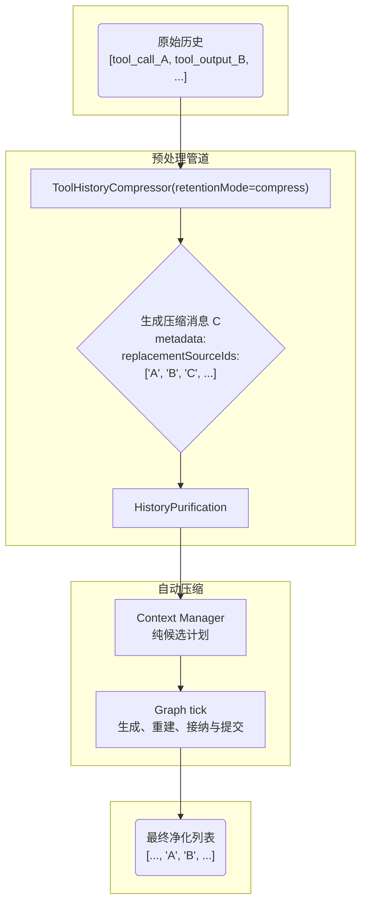

# Agent Context Manager 架构文档 (v4.3 - Fence-first 上下文注入)

`packages/linnkit/src/context-manager/*` 是 Agent 平台内部的通用上下文子系统。

这份 README 记录当前 `Agent Context Manager` 的权威架构说明：

- `shared/*` 放共享的上下文 pipeline、预处理器与格式化能力
- `features/context-compaction/*` 放自动压缩的纯计划、校验与 summary draft 能力
- `profiles/agent/*` 放 Agent profile 的上下文构建、工作记忆、事件转换与任务能力

> **2026-06-22 定稿口径**
>
> - 长期目标是 **agent-only core**：统一一套 agent pipeline
> - 纯聊天只是 **不注册工具、不给执行能力的 agent 形态**
> - `profiles/chat/*` 已物理删除；host 的单轮/无工具能力应注册为 tools-disabled agent

本文重点是 **Agent profile 的详细上下文构建机制**。Provider pipeline、示意图、协议不变量和工具组一致性规则以当前实现为准。

> 公开接入文档入口：
>
> - 想知道“预算 / 工具历史 / 自动压缩 / must-keep 到底改哪里”，先读 [`docs/integration/context-engineering.md §0.1`](../../docs/integration/context-engineering.md#context-policy-source-of-truth)。
> - 想定义或注册 agent，读 [`docs/integration/agent-registration-guide.md`](../../docs/integration/agent-registration-guide.md)。
> - 想接入 host 上下文注入，读 [`docs/integration/context-fences.md`](../../docs/integration/context-fences.md)。
>
> 本 README 只解释 context-manager 内部结构。模型容量的真相源是 prepared model route；Agent 上下文行为与可选容量 cap 的配置真相源是 `AgentSpec.contextPolicy`。本模块里的 builder / preprocessor / provider / execution 配置都是已解析结果的运行时消费点，不应另起一套局部默认。

---

## 上下文窗口概念模型

### Context Injection 与 FenceRegistry

Agent profile 支持通用的 `context_injection` 消息类型，用来承载 host 注入的上下文。framework 只理解通用协议：

- `metadata.fenceKind`：host 注册的 fence kind
- `metadata.fenceAttrs`：formatter 需要的结构化属性
- `metadata.fencePlacement`：注入位置

具体标签由 host 的 `FenceRegistry` 决定。不同 host 可以分别注册自己的 policy、selected-content、system-event 或 user-reference fence；这些标签字面都不属于 framework。

`BaseAgentTask` 只展开 `request.fences`，不再拼接产品字段。接入方应在进入 linnkit 前把自己的请求字段转换为 `FenceInjection[]`，并在 formatter 侧传入同一个 registry。

> 以下是发送给 LLM 的 messages 数组的直观分层结构，是所有预处理和 Provider 编排后的最终产物。
> 由 `profiles/agent/context/AgentContextManager.ts` 产出，消息按 **类型分组 + 组内时序** 排列。

### 一次上下文构建的稳定形态

```text
┌─────────────────────────────────────────────────┐
│  [system prompt]                                │ ← 静态，可缓存（Must-Keep）
├─────────────────────────────────────────────────┤
│  [context_injection fences]                     │ ← host 注册的上下文注入（如有）
├─────────────────────────────────────────────────┤
│  [history_summary]                              │ ← 自动压缩成功后存在
├─────────────────────────────────────────────────┤
│  [对话历史 + 工具交互]                            │ ← 按优先级填充（反向）
│    旧对话 user↔assistant（P2）                   │
│    旧工具交互（P3，历史段最多 12 组）               │
│    最近 2 组原始工具交互（P1，最高优先级）           │
│    当前 user_input（Must-Keep）                  │
│    当前轮工具交互组（不限组数，仅受预算约束）          │
└─────────────────────────────────────────────────┘
```

自动压缩不是 Agent 工具，也不增加图节点。Context Manager 每次构建时只产出一个可选的
`ContextCompactionCandidate`：其中包含最老可替换区段、精确来源 ID 和压缩策略。压缩模型的输入由 Graph 直接复用 reminder 后的完整 Prompt，不由 Context Manager 另选一份消息子集。
Graph tick pipeline 依据 reminder 后的最终 Prompt 计量决定是否执行压缩。

压缩模型输出通过格式与 token 校验后，Context Manager 用尚未发布的 `history_summary`
草稿重建上下文。只有重建后的主 Prompt 通过容量门禁，Graph 才先请求 Host durable commit；
落盘确认后再发送进度 end，并经唯一 publisher fan-out 同一事实，随后才允许调用主模型。
压缩只替换 LLM 可见上下文，不重置 Graph 步数预算。

---

## 核心架构：预处理 + Provider pipeline

本架构将上下文构建分为两大步骤，实现职责分离：

1. 预处理管道：先规整、保留/删除旧工具组并净化消息
2. Provider pipeline：按“核心 → 工作记忆”在 token 预算内选择消息，并纯计算自动压缩候选。

### 事件进入上下文的不变量（2026-03 权威口径）

当前 Agent Context 的准入规则已经改为显式事件语义：

- 允许进入下一轮 LLM 上下文的工具事件：
  - `tool_call_decision` → 转成 `assistant.tool_calls`
  - `tool_output` → 转成 `tool`
- 明确禁止进入下一轮 LLM 上下文的事件：
  - `tool_process`
  - `subrun_trace`
  - hidden `user_input`
  - 空的终态 `thought / final_answer`
- `ephemeral` 在本模块里**不参与上下文准入判断**
  - 它只表示“是否允许持久化”
  - 上下文过滤统一由 `packages/linnkit/src/runtime-kernel/events/eventGovernance.ts` 的 `shouldEnterAgentContext(...)` 决定

业务工具的历史保留由宿主使用通用 tool history policy 配置；policy 可以匹配正式 `tool_name`。Context Manager 不硬编码宿主工具名，也不为某个业务工具维护专属快照或准入分支。

### SDK 统一后的上下文语义

Agent Context 已经不再接受“按 SDK 分叉消息协议”的做法。

统一规则：

- 无论消息来自 OpenAI-compatible、Claude 还是 MiniMax
- 进入上下文前都必须先收敛成同一套 `AiMessage`
- 回放时都必须遵守同一套：
  - `assistant.tool_calls`
  - `tool`
  - `provider_continuations`
  - provider sidecar metadata

这意味着：

- Claude / MiniMax 可以继续通过 Anthropic Messages 协议提供 `thinking_blocks`
- 但这些 Provider 私有载荷只能作为带 producer identity 的 `provider_continuations` 存在
  - `AgentWorkingMemoryProvider`、自动压缩、历史净化都不应该感知 Anthropic 私有执行语义

### 与 replay / UI 的边界

- `tool_call_decision` 是历史事实锚点，因此必须允许 replay，且下一轮仍可进入上下文
- `tool_process` 只服务实时 UI 投影，即使未来某些场景把它落库，也不能因此放行到上下文
- `tool_call_id` 继续作为 `tool_call_decision ↔ tool_output` 配对与前后端归并的稳定锚点

### 测试归属

`packages/linnkit/src/context-manager/profiles/agent/` 的测试属于 Linnkit 的 framework contract：它们验证 package-neutral 的消息编排、工具组保留、摘要净化和 working-memory 策略。具体 host 的请求映射、注册表和 UI 回放应在 host 自己的集成测试中验证。

当前代表性回归：

- `profiles/agent/context/providers/__tests__/multiToolFollowup.integration.test.ts`
  - 锁多工具 follow-up 在工具历史保留、working memory、history purification 之间的框架语义闭环
  - 同时锁真实 `provider_continuations` 穿过三阶段后仍挂在同一条 `assistant(tool_calls)` 上
- `profiles/agent/preprocessors/__tests__/toolReplayProtocolGuard.test.ts`
  - 锁 DeepSeek 这类 provider 的历史工具组协议守卫：缺真实 sidecar 只能降级为文本，不能从 thought 伪造
- `profiles/agent/preprocessors/__tests__/toolHistoryCompressor.test.ts`
  - 锁工具组原子保留/删除；兼容压缩模式下锁 `replacementSourceIds` 语义
- `profiles/agent/context/providers/__tests__/agentWorkingMemoryProvider.toolLimit.test.ts`
  - 锁 working memory 的工具组预算策略

中文备注：

- 这些测试是产品正确性护栏
- 不是 kernel verification set

### Token 预算与最终 Prompt 的边界

Context Manager 负责 messages 的选择、候选计划和压缩后重建，不负责决定何时调用模型或提交事实。Graph 集成以 prepared model 的正式 route 作为总窗口和最大输出基线；Agent policy 只有显式声明 `maxTokens / reservedForResponse` 时才能进一步收窄。有效输入预算还要扣除 prepared Tool definitions，`ContextBuildResult.tokenUsage` 明确保存 `messageBudget / inputBudget / toolDefinitionTokens`。

system reminder 和 tools 位于 Context Manager 边界之外，因此最终 Prompt 占用由 Graph 的 `measure_prompt_usage` stage 负责。达到软阈值时可执行自动压缩；严格超出硬上限时必须先压缩成功才可继续。内部压缩请求逐条复用普通 reminder 已注入的主 Prompt，再追加一条瞬态 user-role 消息承载专用压缩 reminder；重建后由 Graph 按同一规则重新生成普通 reminder、重新计量并通过 `admit_prompt_capacity`，再由 `commit_context_compaction` 按“Host durable commit → progress end → 唯一 publisher fan-out”提交 `history_summary`。durable `history_summary` 当前以 system role 投放到后续主 Prompt，它是压缩结果，不是压缩 reminder。Context Manager trace、telemetry 和 component ledger 都不能替代这份执行事实；reminder 的压缩前后语义见 [`context-engineering.md §6`](../../docs/integration/context-engineering.md#system-reminder) 与 [`runtime-kernel/system-reminder/README.md`](../runtime-kernel/system-reminder/README.md)。

---

## 第一步：预处理管道 (`shared/preprocessors/*` + `profiles/agent/preprocessors/*`)

**目标**：在进入核心构建逻辑前，对原始消息列表进行规整、清洗和优化。

### 1. `ToolHistoryCompressor`

**先执行**。负责处理**历史段**中的完整**工具交互组**：保留窗口内原样保留，窗口外默认整组删除；当 `toolHistory.retentionMode: 'compress'` 时，才把窗口外工具组压缩为单条 `final_answer` 摘要消息。

这里的“压缩”只完成第一步替换：raw `tool_calls/tool_output` 被移除，留下带 `metadata.isCompressedToolHistory` 的摘要消息。摘要消息之后仍要进入 working memory 的 P3 历史工具交互阶段竞争预算，因此不会因为已经压缩就永久保留。

#### 工具交互组定义

- 一条 `assistant.type === 'tool_calls'` 是组锚点
- 该消息中的全部 `tool_call.id` 与其全部 sibling `tool_output` 共同构成一个原子组
- 保留决策只能按整组操作：整组保留、整组删除或整组压缩，禁止按单个 `tool_output` 做部分替换
- 工具结果附件属于该原子组；图片不增加额外保留窗口，也不能脱离所属 `tool_output` 单独 keep/drop

#### 关键实现

- 仅在 `retentionMode: 'compress'` 时，新摘要消息通过 `metadata.replacementSourceIds` 记录整组被替换掉的原始消息 ID
- 同时补充：
  - `compressedToolCallIds`
  - `compressedToolNames`
  - `toolInteractionGroupSize`

#### 同一 run 内的循环为何不压当前轮工具消息

在图执行引擎中，每一次 `tick` 都会调用 `AgentMessageOrchestrator`，并完整走一遍：

- 预处理管道
- Provider pipeline 上下文构建

`ToolHistoryCompressor` 的“历史/当前轮次”切分边界是：

- 从后向前找到最后一条 `type === 'user_input'` 的消息
- 其之前视为“历史段”
- 其之后视为“当前轮次段”

因此：

- 用户发起新请求那一次：最后一条 `user_input` 是本轮新问题，其之前的旧工具交互落在“历史段”，会按 `toolHistory` 保留窗口处理
- 同一个 run 内多次工具调用循环：通常不会产生新的 user 消息，最后一条 `user_input` 仍是本轮起点；run 内新产生的 `tool_calls/tool_output` 都位于该 `user_input` 之后，属于当前轮次段，被刻意保护不处理

### 2. `ToolReplayProtocolGuard`

**工具历史处理后、净化前执行**。它是 required route 的协议门禁：

- 正向链路必须先保证 text/reasoning/tool 按 `assistant_replay_parts` 的原始顺序进入 assistant 产出事件；
- 每个 `provider_continuations` 必须绑定到所属 replay part，聚合字段不能单独证明回放顺序；
- 工具决策位于 `tool_call_decision.payload.assistant_replay_parts`，最终回答位于 `final_answer.assistant_replay_parts`；
- 回放时进入 `AiMessage.metadata.assistant_replay_parts`，再由 formatter 放回同一条 assistant 消息。
- 同一次 Assistant 产出的完整 `thought` 仍作为 UI / 审计事实持久化，但永不进入模型上下文；canonical `reasoning` 只由 ordered replay 回放。

当 Host 根据显式 route 注入 required 策略时，守卫检查所有完整工具组：每个 tool call 都必须在 ordered parts 中有对应 continuation；缺失则抛出 fatal 协议错误。历史轮次和当前轮次执行同一规则，避免新链路缺陷被隐藏。

注意：`thought` 或 `<think>` 文本不是 provider replay sidecar，不能被折回去伪造 continuation。Host 必须通过 `assistant_part_end` 交付完整 canonical reasoning 与 continuation；文本不一致是 conformance 错误，不产生第二条模型消息兜底。

`linnkit` 不根据 `model_id` / provider 名称内置任何厂商判断。宿主应在组装 `AgentMessageOrchestrator` 或 `PreprocessorPipeline` 时，通过 `toolReplayProtocolPolicy` / `resolveToolReplayProtocolPolicy` 显式传入策略。

### 3. `HistoryPurification`

**随后执行**。负责根据最新摘要中的 `replacedMessageIds` 列表，移除所有已被摘要覆盖的旧消息。

关键实现：

- 不只移除 ID 在列表中的消息
- 还会检查消息的 `replacementSourceIds`
- 如果一个压缩消息的来源 ID 在净化列表中，那么这个压缩消息本身也会被一并移除，实现“自我吞噬”闭环

中文备注：

- `HistoryPurification` 是 shared 预处理能力，不与某个 Provider 或压缩触发器绑定

---

## 第二步：Provider pipeline (`profiles/agent/context/`*)

**目标**：在给定 token 预算内，通过选择与允许的截断，生成发送给 LLM 的消息组合。Provider pipeline 不调用模型。

### 阶段一：核心上下文保留层 (Must-Keep)

始终无条件保留三部分：

1. 系统提示词 `system_prompt`
2. 最新用户输入 `user_input`
3. 标记为 must-keep 的 `context_injection` fence
  - `role` / `placement` / `lifetime` 由 host 注册的 `FenceRegistry` 决定
  - framework 只识别 `metadata.fenceKind` 和 `metadata.fencePlacement`
  - 具体标签字面（如 `<additional_context>`）属于 host，不属于 linnkit core

#### 极端情况

如果 Must-Keep 自身超预算，系统将采取截断策略：

- 保持系统提示词和用户输入不变
- 仅对允许截断的 fence 进行截断
- 每种 fence 的预算上限由 `FenceDescriptor.maxBudgetFraction` 或 host 的 `MustKeepPolicy` 决定

该阶段由 `AgentCoreContextProvider` 负责实现。

### 阶段二：工作记忆填充层 (Working Memory)

采用**工具优先填充策略**，使用所有剩余预算，从最新消息开始反向填充，直到预算耗尽。

#### P1：工具交互组保留

##### 最近工具组原子保留

- 识别最近的 2 组原始工具交互，标记为最高优先级
- 实现按组保留，确保 assistant 锚点与全部 sibling `tool_output` 一起进入上下文

##### 范围说明

- 同一轮 user 之后产生的工具组：默认不做数量上限裁剪，只受 token 预算约束
- user 之前的历史段：仍然只保留最近 2 组原始结构工具交互，避免历史工具消息膨胀

#### P2：核心对话

处理纯文本对话（`user`, `assistant`）以及可能存在的最新摘要。

此时收到的数据已经过预处理，不再负责摘要筛选和去重。

#### P3：历史工具交互

处理历史工具摘要，以及保护窗口内尚未处理的历史 raw 工具组。

- raw 工具组窗口：当前工具 turn + 最近一个历史工具 turn，按 `runOrdinal` 判断
- 超出窗口的 raw 工具组维持整组 drop，不在 working memory 阶段重新捞回
- 硬上限：压缩工具摘要和历史工具交互最多保留 12 组
- `retentionMode: 'drop'`：窗口外旧工具组在预处理阶段已经删除，P3 看不到这些旧组
- 压缩工具摘要识别（仅 `toolHistory.retentionMode: 'compress'` 时出现）：
  - 预处理阶段被压缩成 `role: 'assistant'`
  - 且 `metadata.isCompressedToolHistory === true`
  - 这类消息在 working memory 中也算一组工具交互，同样受 12 组上限约束

注意：P3 的 12 组上限只作用于历史段，不会裁剪同一轮 user 之后的工具组。

#### 工具组保留策略

单次 run 内默认行为：

- 最近 2 个 turn 内的工具组 `tool_calls ↔ tool_output(s)` 结构整组保留
- `tool_calls.function.arguments` 在构建期不按尺寸截断，避免把“参数过长”伪造成执行失败原因
- `tool_output` 的尺寸治理只发生在执行期 `observationGovernance`，工作记忆层不再二次摘要
- 不得打散 assistant 锚点与 sibling outputs 的结构

预算行为：

- 保护窗口内工具组即使超过 working memory 预算，也会原样保留；这是为避免最近行动链被改写的显式取舍
- 超出 turn 窗口的旧 raw 工具组整组 drop；如果配置了 `retentionMode: 'compress'`，只保留预处理阶段生成的自然语言摘要
- 单个超长 output 依赖执行期 `observationGovernance` 先落盘为 preview，默认阈值是 `20_000` 字符或 `1_200` 行；构建期只看到 preview

注意：“原样保留”只表示 working memory 不再二次摘要/改写已经进入历史的 `tool_output`，不表示 output 跳过执行期落盘。output 没有 build 期 token cap，只有执行期字符/行阈值。

收益：

- 避免单次 run 内工具链断裂
- 避免 Agent 因构建期改写 input/output 而误判工具失败原因

该阶段由 `AgentWorkingMemoryProvider` 负责实现。

辅助模块位于 `profiles/agent/context/providers/working-memory/`*：

- `ToolPairMatcher`
- `ToolRunWindow`
- `ReplacementSourceTagger`

### 自动压缩的纯计划与重建边界

Provider pipeline 本身不调用摘要模型。`AgentContextManager` 在常规构建完成后做两件确定性工作：

1. `selectContextCompactionCandidate` 只从已经 materialize、真正进入本次主 Prompt 的消息中选择最老可替换区段。完整工具组不可拆，最新用户请求、must-keep、附件、不完整工具组和最近工具组不可替换。
2. Graph 获得模型输出后，`prepareContextCompactionDraft` 校验固定摘要格式与 token 上限，创建尚未发布的 `history_summary` 草稿，并用该草稿重建上下文。

预处理来源历史不参与候选排序或释放量估算，只用于对 `replacementSourceIds` 与旧 `history_summary.replacedMessageIds` 计算传递闭包，并递增 durable summary seq。因此新摘要能精确覆盖此前已经被压缩的来源，又不会优先采样主 Prompt 根本没携带的旧消息。Context Manager 不决定触发时机、不发布 RuntimeEvent、不等待数据库，也不修改 Graph 步数。

`ContextBuildResult` **始终**返回已解析的 `contextCompactionPolicy`，但只在真有可替换区段时返回 `contextCompactionCandidate`。这两者不能合并成一个可选字段：Graph 需要在“压缩已启用 + Prompt 硬超限 + 无候选”时结算 `context_compaction_insufficient`，而不是退回普通的 Prompt 容量错误。

旧链路中 Context build 内的 Summary Provider、专用摘要 Agent、`generateSummary` callback、RuntimeEvent 与 internal LLM usage 旁路均已删除。自动压缩的模型调用只属于 Graph 独立 stage，并使用当前 Agent 的模型与系统提示词。

---

## 核心数据流与 `replacementSourceIds`

工具历史压缩与自动上下文压缩共同依赖 `metadata.replacementSourceIds`。它记录一条派生消息真实代表的来源，避免消息合并后丢失原始身份。

这里有一个重要边界更新：

- `replacementSourceIds` 只记录**当前消息真实替代或代表的工具组 source ids**
- 不再向相邻 `user_input / final_answer` 扩散
- 因此后续 `history_summary` 只会递归收集真正被替换的工具历史，不会再顺手吞掉无关文本对话




生产者：

- `ToolHistoryCompressor`
- `AgentWorkingMemoryProvider`

消费者：

- `selectContextCompactionCandidate`
- `HistoryPurification`

这个机制保证无论消息经过多少次变换，其最原始的身份信息都不会丢失，从而实现精确、可靠的历史净化。

---

## 关键文件职责

### `profiles/agent/tasks/BaseAgentTask.ts`

统一 Agent 任务接口。核心 `buildMessages()` 方法负责将：

- 用户请求
- 工具描述
- 上下文文档
- 历史消息

组装成一份**原始、完整且时序正确**的消息列表。

### `profiles/agent/orchestration/AgentMessageOrchestrator.ts`

作为数据准备调度中心，完整编排：

- 事件转换
- 任务构建
- 预处理管道
- 上下文优化

### `profiles/agent/context/AgentContextManager.ts`

上下文优化核心实现。它接收预处理后的消息列表和 token 预算，通过编排各 Provider 生成预算约束下的消息组合，同时产出可选的自动压缩计划。压缩后重建仍复用同一入口；模型调用、容量接纳和事实提交归 Graph tick pipeline。

### `shared/MessageFormatter.ts`

负责最终“出关”：

- 将 `AiMessage` 翻译成 LLM API 能完全理解的标准格式
- 这是确保工具调用、附加上下文和 provider sidecar 信息被正确传递的关键

---

## 事件转换层：`eventConverter` vs `eventMappers`

系统中存在两个事件转换模块，各自职责不同。

### `profiles/agent/utils/eventConverter.ts`

局部数据准备转换器。

职责：

- `RuntimeEvent[] -> AiMessage[]`
- `AiMessage -> RuntimeEvent`

使用场景：

- 仅用于 context manager 内部
- 负责历史记录进入上下文构建前的数据准备

关键点：

- 正确映射摘要元数据字段
- 正确映射 `tool_call_decision / tool_output`
- 统一过滤 `tool_process`

### Runtime Kernel 侧 `eventMappers`

运行时事件流映射器。

职责：

- `AnyAgentEvent -> SSEEvent`
- `AnyAgentEvent -> RuntimeEvent`

使用场景：

- Graph 执行主链路的输出侧
- 服务于实时推送和持久化

总结：

- `eventConverter` 处理批量、静态的历史数据
- `eventMappers` 处理单个、动态的实时事件

---

## 文件结构

```text
packages/linnkit/src/context-manager/
├── README.md
├── index.ts
├── features/
│   └── context-compaction/
│       ├── definitions/          # 候选、重建与 summary draft 合同
│       └── functions/            # 选择、格式校验、draft 创建与重建校验
├── shared/
│   ├── MessageFormatter.ts
│   ├── context-manager-base.ts
│   ├── context-pipeline.ts
│   ├── context-result.ts
│   ├── toolInteractionGroup.ts
│   ├── index.ts
│   ├── preprocessors/
│   │   ├── base.ts
│   │   ├── currentTurnMessageAssembler.ts
│   │   ├── fenceLifetimeManager.ts
│   │   ├── historyPurification.ts
│   │   ├── index.ts
│   │   └── priority.ts
│   ├── providers/
│   │   ├── base.ts
│   │   ├── index.ts
│   │   └── registry.ts
│   └── fences/                   # FenceRegistry 与 formatter 合同
├── profiles/
│   ├── agent/
│   │   ├── config.ts
│   │   ├── contracts.ts
│   │   ├── orchestration/AgentMessageOrchestrator.ts
│   │   ├── context/
│   │   │   ├── AgentContextManager.ts
│   │   │   ├── ConversationSession.ts
│   │   │   ├── config.ts
│   │   │   ├── index.ts
│   │   │   └── providers/
│   │   │       ├── AgentCoreContextProvider.ts
│   │   │       ├── AgentWorkingMemoryProvider.ts
│   │   │       ├── base.ts
│   │   │       └── index.ts
│   │   ├── preprocessors/
│   │   │   ├── toolHistoryCompressor.ts
│   │   │   └── toolReplayProtocolGuard.ts
│   │   ├── tasks/
│   │   │   ├── BaseAgentTask.ts
│   │   │   └── base.ts
│   │   ├── tools/ToolManager.ts
│   │   └── utils/
│   │       ├── eventConverter.ts
│   │       └── toolOutputSummarizer.ts
```

---

## Host 上下文注入策略

### 数据来源与字段约定

Agent profile 不直接理解任何 host 富请求字段。`BaseAgentTask.buildMessages()` 只展开 `request.fences`，每一条 fence 会变成通用的 `context_injection` 消息。

host 可以拥有自己的富请求字段，但必须先由适配层校验并转换为 `FenceInjection[]`，再交给 linnkit。framework 不命名这些字段，也不为它们定义表达层语义。

### Host 如何构建这些上下文

例如，host 可以注册自己的 fence 家族：

- `policy-context`：持久化策略上下文，通常放在 system 之后
- `selected-content`：当前轮选中的内容
- `user-reference`：当前轮用户引用

这些 fence 的 formatter 可以输出 host 自己需要的标签，例如：

- `<policy_context> ... </policy_context>`
- `<selected_content> ... </selected_content>`
- `<user_reference> ... </user_reference>`

标签、中文前缀、属性名、生命周期都由 host 注册表决定；linnkit 只负责预算、排序、生命周期和最终格式化调度。

当前轮用户侧上下文采用“同一 user request block”模型：`before-current-user` / `after-current-user` 的 user-side fence 不会作为多条独立 `role=user` wire message 发给模型，而是按实际注入内容组装到当前 `user_input` 中。未注入的 fence 不会产生空 XML 或占位符。

### MessageFormatter：`context_injection` → registry formatter

最终在调用 LLM 前，所有 `AiMessage` 会经过 `shared/MessageFormatter.ts` 统一“出关”。

对于 `type: 'context_injection'`：

```ts
const descriptor = registry.get(metadata.fenceKind);
return {
  role: descriptor.llmRole,
  content: descriptor.formatter(content, metadata.fenceAttrs ?? {}),
};
```

也就是说：

- framework 不硬编码 `document_fragment`
- framework 不硬编码 `<additional_context>` 或任何 host 标签
- framework 不输出 `<formatter(before-current-user fence)>` 这类概念占位符；只有真实注入的 fence 会调用 host formatter 产生实际 XML
- `task_request` / `task_completion` 等 framework 协议消息只做纯透传

设计意图：

- framework 负责通用上下文工程：预算、排序、生命周期、自动压缩、工具组一致性
- host 负责产品表达：标签、中文说明、项目/文档/引用等业务字段如何呈现给 LLM
- 这样 linnkit 可以作为框架复用，而不是把某个 host 的产品语义写进 core

---

## 协议治理与不变量

这部分是当前 `agent` context manager 的权威协议说明。以后修改 `eventConverter`、`AgentWorkingMemoryProvider`、自动压缩或工具历史保留逻辑时，以这里为准。

### 一、回放协议不变量

#### 1. `action` 进入 LLM 上下文时，只能代表 LLM 的工具决策锚点

- 允许进入回放的 `tool_call_decision` 只代表模型产生的 `assistant.tool_calls`
- `ToolNode` 产生的 `tool_process(start/update/complete/error)` 只是过程事件，不得进入下一轮 LLM 上下文
- 当前唯一稳定判定标准是 `meta.origin === 'tool_node'`

#### 2. 工具交互组必须保持原子性

最小工具交互必须包含：

- `assistant/tool_calls`
- `tool/tool_output`

约束：

- 如果 `tool_output` 被保留，但缺失对应 `tool_calls`，视为协议损坏
- 如果 `tool_calls` 被保留，但 `tool_call_id` 无法在同组 `tool_output` 中闭合，也视为协议损坏
- 工具历史保留、压缩和 working memory 选择只能按组操作，不能拆出单个 sibling `tool_output`
- attachment 不改变这一规则：含图与无图工具组服从同一选择策略，图片随完整工具组同进同退

#### 3. `payload.tool_calls` 是回放权威载荷

- 当 `RuntimeEvent(tool_call_decision).payload.tool_calls` 存在时，回放必须优先原样使用
- 不允许随意退回“按 `tool_name + args` 最小重建”的兼容写法，除非历史数据本身确实缺失 payload
- 原因是部分 provider 会返回签名等关键回放状态；Host 必须把这些状态投影到 part 级 `provider_continuations`
- 当一次模型决策包含多个工具调用时，`payload.tool_calls` 必须保存**整批**工具调用，而不是拆成多条独立 `tool_call_decision`

#### 4. replay 时不能丢 provider/protocol 关键字段

- `payload.tool_calls`
- `provider_continuations`
- `assistant_replay_parts`
- `tool_output.metadata.data`

这些字段不是调试信息，而是回放、可选压缩和 provider 兼容链路的一部分。

字段落点约定：

- `RuntimeEvent(tool_call_decision).payload.assistant_replay_parts` 与 `RuntimeEvent(final_answer).assistant_replay_parts` 是有序 Assistant 事实的标准位置。
- `AiMessage(type='tool_calls' | 'final_answer').metadata.assistant_replay_parts` 是上下文回放后的标准位置；聚合 `provider_continuations` 只作为事实查询字段，不能脱离 ordered parts 回放。
- 同一 Assistant turn 的 durable `thought` 与 ordered replay 可以同时存在于事件历史中，但模型上下文只允许 ordered replay 一个 reasoning owner；所有 thought 都不单独投影为 AiMessage。
- `tool_calls[*]` 只保存 canonical 的 `id/type/function`；Provider 私有字段不得进入工具调用本体。
- Provider 的不透明回放状态只允许进入带 producer route identity 的 `assistant_replay_parts[*].provider_continuations`。
- `formatAgentLlmMessages(messages)` 是 Agent 模式推荐出关 helper，固定输出 native tools 形态，并把 ordered parts 放回对应 assistant 消息。
- canonical reasoning 随所属 ordered replay 保留到正式压缩；continuation 必须留在所属 replay part 上。
- `ToolReplayProtocolGuard` 只根据 Host 注入的 route 能力治理完整工具组；它不能从 `thought` 或 `<think>` 推断 continuation。

注意：

- `RuntimeEvent(tool_output).observation` 是模型唯一文本视图，`data` 是程序化事实；转为 AiMessage 后分别位于 `content` 与 `metadata.data`，不得保存另一份原始 JSON 影子副本。
- `subrun_trace` 是 UI / 子过程侧车，不进入主 Agent 上下文，不能和 provider replay sidecar 混用。
- 被 `ToolHistoryCompressor` 删除的旧工具组不再进入上下文；在 `retentionMode: 'compress'` 下被压缩、或被 `history_summary` 替换的旧工具组不再具备结构化 replay 能力，只保留摘要文本；最近保留的原始工具组必须完整保留这些字段。
- required route 缺失有序 tool continuation 时必须失败；不提供文本降级、空字段标记、排序猜测或 legacy replay。

#### 5. `final_answer_chunk` 只属于流式过程，不属于历史事实

- chunk 只进入 RuntimeEvent 实时主链；完整答案由 Graph 内的 `FinalAnswerAssembler` 原样聚合后通过同一 publisher 发布
- 真正进入持久化与回放事实链路的应是 `final_answer`
- 回放层不能把 chunk 当成历史消息源

### 二、上下文过滤不变量

以下事件默认不得进入 LLM 上下文：

- `subrun_trace`
- `metadata.ui.presentation === 'hidden'` 的 `user_input`
- `meta.origin === 'tool_node'` 的 `action`
- 空内容的终态 `thought / final_answer`

治理要求：

- 这些过滤规则必须集中收敛在回放转换层，例如 `profiles/agent/utils/eventConverter.ts`
- 不要把过滤逻辑分散到各个 Provider 再各写一份
- 不要硬编码宿主业务工具名增加过滤或保留特例；工具历史只通过通用 tool history policy 治理

### 三、工作记忆与自动压缩不变量

#### 1. 工具组优先级高于纯文本对话

- 当前轮工具组优先于纯文本对话
- 近历史工具组优先于更旧工具组
- 纯文本消息不能挤掉最近工具锚点

#### 2. `replacementSourceIds` 只能指向真实替代来源

- 工具历史压缩消息上的 `replacementSourceIds` 只能记录该消息真实代表或替代的 source ids
- 禁止把相邻 `user_input / final_answer` 顺手并进去

#### 3. 摘要闭环必须依赖 `replacementSourceIds / replacedMessageIds`

- 压缩消息必须带 `replacementSourceIds`
- 后续生成 `history_summary` 时，`replacedMessageIds` 必须能覆盖这些来源
- `HistoryPurification` 必须能消费这套关系

#### 4. 最新摘要的权威选择应以 `summarySeq` 为主

- 范围锚点是历史兼容字段，不应继续扩散为主判定依据
- 后续若清理旧语义，应优先收敛到 `summarySeq + 精确 replacedMessageIds`

#### 5. 自动压缩结果必须先校验再重建

- 摘要输出使用固定章节格式，不能从任意展示文案猜测结构
- `replacedMessageIds` 来自压缩计划，不由模型生成
- 重建后的消息集合、来源闭包与压缩收益必须通过确定性校验

### 四、代码评审清单

以后修改以下模块时，评审至少过一遍这份清单：

- `packages/linnkit/src/context-manager/profiles/agent/utils/eventConverter.ts`
- `packages/linnkit/src/context-manager/profiles/agent/context/providers/AgentWorkingMemoryProvider.ts`
- `packages/linnkit/src/context-manager/profiles/agent/preprocessors/toolHistoryCompressor.ts`
- `packages/linnkit/src/context-manager/profiles/agent/preprocessors/toolReplayProtocolGuard.ts`
- `packages/linnkit/src/context-manager/shared/preprocessors/historyPurification.ts`

必查项：

1. 有没有让过程事件误进入历史回放
2. 有没有绕开 `payload.tool_calls` 直接重建协议字段
3. 有没有把 UI/调试字段泄露到模型消息内容
4. 有没有破坏 `tool_calls + tool_output` 原子组
5. 有没有让 `replacementSourceIds` 指向不真实的替代来源
6. 有没有把普通 thought / `<think>` 文本伪造成 provider replay sidecar

### 五、最低回归要求

每次动到执行期协议、回放协议或上下文构建协议，至少跑这些测试：

- `src/app-hosts/linnya/adapters/flow/__integration-tests__/flow.followup-tool-history.integration.test.ts`
- `packages/linnkit/src/context-manager/profiles/agent/utils/__tests__/eventConverter.test.ts`
- `packages/linnkit/src/context-manager/profiles/agent/utils/__tests__/replayHarness.test.ts`
- `packages/linnkit/src/context-manager/profiles/agent/context/providers/__tests__/multiToolFollowup.integration.test.ts`

如果改动涉及中断、恢复或自动压缩，还要额外跑：

- `src/app-hosts/linnya/adapters/flow/__integration-tests__/agentRunner.interrupted.integration.test.ts`

### 六、当前仍存在的语义债务

- Provider 与回放层之间仍依赖少量隐式命名契约，例如 `replacementSourceIds / replacedMessageIds`
- 后续改动必须同步补回归，并保持与 schema / 测试的一致性
