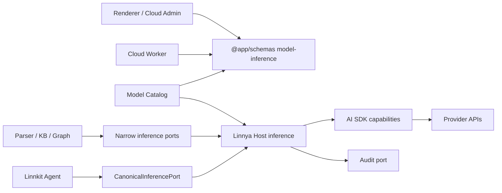

# Model Inference

本文是 Linnya 模型推理能力的正式模块边界。它约束桌面端、Renderer、Cloud、Linnkit 与 Provider SDK 的职责和依赖方向。实现与本文冲突时，必须先修正实现或更新架构决策，禁止在调用点增加兼容分支。

## 1. 核心原则

1. 产品模型目录、业务调用策略与 Provider wire protocol 是三个不同的变化原因，必须由不同模块拥有。
2. 一条模型 route 在一次发布中只绑定一个 capability；禁止双发、旧实现 fallback、协议猜测和第二套 SSE parser。
3. 跨进程、跨部署共同交换的 route 是产品 wire contract，只能有一个 schema owner。
4. 调用方只依赖自己需要的窄 port。Parser、Knowledge Base、Graph worker、OCR 和 ASR 不得依赖宽 `AIEngine`。
5. Provider SDK 只能出现在 Host capability 内，不能进入 Linnkit、Renderer、Model Catalog 或业务 domain。
6. retry、模型切换、工具执行、持久化和审计各有唯一 owner，Provider capability 不得越权。
7. 不支持运行时兼容。已知存量数据通过一次性迁移处理；新 schema 不双读旧字段。

## 2. Domain 本地合同

`model-inference` 拥有非 Agent 业务可消费的 vendor-neutral 推理能力合同。它不拥有 Provider SDK、模型目录、凭据、Agent 策略或业务 retry。

目录与公开能力：

- `features/text-generation/`：一次无工具文本/视觉生成的 request、result、failure 与 port；
- `features/embedding/`：向量生成合同、typed failure 与批次顺序、数量、维度和有限值不变量；
- `features/reranking/`：重排合同、typed failure 与 `originalIndex` 身份、分数不变量；
- `index.ts`：Parser、Knowledge Base 和 Graph 等调用方唯一允许依赖的公开入口。

本 domain 不读取 Model Catalog，不创建 Provider SDK 实例，也不访问 credential。App Host 在 `src/app-hosts/linnya/adapters/inference/` 实现这些 port；retry、fallback、索引重建和并发属于调用方业务流程，每次 Host 调用只执行一个 attempt。

Text Generation 只支持当前真实消费者需要的 system/user 文本与图片输入，不提前加入工具调用或 Assistant continuation。Agent 继续使用 Linnkit `CanonicalInferencePort`，不能反向改用这里的窄 port。

Embedding 只表达“按输入顺序生成向量”，不知道 Qdrant、知识库、分批进度或索引重建规则。Reranking 只表达“query + 原始 documents → 原始索引 + 分数”，不知道 RRF、文档存储或失败后是否继续搜索。两者的 `usage.raw` 只保留 Provider 实际返回的事实，不构造本地 token 出身或假分数。

禁止新增总括性的 `InferenceEngine`、`AIEngine`、manager 或 service。

## 3. 模块职责矩阵

| 模块 | 负责 | 不负责 | 允许依赖 |
|---|---|---|---|
| `@app/schemas/model-inference` | language/embedding/reranking route 的跨端类型、schema、严格 parser；已启用 surface 与稳定 capability identity 的映射 | 模型目录、密钥、价格、Provider 实例、网络调用、retry | Zod 与基础 JSON 合同 |
| `@app/schemas/document-ocr` | 文档 OCR layout/job route 的跨端判别联合与 Host capability identity | Parser 策略、凭据、网络调用、Cloud 网关实现 | Zod 与基础 JSON 合同 |
| `@app/schemas/transcription` | OpenAI Audio/DashScope ASR route 的跨端判别联合与 capability identity | 音频切分、模型选择、凭据和网络调用 | Zod 与基础 JSON 合同 |
| `src/domains/model-catalog/` | 模型目录、用户/默认/Cloud 模型持久化、route 与 model/base identity 一致性、价格与 token route | 根据模型名/URL 猜协议、创建 SDK Provider、调用模型、决定 Agent fallback | 对应共享 route contract |
| Renderer `model-configuration` domain | Provider connection projection、自定义模型注册、纯 route builder、catalog projection 与用途绑定 | 手写 capability ID、识别 SDK package、保存/读回明文 credential、推理运行时、消费方业务规则 | 共享 route contract、Settings public integration、feature-local ports |
| Cloud Admin | 选择已批准 surface，配置 Cloud proxy/upstream 与模型能力，提交完整 typed route | 自由输入 capability ID、改变桌面 retry/tool 语义、替客户端猜 route | 共享 route contract、Cloud Admin API |
| Cloud Worker | 以 v2 记录分离公共 catalog 与私有 upstream route；执行 quota/auth/proxy；逐字段发布客户端 route | 暴露上游拓扑/credential、重解释 route、补旧字段、客户端 retry、Provider SDK fallback | 共享 route contract、Cloud 自有存储/代理合同 |
| `src/app-hosts/linnya/adapters/inference/` | 单次 attempt 的 route admission、凭据解析、图片/输出门禁、capability 选择、事件身份与安全审计投影 | 模型目录、Agent retry/切模、工具执行、Graph/Run 终态、Provider body 持久化 | Model Catalog public contract、Linnkit port、Host capability |
| `src/app-hosts/linnya/adapters/llm-input-materialization/` | durable 图片引用、active route profile、Workspace 核验与最终 resolved bytes 编排 | Provider body、模型切换、Workspace SQL、前端附件 DTO | Linnkit materializer port、Workspace resolver port、Model Catalog capability identity |
| `src/app-hosts/linnya/adapters/token-accounting/` | route-aware remote count、actual usage 校准样本、run/child-run token cost 聚合 | Provider response usage 投影、上下文截断规则、canonical ledger 数学、长期 telemetry 存储 | Linnkit token contracts/ports、Model Catalog public contract、Host telemetry events |
| Host AI SDK capability | Provider factory、canonical request 到 SDK、SDK stream/usage/continuation 到 canonical event；每次调用零 SDK retry | 产品 catalog、凭据来源、业务 fallback、工具执行、持久化、UI DTO | `ai`、已批准的 `@ai-sdk/*`、Host 内部 definitions |
| Linnkit | Agent context、调用预算、批准的 retry/模型切换、工具循环、RuntimeEvent 与 Graph/Run 生命周期 | Linnya Model Catalog、Provider SDK、base URL、认证与 wire codec | vendor-neutral canonical ports |
| `TextGenerationPort` | 非 Agent 的一次文本/视觉生成合同与 typed result | Agent RuntimeEvent、工具循环、模型 fallback | Host inference public capability |
| `EmbeddingPort` | 批量向量输入/输出顺序、维度与 usage 合同 | 索引重建策略、召回排序、chat continuation | Host embedding capability |
| `RerankingPort` | query/documents 到稳定 `originalIndex + score` 结果 | RRF 规则、失败后是否跳过 rerank、文档存储 | Host reranking capability |
| Parser / Knowledge Base / Graph orchestration | 业务输入、业务 retry/降级、状态写入与结果消费 | SDK Provider、wire event、全局模型 registry 实现 | 对应窄 port |
| OCR / ASR domain | 自己的 route、transport、error、结果与任务生命周期 | 伪装成 chat adapter、复用 LLM error/client、进入通用 inference 上帝对象 | 自有 port、统一安全 audit port |
| Audit domain | metadata-only outbound attempt envelope、snapshot 和查询 | prompt/body/tool args/base64/key/continuation、业务 retry 决策 | 各 producer 的安全投影 |

## 4. 依赖方向

强制规则：

- 箭头只能沿图中方向。下游实现不得反向成为上游类型 owner。
- Model Catalog 与业务 domain 只能从 Host 的公开入口依赖能力，不得 import `capabilities/ai-sdk` 内部文件。
- Host capability 不得 import Renderer、Cloud Admin、业务 feature 内部文件或 Linnkit orchestration。
- 不同业务 domain 之间通过 port、public contract 或 app-level orchestration 协作，不直接 import 对方内部实现。
- `shared/` 不接收推理业务规则。跨端合同进入 `@app/schemas`；跨业务流程进入 app-level orchestration；技术实现进入 Host capability。

## 5. Route 合同规范

### 5.1 单一真相源

language、embedding、reranking route 的 wire shape 与已启用 capability 映射由 `@app/schemas/model-inference` 唯一拥有；文档 OCR route 由 `@app/schemas/document-ocr` 唯一拥有。桌面后端、Renderer、Cloud Worker 和 Cloud Admin 必须从对应公开入口导入，禁止复制 union、常量或 parser。

Model Catalog 可以在共享 schema 之外增加目录一致性校验，例如 endpoint model 必须与当前 endpoint 实际接收的模型身份一致、base URL 必须与本次模型配置一致。这些是 catalog admission，不应倒灌进跨端 schema。

### 5.2 配置生产

- 普通用户从 Renderer 的 Provider preset registry 选择正式 Provider 或显式 compatible endpoint，纯函数生成完整 route；UI 不接受裸 capability ID。
- Cloud Admin 从已启用 surface allowlist 选择，不能编辑裸 capability ID。
- surface 与 capability 必须组成共享 allowlist 中的 route profile。同一 wire surface 可以有官方 Provider 与通用兼容 Provider 两个 profile，但配置端不能自由拼接。新增组合必须先注册 Host capability 和 conformance，再加入共享 allowlist。
- `endpoint_id` 是客户端下一跳 route identity，不参与 capability 选择。Cloud 模型的下一跳是 `linnya-cloud`，不是 Cloud 私有上游厂商；新 BYOK 连接使用绑定连接实例的 endpoint identity，不能把同一厂商品牌常量当成所有网关实例的共同身份。
- `endpoint_model_id` 和 `base_url` 必须在写入时明确，读取时不修复。Cloud 的真实上游模型 ID 与认证只存在私有 `upstream_route`。
- 原始 language route 配置可以省略 `context_window_tokens / max_output_tokens`；共享 schema owner 只在字段真正缺失时分别规范化为 `256000 / 16384`。显式非法值必须拒绝，不能回退。
- 解析后的 canonical language route 始终携带明确容量；continuation、input placement、usage 与输出限制仍是 route 必有能力，不允许 Renderer、Model Catalog、Host、Linnkit 或 Provider capability 各自再补默认值。

### 5.3 不兼容迁移

- language route schema 拒绝 `legacy:*`，配置生产端不再写 `api_protocol` 或 chat `adapter`；OCR 只接受 `document_ocr_route`，顶层 `adapter` 只服务 transcription 等尚有独立技术合同的非 OCR 能力。
- 可确定的旧数据只在专用迁移中一次性改写；无法确定的配置禁用并要求重新选择。Cloud v1 KV 使用新 namespace 迁移器，source/target manifest 回读一致后才允许切换绑定。
- 迁移脚本结束后删除旧字段、测试 fixture 和迁移代码，不留下运行时兼容层。
- 用户模型文件从 `1.0.0` 升为 `2.0.0`；旧文件缺少 API surface、token limits 或 continuation 事实时不能自动推导，必须先备份，再由用户按真实 Provider 合同重新登记。
- OCR 的 `adapter` 与 `vision_pipeline` 已删除，不得恢复；ASR 的 Provider 选择留在 transcription domain，不能进入 language route。

## 6. Port 与 orchestration 规范

- Port 只表达调用方真正需要的输入、结果、取消和稳定错误分类，不暴露 AI SDK 类型。
- Port definitions 不读取 registry、不发网络请求、不写状态。
- 纯映射、校验和计算放 `functions/`；Provider 调用与步骤组织放 `orchestration/`；实例选择放窄 `registry/`。
- 业务 retry 由调用方 orchestration 或 Linnkit 拥有；Host/AI SDK 每个 attempt 固定零 retry。
- Embedding 必须保持输入顺序，验证向量数量、有限值和同批维度。
- Reranking 必须保持原始文档 identity，不得用排序后下标替代 `originalIndex`，不得产生本地假分数。
- 非 Agent text 不得借用 `LlmCaller`。它只复用 Host route、credential 与 Provider capability。

## 7. 错误与可观察性

- Provider capability 将 SDK error 映射为稳定、安全的错误分类；不能把 SDK error/body/stack直接交给通用 logger。
- 是否 retry、切模型、跳过 rerank 或终止任务由对应业务 owner 决定，不能由 Provider policy 返回流程指令。
- Audit 只接收 route identity、角色/工具/图片聚合计数、状态、usage provenance 与安全错误分类。
- Debug API 从 audit snapshot owner 读取，不得绑定某个 HTTP client 的静态状态。
- prompt、answer、tool schema/args、base64、文件路径、API key、continuation payload 和 Provider body 不得进入日志或 snapshot。

## 8. 测试与变更门禁

每次新增或修改推理能力必须按影响面通过：

1. 共享 route parser 与 surface/capability 配对测试。
2. 配置生产端到 Model Catalog admission 的业务 E2E。
3. Provider surface 的 request、stream、usage、continuation、Abort、零重试和单 fetch conformance。
4. 调用方模块 E2E，验证业务状态、失败策略和数据身份。
5. 敏感数据不会进入 audit/log 的负向测试。
6. TypeScript、边界 guard、Main/Backend build 与 bundle 内容检查。
7. 正式启用 capability 时执行当前平台 packaged controlled request；桌面安装包发行门禁独立处理。

禁止用 README snapshot、UI 样式值或单个配置常量快照代替业务测试。

## 9. 修改前检查

新增文件或修改边界前必须回答：

1. 这是跨端 route 合同、产品 catalog、Provider codec、业务规则还是流程编排？
2. 唯一 owner 在哪里，其他模块是否只从公开入口消费？
3. 是否引入宽对象、`any`、字符串猜测、兼容 fallback 或第二个 retry owner？
4. 是否让一个 domain 直接依赖另一个 domain 的内部实现？
5. production import 与打包产物中，旧实现能否在新链路完成后被物理删除？

任一问题没有明确答案时，不开始写实现。
