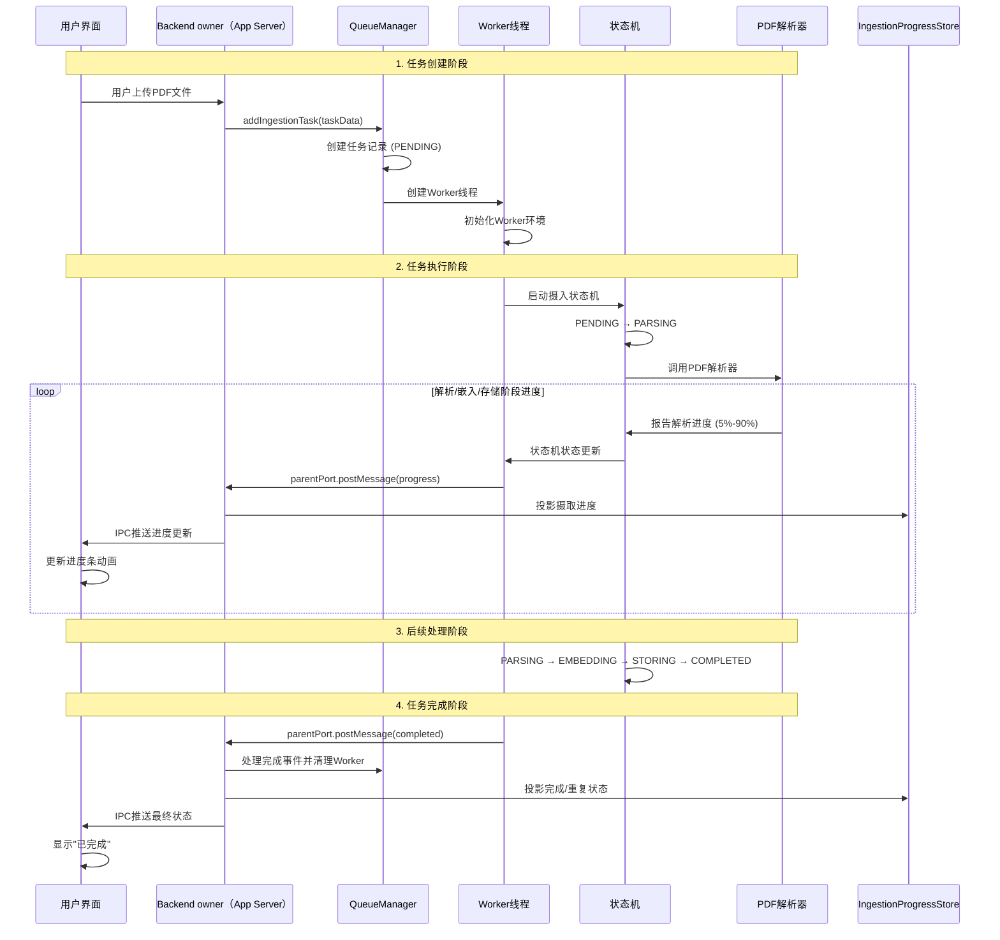

# Worker线程架构：多线程文档处理系统

## 🎯 概述

本文档详细说明了基于Node.js Worker Threads的多线程文档处理架构，从单线程演进到多线程的完整设计方案。

**功能 (What):** 实现高性能、可扩展的多线程文档摄入处理系统  
**输入 (Input):** 用户上传的各类文档文件和处理配置  
**输出 (Output):** 解析后的结构化内容块和实时进度反馈  
**副作用 (Side-effects):** 创建Worker线程、管理任务队列、维护状态同步、资源清理

## 🧵 架构设计原理

### 为什么选择Worker线程？

**问题背景：**
- 📄 PDF解析（特别是AI视觉识别）是CPU密集型任务
- ⏰ 大文档处理可能需要几分钟，阻塞主线程
- 📱 用户界面需要保持响应性
- 🔄 需要支持多文档并发处理

**设计目标：**
- ⚡ **性能提升**：充分利用多核CPU
- 🛡️ **故障隔离**：Worker崩溃不影响主应用
- 📊 **实时反馈**：精细化进度更新
- 🔄 **任务控制**：支持取消、暂停、恢复

## 🏗️ 系统架构图

```
┌─────────────────────────────────────────────────────────────────┐
│                        Renderer Process                        │
│  ┌─────────────┐ ┌─────────────┐ ┌─────────────┐ ┌─────────────┐ │
│  │    Vue UI   │ │ KnowledgeBase│ │ ProgressBar │ │ FileUpload  │ │
│  │             │ │    Store    │ │  Animation  │ │   Dialog    │ │
│  └─────────────┘ └─────────────┘ └─────────────┘ └─────────────┘ │
└─────────────────────────┬───────────────────────────────────────┘
                          │ IPC通信
                          ▼
┌─────────────────────────────────────────────────────────────────┐
│                  Backend Owner Process                        │
│  ┌─────────────┐ ┌─────────────┐ ┌─────────────┐ ┌─────────────┐ │
│  │ QueueManager│ │WorkerThread │ │    IPC      │ │   SQLite    │ │
│  │             │ │    Queue    │ │  Handlers   │ │  Metadata   │ │
│  └─────────────┘ └─────────────┘ └─────────────┘ └─────────────┘ │
└─────────────────────────┬───────────────────────────────────────┘
                          │ Worker创建与管理
                          ▼
┌─────────────────────────────────────────────────────────────────┐
│                       Worker Threads                           │
│  ┌─────────────┐ ┌─────────────┐ ┌─────────────┐ ┌─────────────┐ │
│  │  Worker-1   │ │  Worker-2   │ │  Worker-3   │ │  Worker-N   │ │
│  │┌───────────┐│ │┌───────────┐│ │┌───────────┐│ │┌───────────┐│ │
│  ││StateMachine││ ││StateMachine││ ││StateMachine││ ││StateMachine││ │
│  │└───────────┘│ │└───────────┘│ │└───────────┘│ │└───────────┘│ │
│  │┌───────────┐│ │┌───────────┐│ │┌───────────┐│ │┌───────────┐│ │
│  ││PDF Parser ││ ││DOCX Parser││ ││Image Parser││ ││Text Parser││ │
│  │└───────────┘│ │└───────────┘│ │└───────────┘│ │└───────────┘│ │
│  │┌───────────┐│ │┌───────────┐│ │┌───────────┐│ │┌───────────┐│ │
│  ││AI Engine  ││ ││Vector DB  ││ ││  Storage   ││ ││ Embeddings││ │
│  │└───────────┘│ │└───────────┘│ │└───────────┘│ │└───────────┘│ │
│  └─────────────┘ └─────────────┘ └─────────────┘ └─────────────┘ │
└─────────────────────────────────────────────────────────────────┘
```

## 🔄 数据流与生命周期

### 完整的任务处理流程



### 任务状态生命周期

```
┌─────────────┐    ┌─────────────┐    ┌─────────────┐    ┌─────────────┐
│   PENDING   │───▶│   RUNNING   │───▶│ COMPLETED   │    │   FAILED    │
│             │    │             │    │             │    │             │
│ 0% 等待中   │    │ 5%-100%     │    │ 100%        │    │ 任意%       │
│             │    │ 解析中      │    │ 已完成      │    │ 错误        │
└─────────────┘    └─────────────┘    └─────────────┘    └─────────────┘
       │                  │                                      ▲
       │                  │                                      │
       │                  └──────────────────────────────────────┘
       │                           任务执行异常
       │
       ▼
┌─────────────┐
│   FAILED    │
│             │
│ 任意%       │
│ 用户取消    │
└─────────────┘
```

## 📁 核心文件架构

### 文件职责分工（已重构）

```
src/infra/task-queue/
├── 📄 jobs.ts                      # 任务负载定义与验证
│   ├── IngestionJobPayload         # 文档摄入任务数据结构
│   ├── validateJobPayload          # Zod验证函数
│   └── JobPayloadValidationError   # 验证错误类
│
├── 📄 queues.ts                    # 队列门面（QueueManager/单例）
│   ├── QueueManager                # 单例队列管理器：初始化/监听/发布任务事实 + 对外事件扩展点
│   └── queueManager                # 单例实例导出
│
├── 📄 WorkerThreadQueue.ts         # Worker线程队列管理器（独立文件）
│   ├── WorkerThreadQueue           # 线程创建/任务分发/消息处理/失败清理
│   ├── WorkerJob/WorkerJobState    # 队列内部 job 类型
│   └── WorkerJobLifecycleObserver  # 显式注入的通用生命周期观察端口
│
├── 📄 AudioProcessingQueue.ts      # 音频 Worker owner 与 shutdown barrier
├── 📄 concurrency.ts               # 并发度计算（CPU/内存感知，最大4）
├── 📁 definitions/
│   ├── audioProcessingWorkerProtocol.ts  # 音频 Worker typed input/output
│   ├── queueJobPresentationPublisher.ts  # 不含 Electron 的队列 job presentation port
│   └── queueWorkerRuntime.ts              # App owner 冻结的 Worker bundle 路径
├── 📁 functions/
│   └── resolveQueueWorkerRuntime.ts       # 从 main bundle 布局解析并校验产物
│
├── 📁 workers/
│   ├── ingestion.worker.ts         # Worker线程执行脚本（状态机驱动摄入流程）
│   ├── audio-processing.worker.ts  # 音频解码、重采样和切分
│   ├── graph-extraction.worker.ts  # 图谱抽取
│   └── graph-indexing.worker.ts    # 图谱索引
│
└── 📄 WORKER_THREAD_ARCHITECTURE.md # 本架构文档
```

## 🔌 扩展点：保持 task-queue 通用（避免业务膨胀）

随着业务演进，我们会新增更多“后台增强任务”（例如：软知识图谱抽取、索引构建等）。
**关键原则**：`task-queue` 只负责“队列/Worker 生命周期与事件转发”，不承载任何业务编排逻辑（如选模、回填扫描、读写业务表）。

`WorkerThreadQueue` 只理解 `taskId`、Worker 消息和 job 生命周期。业务方需要投影状态时，必须显式注入 `WorkerJobLifecycleObserver`；队列不得检查 `doc_id`、`filename` 或其它业务字段来猜测消息归属。

Worker bundle 路径同样必须显式注入。App composition 从冻结的 `mainBundleDirectory` 一次解析 `QueueWorkerRuntime`，启动时校验四个 `.worker.cjs` 产物；`QueueManager`、`WorkerThreadQueue` 和 `AudioProcessingQueue` 不得读取 Electron `app`、`process.cwd()` 或 `NODE_ENV` 猜路径，也不提供找不到产物时的隐式 fallback。

摄取进度 read model 与 Worker 消息 projector 归 `features/knowledge-base/ingestion`。`ServiceInitializer` 是 app-level 组合根：它把知识库 projector 组装为 observer，仅注入 ingestion queue。图谱抽取、图谱索引和其它通用队列不注入该 observer，因此即使 payload 字段重名也不会写入摄取状态。

### ✅ 推荐做法：feature 层编排器（orchestrator）

以软知识图谱为例：
- `QueueManager` 只初始化 `graph-extraction` 队列，并向外发出事件：
  - `ingestion:taskCompleted`
  - `graphExtraction:taskProgress / taskCompleted / taskFailed`
- 由 feature 层的编排器订阅这些事件，完成业务动作：
  - ingestion 完成后“是否入队图谱抽取”
  - 打开 App 时“历史文档回填入队”
  - KB 级进度聚合与 Renderer integration 推送

当前实现中，该编排器位于：
- `src/features/knowledge-base/graph/application/knowledgeGraphQueueOrchestrator.ts`

### 🚫 反例：把业务逻辑写进 queues.ts

以下逻辑不应出现在 `queues.ts`：
- 读取 SoT、扫描知识库文档、计算 chunkCount
- 图谱抽取的选模策略（chat vs vision）
- knowledge_graph_doc_status 的写入与回填策略
- KB 图谱进度聚合与前端推送（应由 feature 层服务负责）

### 关键类与职责（更新后）

#### 🎛️ QueueManager（单例门面）
```typescript
/**
 * 功能 (What): 全局任务队列门面，协调 Worker 线程与状态推送
 * 输入 (Input): 摄入任务数据、队列配置参数
 * 输出 (Output): 任务执行结果、状态更新事件
 * 副作用 (Side-effects):
 * - 初始化 WorkerThreadQueue
 * - 向显式注入的 presentation port 发布 job 事实
 */
class QueueManager {
  addIngestionTask(taskData)
  cancelIngestionTask(taskId)
  getTaskStatuses(taskIds)
  getQueueStats()
}
```

#### 🧵 WorkerThreadQueue（多线程管理）
```typescript
/**
 * 功能 (What): Worker 线程池管理器，负责线程创建、任务分发、消息通信
 * 输入 (Input): 任务数据、并发配置、Worker脚本路径
 * 输出 (Output): 任务执行事件（taskStarted/taskProgress/taskCompleted/taskFailed）
 * 副作用 (Side-effects):
 * - 动态创建/销毁 Worker
 * - 维护任务与 Worker 的映射
 * - 处理 Worker 异常和超时
 * - 将摄取 progress/completed 投影到 IngestionProgressStore
 */
class WorkerThreadQueue extends EventEmitter {
  addTask(taskData)
  cancelTask(taskId)
  pauseTask(taskId)
  resumeTask(taskId)
}
```

## 💬 通信机制详解（更新）

- Worker → Backend owner：通过 `parentPort.postMessage` 上报 progress/completed/failed。
- Backend owner → IngestionProgressStore：在接收到 progress/completed 时，投影最新摄取进度，供轮询/Watchdog 校准。
- 摄取失败：由 Worker 内的摄取状态机完成失败清理并写入读模型；通用队列只发出失败事件，不绕过状态机重复写入。
- Backend owner → Renderer integration：发布通用 job presentation；App Server 通过 reverse Desktop capability 映射为既有 `task-status-update`，payload 不变。
- Renderer 轮询兜底：`knowledgeBaseService.getTasksStatus()` 定期从后端拉取，读取 `IngestionProgressStore`，保证生产稳态。

```typescript
interface TaskStatusUpdate {
  taskId: string;
  docId: string;
  filename: string;
  status: 'pending' | 'processing' | 'completed' | 'failed' | 'duplicate';
  progress: number;
  message: string;
  error?: string;
  stage?: string;
  stage_progress?: number;
  timestamp: number;
}
```

## 🗄️ 数据库所有权与当前收口项

`workspace.sqlite` 的 schema、migration、插件 lifecycle 和普通业务提交由 App Server 中的 `DatabaseService` 拥有。Worker 不得执行完整 `initialize()`；connection-only 路径只允许连接已经完成 schema 初始化且版本完全一致的数据库，不能在 Worker 内建表、迁移或启动插件 lifecycle。

Queue owner 还必须把 App Server 已冻结的 `RuntimePathRoots` 与 `DistributionIdentity`
作为 data-only `workerData` 传入。Worker 在初始化 Model Catalog 前安装这两份事实，不能
根据 `cwd`、`LINNYA_DEV_MODE`、`NODE_ENV` 或 `process.env` 重新猜路径和官方发行身份。

当前仍有一个明确的架构缺口：`ingestion.worker.ts`、`graph-extraction.worker.ts` 和 `graph-indexing.worker.ts` 会各自建立 connection-only SQLite 连接，并在 Worker 内读取或写入业务表。这避免了在 App Server 事件循环执行最重计算，也避免了每次 spawn 重跑数据库 bootstrap，但还没有达到“App Server 是唯一 SQLite writer”的最终边界。

收口方向固定为：Worker 只接收 data-only job input，执行 CPU/模型/解析工作并返回严格 result；知识库/图谱 feature 的 App Server orchestration 负责读取所需业务快照，并在结果通过身份、版本和取消状态校验后提交 DB、CAS 与 Workspace。迁移期间不允许 Worker 与 App Server 对同一结果双写，也不提供失败后退回 Worker 直写的 fallback。当前证据和优先级由 [`docs/audit/risk-register.md`](../../../docs/audit/risk-register.md) 的 `F1-04` 跟踪。

## 🔧 Worker环境初始化

### 关键环境问题与解决方案

#### 1. 工作目录问题
```typescript
/**
 * 问题: Worker线程的工作目录可能不是项目根目录
 * 影响: 无法找到配置文件、模型文件、临时目录
 * 解决: 计算正确的项目根目录并设置环境变量
 */
function fixWorkerEnvironment(): void { /* 详见 ingestion.worker.ts */ }
```

#### 2. 模型注册表初始化
```typescript
async function initializeWorkerServices(): Promise<void> { /* 详见 ingestion.worker.ts */ }
```

#### 3. 依赖文件访问
```typescript
// 编译时需要确保这些文件存在：
// （已移除）sql.js wasm 产物不再需要
// dist/sql-wasm.js
```

## 📊 任务队列管理

### 并发控制策略
```typescript
// 详见 src/infra/task-queue/concurrency.ts
```

### 任务优先级队列
```typescript
// 如需引入，可在 WorkerThreadQueue 外围增加 PriorityQueue
```

## 🛡️ 生产稳态保障

- **双通道同步**：IPC 主动推送 + 主进程写入 `IngestionProgressStore`，前端 Watchdog/轮询可随时校准。
- **时间戳幂等等**：前端仅接受“更新更晚”的状态，终态（completed/duplicate/failed）优先级最高。
- **异常处理**：Worker 异常/退出码由队列收口并推送失败事件；摄取领域失败清理与读模型更新由状态机负责。
- **App owner barrier**：App 退出先停止接单，再调用 `QueueManager.shutdown()`；文档/图谱 Worker 与音频 Worker 都必须等待 `terminate()` 完成。shutdown 触发的非零退出码是 owner 收口，不得投影成业务失败。
- **取消 timer 归属**：任务取消后的强制终止 timer 由队列登记，使用 `unref()`，并在 Worker exit 或 queue shutdown 时清除，不能拖延 App 退出。
- **无关闭后续跑**：队列进入 shutdown 后拒绝新 job、取消尚未执行的音频 Worker launch，也不会在 Worker exit 回调中继续拉起 pending job。

## 🚀 部署与运维

### 生产环境配置

当前队列没有 `WORKER_CONCURRENCY`、`WORKER_TIMEOUT`、`WORKER_MEMORY_LIMIT` 或
`WORKER_RESTART_THRESHOLD` 环境变量合同。并发度默认由
`src/infra/task-queue/concurrency.ts` 根据 CPU 与内存计算；需要固定并发度的组合根通过
`WorkerThreadQueue` 的 `maxConcurrency` 显式传入。不要在部署文档中声明代码没有读取的环境变量。

### 当前可观察性

当前正式读面只有 `QueueManager.getQueueStats()` / `WorkerThreadQueue.getQueueStats()`、结构化生命周期事件和 App owner shutdown 日志；仓库尚未实现 Worker 邮件、Webhook 告警或独立 `WorkerHealthCheck`。新增运维合同必须先落代码、测试和门禁，再写入本文，禁止用示例配置冒充现有能力。

## 📝 最佳实践

### 1. Worker线程设计原则

- ✅ **单一职责**: 每个Worker专注文档摄入任务
- ✅ **无状态设计**: Worker之间不共享状态
- ✅ **故障隔离**: Worker崩溃不影响其他任务
- ✅ **资源清理**: 任务完成后及时清理临时资源

### 2. 通信设计原则

- ✅ **结构化消息**: 使用TypeScript接口定义消息格式
- ✅ **错误处理**: 所有消息都包含错误处理机制
- ✅ **进度粒度**: 平衡进度更新频率与性能
- ✅ **超时控制**: 为所有异步操作设置超时

### 3. 性能优化原则

- ✅ **动态扩缩容**: 根据负载动态调整Worker数量
- ✅ **内存管理**: 主动监控和清理内存使用
- ✅ **批处理优化**: 合理批量处理小任务
- ✅ **缓存策略**: 缓存常用的模型和配置

### 4. 监控运维原则

- ✅ **全链路监控**: 从任务创建到完成的全程跟踪
- ✅ **实时告警**: 关键指标异常时及时通知
- ✅ **可观测性**: 提供足够的日志和指标
- ✅ **自动恢复**: 支持故障自动检测和恢复

## 🎯 未来演进方向

### 1. 智能调度算法
- 🔮 基于任务特征的智能路由
- 🔮 机器学习优化资源分配
- 🔮 预测性扩缩容

### 2. 分布式扩展
- 🔮 跨节点Worker池管理
- 🔮 任务负载均衡
- 🔮 故障转移机制

### 3. 性能优化
- 🔮 WebAssembly加速核心算法
- 🔮 GPU加速AI视觉识别
- 🔮 流式处理大文档

---

## 📝 维护说明

- 💡 遵循标准化注释格式 (功能/输入/输出/副作用)
- 💡 所有接口都有完整的TypeScript类型定义
- 💡 错误处理覆盖所有异常场景
- 💡 性能监控贯穿整个系统生命周期
- 💡 支持开发、测试、生产三套环境配置

> 💡 **架构特点**: 从单线程阻塞 → 多线程并发 → 智能调度优化
